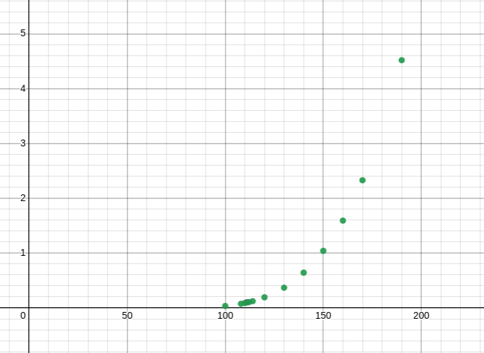

**1.**

**(a)** 

Average/mean velocity
$$v_{avg} = \sqrt{\frac{8RT}{\pi M}}$$

T = 25 + 273.15 = 298.15
$$M_{He} = 4 \frac{g}{mol}$$
$$M_{Hg} = 200 \frac{g}{mol}$$
Not converting to kg as looking at ratios rather than absolute values.

$$\frac{\sqrt{\frac{8(8.314)(298.15)}{4\pi}}}{\sqrt{\frac{8(8.314)(298.15)}{200\pi}}} = 7$$

$$ke(He) = \frac{1}{2}(4)(v_{avg}(He))^2;ke(Hg) = \frac{1}{2}(4)(v_{avg}(Hg))^2$$
$$\frac{ke(He)}{ke(Hg)} = 1$$

**(b)**

T = 20 + 273.15 = 293.15

$$v_{rms} = \sqrt{\frac{3RT}{M}}$$

$$v_{rms}(CO_2) = \sqrt{\frac{3R*293.15}{\frac{44.01}{1000}}} = 407.6 m/s$$
$$v_{rms}(He) = \sqrt{\frac{3R*293.15}{\frac{4}{1000}}} = 1352 m/s$$

**2.** 
$$ n=2; p = 1.25atm;  \Delta T = 27K; C_p= 37.11 \frac{J}{K*mol} $$

At constant pressure heat is the same as change in enthalpy.
$$ C_p =  \frac{\Delta H}{\Delta T}; \Delta H = 1001.97J; q_p = \Delta H = 1001.97J $$
$$ \Delta V = 36 - 32.52 = 3.5L \text{ (from the ideal gas equation)} \rightarrow  \Delta H = \Delta U - (1.25)(3.5); \Delta
U = 1006.36J$$

**3.**

Mass of benzene: $m_b$

$$ m_b = 0.00075kg*876.6; M_b = 78.11 \frac{g}{mol}$$
$$ n_b = \frac{m_b}{0.001*M_b} = 0.84 moles $$

because the unknown substance is involtaile it does not contribute to the vapor pressure

$$ 25 torr = (192 torr)x_b \rightarrow x_b = 0.13 $$

If 0.84 moles is $0.13$ of the total amount of moles there are $6.47$ moles in total.

$$20g = 5.63 moles \rightarrow 3.55 \frac{g}{mol}$$

**4.**

$$ T = 273.15 + 50 = 323.15K; $$

Assuming that this reaction is taking place at constant pressure so that we can use entropy in the gibbs energy of the
reaction.

$$ \Delta{S_{net}} = \frac{\Delta{H_{net}}}{T} = \frac{-134.47 + 3(-92.31) + 50.72}{323.15} = -1.12 \frac{kJ}{mol*K}$$
$$ \Delta_r{G} = \Delta{H_{net}} - \Delta{T S_{net}} = -388 \frac{kJ}{mol}$$
$$ \Delta_r{G^0} = -73.66 + 3(-95.30) + 50.72 = -308.84 \frac{kj}{mol}$$
$$ K = exp[\frac{-\Delta_r{G^0}}{0.008314*323.15}] = 8.38\times10^{49}$$

**5.**

**a)**

If the bomb calorimeter gains 598 Joules of energy for each K increase then it's gained $598*8.1 = 4843.8$ Joules of
energy. This is heat lost by the system so 
$$\Delta U = q_v = -4843J$$

Molecular weight of glucose
$$M = 179.4 \frac{g}{mol}$$

$$\Delta{U^0} = \frac{-4843}{\frac{0.3}{179.4}} = 2900.0479 \frac{kJ}{mol}$$

**b)** 

Because there is no change in volume
$$\Delta{H^0_{com}} = -2900\frac{kJ}{mol}$$

**c)**

$$ \Delta_f H^0(CO_2) = -393.51 \frac{kJ}{mol}$$
$$ \Delta_f H^0(H_20) = -285.83 \frac{kJ}{mol}$$
$$ \Delta_fH^0 = 6(\Delta_f H^0(CO_2)) + 6(\Delta_f H^0(H_20)) = -4079 \frac{kJ}{mol} $$

Gibbs energy of reaction is gibbs energy of the products minus that of the reactants.

$$ 2900.0479 \frac{kJ}{mol} = -4079 - \Delta_fH^0(C_6H_{12}O_6)$$
$$\Delta_fH^0(C_6H_{12}O_6) = -1179 \frac{kJ}{mol}$$

**d)**

Unsure as to what quantities to use to analyse combustion in anaerobic glycolysis.

**6. a)**

{ height=50% width=50%}

**b)** 

The temperature when the vapor pressure is 1 atm (0.101 MPa) is approximately 111K.

**c)**

There's no change in temperature so no change in internal energy. Just the work to change the volume against constant
pressure (1atm).

$$ \Delta V = 9.05 - 4.1\times10^{-2} = 9.009 \frac{dm^3}{mol}; \Delta{H_{vap}} = (-1.013\times10^5 Pa)(0.09009
\frac{m^3}{mol}) = -9.126 \frac{kJ}{mol}$$

**7. **

$$Q = \frac{[C]^2[D]}{[A][B]^3}$$

After reaction the product D increases by 0.2 moles with A losing that amount along with B. The loss $x = 0.2$.

$$\frac{0.2^3}{(4-0.2)(2-0.2)^3} = 3.6\times10^{-4}$$

**8.**

**a)**

For each reaction, calculate $\Delta_rG$. The activity of solids are 1.

for $H_2O(g) \rightarrow H_2O(s)$
$$\Delta_rG = -23.6 \frac{kJ}{mol} + (0.008314)(190)ln(\frac{1}{0.13\times10^{-6}}) = 0.9 \frac{kJ}{mol}$$

for $H_2O(g) + HNO_3(g) \rightarrow HNO_3 \cdot H_2O(s)$
$$\Delta_rG = -57.2 \frac{kJ}{mol} + (0.008314)(190)ln(\frac{1}{0.13\times10^{-6}*0.41\times10^{-9}}) = 0.7 \frac{kJ}{mol}$$

for $2H_2O(g) + HNO_3(g) \rightarrow HNO_3 \cdot 2H_2O(s)$
$$\Delta_rG = -85.6 \frac{kJ}{mol} + (0.008314)(190)ln(\frac{1}{(0.13\times10^{-6})^2*0.41\times10^{-9}}) = -3.2 \frac{kJ}{mol}$$

for $3H_2O(g) + HNO_3(g) \rightarrow HNO_3 \cdot 3H_2O(s)$
$$\Delta_rG = -85.6 \frac{kJ}{mol} + (0.008314)(190)ln(\frac{1}{(0.13\times10^{-6})^3*0.41\times10^{-9}}) = -5.8 \frac{kJ}{mol}$$

The last two reactions seem spontaneous, the deepest gibbs energy well being the final reaction $3H_2O(g) + HNO_3(g)
\rightarrow HNO_3 \cdot 3H_2O(s)$ the most thermodynamically stable.

**b)**

If enthalpy of formation is considered $\Delta_rG$ for each solid, from part a. 

for $HNO_3 \cdot 2H_2O(s) \rightarrow HNO_3 \cdot 3H_2O(s)$
$$\Delta_rG = -5.8 - (-3.2) = -2.6\frac{kJ}{mol}$$

for $HNO_3 \cdot 3H_2O(s) \rightarrow HNO_3 \cdot 2H_2O(s)$
$$\Delta_rG = -3.2 - (-5.8) = 2.6\frac{kJ}{mol}$$

Going from $HNO_3 \cdot 2H_2O(s) \rightarrow HNO_3 \cdot 3H_2O(s)$ is more spontaneous, meaning $HNO_3 \cdot 3H_2O(s)$
is more thermodynamically stable.

**9.**

**a)** 

From experiment 3 to 2, $[Cl_2]$ is kept constant and [NO] is doubled. This results in the reaction rate
increasing by a factor of 8 $\frac{2.2\times10^{-3}}{2.7\times10^{-4}} = 8.1$, this would put a relationship of $r =
k[NO]^3$ on the concentration of [NO].

From experiment 1 to 3, $[NO]$ is kept constant and $[Cl_2]$ is doubled. This results in the reaction rate
increasing by a factor of 8 $\frac{2.7\times10^{-4}}{6.7\times10^{-5}} = 4$, this would put a relationship of $r =
k[Cl_2]^2$ on the concentration of $[Cl_2]$.

the reaction rate law would then be $r = [Cl_2]^3[NO]^2$ an order of 5.

**b)**

The rate constant $k$ doesn't change for concentrations. From experiment 
$$k = \frac{6.7\times10^{-5}}{0.015^3*0.050^2} = 7940.7 \frac{1}{M^4s}$$ 

for experiment 4 then 

$$r = k[NO]^3[Cl_2]^2 = 2.4\times10^{-3}$$

**10.**

**a)**

![Plot of ln[A] against time](img/orderofreactionassignmentgraph.png){ height=50% width=50%}

The rate constant is the slope of the above graph. 

$$ln[A] = ln[A]_0 - k_{obs}t$$ 

$$ln[A]_0 = 2.314 \text{ from the graph}$$
$$k = -0.0486 \text{ picking two points from the graph}$$

**b)**

$$y = 2.314 - 0.0486t \rightarrow y(t=43.8) = 0.185$$
$$e^{0.0185} = 1.2\frac{\times10^{-2}mol}{dm^3}$$
Taking the mass of $(CH_3)_3CBr = 137 \frac{g}{mol}$ after 43.8 hours we have $137*1.2\times10^{-2} = 1.6 \frac{grams}{dm^3}$.
