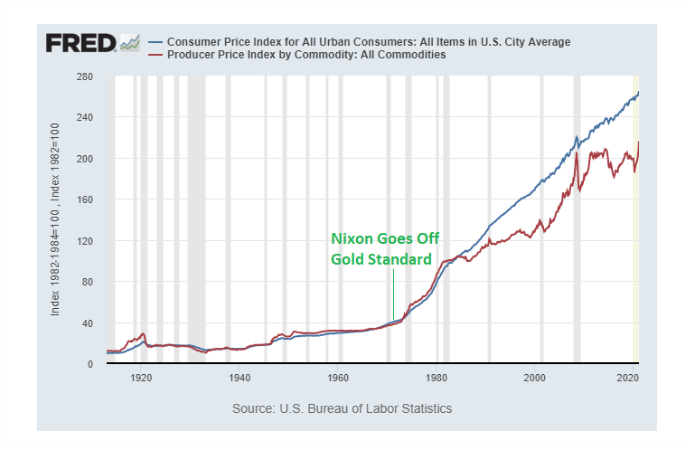
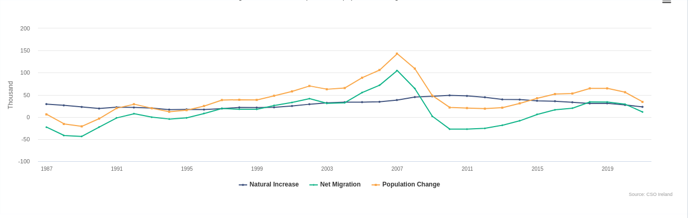
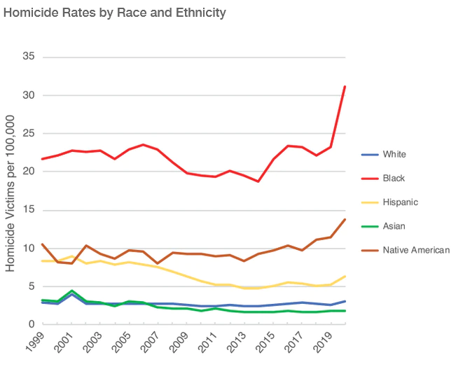
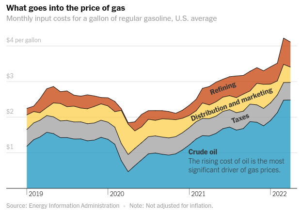

_The aim here is to write down stuff everyday_

## 03/01/22 13:11:13

I wonder do we understand ourselves much better in the modern age. It's slightly rhetoric because of course we do its
just the idea that we still have a long way to go it daunting. It seems like we're not making progress but maybe this
progress is different from technological progress. Could it be due to the non deterministic nature of humans, or just
that we're a lot more complex that technological advancements. We put a man on the moon but that seems to pale in
comparison to understanding ourselves. This is similar to Asimov in foundation. The real advancement will be
understanding ourselves. 

Where are the modern Bach's or Von Neumann's? Do we on average not have the same interaction with life that used to be?
Maybe they're there but culture disincentives them, not even in bad ways. Like a modern Bach just joining a startup or
becoming a financial analyst. It seems like this is the more plausible answer. [From here](https://www.econlib.org/where-are-we-making-progress/)

I think that maybe energy innovation isn't it. I dont think I like the actually process. Partly because I dont know it.
There must be something there though. Theres just something about it that just seems monotonous. I suppose research is
this way sometimes. I'd like to do something I'm curious about though if I'm going to go down that route.

Is there a disconnection from each other that comes into play here. Have we become out of touch with our inner nature
too much, the need for touch, to be consoled, to have support from a community. This is mainly coming from a tweet I saw
yesterday. It makes me think also about the constant state of high I try to live in. Specifically, Dopamine its like the
thought of quiet in ones mind should be avoided at all costs. This is normal I think, not some deep seethed problem with
me. It's an animal type nature. I just wonder if having to deal with that quiet would be beneficial for us sometimes.
That when we see something pleasurable or interact with something pleasurable we don't crave more all the time, of course
its normal too but the self-imposed restrictions, is that something good?

What if I grow to miss tech. Theres something there that I love, that I'm good at. I'm almost hoping something is there
with Web 3.0. Even if I could just do something like astrophysics and help out somehow on the side. The way I can be
most useful is using my current abilities. I would like to try something ambitious though, or at least interesting that
I could take ownership of in some way. I should spend time trying to understand Web 3.0. I find I lack a real conceptual
understanding of it when trying to explain it. It seems that I kind of just want to feel part of something. Maybe I need
to fell wanted or something.

Last night, my brain was on fire. I think its the change of sleep schedule. Anyways, I though about if I had someone,
like a partner who I could really be vulnerable with, what would I say. I think in my teenage years and early twenties I
felt that I was kind of repulsive, irredeemable, that I have these sinful thoughts or something. It wasn't only porn and
that it was also my looks, I felt that there was no point in competing, that I must try some other way and that
eventually it would come. It reminded me of the Dostoevsky quote 

> to angels - vision of God's throne
> to insects - sensual lust

I tried reading around this passage, couldn't really make heads or tails of it apart from maybe the idea that God is
cruel for giving us a vision a beauty "it is a terrible thing because it has not been fathomed and never can be
fathomed" it's this ideal were always falling short of. It's like, sometimes when you see a beautiful woman (or person)
and what some sort of interaction with it, it pains your chest to know someone can be so beautiful. There some sort of
connection with it you search for, I think a normal reaction might be to be with that person but sometimes your own lack
of beauty (as framed by oneself) corrupts this and ruins it.

Dickens, in 'Great Expectations' writes how Pip becomes ashamed of who is based on reproach or scorn from new people
he's met, particularly a beautiful girl. I couldn't help but try and find myself in it, as I usually do. Theres this
standard that I had of myself when I was young, I had never encountered scorn really, dissatisfaction from someone I
liked that would make me feel ashamed, probably until girls came into the picture. Then, I felt inadequate. I felt
ashamed of my parents for giving me these hideous features, ashamed of my endowment in life because socially I was not
thriving or did not have the adoration of those I liked. This could just be a convenient 'semi' explanation but
something about it rings true.

Should I go to the US? Maybe waiting until April makes sense, to really work hard for the next 3 months. I'd only be
going for the Jiu-Jitsu at the moment, not the worst reason but not exactly the best. 

I've been trying to understand conjunctive probabilities. I see that the new sample space for two events is no a
combination of events so the sample space increases by a multiplication between the two initial sample spaces. I'm just
not too sure how multiplication of event probabilities scales up the uncertainty proportionally.

## 04/01/22 12:06:49

Maybe I'm starting to realise that there are a lot of people out there trying to help. Or more so, that a large majority
of paths I could go down in theory could help and don't explicitly harm. Helping then becomes a part time thing but I
can't say that I would ever want it to be full time. 

I've thought about reading Rilke. Similar to Denial of Death, I feel like it's kind of calling out to me. I heard
someone talk about his idea that people can have a destiny but not fulfil it. Not for any particular reason, just
because thats where life lead them. Even if the path was presented to them they might not necessarily take it. I feel
like this a bit with astrophysics. 

Web 3.0 might change the world but it will take a lot of work. It's kind of spurs open protocol innovation.
People will do a lot more things when money is involved, even if its not really what I want.
Crypto is not really accessible either.

I got foot cream, we'll see how that goes.

Blockchains are state machines?

I started reading a wait but why post about choosing career. I thought Id start exploring that here.
https://waitbutwhy.com/2018/04/picking-career.html

When I look at a career path, what affects my decision?

* I want it to be meaningful?
    * What does this mean, I want to derive meaning from it everyday in the sense that I can look at what I'm doing,
      even if its monotonous and say, this is working towards a grander, important goal
    * What is that goal? That I'm helping people, that it's something bigger than myself, thats it's something that's
      good for me.
* I want to be useful
    * I think in some sense I aim to please, I want to be useful, to help and in some sense gain appreciation. Maybe
      like a dog gets a pat on the head for returning the tennis ball
* I want to find someone
    * I figure that if I pursue what I want to do I will find someone who is like me and who would love me. It hard to
      see how I might discover someone like this in my social life at the moment, so I see looking at career as an
      opportunity for something like this.
* Why don't I want to do what I love or am curious about?
    * The first thing that pops up is why I don't just pursue something like astrophysics for the next 5 years. Mainly,
      socially, its not great, things I've heard are that there's no jobs, the only way to have an impact is if you're
      smart, how do I explain it to people, In some sense It seems kind of useless. I don't gain much from it socially and
      practically (in the financial, way of life sense).
    * This fits a narrative too that I want myself to fill in some sense, that I started learning about Physics at 14
      and was considered no good, that I feel theres something there. That I fell awe for the night sky and inspired by
      the likes of Carl Sagan
    * What else am I curious about?
* Energy Innovation
    * I think what put me down this path was Vaclav Smil. There was some sense that just knowing what the problem was would
      be half the solution
    * The actual solution involves combined effort and meticulous work. I'm not content with this, it doesn't pique my
      curiosity nor was it as all guns blazing as I had hoped.
* What are the main branches of my 'yearning' octopus?
    * Personal
        * I have lofty ambitions of who I am I think, beneath it all. I have the kind of intellectual superiority that
          I'm smarter, meant for something. Once again, this kind of narrative about who I am and should be.
            * It's like an obligation. 
            * Theres an obligation to that life is for living, like the pale blue dot, this obligation I want to
              fulfill. It comes from the likes of Shane and looking at interstellar, that the universe is marvelous, I
              want to appreciate it and interact with it even though most of the time I dont feel like it. It's this
              reverence that I want to latch on to. It helps me put the faults I feel I have in perspective and makes me
              kinder to myself, that I'm really not all that bad.
        * I want to go for it too. To just try and do something risky in life and work hard and fail and meet great
          people and get back up etc. 
        * A lot of the study I do I think is for this social reflection of myself. That I'm not socially gifted, I will
          be intellectually so (which I guess is a social thing). 
        * There is a curiosity though, some of my happiest moments are thinking about stuff, or understanding a new
          idea. Or not feeling so pathetic when I can appreciate the great history of ideas and the world.
            * In this sense, sometimes I like the discipline of it all, doing something day in day out like a river
              eroding a stone. It's almost proving to myself I do it or maybe, more so, the expectation it will all pay
              off because if you told me it would be a certain way endlessly I think I'd sack it all off. 
            * I think I'm happiest or content at times doing things that I couldn't care if anyone ever new I did them
                * Like understanding an idea in a book
                * Theres some shame associated with this then sometimes, like it would be a waste of time if no one ever
                  saw the work I put in or the interesting stuff I've read. I think I live in this expectation that all
                  I do will someday be revealed and people will say 'wow, wasn't he marvelous'. I think I know that deep
                  down this won't happen    
    * Moral
        * Theres so much suffering in the world and often times I feel like we pull the ladder up behind us. This
          branch of things is more of a frustration, like when you see someone doing something inefficiently and you
          want to just go in and fix it so you can get it off your mind. I feel that sometimes about a lot of the issues
          I come across. Why can't we just be done with these issues so _I_ can be content?
        * I want to grow as a person too. Through the fog of dopamine I do what to learn about the world, I do find
          things interesting, theres gravitation towards things apart form the social elements I've listed. Theres a
          part of me that would be quite content to sit and read if only the other tentacles would shut up.
        * I do want to help people though, I find that a lot of the time I'm not willing to get down and dirty to do it
          however.
    * Lifestyle, a family, an engagement with life. Where does this want come from. In some sense, I'm scared of all
      these aspects of 'living' of letting go. And because I'm scared of them, they feel important. I somewhat ashamed
      maybe of my singular enjoyment of life. 
        * Do I really want to find someone? I think I do, someone who I could be totally myself with, selfishly I
          guess. Someone I could grow old with. I guess, someone outside my family who might actually love me, my flaws
          and all. That idea seems like it would fill this hole in myself, kind of selfish I suppose. 
        * Theres a social want here too, that I can just make people more comfortable with me, that I can just fit in
          more. That I do normal things and am not boring. 
    * Social
        * I want to signal that I'm thoughtful and smart, part of the reason I want to produce written content, one as
          artifacts of learning and also that secretly I hope someone will stumble upon it one day and like Pip in
          Great Expectations I will suddenly be propelled into the life of a great thinker who people listen to
        * but the sense that I'm behind socially where I should be that I've sacrificed some social elements to be where
          I am (even though I didn't, at least not explicitly) pains me so much.  That I can go back in the world like I
          am, that I'm stunted. Some grotesque malformed creature emerging from the basements with a nice mind, but
          totally fucked everywhere else, physically, socially, sexually, the whole lot. A large aspect of that is being
          a virgin. I guess not having a person ever touch you (and in turn being transformed in my head to: "No one has
          ever wanted to touch me") can wear on you. Theres an intense shame I have for it. That I will be exposed
          eventually for this person I really am, a loser. Theres a fear there too, that its too late, that I don't have
          the courage to solve it on my own, that I never will. Self pity then comes along with this, the only
          interaction of a serendipitous nature I have with women is through Tinder, and its hard to have luck on this,
          trying to pretend to be something I'm not. I'm trying to find someone who might not look at me as this hideous
          beast and Tinder (not that anyone has taken me up on any offer) seems like the last place you'd find that.
        * Sometimes it's hard to take responsibility for some of the failings in life. Although this start synopsis is
          based on the idea of not meeting someone by 24 or ever having a girlfriend as being a massive failure of
          oneself. Theres definitely aspects that I've tried to work on and can make changes too, this one those is the
          hard to modify one, I suppose because it's external too me. 
        * If we leave out the whole 'hoping to find true love' part here. I don't feel too much pressure socially, I think my
          detachment is a benefit in this sense. I find solace in those I admire and their view of the world.
         
This all doesn't really seem like a career problem. I just want to be healthy and happy. I think I yearn for the day
when I could just relax and just be considered normal by myself, and by social standards. This second may not be
attainable unfortunately as there's always someone who wont like you or find you disagreeable. 

There is some sense in which I must accept and move on. Not necessarily repress, but just stop viewing myself as this
grotesque creature, it just keeps re affirming itself. Even if my worst nightmares in this aspect come true (for
instance, someone knowing I'm a virgin) it doesn't help me to wallow in it. In order to grow I need to let it stop
blocking me, I can pop in the back pack but to keep moving. For instance, in talking about my career above, I inevitably
started talking about these inadequacy I feel about myself. This takes away somewhat from trying to figure out solution
not reaffirming the 'problem'. It's fine balance I guess.

In some sense, letting go of dead weight. Sometimes I won't let myself succeed.

## 05/01/22 15:02:28

I started looking into the history of chemistry today, attempting to understand combustion. I get the feeling that my
questions about it are slightly recursive. When I'm wondering how we know what we're building our current (scientific)
information on top of its using the same method were concerned with exploring. Experiment (the real world) is also
always the burden of proof. It's still interesting to explore some of the history of at least one phenomena. 

I've been trying to read the Faraday lectures on how a candle works. I just can't get into it. Even the associated
videos. I want to have a tangible sense of how we define these invisible things, like chemicals, elements and atoms. The
explanation makes up the description of them. For instance, a way of describing Oxygen might be that 'thing' that is
removed from air when we burn a candle, how might this be test though. I know the other way, from weighing the burning
of metal that oxidises before and after (has more weight). Weight here is the measurement.

Reading the Tim Urban article today, I felt reassurance from the logic of not actually being able to know who'll you be.
To not try and predict this. He contrasts the career path as a tunnel you choose vs a path with dots. When we look back
it's clear where all the dots were and whether they made sense. It's impossible to predict where the dots go in the
future though. Also careers are a lot more malleable than maybe contemporary culture would be prepared to admit.

Another useful tip is to try and look at the career (chess?) board looks like, what success in it looks like. If there
is no real career chess board then trying to determine success in the 'game'. 

Urban talks about the tendency to define who you are by your work. Listening to the yearning octopus with all it's wants
(that don't stop) is more of a valid metric, that you could be looking at this octopus and planning it's yearning's
appropriately for what you want. As opposed to feeling dictated by what culture would dictate.

Do I want to study Physics?
* Self study for 2 years I think would put me in a good spot. It requires a lot of hard work. The benefits are large
  though even in a practical sense of discipline and problem solving.
Do I want to study Economics?
* I think what I like about Economics is the insights it gives into the workings of the world. Knowing the problem
  doesn't necessarily lead to the solution though.
* Understand the current career board
* What is my definition of success?
    * At the moment, I would like to be component to understand basic Physics fairly well. Not really for any use case. 
* Maybe don't think of my career as a tunnel
* Can I be satisfied with just jumping to the next dot in the path?
    * Of course
* Literally impossible to predict who I will be, should just keep my options open. In this sense, doing a wide array of
  things (which is what I actually kind of like doing) seems like a good idea. 
* Releasing myself to do things like this might be kind of peripheral to my career (as in, wanting have enough freedom
  to do other things)

It is bloody freezing, I might not feel my toes til March

Getting things done really does rely on focus. Also my days at the moment are a bit lose so it can be difficult to jump
into things to do if it's not explicitly defined.

I listened to Dana Giaio on Tyler Cowen. Very knowledgeable guy and seems to just revel in knowing things that interest
him. I watched his analysis of Yeats lake isle poem which was interesting just to explore the language and structure. It
occurred to me that work isn't so important. He worked at Jello for like 2 years and did some interesting things, I mean
objectively Jello doesn't matter but it's kind of just a job and the interesting aspects aren't necessarily what the
company stands for. I don't think you could say he hasn't succeeded or anything. Just letting your curiosity run wild in
any circumstance. 

Physics was a struggle today. Maybe getting some grasp on energy and defining conservation of it. Defining the system is
key it seems. Figuring out whats doing work with this 'system'. If work is done by one component it must be stored
somewhere in the system. In this sense, transferred to another 'form' of energy.

I teared up again looking at the handshake scene in for all mankind. It's just this idea of looking past differences and
seeing the humanity that unites us all. 

## 06/01/22 16:07:16

I managed to complete study and reading earlier today. I have a feeling I could use another 3hrs at least more
effectively. 

I listened to a Huberman podcast about building habits. He talked about creating the environment and triggers for them
etc. but also talked about dividing the day up into three phases which is kind of what I do. I try and get things like
Physics and workouts done as early as I can because they're kind of the hardest. 

I think my general goal in life is just to be the best me. It encompasses a lot of things I guess. It's very general
but, I think its the case.

I've been struggling in Physics with understanding the conservation of Energy. It's a whole different ball game applying
concepts to actual problems. It's a general confusion. Where to start. Where are the boundaries or connections between
concepts. Energy is a mathematical construct for when we can't really pin down all the finer details. It's a general
property of seemingly every interaction in the universe. Without it 'invisible' undetectable work could be done that
might allow all sorts of things, such as using a small bit of energy to run something for an infinite amount of time (as
we might be able to loop this invisible force)

On the career front I don't see the need for major decisions. I'm kind of OK with how my life is going. Now it's just a
matter of finding work I suppose. Or maybe making use of the time between now and finding work.

I would like to meet more people who might be on the same 'wavelength' (whatever that may be). How do I do this?

Looking for strain not shying away from it Cal Newport 

> The craftsmen out there are not the guys checking their social media feeds every five minutes. They’re not looking for
the easy win or the flow-state. They’re the guys that are out there three hours, pushing the skill. “This is hard but
I’m going to master this new piece of software. I’m going to master this new mathematical framework.” That’s the
mindset, the habit of the craftsman.

The CATU meeting was interesting. It's kind of getting hands dirty which I think, because I don't necessarily want to
to do it. Is probably something I should do. I'm interested now to find out where the general opinions of CATU are
developed are there experts or do we (the members) try and come up with it.

I'm not reading enough during the day. I mean critical reading the type that should provoke thoughts (I might write
about here). I'm liking Great Expectations the last few days have been slow. I find Joe as always being a fountain of
wisdom. The simple life Pip is leaving behind (and ashamed of). More just interesting thoughts, 'fountain of wisdom' is
a bit dramatic.

I looked a bit into what an Astrophysicist does. Doesn't really seem too interesting, as in, it doesn't seem to add much
to the awe factor I guess. I'm more convinced that having Physics self study for the next 2 years is the path forward
for that. I feel myself kind of understanding that a job might not take as much time as I think it needs. I find myself
not doing too much during the day. It will be interesting to see if I can change that and see how I feel about doing my
own work whatever that is. Amateur astronomy could also be exciting. How do I get into this?

What are some 'odd jobs' I could pick up?

Maybe  is something I can look into. Something thats under appreciated and useful.

It's funny, not many thoughts really occurred to me today. I'm happy to have this freedom at the moment though mentally.
Hopefully it lasts but just in terms of no responsibilities, I get to see all these options I've been looking at more as
they are without the fog (for good and bad) of work or without things to kind of compare them to. I can look at the job
I had without it being a possibility in the future. Kind of assess it realistically what was good and what was and
about it. There's also no reason to not do what I want to do. Particular in the sense of learning and writing. The whole
goal really is to develop habits now so I can be effective at this. And also, maybe try and see how much work really
took me away from them, if at all. So this general sense of being the best me kind of drives the daily decisions. And
this is the best me in my own light, I think based on my own values (going back to the yearning octopus personal
section). Next would be to figure out how to get involved in more social things. I'm working on it though, I think
having an open mind is important. 

Discovering the problem is only the first step in a chain of analysis. Say, like I was saying about Smil's book where
you have these incredible facts, or data really. Some of it is just interesting. Some of it is useful in analysing a
problem. It can be kind of thrilling to know these things, for me, it feels like an 'in', I know something no one else
knows but in a kind of insider trading, competitive secret way where I see it as gaining some advantage in helping the
world solve some problem. This isn't always the case, applying this knowledge is important. So if we know that China
produced as much concrete in the first 16 years of the 21st century as the US did in all the 20th century, what do we do
with this. Knowing it doesn't solve the problem, it certainly frames it though. Under these stats though theres
dynamics. You could state how much coal China use but the dynamics is the cheap production of goods that we demand.
Once again, insider secret, we might know the dynamics, once again, doesn't solve the problem that we've just
found. These dynamics then come into play in any conceptual solution. Similar to a good hypothesis how do we string a new
narrative that accounts for all these dynamics (some even, may be unknown). There may not be much in this ramble but it
seems that constructing a solution involves knowing the dynamics yeah, but thats the easy part; sometimes I've found
this part to be the end...but its not.

07/01/22 13:32:46

* [Facing rejection, could be useful for me finding oppurtunties](https://www.youtube.com/watch?v=-vZXgApsPCQ).
  Embracing it and asking why, don't run. 
* Kip thorne some had intuitive understanding, others found the aesthetic beauty in the maths
    * Kip thorne highlights the important of asking good questions. Are they answerable in a feasible amount of time. He
      says Hawking was one of the best Physicists of all time because he was able to ask these good questions. Also, is
      the question important (I guess in context)
    * He described someone who could look for aesthetic beauty in the mathematics which would resolve to real world
      solutions which is fascinating. Author of the book: Truth and beauty
    * It's similar to Cixin Liu who described when a third 'body' is added how the equations and non-determinism of
      their interactions just explode mathematically. This is a way of  seeing the world. A bit like reading Shakespeare
      vs watching a performance of it. The words are the same.
    * What camp do I lie in, do I require a bit of both or if I let go a bit of the intuition can I look at the maths in
      this aesthetic way. It's probably something boring like a mix between the two but still, taping into this is
      interesting
* Just asymptotically approaching reality. If two mathematical tools or system model or predict reality then they are
  equal (until they dont). Trying to grasp some concepts may not be feasible at times. Grasping the descriptions of them
  might be more so. Similar to language. I can see a chair, but I can't see an adjective. The language and it's context
  is what gives the adjective meaning ( probably could come up with a better example). This is another case for maths
  being a language for the universe.
* Sometimes the mathematical representations and definitions in Physics are derived based on experiment not some
  rational intuitive thought. Now, you may see it intuitively, but it doesn't seem you are wrong to just look at it
  numerically. After all, maths is the language of the universe the manipulation of universe and the dynamism of
  operations from function to function mimic that of nature. Whether our maths is universal or even if theres any
  language that completely describes things is unknown (I don't know about Godels theorem) but it seems to work anyways.
* Going back to my struggle understanding the conservation of energy. It's a mathematical tool to understanding the
  empirical observations. Here the tool is each 'type' of energy. It's a balancing book that keeps us in check.
* Also conservative forces are path independent. Moving from a to b (say in the y axis) wont matter how windy for
  gravity as its a uniform field. It will matter for friction though as it resists according to the direction of motion. 
* My great expectations similar to that of someone I look down on (instagram, snake oil) maybe...further thought
    * I think I had this notion like 2 years ago in the house in Phibsboro that I am just a soldier kind of. I couldn't
      really resolve it too much then, as to being no more than an ant. I think now I kind of look at myself as the
      arbiter of myself. You view what you may or may not have done based on social things and that could be what made
      me feel small. Just looking at it as personal growth and determining what you feel is growth for you seems more
      empathetic at least.
    * In this respect of my 'great' ambitions I too was(am?) looking for the social norm of approval. It's kind of like
      in the movie Birdman where at the end he flies above everyone and he's saying, this is where you want to be right?
      And I guess in some sense  it was, he was looking for adoration in the sense that he wanted people to view him as
      someone special, inevitably someone they could never be, better than them. I think subtly thats what my ego
      wants sometimes. I view myself in that sense because it satisfies the ego, and I'm ashamed to say some hidden want
      to be what I wasn't in secondary school or in life maybe, noticed and social above people. Breaking it down it's
      not really that great is it, to base your wants and dreams on something thats past. And also something that you've
      derived from the outside world. None the less it plays some role in my wants.
* The paralysing effect of lofty ambitions (when not smart, dunning kruger?)
    * So I was thinking about this on my way home from Lidl. I think maybe it's something I've struggled with. I look at
      something like, writing about computation or anything I want to learn. And I put it on this crazy short time scale
      of when I'll know it in depth and how I'll learn it. Then, when I inevitably fail at that (because...planning
      fallacy) I consider it a fault of me for some reason. I think I can learn whatever I put my mind to if I want. But
      there is a limit on how quickly I can get there. If I'm going to try, I've have to be realistic with myself based
      on past experience. I Look at all these things as failures when I just didn't really plan them realistically nor
      account for limitations in understanding.
    * The reason I link this to the Duning-Kruger is that I forget my average abilities in most things. That's OK and I
      think I'm better able to accept that but being kind to this sensibility is important. 
* Quantum computation
    * Just in general along the lines of what can computer science contribute towards progress. Maybe with the climate
      what are the things I could help out with.
* There may be some sense to have delusional positivity about oneself, even if someone says the opposite after all
  theres is a fabrication based on influences as well. Why not choose firstly, your own and secondly one that helps you
  rather than hindering you.
* Read some of The Library of Babel by Borges
    * Vindication, mans search for it.
    * Interesting. The quest for information in this information rich universe
    * The universe is library is infinite buts it's books are periodic (because of the ultimate no. of combinations of
      the alphabet)
* 07/01/22 22:17:20 I watched Blade Runner for the 2nd time. I think I like the parts I didn't like as much from the
  first viewing on the second one and vice versa. The slow pace and the ambience created along with the scenes in the
  decrepit house with all the puppets. I noticed that artificial light is constantly assaulting you. There's no night or
  day it's just this barrage of artificiality. It adds to the claustrophobia of it all. There's a sense of isolation
  too. Like the outdoors is awful and theres large amounts of people but no real connection. 
    * Theres over tones of automatons to Capitalism I think. Actually, not really Capitalism just the idea of implanting
      of experience and memory, without it would you know if you were a replicant or not? Are a lot of our thinking
      implanted too (probably not what they were trying to get across but something I thought about)
    * It's interesting then how the replicatants have to show something of superhuman or unnatural ability to prove they
      are what they say they are. Otherwise how cold we tell apart from the test. Even the test could be kind of like a
      witch trial. Who are we to be the judges? 
    * Maybe I'll have more coherence in the morning...good night
    
## 08/01/22 16:48:16

Great Expectations is slowly turning into a bane of my existence. I do like some passages of it but at some points it
just seems to go on and on. The way I structure my reading too. I think I enjoy it more when its an hour before bed or
at 10min intervals throughout the day rather than some strict hour in the afternoon when I'm at my most ADHD. One of my
favourite passages is that of home as Pip sees it after he's ashamed of it. At some point it was everything to him but
now its not. It's an embarrassing past or just something he wants to be away from.

> But, Joe had sanctified it, and I believed in it [home]. I had believed in the best parlour as a most elegant saloon;
I had believed in the front door, as a mysterious portal of the Temple of State whose solemn opening was attended with a
sacrifice of roast fowls; I had believed in the kitchen as a chaste though not magnificent apartment; I had believed in
the forge as the glowing road to manhood and independence. Within a single all this was changed

This idea that what we have or had is no longer good enough. It seems meek in comparison to what we've seen to be out
there, and what we should have. It's interesting too how wise Joe and Biddy kind of come off, well, not wise but
content. Pip kind of pities them but they don't really need or want it.

Theres a respect for childhood concerns. "for we think feelings that a very serious in a man quite comical in a boy"
it's interesting to think that often times we are acting out our childhood notions in adulthood. With Pip constantly
thinking about what Estella might do if she could see him. I can't help but relate to be honest. Sometimes I feel I've
my own Estella, she's not one person, more an amalgamation of things.

That shame with home and the concerns of the small town. With Joe contentment of the forge and his belonging to it.

Pip also feels contempt for offence to this Estella as well. 

> "It was not that I knew I could never bear to speak to him
about her, that I knew I could never bear to hear him creak his boots at here, that I knew I could never bear to see him
wash his hands of her;it was, that my admiration should be within a foot or two of him- it was that my feelings should
be in the same place with him"

It's interesting how these emotions are so complex and honest. 

On p.243 Pip says as much as I've said above really. The damaging effect his expectations (a function of Estella) are
having on him. 

Dickens has some extravagant language the way he describes things are kind of unique, just picking up on odd aspects of
peoples demeanor. 
In saying all this I'm still struggling to read the bloody thing.

I watched a video about Blade runner. Talking about the ambience it creates etc. and how this along with Neuromancer
created this cyber punk aesthetic (I noticed also that Syd Mead was the art director). It portrays (to an extreme
extent) the squaller of tech advancement. The grim aspects, the class breakdown. Does it do anything more that create
an incredible ambience and aesthetic. The focus on eyes is something I hadn't noticed (ironically) specifically them as
reflective, like a mirror. The entrance to the soul kind of. The attribute of a human, the tell sign, is there life in
those eyes, is the humanity in those eyes? 

Word of the day _obsequious: obedient or attentive to an excessive or servile degree._

Feeling not bad today. Fairly content. Not really too productive. Physics could be going a lot better. I need to pretty
much "re do" Chapter 5. It doesn't seem like my fundamentals are as solid as I'd hoped. The first reaction is to say
that I'm shit at Physics. While I don't seem to have a natural ability for it I go back to what I said yesterday it's
all a matter of understanding it in your own way. Maybe I'm a mule going of the hill, overtaken by some stallion or
fucking unicorn racing by but fuck it, I'll enjoy the views as I go. I'm also not fertile which is shit but fingers
crossed the one part of the analogy that doesn't work. Haha I'll write this in the Instagram post. So, the plan is to go
back to chpt. 5, take notes and solve problems. Day off tomorrow, from Physics.

Other than that I'm feeling fine. I'm taking it easy on myself. By all accounts JWST seems to have fully launched so
that's something to look forward to.

It's tough trying to get comfortable with the lack of dopamine world. Not jumping around. Not having comforts. It's
weird. It's hard to just sit there and read for an hour because it's so much easier cognitively to just browse Youtube.
It's left down to the individual then to create an environment where they have that long term, slower release
gratification. Voluntarily doing that is hard, it goes against human nature in a way. I think once you get it going
though it can be easier. 

I watched a part of the French dispatch, found it incredibly boring. Like if literary criticism was a movie. Not that
I've read any literary criticism. Theres merit to making engaging movies while making your point, I don't know I might
have missed it but I just didn't really like it. Ah, I suppose theres parts that are OK. Like the first story about
towns not really changing in 100 yrs and the one about the guy in prison who paints, just quirky but good I think. Same
with the revolution one, it's grand. I think it's just not a format I particularly liked. Im sure others do.

## 09/01/22 18:38:33

So we've reached the end of another week. I watched a movie called Waves. It felt like a Shakespeare in that such pain
is caused by an act done out of influences that if only revealed could have been mitigated. We don't know why we don't
reveal these pain and confusing emotions we have. Instead we just express them implicitly in our actions. The music and
general camera work adds a melancholy nostalgic tone to it. Pretty much like a Frank Ocean album. It matched up for me
anyways though with the feelings of what could have been and how to live now. Acceptance is very hard, but it's the only
way to move forward I guess. 

Went to the gym this morning. Got some tape will see how it works out for bjj tomorrow. I've yet to write out the plan
for the week. I think what went well was the Physics and this. Most days I didn't feel the need to work hard. But I did
evolve a bit from where I was in general. Became more accepting, at least for the time being. 

I watched a video about what poetry is. It seemed interesting but I wasn't very focused. I also listened to Huberman
about habits. Associating a 'bad' habit with another habit seems to set up your brain to think before it does it. For
example, checking Instagram. If, every time I check Instagram it becomes a longer habit of check Instagram then go on
Duolingo for 10 minutes. Now the action after a while becomes this more purposeful one. You can more consciously evaluate
it.

Mood of the week: "_And once I knew. I was not magnificent. I could see for miles_"

Hopefully this week I can take a more hard working look to things. But some focus in to the tasks I carry out. Like Dan
Gaoia who I wrote about before having to explain to his co workers in business why he was going to be a poet in terms
they could understand (not in a patronising sense) but I find myself similarly entailed to figure this out. When someone
says what are you doing all day, what do I say? First, whats the truth? 
* I spend at least 2hrs studying Physics to understand in case any future opportunities requires this. I spend some time
  doing odd tasks like emailing, or preparing for skiing. 
* I research things I could do, maybe stuff to do with the climate and how my computer skills might be useful (this
  isn't entirely true). 
* Then, the odd time I do research into things I'm interested in like the theory of computation or how combustion works
  at a foundational level. 
* Try and find time to look at where I want to go in my career, hopefully gaining insight in asking myself these
  questions so I can make a more accurate decision if an opportunity comes up. 
* Also, I'm seeing theres maybe odd jobs I could do for universities or causes I believe in like nuclear

At least, this is the ideal state. It's a start I suppose, Kind of aimless but not awful. At the moment, I'm fulfilling
maybe 30% of this. But I'll get there. Is there a byte sized version of this thats socially acceptable. Maybe, I'm just
trying to do some online learning for the sciences (if I want to get into the more climate side of things) and
researching what jobs are in the space. Then doing some research on more general things I'm  interested in, like
combustion. That'll do I suppose, Ill see how it tests. 

I thought about the computational theory of mind today. How neurons and synapses at a moment in time could represent
state and the transitions could be codified into functions. A question then arises if theres a template to these
transitions, is there a way to reduce the function space. Even if there isn't because the brain is finite you would
assume that at some point it would end. What if each transition though is a brand  new thing? I'd say the literature
wouldn't back this up, maybe we can clearly see things repeated. It's fascinating to think that if we cracked that, if
we could simulate someones brain in this sense what would happen. What would become of such a machine. I wonder why we
can't simulate this today, is it purely the complexity?

Lex Fridman was on a podcast with Huberman and they spoke about the eyes as an indicator of some sort of spirit of
someone (or something, in this case they were talking about a dog). This reminded me of Blade Runner and how it operated
as a kind of reflection, similarly to what I just described. It is true that the eyes can contain such life, such
humanity. Its fascinating to think why that is, maybe theres an evolutionary explanation but even still, theres a
complex emotion that can be communicated, possibly outside some utility need. As I'm saying this its seems this  would
be an argument in favour of the evolutionary perspective. The eyes as the window to the soul, which in turn is a mirror
on ourselves. This is why curiosity can be interesting too, why do we care how things work, is that the Prometheus
spark, a want to know the universe to interact with it? Supposedly Prometheus gave man knowledge right? Maybe this could
be twisted to be Prometheus gave man the 'idea' of knowledge and from there he generated the tools to get it, from a
book, from the evidence etc. 

I think it'd be cool to learn an instrument, like the piano. Just to interact with music. I'd need to start just getting
into classical music in general. Or at least analyse why I like the music I like. Classical music would signal more
socially though. Or would it? Maybe I'd just like to be on the in group.

Also, just in general it'd be nice to know something that bodes well at parties, this is surely a terrible heuristic.

## 10/01/22 11:03:52

[Interesting article about understanding](https://nabeelqu.co/understanding)
* This is something I've felt recently is that "will to think". It's hard to constantly be honest on whether you
  understand something or not. It's nice to note that I'm not alone with this. Another interesting point  was answering
  a question in multiple ways, playing around with it in your mind. So even getting the textbook solution right may not
  be enough or satisfy your own internal understanding, so having the integrity to pursue it until you fully understand.
  I've found this very much so in my own life. It's referred here as the software and hardware. This will and pursuit of
  understanding is the software side of things no matter the specs of the underlying hardware. Maybe I have this decent
  software but very poor hardware. Maybe both are slow. I think though a lot of the times the only thing preventing me
  from really understanding is that "will to think" to be aggressive with it
* Recommends the sequences. Think this is A to Z rationality. Specifically "Noticing confusion"
* here, again, like Austin Vernon said, look at primary sources. But also have your own view, try and block out what you
  know about a thing or "should" know about a thing.
* I find things like multiplication and division, taken for granted as something like this
* [Laura Deming on rage inducing research this could be useful in learning about combustion](https://ldeming.posthaven.com/the-rage-of-research)

I've though about getting involved in the data visualisation space. Do I like the end destination though, what am I
striving to do there? I've thought, that maybe a good project would be to explore climate science, specifically the IPCC
report and see how you can build up the evidence and analyse appropriately (aka do Science). This seems kind vague to
just do what's already been done. Data is fundamental though to our understanding of the universe, there is a cosmic
perspective one could take

All that seems to be available is modelling and visualisation. And also general, more practical power consumption stuff.
At some point, I might have to accept that no area is going to jump out at me. That just trying to do one that has a
decent benefit.

> If your actions seem beholden to yearnings that you don’t believe you actually care that much about, you’re probably
not looking closely enough at your fears

Strictly in a career sense for the time being. Ranking the importance of the yearnings that I have. 
No matter the hierarchy some yearnings won't be satisfied or fears completely resolved.
Right now, the most important thing is social interaction, which isn't ideal with COVID.

* Non negotiable
* Top shelf
* Middle shelf
* Bottom shelf
* Trash can

In some sense I think I'm scared of failure too. What if I try really hard at something and it turns out to be not
useful, or a waste of time? I think about this with the different "projects" I have. I think this stems socially and
personally. I'll feel like a failure to myself (or damage my self-image) if I try something fail at it. Because I don't
try I can always say well "Maybe I could". Then socially I want to get some level of respect or even admiration. If I
spent my whole life doing what I was curious about or doing projects that never really succeeded I wouldn't be able to
tell people that I've done amazing things, that I wasted my life. 

Just writing it out though, I can't see how I'll ever be satisfied with the above heuristics. I'll just constantly
ruminate. I have to move on from the 'opinions' of people that I've derived in my head. 

I want to feel like what I do has a tangible impact too. Like a hard causal line to doing something beneficial.

I have this frustration too with anyone that's really trying or something. I think it's just an outward expression of
maybe my own failures. Say, in Workday I'd get annoyed, like who gives a fuck whether this project is done or not. I
just didn't see any point to it. Partly, because it meant I had to give a shit, to become another minion and work hard.
This, maybe, I felt was beneath me, I don't know. It kind of comes back to it, it was hand's dirty work and it could all
be for nothing I could be doing something else etc. etc. but I think part of it was fear of failure. Or, also, getting
trapped in a job. What did I fear about being trapped? Theres this social expectation that you failed or something if
you stayed at a place, I have high expectations of what I am to be. These expectations dictate a lot of the above
behaviour I think. Am I able to let go of them completely?

In some sense, I'm dissatisfied with the way my life is, I want more. I feel sometimes I deserve more rather than
appreciating (and/or acknowledging) what I have. 

The most rational approach might just be that internal growth metric, am I learning everyday with personal stuff and can
I get a job that maybe does something I would find it hard to learn on my own or that isn't high enough on the want to
know list but would be good to know.

I started watching Euphoria. Jesus Christ, I didn't feel fucked up anymore lol. Jeez sometimes I wonder if everyone is
just going through it. Like really just struggling to be whoever they are. Constantly flip flopping a walking dichotomy.
Some of the acting is a bit meh but it's very engaging. 

## 11/01/22 13:37:30

Not very productive morning. Handy man is here fixing bath so can't really focus too deeply. Managed to get some Physics
done this morning, still trying to understand Tension. Struggling with it. Also, spent some distracted time on Finite
automata and trying to understand their fundamentals. 

I've been trying to do some on Chemistry, to look at what chemical reactions are and then hopefully learn more about
combustion. I've been trying to break the general discovery of things and materials down into first principles thinking.
I get annoyed when I read how an experiment was done with sulfuric acid that showed this, but then I say, what is
sulfuric acid? And so on. I think one thing to note is that these names are applied to substances with specific
properties. For instance we might know of hydrogen as something that water breaks down into when a current passes
through it. But how can we identify this same substance again, just in nature? How do we identify it like some
birdwatcher who knows the particular markings of a bird. Maybe, this is similar in that hydrogen has other properties
that make it unique in that it is in the class of elements but also in the class of a certain weight?

Another thing I learnt I guess is that atoms are never really destroyed they just undergo and overall composition change,
the compound changes but not the atoms themselves. Different forces and thermal properties dictate this composition (I
think)

It might be worth reading some science history books too. With some of these questions I have in mind (what are these
questions).  Next steps might be to read the short introduction to the history of chemistry and also to read Kuhn's the
structure of scientific revolutions.

Still struggling with understanding Tension. I just don't know what I'm looking for. Why is it so obvious that tension
is the same throughout a system of pulleys. In what circumstances does it change. Tension is the net force of two
pulling forces. For a straight line with no mass in the string and the system in equilibrium the two pulling forces are
equal. Tension is just the net of these two forces. So even in an accelerating body tension could be the same throughout
the rope.

Great expectations seems to be a tragedy in the sense that people can't get over there own problems. Maybe just Miss
Havisham, who basically destroys Estella (And Pip's) life because she had it rough. Money is also supposedly the
saviour, the destination or at least high status. It seems the lowest "status" people are they ultimately good though.
The dynamic with Jaggers is odd. Every one is so cagey around him, like if they slip up he'll charge them with
something. It's an interesting dynamic, no one ever really feels comfortable around him. 

I wondered why Pip felt a sudden sense of regret towards the end before Orlick nearly kills him. Why he could see that
Joe never asked for a penny or anything and Pumblechook wouldn't shut up. 

Lots of different imagery in it, particular a looming convict, prison, chains kind of vibe. 

I continue to watch Euphoria. There a cheesy quality to it, that is engaging. I don't know why it's so easy watch.
Probably the drama. There is something missing though for me, I just don't know what it is. I'm not a big fan of Julie
in it, I don't really like her acting but I can't say that she's terrible actor it's just a personal opinion it feels a
bit cringe or unnatural to me. I also, don't care too much about the side plot of Kat doing camming or being a bad bitch
or whatever. Maybe 2 or 3 character lines is enough? Not dogmatic on that though. The popular girls in it are very
"dumb" and that but they're supposed to be as far as I can tell. I does a good job of portraying people of all aspects.
For instance, Molly who's fairly sexually active and seems to really like it is shamed for it. It's just interesting to
see perspective's that maybe young adults are currently dealing with. I personally don't resonate with it, but it's not
for me. Theres a lot of taboo in it. Like a lot of shame internally for people because of who they are, or at least who
they feel they are. This internal struggle is funny because from an objective view (of the audience) we can see they all
struggle and we may not relate but it doesn't always make you sinful and that. There a certain sense that the taboo is
at fault, not the people. Even with the drugs. There's a repression of everything. A repression of feelings about OCD or
whatever Rue has and a lack of empathy maybe in dealing with it, theres a lot of sexual taboo and repression that must
be kept that way for fear of it being revealed, affecting social standing. Those dynamics are interesting I guess, It's
where the drama mainly stems from, of secrets, hidden wants and desire. What your outward facing self does with those
repressed things. 

I've been feeling a bit more empathetic these days. Maybe it's lack of testosterone or some bullshit but none the less,
It's helpful too for my own self-esteem.

I don't think my thoughts drifted anywhere else today. Just not looking forward to the amount of thinking I will have to
do tomorrow. I do find I'm kind of getting better at understanding how utterly confused I am most of the time (with
things like Maths for instance) don't know if that really helps, but it is the case anyways.

## 12/01/22 15:04:04

* Questions arising with this history of Science
    * The hope here is to develop some understanding of how we know what we know. Specifically in Chemistry when we say
      something like zinc oxide, how do  we know that it is what it is. Or for the discovery of the structure of the
      atom, shooting beta particles or whatever, how do we know that they are smaller than the atom or produced by the
      atom or whatever?
* Questions arising with evaluating climate change
* Having one of those days where I'm hungry and anxious. Could be sleep. Still managed to get about 3 hrs of thinking or
  there abouts done, so I shouldn't feel too bad
* Listened to some interviews of Robert Eggers. I find him interesting, he reads a lot and I admire how meticulous he
  seems to be. I forget the name of the guy he was talking to but he made a good point that when he wrote the dialogue
  the movie kind of became a reflection or in general is always some form of expression. The characters are saying lines
  all generated from the one person. This kind of reminded me of Oscar Wilde and what art is and all that, theres no way
  to avoid this mirror onto yourself.
* He also made a good point about the wonder of dreams being the experience or aesthetic of it. When you retell the
  narrative of a dream it can be boring compared to the  actual experience. He thought that movies operate in this
  sphere as well as something unique to the medium. 

I started reading picture of Dorian gray(?). The first few pages are just detail about art and what it is. It's pretty
interesting. It's confusing, I couldn't even begin to break it down. Art should be chasing a higher ideal. Art as
expression isn't art, the artist shouldn't play a role in the painting. And then Dorian gray is this beautiful guy who
inspires that search in the artist. 

I thought a bit about jobs. I looked at maybe data analyst. Or I guess something to do with Kubernetes. I wouldn't mind
a job where I don't feel like if I used all my brain cells in the day thinking on it it would feel like a waste. That's
what I felt Workday was like sometimes.

Also I don't know if data visualisation is really tackling a problem 

I'd like to use like Rilke or Poe or someone to start off with poetry. It feels like it'd be a good place to start

I've been disappoint really with my tenacity in discovering the answers to my question. I was reading an introduction to
chemistry today and it contained good detail as a foundation to understand how different concepts are built up. What
frustrated me was that it was tortuous to try and even read it for an hour, my mind was elsewhere. I think I was tired
but still, the answers are all here if I just persevere but I don't. Acknowledging it is something though so
hopefully I can get better at it. It's also the ease of distractions which is many

I made decent progress today in my thinking about Tension. There is no tension added or taken away as a rope goes around
a pulley as the pulley remains in equilibrium with an equal but opposite force. Think I'm still confused but in a good
position to move forward with questions. 

There some sense in which I feel at a disadvantage. Ugh, this might go down a rabbit hole. But when I see people who are
intelligent and curious and reading a lot and all that I feel like they don't have this constant discomfort I have. For
some reason I just can't lose myself in the material. Theres a recalcitrance because it's always routine oriented or
something. Sometimes I don't just let myself go though, to fall into it. There's a resistance to it. I think too I'm
expecting to use it at some point, like it's hard work for a payoff as opposed to the learning being the payoff. Even
learning about the history of chemistry I don't see it as just learning even if no other soul knew I knew. I'm almost
half expecting it to be quizzed on at some point in the future, or it'll make me look smart or something. That's also
why I try and consume it quick or if I don't understand get frustrated. There's always this time element like I'll have
an exam on it soon in the social arena. It's not to enrich my life, it's to enrich other's or at least to enrich how I
look in the eyes of others. So, when people say, Conor just reads and stays in his room and is odd, I can say "look how
smart I am" or how much things I know. It's not purely this, theres times I am in the learning aspect but I think in
general it's fair to say that the social side creeps in a lot. 
    I want to have this artifact of my "hard work". I do enjoy learning things, but for some reason I can't just enjoy
it myself. It must be useful. Thats it I think. At some point all I read and that must become useful. If at no point I
get to use it. It was a massive waste of time. In this sense then. Sometimes I'm asking questions of use about what I
read. As opposed to questions I might be curious about. So say, read a book about China to understand how I might view
them in popular culture and tell people how to view them in popular culture. Understand Ireland so that I don't feel
behind in some debate about it. I suppose it can be OK viewed this way but definitely when I enjoy reading is when I
truly am learning things I engage with. Not the utility. It's a balance I suppose but once again no harm in noticing it.

## 13/01/22 17:04:30

* Man, today was so unproductive. I just could not get it going at all. I picked up a few books. One on the history of
  Science which I'm looking forward to getting through
* I wish I could focus on things. I think I want to know about a certain thing but I can't focus on it for more that
  like 10 mins before I'm bored. The limbic friction is too great I suppose sometimes. 
* I just don't want to do anything today for some reason.
* I finished the first season of Euphoria. Liked it, the musics great. Dreams and "Great expectations" in America. The
  ending is kind of confusing. Like Rue can't leave, or really be the person Jules wants her to be. Those diverging
  paths after school. There's a nice line where Cassie talks about the great thing about high school as the last time
  you can kind of dream. Until life just hits you in the face. Everything is kind of glamorous and pure in high school.
  Then, in some sense you've to be who you really are in the world, just this long stretch of life. 

## 14/01/22 15:51:10

Bit more on track today. Managed to get over the hump in Physics. At this for now. There is no y force acting on the
rope at its center, tension is purely pulling it apart. 

I've been reading more about the history of science. The book I got is really building it up well. One thing I noticed
is that most explanations for instance Aristotelian astronomy later modelled by Ptolemy fits a nice narrative, it seems
it's a way we want it to be like some compromise. This or the principles that compose matter being a trinity
(chemistry). Its just interesting to see these human tendencies pop up. 

Measurement is also very important. Having a way to analysis processes with numbers to be comparable and verifiable.
Also, to be able to deal with quantities longer that a human life and to compose units based on units.

Theres a trend of understanding nature for utility as well. For instance the beginnings of chemistry seem to spread from
using a oven for cooking, which was able to melt metal or to make pottery etc. All these processes were scattered
however wit "home recipes" until some sort of structure or institution could be put in place.

I'm slightly confused about 'air' in the development of chemistry. How did we know it was there? I think you would know
air by the wind. Some invisible breeze that destroys or livens the camp fire. Also fog or mist. How would you go about
testing wtf this is made up of?
To summarise where I am so far with my combustion research. First, what is a chemical reaction? A chemical reaction is a
transmutation of matter. The defining principles for why it happens lie with energy and structural properties of the two
reactants.
* How do we know the structure of the atoms in a material? Where do I start?

I think I need to reduce my screen time or something. It's hard to be motivated to do anything with so many options.

Also, another cool idea from that science book is the idea that vision can be kind of filtered, by definition it's more
focused whereas our auditory senses are all consuming. "sight isolates, sound incorporates". "A typical visual ideal is
clarity and distinctness , a taking part .. The auditory ideal, by contrast, is harmony, putting together"

I'm a bit all over the place this evening. Why am I not reading or learning or doing productive shit? It seems what I
should be doing 1) because smart people it seems do this 2) to be my best self surely thats what I should be doing. It's
hard to get around this. In some sense this comes down to, what are my goals? If I'm not doing something productive all
the time I feel useless. I feel like I'm missing the point but just can't see. 

I watched an interesting called American factory. Really shows the disparity between China and the western world in
terms of work culture and life in general. Life is about work for the Chinese whether they like it or not. What kind of
life is that, they seem quite content with it, at least seem to. Theres no rights though. Apart from the emotional
aspects to people having freedom theres no sense of error correction on leadership. To few people make the choices and
there is not enough say from people. It's hard to argue why people should have freedom in a purely formal context but
the whole goal of just producing more shit, especially commodity goods can't be it. It can't be a meaning of life really
to aspire to. I can understand being the best worker you can be "we all work, we all drop" etc. but doing something with
meaning or having a beneficial contribution to the world, all along the supply chain.

I watched some videos on Great expectations. One interesting point was stated that Dickens sets up this idea of a world
before photograph from the first page. A world that is a product of the story teller whether written or spoken. Theres
symbolism apparently with tears and food but I don't really find that too interesting I suppose. 

The general theme that struck me was the narrative of expectation of dreams as a child. Here, I suppose Ms Havisham
represents this remnant of those expectations. I think with any expectation, not losing yourself or those who care for
you. Or who you were (Pip helping Magwitch at the start). Theres that impatience in me for the literary aspects of the
book. It might be what makes it a classic but I'm not really interested in them for there own sake. I guess I'm trying
to find was to live better from reading the classics, maybe this isn't exactly the right way to go about it.

I don't really have many original thoughts about I suppose.

## 15/01/22 17:24:16

How do we know what we know about the structure of chemicals elements. I think it would be useful to look at what
perceptions we are using. If it's a microscope then we might be able to 'see' these structures. If it is some effect of
a structure, seen on something else, then the structure is 'implied'.

[Mystery of matter documentary](https://www.youtube.com/watch?v=z3Gt5IOjAuc)

## 17/01/22 13:31:15

RF foster will be on conversations with Tyler. What better time to try and read modern Ireland again. Thinking of
pairing it with Bartlett just to check for context and that. 

[Very interesting profile on foster](https://www.theguardian.com/books/2003/sep/13/featuresreviews.guardianreview6)

His book on Yeats sounds very interesting. Yeats is viewed as this kind of weird figure. It makes me think of how I want
to view the people who affect our history as opposed to who they actually were. Also, this sense that to be a genius or
what not you must have it all figured out, or not be socially odd (think Isaac Newton). 

* Going into this next venture in Irish history I'm hoping to tackle Irish nationalism as an idea, how its changed,
  where it kind of begins and ends.
* My opinions on Irish nationalism are perhaps too simplistic.
* Why Ulster (for plantations)?  

I started reading the information theory book again. It is an interesting field. The mathematical aspects are tough for
me to wrap my head around sometimes, they're not so intuitive. Especially when we talk about combinations or possible
messages. 

Prediction without explanation.
    Fourier analysis with Ptolemaic view of orbits

My thinking is to start with the period after the statute of the kingdom of Ireland (1541) up until the battle of
Aughrim (1691). We'll see how we go. 

Right, so not exactly pretty but think I'm getting back into it. Just at the start of the plantation of Ulster now after
the flight of the Earls. It's always kind of memorising that slaughter, hardship and peoples whole lives are summed in
a paragraph. Man mad famine, killing of woman and children, all just a couple hundred words. Sometimes I feel almost
honoured to just read about others. To be able to take a vantage point that they never could. 

As to why Ulster, I don't think initially theres anything special about setting up plantations in Ulster as opposed to
the other provinces. Connacht was probably too barren, Munster land titles too chaotic and Leinster pretty much sorted.
Ulster seems to have the strongest Gaelic chieftains and Gaelic spirit(?) but will see how it evolves.

Theres an interesting dynamic of just not liking the English, even in the early 1500 as reforms from England came in
for the spread of Protestantism the Irish did not seem too devout a Catholic. They did not seem well versed in scripture
or anything like that, it was just a distaste for anything Anglican. I can understand it, its just odd I suppose to have
such obstinacy of it, even if there might have been gain in it?

I started reading Star Maker yesterday. The opening pages are amazing I think. I started to fatigue a bit reading about
all the different worlds encountered but the dynamics encountered in each of them is interesting, in how they attain
planes of being. One interesting idea was a species that had eugenics to create a "person" with a more long term sense
of the now, a more holistic view of what they were doing. 

I was trying to think about Great Expectations and what I felt I took from the experience of reading it. The main thing
I think of is how relatable I felt the Estella dynamic on Pip's life to be. Pip's expectations are a product of
Estella, if Estella said "jump" he'd jump. There was no real need until then to have expectations, theres the paragraph
about the "home" I've referenced earlier. The ultimate good things in Pip's life are products of himself of his actual
self, helping Magwitch, friendship with Joe and Herbert, helping out Herbert. There's some element of satisfaction with
himself that he (all of us?) must come to terms with. 

I can't really comment too much on the literary aspects of Dickens. It would be interesting to explore though, there
seems to be great depth there (understatement of the year probably).

## 18/01/22 16:56:59

Maybe I should get some advice on where to travel too?
I might need to rent a car too.

I thought today about Star Maker and how it puts moods, or culture on timescales. That the golden age of thought with
the enlightenment was searching for a higher being of some sort and that we should still search. That there could be
multiple planes of it, if we could only look at different scales.

I don't feel I have as much to write these days. Going to the US seems like a nice idea but I don't know how feasible it
will be to have a smooth time over there. I didn't get much sleep last night and I can feel it on my temperament today.
I looked at a small bit of Irish history, mainly why the plantations in Ulster were important, not necessarily than the
others but the Old English being the point of contact in Ireland was not suited to the Calvinist English as settlers who
viewed them pretty much as the anti Christ. 

I feel like Science is where I'm going to end up. Doing statistical rethinking today it made me think about all the
useful tools for your mind you use in your research, asymptotically approaching what actually is. The problem is that no
area of research particularly sticks out to me. Maybe I should just hone in on slight curiosities and see if it takes me
anywhere. Often though, I find that I don't even know what I think I know at a basic level. I often think that something
along the CS route would make the most sense, just can't think of what. I like the idea of computational science but I
don't even know what that really means.

## 19/01/22 21:31:39

I'm really dropping of the ol' two pages a day. No thoughts of much substance this morning really, other than secondhand
bookshops seem to have some of the best selection of books. 

I read about the beginnings of the Ulster rebellion of 1641 and Foster's reasoning of nationalism at the time. It's all
very interesting and mainly revolves around doing what suited the chieftains most. I need to get more familiar with the
9 years war to see the lay of the land for these events as by all account it's a huge moment historically. At the
moment, I can't see why so that's a question I've to answer. I will be a lot slower this time around reading but its a
more question orientated approach which is good.

I'm becoming more and more convinced that research is whre I want to be. It doesn't really matter what problem it is,
just some problem. I've found that I really need to start starting. A lot of things are remaining in my head.

Statistical rethinking is going OK. It's hard to see use cases as I've no 'research' to immediately apply it to. In
saying that, it's teaching me a lot just about basic concepts in statistics so it's definitely worth persevering for
that alone.

I thought about a mood board after a tweet from Ben Reinhardt; sometimes I'm inspired by things but the feeling kind of
disappears. Maybe a mood board is something that could help that.

I'm going to try and finish A Picture of Dorian Gray this evening. I will probably need to read it again.

## 20/01/22 13:26:24

* [Video on the earls of Kildare and silken Thomas](https://www.youtube.com/watch?v=P5pLGLF4Km4&t=3s). How the first
  earls had kind of struck a balance with the gaelic lords. Suspicion arose from Henry the 8th. The Fitzgerald's were
  overlooked as long as they were taking care of Ireland. They started to grow in power though and with Gerald
  Fitzgerald moving soldiers (mobilising) it looked suspicious. Ireland was still medieval. Even Silken Thomas declaring
  rebellion he threw down the sword, a ritual from the middle ages. Eventually the house of Kildare fell.
* Ireland was not under English direct control apart from in the Pale. This changes when in 1542 Henry starts surrender
  and regrant to try and get the gaelic lords under control
* Ireland was not a cohesive whole. When policies of land regrant were trying to be passed you were constantly dealing
  with different kingdoms.
* [Interesting article about what we admire in leaders](https://metaismurder.com/post/44155254813/the-charisma-of-leaders?utm_source=pocket_mylist)
    * A mixture of a determined purpose and a sheer will to have it come to fruition
    * > “The reasonable man adapts himself to the world; the unreasonable one persists in trying to adapt the world to
      himself. Therefore all progress depends on the unreasonable man.” 
    * Jobs seemed to have no inner contradictory self as we all seem to have. 
    * Leaders taking the place of the religious
* [Teaching](https://escapingflatland.substack.com/p/apprenticeship-online)
    * Interesting how culture might be the teacher in primitive peoples children are more expected to pick things up. In
      school maybe the curriculum is separate from the culture (the schoolyard)
    * finish tomorrow

## 21/01/22 10:51:19

* [Beware the man of one study](https://www.lesswrong.com/s/BQBqPowfxjvoee8jw/p/ythFNoiAotjvuEGkg)
    * How support for both sides of an argument can be clouded by the other side. He uses wage increases as a benefit or
      detriment to the economy as an example. Lots of accredited studies from University find different things even meta
      analysis switch back and forth. Any side could 'convincingly' present the argument for their own side.
    * This starts from the bell curve of studies, There might be a slight shift in the bell curve from one side or
      another but there is plenty of noise (malpractice, nuisance to the study where you're not comparing the exact same
      'kind' of study)
    * A high degree of skepticism then is needed for pretty much anything. For any 'fact' is there an equal amount of
      'evidence' for the counter factual?
    * Try not to totally 'believe' things unless you've reviewed the evidence fully yourself (which, of course, is not
      always practical).
    * Need multiple studies of correlation for things, studies can show high correlation in the singular but not always
      across studies.
    * You could compare it to books as well. Rarely is reading one book on a topic, say in history, a completely fair
      representation of what happened. All sorts of bias and forms of procuring sources (laziness, lack of access) can
      affect the final result
    * There's also an interesting post linked too in this one about explaining what Rationalism is. That just stating
      de-bunking of flat earth or homeopathy should not be considered a valid framework for analysing and getting
      answers to things. It further projects a notion that these things are 'obviously' wrong and you need to be
      'stupid' to think otherwise. Rather than actually looking into the consensus and research to a level where there
      is extremely convincing arguments against it. 
    * It's an appeal to authority which makes one side no 'better' than the other.

    
## 22/01/22 15:34:45

* Speed reading
* Learning a language
* I've also been thinking recently about aligning the will with persistence for it to come to fruition
* How might I implement this idea of scaling tacit knowledge in my own search for...tacit knowledge?
    * I think this idea of open questions in the field is something important
    * > Learning a field can take multiple meanings, it can be learning the content of the field, learning the social
      context of the field (what are the active areas of research, key labs, its history), or learning to do research in
      the relevant field.
    * The point of the post is to state a hypothesis that might work to further leverage gaining tacit knowledge of the
      expert.
    * Acquiring expertise can be sped up by a lot of examples in context. Sometimes this is why the tacit knowledge of
      managing can seem like drawn out prose. Writing down the knowledge and translating it is hard without examples
    * Using is salt bad as example of a question where you have two variables. An expert could probably give an overview
      and you could also find what the main issues are in testing where the inconsistencies may be. An expert may not be
      able to cite all this and any argument they give may  be biased if you haven't looked or scanned the research
      yourself.
    * You really need to 'know' the field to get an idea of the open questions or how you might accelerate the field
    * Tacit knowledge is that which is very hard to acquire (embodied in a person or group)
    * Theres public tacit knowledge, say, like learning to play an instrument or learn a language in the sense that
      things you need to gain to get the tacit knowledge are available
        * Another example here is when something is cooked, some 'intuition'
    * Scaling private tacit knowledge is one of the main explorations of the essay
        * Is it possible to scale apprenticeship to experts. 
        * The point here is the knowledge the individual you're learning of knows. The public tacit knowledge is also
          tacit knowledge but of a different kind. In the private sense you could get both though. Say, from a guitar
          teacher.
        * An interesting example here is social tacit knowledge where something can be done, but no individual really
          knows how, the knowledge is embedded in the group.
    * Examples
        * Reading a research paper and breaking down, would you be able to run this experiment? Do you know why
          everything was done the way it was done? Can you create your own experiments. All tacit
        * > The task is not to memorize the specific papers (after all they can be wrong) but to build a model from
          which the papers become predictable. A trivial example is if a paper claims an association between A and B and
          another between B and C, nowhere in the literature says that A could lead to C, but if one is aware of A->B
          and B->C one could infer A->C and then try to look for evidence of that relation.
          
## 23/01/22 15:19:16

* I've hit a point at least once a week where time seems to pass slowly and I get anxious and look for food or dopamine
  or whatever. Whatever I'm 'supposed' to be doing doesn't seem adequate to cope with the change in horizons.
    * I'm able to recognise when I get in this state. And I'm pretty sure just pushing through it and working harder is the
      only way out (as it has to be done at some stage), but I often lack the strength to do that immediately. I feel sorry
      for myself and that
    * Losing sight of the 'why' of things is affecting me I think too. My sub goals may not be succinct or tangible
      enough, in general, and to the wider goals.
    * In saying all this, I've been feeling more empowered, specifically by the beware man of one study article to get a
      fair view of things. This is something that could really apply to analysing the housing situation in Ireland
    * This, paired with nintil's ideas on gaining tacit knowledge of reading widely then honing in would be some thing I
      want to be conscious of and hopefully implement. All thats stopping me is laziness.
    * I want to write out my thoughts on web 3 as well very broadly taking the below example of making small bets on it,
      the things that look most promising but all outcomes are essentially unknown.
    * I also need to think about revisiting match tracker. Specifically focusing on the data viz aspects.
    * My lack of understanding frameworks in areas of interest is very real.
    * Funnily enough, I watched [this](https://www.youtube.com/watch?v=g8tV_U1m2UQ) video in which emmie is feeling the exact same way. It's nice to know I'm not alone 
* [A really interesting review of Complexity by Waldrop](https://commoncog.com/blog/learning-from-waldrop-complexity/)
    * I never really thought about systems that may not be deterministic. 
    * In these systems to thrive or take action you have to watch and make small bets (so that you can generally take the
      right path)
    * An example used is traffic. Trying to exactly predict how long the commute will take as opposed to a few things you a
      fairly certain about affecting outcome (like some company gets out at 6 etc.) of commute
* [Meaning of Decentralization](https://medium.com/@VitalikButerin/the-meaning-of-decentralization-a0c92b76a274)
    * Types of (de)centralization
        * Architectural: How many physical computers is the system made up of
        * Political: How many individuals ultimately control these computers
        * Logical: Are the objects or data structures that the computer processes interact with a monolithic block or
          amorphous swarm
        * One interesting example is language, which is logically decentralized. The language you speak to a friend and
          then what they speak to someone else does not have to be the exact same grammar or structure. The 'process' is
          conveying meaning, so language as an arbiter is not opaque
        * BitTorrent is logically decentralized but Blockchain isn't?
    * The main reasons for decentralisation being fault tolerance, attack resistance and collusion resistance. It's
      interesting though how these different aspects can't just be taken for granted (as further explained) but must be
      worked on.
    * Makes point about good coordination, that of not creating one code line that is dominated by some small group of
      developers. And bad coordination, that a select group can dominate the mining of blocks.
      
## 24/01/22 13:02:34

* The main headache with match tracker is persistence. For it to be in any way useful there must be user data.
  Controlling that with authentication and all is painful. It might just be a matter of getting on with it.
* The whole app at the moment is just a data collector. I'm more hoping that it's a data analyser. The data collection
  part might be useful. Is it useful enough though. There's no real explicit template for collecting data. 
* The problem is it would be easier to work with consistent data. So thats where the data collector app comes into play
* Realistically it just
    * Create users functionality
    * Tie games to users
    * Start game function that just does what was done before.
* The current plan would just have a set of seeded users 
* 9 years war and it's affects as I currently understand it
    * The most prominent gaelic chieftains remained in Ulster in the early 16th century
    * There was a slip up as to the tanist or successor to the O'Neill lordship in Ulster.
    * This created a friction with queen elizabeth, the irish fought off any pressure from the English
    * Shane the proud was succeeded by Hugh O'Neill who was brought up in the pale and had been to England
    * There was an ongoing battle with Phillip of Spain and catholics in Ireland wanted to support Spain. 
    * Maguire (another gaelic  lord?) attacked English troops in Sligo. Hugh took it back from Maguire. He told
      Elizabeth that he was needed to govern Ireland.
    * Bishops in Ireland were told that Spain would fully support any uprising they took on
    * Phillip wanted to prolong the conflict which caused the Battle of Yellow fort (?). Hugh could have sacked the pale
      after this if he wanted
    * Phillip sent troops to Kinsale to end the war and oust the English. Mountjoy fought of the ariving oneill and
      odonnel troops with Hugh barely surving
    * He got terms to keep his land but most earls fled. This left open large portions of land to be governed. 
    * "End of organised gaelic resistance"
* It's such a hectic time in Irish history. A lot of it due to things happening in England and Spain. 
* There is a real sense of hatred for catholicism and the confederates (of old english and native irish) after the
  Ulster rebellion. It's interesting though that this hatred did not extend to Scotland? As this rebellion was based on
  what they did
* I think I learned a bit about the cultural revolution today. Because I started reading the three body problem. It's
  really crazy how little we know about the history of China, I mean talk about man-made famine, my god.

## 25/01/22 16:38:51

* Made some OK progress with match-tracker today.
* Still need to set up session management and display user games
* Just trying to get the game logic working as in the connections between the events and games
* I listened to an interesting Huberman podcast about the mindset associated with eating or working out and how that can
  have negative effects on the brain. 
* I can definitely relate in that I often choose a healthy option but either over eat or cause myself stress by doing it
* I was listening to Knees Over Toes guy on the Joe Rogan podcast this morning. His mentality was that he literally has
  no luck so he had to make it. He had to switch up his life to literally make it. I thought about this in relation to
  me applying it to what I want socially or academically. I'm not sure if I have the courage to do it. 

## 26/01/22 15:03:45

* I'm starting to enjoy working with match-tracker a bit more. Just because I can use it to do neat code and really try
  and work through a whole build pipeline
* I'm eating to many god damn rice cakes
* Listening to Jordan Peterson this morning on Rogan. He had an interesting thought about when writing an essay write to
  answer questions you actually care about. This is where the majority of schooling is boring.
* he also talked about the foundational texts of western culture being built on top of one another. And that propagation
  of these texts and the stories in them must imply some sort of resonance with a large majority of humans throughout
  history. Even if the bible is arbitrarily the base there is some inclination for the stories we have and why we have
  them at the moment.
* Ok, so current plan. Fly to Austin in April and stay for a month. After that...no clue some research needed

## 27/01/22 12:33:50

* Physics is still being a sack of shit
* Frustrating day today with the match tracker stuff. And just in general. I'm feeling anxious. I think my sleep has
  been kinda fucked up plus the lack of immediate goals.
* I might have to take it easy with the Physics or just do an hour a day. It's driving me nuts. Either that or spend
  time making some more concrete goals
* I had some thoughts about the random questions they ask in Atlanta, like are black women considered brunettes or what
  flavour is flaming hot. They do the off handed comment like that a lot. Probably not really to make a statement per
  se. I'm not sure.
    * Atlanta is full of those kind of mad moments in the narrative. The narrative keeps sweeping and you almost want to
      stop and be like wtf is going on
    * One I watched tonight about the barber taking paper boy about town doing random shit and just slowly falling into
      everything. Then paper boy realises he needs this barber. With all his shenanigans. Pretty hilarious stuff. 
    * It's just a kind of cluster fuck of things, or juxtaposition I suppose
    * Theres also proper  drama thrown in too. Like the episode with the German festival where Earn isn't necessarily
      the most likable, but he's honest. The reality of the situation is painful. I wonder why they don't just focus on
      these aspects? It just jumps from random event to random event and then life seems to happen in between all that.
    * To be totally honest. The show confuses me. But in a good way. The spontaneity is shocking sometimes, hilarious
      other times and just out right bonkers.
* I'm feeling fat and flustered as I mentioned. Had some hot chocolate. Ah, who cares though.
* What do I actually want to do? It changes week by week. Like at the moment I like working on match tracker. Because
  it's mine, and its challenging
* Sometimes I think about feeling things. As in, the power of emotion, does it affect us as a society as much anymore?
  Does it affect me as much anymore. I can't watch an episode of something and get caught up in it. I need some sort of
  gratification every couple of seconds. Not all the time, but most of the time. Of course, we can't care about
  everything too much. But the general sense of being passionate about things. I'm not too sure about my staying power.
  Just sitting in the pocket of ones thoughts. It's not necessarily uncomfortable just not as immediately gratifying.
* I've been reading the three body problem. I've been occupied by something mentioned about the information content of
  two images. One of this  complex famous chinese painting and one of the sun with a clear sky and maybe one cloud. Liu
  writes about how the 'plain' image has a much higher information content (entropy) than the other. This point is
  extended further when Wang, one of the characters enters the three body simulation. He has the sense that "he could
  not articulate it. He suddenly understood that the makers of Three Body took the exact opposite of the approach taken
  by designers of other games. Normally, game designers tried to display as much information as possible to increase the
  sense of realism. But Three Body's designers worked to compress the information content to disguise a more complex
  reality just like that seemingly empty photograph of the sky". I find this interesting as an idea. What does all that
  hidden information represent or entail. In the plain photo there might be hidden details that contribute to an
  increase in the overall information content. So it's what unseen by us (the human) that contributes to the increase in
  entropy of the image. Pretty interesting. I also see this as vibing with what Liu writes about the fundamental laws
  containing so much depth. That if they are disturbed (like that of invariability of the laws of Physics through space
  and time) then so much falls apart in higher level (or perceptual levels) so these simple equations have many levels
  of meaning. You might look at Newtons second law vs some algorithm that might compute or create an image on a screen.
  One looks flashy while the other contains depth. What is this depth though?

## 28/01/22 15:36:31

* Eventually got token authentication working. Just need to clean it up a bit now and write some tests.
* I'm trying to read about entropy in the info theory book. To be honest, it doesn't seem very well explained. I'm
  trying to figure out why the idea of log makes sense as a measure of entropy.
    * Entropy is _the_ measure of information. It determines for a information source how much uncertainty is in each
      successive symbol. The higher the uncertainty (the less we know about the next symbol) the higher the information
      content of that symbol. 
    * The log value (to the base 2) of a decimal represents the reciprocal number that 2 to the power of the log 
* Kind of tired today. Just feeling kind of aimless. I forget why I'm doing what I'm doing. It's never enough. Maybe
  tomorrow morning I can spend some time writing out some stuff. 
* I'm just gonna read my book for the evening

## 29/01/22 07:54:08

* This morning I was just hoping to take some time to look at how I'm getting on in what I'm doing

### Things I'm trying to improve at

* Physics - to an undergraduate competence (knowledge)
    * **why?** 
        * As a prerequisite if I end up doing the energy science masters
        * Improve my problem solving skills
        * Get intuition to understand the world through mathematics
        * Read the data of reality as we interact with it
* Computation theory - to be able to read Turing's paper and critique simulation and computation theory of mind
  arguments (knowledge)
    * **why?** 
        * As a computer science student I want to know the fundamentals of why programming languages are the way they
          are what is the limit to their expressibility 
        * Understand an influential paper
* Cognitive Science - just general reading once the above is satisfied (knowledge)
    * **why?** 
        * General interest
* Having more informed opinions by doing primary source research and using 'Rationality' tools (tool)
    * **why?** 
        * Make better guesses as to what the right move is so that problems get solved
        * Learn about things that make up our everyday life like peer review, general standards 
        * Get a statistical and probabilistic intuition of the world
    * **Goals**
        * Look at something like housing and understand the general space of research what works and doesn't work so
          that I can have a heuristic for policies and conversation on the topic. (knowledge)
        * Do the above with many popular topics.
* Statistical rethinking (tool)
    * **why?** 
        * Learn tools needed to see correlations and determine uncertainties in results. Heavily aligned with the above
* Fundamental economics concepts like growth (knowledge)
    * **why?** 
        * Frustrated with the idea that a priori growth is the goal of all modern economies and why that doesn't seem
          immediately obvious to me
        * An understanding of the above might help as a heuristic for what different political theories contribute to
          this overall goal or how their overall goals are different
* Programming (tool)
    * **why?** 
        * Move my percentile slightly up in terms of programming ability
        * Have a language that I'm extremely comfortable using in many different contexts (repl, web app etc.) most
          likely Python at this stage
        * To be more employable
    * **Goals**
        * Match-tracker to be a fully functioning application
        * Program a Dapp to have a more in depth understanding of how Blockchain could be used
        * Develop a more in depth understanding of programming fundamentals (see computation theory above)
        * Get comfortable with data analysis and statistical analysis
        * Set up my workshop (Vim etc.) so that on a completely new machine I can recreate my programming environment
* Irish history, read and understand a dense text like Modern Ireland (knowledge)
    * **why?** 
        * Obligation as an Irish person
        * General interest
    * **Goals**
        * Read and understand all the points in Modern Ireland
* History of Science - understand a chemical reaction like combustion by building up the concepts historically and
  intuitively
    * **why?** 
        * Gain an in depth understanding of a phenomena 
        * Gain understanding of the scientific method and how the concepts out of it are based on experiments
    * **Goals**
        * understand a chemical reaction like combustion by building up the concepts historically and intuitively

I found that in the past couple of weeks it's been hard to context switch between all the different things in a day. 

While writing can be a tool for understanding move abstract concepts. Programming could be a tool to understand the
technical concepts. Or at least form another perspective

### Framework to understanding

_the general idea being to have a heuristic for what I'm doing on a day to day basis as part of a larger goal_

To understand a concept, tools can be used to explore and gain insight into it. In this sense reading is also a tool.
Tools help gain insight. The are not an end in themselves.

I would separate the idea of 'learning' a tool. More just gaining proficiency at it (once again, not an end in itself)
e.g. if I'm trying to learn Python. The goal general is to become better at it to explore concepts which I want to
better understand. The end here is to understand. Python is a means to that end even while learning it.

I think it's a good attitude to say "what tools could I be learning or using right now to explore this concept?"

* Tools
    * Programming
    * Writing
    * Reading
    * Practice
* Knowledge
    * Physics
    * Answers to political questions
    * Economics
I'm anxious for tomorrow. To be honest I'll be disappointed if I don't win.

## 02/02/22 10:29:05

* AI as the most important trend in our lifetime. 
* [Construction costs around the world](https://constructionphysics.substack.com/p/construction-costs-around-the-world)
* Shakespeare; For some reason it occurs to me that we might have a sense of mass delusion about Shakespeare. If I read
  Shakespeare is it just peer pressure or placebo that I see his works as genius? How can I trust my perception, what
  would make me believe that Shakespeare is...well, Shakespeare? I wonder if he had contemporaries of the same calibre,
  was he the first to explore certain things? The only way to find out is to keep exploring his stuff I suppose. Maybe
  read around him too.
* The three body problem; nearly there with the three body problem. Something I picked up on was the idea of extra
  terrestrial intelligence as a symbol and how it's interpreted being somewhat unpredictable. Theres something about the
  commoner there too. That seems to be the most generous, or the most intelligent or able to reckon human behaviour. The
  commoner as that person who is history. Who the tracks of history are made out of 
* Irish history; Modern Ireland is tough going. Just so dense every time I read over a passage I get a different
  interpretation, and not so much in an exploratory way. It's interesting to read clearly high level thought about Irish
  history and kind of fill in the gaps myself. 

## 03/02/22 12:17:46

* [Asset manager captilism](https://www.youtube.com/watch?v=dHlEkaXfgMw&t=82s)
    * The rise of institutional investors like pension funds leading to the rise of asset management
    * > In 1945 Households held 95% of US corporate equity
    * The top 1% owns 50% of all equity and Mutual fund shares
    * "Institutional invesotrs suck capital in from lots and lots of people; give it to asset managers who invest it. The returns
      go back to fewer and fewer and the underlying assets become inherentely valuable (?)"
* Bayesian statistics
    * I've been reading and trying to follow along to statistical rethinking. It's interesting and there's moments where
      I think I get it. And then I promptly don't. The general premise of a model confuses me. You have some set of
      observations and with new data you try and predict how it will fall within the current observation set. Also,
      trying to determine the causality between variables in a model. I suppose, once you have a model you can do both
      of these things. 
    * With that, it also feels like there's just Russian dolls of distributions. Each observation seems a distribution
      which itself is represented by a distribution etc. For the binomial distribution how do I get a quick conceptual
      map for the problem it's solving?
        * What parameters do you vary in the function?
* Slowly trying to understand the english Civil war
* Plan to read some Rilke for the evening

## 04/02/22 10:12:13

* Trinity webinar about how degree prepared people for the world
    * I suppose it is important to check or review how up to date the curriculum will be. Also, reviewing what content
      is actually convered and what the end goals are, or what you will end up 'knowing'.
    * Funnel them into "SMART Dublin" which works with councils to plan for the future. Could get involved in
      some of these projects.
    * Having a cohesive view of the future and being capable to deal with the ambiguity... whatever all that means
    * E3 is trying to look at the next 100 years of education. Claims that it's very unique. Looking at the goals for
      the future thats why there is a combination of schools.
    * Could on campus accomdation be a thing
    * > Applications from Postgraduate students will open on 7th February 2022. 
    * Seems to be space to learn what you might be interested in
* Info theory
    * If we think about a blinking light. Say, its red. It blinks on and off. If we wanted to use this to communicate
      something, what would we need to imply?
        * That there is a pattern to the blinking. For the receiver to know this pattern however requires knowledge of it.
        * If we can define a set of symbols then. A reference sheet say. That time along with a blink is some symbol. We
          have all we need to start transmitting a message in this symbol language.
    * Nyquist looked at transmission speeds. For this example, he says that the speed of transmission of our symbols
      above is some proportion of the value of $$log(m)$$ where m is 2 as the 'values' we have for our representation is
      just a red light and then no light. In this case then, the best line speed we can get is 1.
    * In this sense, one light is a message stream. It's slow but it can convey a message.
    * The addition of more current values, according to Nyquist, increases the line speed in proportion to the log of
      the values, If we had three different colour lights with the same symbology reference 'sheet'...
    * If we had a case where there were more than one LED blinking how does the 'line speed' change. To send M messages,
      M being the number of LED's at once, we need to be able to send all combinations of the M LED's. This could be
      physical contstraints, maybe how they're connected or something but this is the bare minimum requirement.
    * The 'line speed' is then the log of the number of LED combinations which gives us M again. So the line speed just
      scales by the amount of independent messages you could convey? Having three colours is now like adding an extra
      half source of message transmission so the line speed increases by 60%(?). And 4 colours is like adding a full
      extra source so the combinations now become 2^4 and log of this is 2, so twice the 'line speed'.
    * What role does the base value of log play in information theory?
* [Mis treatment of Children in Uighar camps, really shocking stuff](https://www.npr.org/2022/02/03/1073793823/china-uyghur-children-xinjiang-boarding-school)
* [Prediction markets](https://www.youtube.com/watch?v=4yZKGbq1YmA)
* S3E14 of TNG, is similar to the last duel, no deceptin evident in either sides story. Bothe 'believe' they are telling
  the truth. Ok, maybe it's not really.

## 05/02/22 15:45:35

* Installed coc.vim in my vim config. Seems to pretty much solve my problems for js stuff. Now, it shall pester me here
  too. Lets try it out sure.
* Interesting conversation on a podcast with Dan Hardy this morning. About the inherint violence in people and how if we
  accept it and channel it, into spaces like, MMA then we can ultimately help wider society. I don't know if we fully
  have to accept that it will always be there, I think we still need to change violence in society but it does make
  sense that MMA and the like is a path to mitigate it. Although, could it encourage it?
* dfsdffdsfd

## 06/02/22 20:35:17

* I really need to sort out my relationship with food. I think it's mainly when I'm anxious, like I'm worried or
  something. Reminding myself to focus on other things should help. Sometimes, I'm full but I just want more. It's like
  I constantly want to relive the being hungry then getting food experience. Maybe it's in my personality to just crave
  that dopamine.
* It also feels like sometimes, it's the most exciting part of my day. Like I rank it no. 1 on the list. Maybe I need to
  change that mentally. 

## 07/02/22 12:59:56 

* Reading Cryptonomicon made me rethink about Godels incompleteness theorem. The character of Turing in the book
  describes Maths as counting bottle caps. this is our best approximation at describing phenomena in the real world.
  Specifically, for Physics. Like, Newtons laws rely on relationships, equality, multiplication for scaling etc. this is
  the language we use to talk about what happens between bodies under the influence of a force. No matter what phenomena
  we see, can we always rely on us being able to translate it into Mathematics? According to Godel there are things that
  are the case (in the Physics sense there are portions of reality) that we can not prove are the case, that we can not
  derive or describe with the language of Maths (so in the Physics sense, there are portions of reality that we can not
  describe or predict, there is a limit to the language we are using, a limit for discovery) so that quite literally we
  are always asymptotically approaching reality.  To take it into the induction failing sense, is there some element in
  that underdiscovered place that could completely shatter our whole idea of the universe at any second?
* I think one of the big blockers in understanding the universality of Computation is the substrate. Computation is
  substrate independent. As long as you have some physical or logical way to replicate basic operations you can simulate
  a Turing complete machine. 
* Constraints for the housing system
    * How many sq is a 3 bed say
    * Whats the min. expectated cost for a 3 bed
    * How much budget do the government put (or need to put based on demand) using the prev. metric.
    * Who would have thunk it, there's no straight answer to the above so far. 
* [Construction costs around the world](https://constructionphysics.substack.com/p/construction-costs-around-the-world)
    * Using a survey and anecdotal experience.
    * Lack of correlation between high labour and material costs and construction costs. Could be due to a number of
      factors but might be something there
    * Interesting graph on the different types of construction residential to airport and how the US is higher than
      anywhere for airports and hospitals. This could be because they have the highest administrative costs. 
    * > This tracks US performance on infrastructure projects.
    * The US also seems to build some of the most affordable homes in the world
    * Land costs are not included in the construction costs shown
* So Shakespeare uses iambic pentamer. Is there a general rhythm in our regular speech? I assume we have different
  rhythms but still its' interesting. Samuel Johnson quoted him more than any other author in his 'A dictionary of the
  English language'

## 08/02/22 09:51:49

* Slow enough morning with match tracker. 
* Struggling to focus too in Physics. Hopefully starting example questions now will help

## 09/02/22 10:29:42

* [Heuristics that almost always work](https://astralcodexten.substack.com/p/heuristics-that-almost-always-work)
    * If 'experts' start to all use the general heuristic (of say, some black swan event not happening) and it is then
      taken as a way to update priors (aka as more information) the expert is not useful (nor should it be considered
      more information)
    * Where is the information coming from to determine if it's 'new'. 
    * The above can jsut sometimes mean that due diligence is relaxed, that the process that would find the answer is
      not used anymore because the answer is a given.
    * It seems similar to induction, where it's intuitive for us to take the easier system 1 option.
* [Fable of the dragon (Bostrom)](https://www.nickbostrom.com/fable/dragon.html)
    * About aging and wh y we shouldn't accept it.
* PG on Lisp
    * Expressions in mathematics like 1+1 return values (like 2). This is similar in programming to some expression
      returning a value. There is a syntax to mathematical expression 
    * Interesting, so you have the operator ' which quotes an expression so that it is not evaluated
        * "This corresponds to the way we use quotes in English. Cambridge is a town in Massachusetts with 90,000 people.
          "Cambridge" is a word with nine letters"
    * Skipped the bulk of the text
    * These operators are a model of computation (like a Turing machine) but more abstract

## 13/02/22 10:34:41

* Who do I admire right now? Eggers, Stephenson? In terms of the ignoring of popular culture?
* How much entropy do I add to the universe, or even just how much energy do I consume on a daily basis. The most basic,
  of course, is food. But even just external heat and general labour (which could include that done by other machines). 
* [Context is scarce](https://marginalrevolution.com/marginalrevolution/2022/02/context-is-that-which-is-scarce-2.html#comments)
    * Some good point here and rhymes with previous post about following the good analytical skills. This is really how
      I try at least to gain an understanding of most things
    * It's interesting to think about gaining a way to purposfully understand context. So for learning things can you
      tune into what's needed to get on the same track.
    * This is similar to the tacit knowledge above
* [Probability explained](https://samgriesemer.com/test_prob)
    * I like how it's explained about refining the sample space. How any denominator is just 'honing' the sample space
    * this is pretty much the article I wish id written

## 14/02/22 11:10:26

* Book flights to Austin
* Get checklist for skiing
* Look into applying for E3 scholarship
* Tim Urban, on Lex, small incremental steps to a goal
* On Cohens analytical people yday. I thought about how I'm much more biased towards thinking the likes of the tech bros
  are right than many anti tech people. Pretty much because they are more analytical.
* I really need to invest in what I'm doing if I'm to get over this food thing.
* Get blog in shape again.
* I need to get better at Vim.
* Unproductive day... procrasination central

## 15/02/22 10:11:11

* Get a plan in place for reading Shakespeare what does it take to get the context!
* Finally reading Lyn Alden's inflation guide
    * > When broad money goes up a lot but gets rather concentrated, then the link between broad money growth and CPI
      growth can weaken, while the link between broad money growth and asset price growth intensifies.
    * This chart is interesting. Alden states several factors that are up for debate with inflation. Particularly the
      raise in standards of the consumer commodities. From this chart the value of the CPI has risen 26x to the present
      day. Specifically in the later half of the 20th century. Are we assuming at least a part of this is better quality
      of goods and then some other mechanism?
      
    * Got to around the Big mac test section
* Need to map out the chronology for Shakespeare. In terms of a year long project. Similar to reading and comprehending
  Modern Ireland
* I've been a bit all over the shop recently. I realised today that I spend so much time giving out to myself in my
  head. A lot of subtle negative self talk. It's just not useful. It blocks me from doing things. When I'm doing Physics
  half the time is me saying I'm fat or shaming myself in my head. 
* Quick one on influences I suppose.
    * At the moment any time I delve into the idea of 'doing Science' almost like some sort of religious service to the
      universe, its pure I love the thought of it. 
    * As well as that I find I lose myself the most in programming. Whether I like it or not it's something I can more
      easily get into a flow state in. Also, I know a lot of things about it and it has an element of crafstmanship to
      it.
    * Top of my mind right now is Tim Urban on Lex Fridman yesterday. I felt I could relate to a lot of what he talked
      about with spending about 3 productive hours a day. And that generally being a max.
    * I've been looking at a lot of Stephenson interviews recently, he seems like someone whos got it all figured out
* I really don't feel like I'm in tune with myself these days. Like what I feel is clouded by my negative self talk and
  by memories and external influences. It's all just a hodge podge of things layered on top of me. 
* I read some White Goddess today. Myth is a tricky one. I found that I'm searching for this holistic explanation of
  everything. There's general aspects to all these different gods or motifs to different stories. I'm looking for them
  to all satisfy some answer to an internal question. Like all these gods actually represent X, I suppose thats the
  case, with comparative stuff. In some cases too, I can't relate because it's a humanity that's different than us. That
  cared about different things that were in awe of different things. Like moon gods, or demon's all these reactions to
  the world. 
    * I read that Rilke with the elegies created the first 'modern myth'. If myth is a reaction to the world, to explain
      what we cant explain. To put it into a narrative then I guess the elegies (though I've yet to read them) in trying
      to handle the human condition do that 
    * I also have some hope that it will explain it all. That if we have motif's that reappear throughout humanity we
      can tame them. We can essentially reduce ourselves to sub routines. 
    * The Jordan Peterson-esk kind of ad-hoc (or seemingly) 'discovery' of things hidden in myth just seems like hearsay
      to my. Actually, I suppose you could test the explanation, Deutschian style. Is it hard to vary. Myth, of course,
      is a shitty explanation but what about what you 'discover' in the myth? We take all the foundings of your story on
      the story and see if it all falls apart if any of the underlying varies but also, if there are multiple
      explanations for each founding. This last part is what I feel kind of subconsciously erks me about the soft
      Science.

## 16/02/22 09:22:40 

* I wonder is there some way I can write code or prose to explore relative velocities and conservation in collisions?
  Does python do good animation, maybe d3. My main confusion is what it 'looks' like for the relative frame. It's hard
  to visualise that it's just our starting frame again.
* Pauline not skiing but staying Fri; Sat stay in munich; then Anime arrives leaves on wedns then all back
* Comparative mythology
    * Particularist would identify differences between different myths. That seeing the difference between themese helps
      us understand more than finding all the abstract similarities
* Maybe some questions for tomorrow. Why do we need institutional investment? Why can't we fund all the supply with
  government revenue?
      
## 17/02/22 10:10:52

* Read a excerpt about Revenge of the Sith from Camille Paglia. Fascinating  to put George Lucas in this light
    * ROTS as a paitning or a rhythm, the dialogue and plot not really essential just a composite of the whole. Aim for
      this sense of emotion to guide you through the story, some visual experience.
    * The final duel as a dance. Two brothers speaking through a physiciality. 
    * "Expand our universe!" Lucas says to artists. Which is incredibly inspiring. Lucas admires technology but has this
      respect for nature from the second handedness of the technology to the positive association of Green and grand natural
      landscapes
    * There's these raw motifs of things like history repeating itself, the prodigal son etc. 
    * [Argues here too how women are represented in Star Wars](https://www.youtube.com/watch?v=sRLf0iDyPYI)
* Lyons again
    * Discussing the 'forgotten middle'
    * > given prevailing construction costs and yields, as well as the tax system, the construction of new rental homes
      is only viable for households with a gross annual income of at least €100,000
* Where 

## 07/03/22 09:43:44

* Should I learn latin?
* Unproductive in the task sense today. Just focusing on reading Cryptonomicon.

## 08/03/22 08:59:55

* I've wanted to learn a language, latin seems a good place to start
* Working title "How we reason about things we can't see". Hoping that I can cover how we know the incredibly small or
  how we create models of things in our heads (like gases) from experimentation. It would also touch on epistimiology
  I'd say. Where to start though
* Should I get a health check?
* Information profile on myself ?
* Now when I'm reading introductions to Latin like from this book https://archive.org/details/latinforbeginner00doogrich/page/n21/mode/2up I read it like the lotr and it's fascinating.
* Here I go, tryna write some thoughts again.
* Mostly on my mind today has been the Lord of the Rings. The idea of a ruinic past. Pieced together through tales and
  language is so intriguing, escpecially because it's actually the way our history is. Latin this lost  language to
  uncover what once was and what was once thought. 
* I wrote above about Paglia on Star Wars how technology could inter mingle with a mythic atmosphere. In a way Star Wars
  is the science fiction lord of the rings. 
* I've been thinking a bit about my information footprint. Inspired by Cryptonomicon to try and get a handle on it.
  Shards of information about me are scattered everywhere. Every website I visit contains some. What to do with that
  idea that I'm some sort of fragmented creature on the internet. 
* Elon Musk said before that money should be thought in terms of information theory. Stephenson talks about 'infotropic'
  organisms. That veer towards information, seek it out, just like a plant needs and seeks sunlight. International
  finance, or just a small financial system (to not be too grand) operates on information. That is, how money is
  distributed is data, who gets it, who gave it to who. All these things are just information. The system operates under
  some form of regulation to maintain consistency and fairness but in terms of other forms of manipulation and
  examination exceptional to humans. Is it just information theory? This is all very vague in my head. The crypt in the
  book is just a store of value on the internet. People put their money into it and can use it on the network to operate
  with others on the network. In this sense the network gives the money it's value. In that case I suppose it's not
  really information theory which I would consider more to do with communication between nodes.  The network gives the
  data in the network value (transactions, ownership etc.)

## 09/03/22 17:02:33

* I have too many books to get through at this stage.
* "show some fucking adaptability" - Bobby Shaftoe
* > Every creature leaves traces of what he was; man alone leaves traces of what he created
    * Reading 'the ascent of man' Lots of pictures, which is good. The first chapter has a fairly engaging account of
      the evolution of man. Specifically the hunter aspect of man made him always on the move, density had to be low.
      Also, I never really knew that man kind of existed in between ice ages and it was only after the last one that we
      really got going. The main idea seems to be that of imagination, thats what seperates man from animal. Imagination
      in this sense kind of relates to the idea of creating narratives. The push into the hypothetical future or past
      and analysis of results. I don't think that that alone fully defines the difference, for instance where does our
      logic come into it? Where does the consistency of story or the right and wrong answer come in.
    * Another interesting example is that of the Lapps who are 'transhumance', they migrate with the herd they hunt
      using it as a 'mobile resevoir', the difference here is that they are not biologically tied to this way of life,
      they are just 'culturally' tied to it. Man, creates things, actions and behaviours being something that we also
      create, as a community and within ourselves. This strums on that imagination string as well. Imagination is
      abstract enough to encapsulate physical and metaphorical creation of things I think too.
    * When man became meat eaters they were looking at larger game. Bronowski says that this could have changed the
      neural wiring of delay between stimulus and response, to postpose gratification of desire.
    * It was interesting too how B talked about using abstract maths to analysis difference between early human teeth
      and that of the ape. The idea that man could come to this point of creativity to solve issues about himself.
* Cryptonomicon refers to people a lot as sacks of chemicals. It feels kind of exact in a digital space as the lines
  blur. Concepts of eachother can take on different shapes in our minds that the physical sack of chemicals. The things
  that make us who we are seem multifaceted (social interaction, personality, thoughts) but seemingly defined by the
  sack of chemicals. Internal representations of eachother in our heads are more real(?) than the sack of chemicals?

## 10/03/22 07:10:28

* Trying to get my bearings again today on the history of Science stuff
    * How does a vacuum pump use pressure, how does it work?
        * The density of a fluid is generally regarded as independent of pressure
        * A fluid can either be a liquid or a gas, one considered incompressible the other compressibl
        * A fluid is a substance that can flow. It cannot maintain a force tangential to it's surface (surface here
          being that which is in contact with the container). It can exert a force perpendicular to it's surface
        * There is no 'orderly long term' arrangment in a fluid like the crystalline structure of solids.
    * How would one build up the theory of the 'airs'?
    * [History of the barometer](https://www.youtube.com/watch?v=EkDhlzA-lwI)
        * Interesting to note here how a vacuum was naturally unintuitive
        * Think I'm slowly getting the ideas with pressure.
        * https://catalogue.museogalileo.it/indepth/Vacuum.html
* I should be reading about properly fetching and contexts in React after this is mildly tidied up and uploaded

## 11/03/22 08:50:17

* The question of the day is still the basic operation of the air pump. Once again, I'm hoping to get an idea of what
  was known around the time of its invention
* I wouldn't mind taking stock of where I am with things. Have a I wasted a load of time studying Physics.

## 14/03/22 15:05:22

* Tolkien on Beowulf
    * > The dwarf on the spot sometimes sees things missed by the travelling giant ranging many countries. In
      considering a period when literature was narrower in range and men possessed a less diversified stock of ideas and
      themes, one must seek to recapture and esteem the deep pondering and profound feeling that they gave to such as
      they possessed.
    * On attempting to recapture what may seem trite and 'basic' ideas in Beowulf.
    * I think the main criticism is that it spends too much time on unimportant aspects of the narrative. Describe as
      'weighty' (?)
    * Notes the rare appearence of a dragon, one of two times in northern mythology (?). The poet seemed to have a
      fondness for the dragon.
    * > There is something irritatingly odd about all this. One even dares to wonder if something has not gone wrong
      with ‘our modern judgement’, supposing that it is justly represented. Higher praise than is found in the learned
      critics, whose scholarship enables them to appreciate these things, could hardly be given to the detail, the tone,
      the style, and indeed to the total effect of Beowulf Yet this poetic talent, we are to understand, has all been
      squandered on an unprofitable theme: as if Milton had recounted the story of Jack and the Beanstalk in noble
      verse. 
    * Goes on to argue why we should pay attention to it. That it seems probably the poet had some design behind it.
    * > The significance of a myth is not easily to be pinned on paper by analytical reasoning. It is at its best when
      it is presented by a poet who feels rather than makes explicit what his theme portends; who presents it incarnate
      in the world of history and geography, as our poet has done. 
    * Myth is a whole or none at all. That falls aware upon vivsection (or something like that)
    * Tone: the writers attitude
    * The foes of Beowlf are that of christianity. Not that I know what I'm talking about but the monsters seem more
      like Milton's devil than enemies of heroes in the Greek age.
    * Fate washing away all mans workings and glory. But still with a strong belief in this 'doomed resistance'
    * On gods in the north vs the south, more human, within the chains of time
        * > they had become in their very being the enlarged shadows of great men and warriors upon the walls of the
          world. When Baldr is slain and goes to Hel he cannot escape thence any more than mortal man.
    * Tolkien said that the south must go foreworth into more thought than back to anarchy
    * The monsters are front and center in Beowulf but they have no honour, or courage.  

## 15/03/22 12:38:34

* I've been having a bit of trouble with momentum problems these days. This morning I tried to untangle where momentum
  plays a role in a system. I struggle, when I first look at a problem to identify the conserved quantities. It all
  derives really from the forces in play but I don't always pay attention to this, nor do I always know where to start
  with it.
    * Most of the time when I'm frustrated like this is due to lack of understanding, or at least maybe just changing my
      conceptual models that are being built upon.
    * F = ma on it's own is instantaneous. It a tiny change in velocity. $$ F = d/dt (mv) $$ says the same thing as F =
      ma its just if we integrate over mv we get a change over time. If you integrate over ma you've a change over
      velocity.
* Read an article for match-tracker stuff, maybe on fetching data.
* > By reducing each machine to a number, Turing has also made it possible, in effect, to generate machines just by
  enumerating the positive integers. Not every positive integer is a valid Description Number of a Turing Machine, and
  many valid Description Numbers do not describe circle-free machines, but this enumeration certainly includes all
  circle-free Turing Machines, each of which corresponds to a computable number. Therefore, computable numbers are
  enumerable. That's an important finding, although possibly a disturbing one, for it implies that most - nay, from what
  we know about the extent of the real numbers, virtually all - real numbers are not computable. This revelation,
  combined with some mathematical paradoxes and investigations
    * Need to think about this one a bit
    * If you enumerate all the turing machines (but the integers are infinite?) you are left with a selection of
      computable numbers (those that are a result of the machines you've just enumerated)
* Latin not going too well, hoping the books will help this.
* There is a limit to how much I'll be able to do in life. What I can cram into my brain and what I allow myself to do.
  It's painful sometimes to think about. It's impossible to cater for every mood you might be in though. If you wished
  you did this or that, when this and that required exceedingly disparate interest and time to do. It is an excuse I
  know but also it's more realistic, for who I am anyways.
* Ascent of Man
    * > A system that describes the magnitude of a place must provide for the possibility of empty spaces
    * It is an interesting chapter on the role of Maths in our observation of the world. I just didn't feel like
      reading it. 

## 16/03/22 16:05:41

* I've to write an application for Trinity accomodation.
    * I dont plan on being employed during my masters
    * I don't have easy access to view accomodation
    * Similar to most this is my first time attending university in Dublin. Having accomodation sorted would help that.
    * Hoping to meet people and have the oppurtunity to interact with all Trinity has to offer (in terms of societies
      and gatherings). Engage.
    * I'm pursuing a masters in Energy Science for the 22/23 academic year at Trinity. A small bit about me: I'm
      originally from Galway, I've lived in Dublin on and off (currently off) for the past 2 years or so for work. I'm
      currently living at home, finding accomadation from Galway will be difficult due to an inability to attend
      viewings on short notice. I don't plan on working through my postgraduate degree, hoping to put all my time into
      my studies. The accomadation on offer provides much more affordable places to stay and amenities. I'm really
      looking forward to engaging with all Trinity has to offer, from societies to general gatherings.
* [Interesting article about a speed skater training](https://www.howtoskate.se/_files/ugd/e11bfe_b783631375f543248e271f440bcd45c5.pdf)
    * It's interesting that he included other things to aim for in his training apart from just the olympics. So doing a 100
      mile run, he aimed for it along with the grander goal
    * Expanding himself outside of the sport too seems important. When it's not the be all end all it's more fun, more
      engaging, done voluntarily. It's not this thing that must be done because too much has been sacrificed
    * > I never felt sorry for myself, no matter the hour, wind, rain or temperature. I volunteered to do this. I wanted it
      because it was hard and throughout the training sessions I tried to keep that in mind. I questioned my decision to be
      a speed skater a lot, but I didn’t question it when I was suffering, then I only got through it. I left the
      questioning for rest days.
    * Really has emphasis on the voluntary aspect that gives him power to confront things
        * > [On performing in competition] But today it’s a walk in the park compared to when I was a kid. This
          development was mainly acquired through continuous voluntary confrontation with the challenge (read that
          sentence again and emphasis voluntary). It was first when I understood that, or felt like, I volunteered, that
          I was able to compete with a free mind.
    * Traing what you practice for. Don't waste time with much else. Although maybe some for injury prevention
    * > It takes mental toughness to get through that. However, the monotonous program exposed me to those sessions so
      often that they became very familiar mentaly. In the beginning of each Season I was quite nervous prior to the
      hard or long sessions. But, as I repeated them over and over the anxiety level dropped and a few weeks into a
      training season I was totally unconcerned about tomorrow's session as I went to bed. 
    * > So even though other skaters had millions of euros going into their careers, I was able to skate faster than all
      of them, because I had found a way to enhance my performance with ice cream. To me the challenge was not about
      suffering, but finding a way to endure hardships with ease.
      
## 17/03/22 14:03:19

* Reading Rilke this morning. I still can't quite figure out what the fuck he's talking about. It's intersting to note
  that he started them in 1912 or so and then completed them in a quick spurt, somewher completely different ten years
  later. Supposedly it tries to address how we live with our new, modern solitude. This, I don't really have a concept
  of I think as Rilke speaks of it. I think it's there somewhere though. There's this creation of meaning  outside of
  some story (that religion might offer). Maybe it's just that I've gotten so used to it as normal that I can't relate
  to it. I’m not sure.
    * I do enjoy his other poems, his reteling of Orpheus and the one on the statue. Supposedly inspired by this guy,
      Auguste Rodin, who taught him 
        * > the idea that the aesthetic object intensifies and exceeds the objects of the natural world... the tension
          between the stillness that appears to characterize a finished work of artt and the vitality that it expresses
* I was slightly enchanted last night, reading the lotr of Tolkien's description of Arwen
    * > Young she was and yet not so. The braids of her dark hair were touched by no frost, her white arms and clear
      face were flawless and smooth, and the light of stars was in her bright eyes, greay as a cloudless night; yet
      queenly she looked and thought and knowledge were in her glance
    * What does grey as a cloudless night look like, it sounds beautiful, maybe it's the emotion you get at looking at
      such a thing, is the same emotion you feel looking into Arwen's eyes. A description like this can border on
      nonsense I suppose, if you want it too. Yet, for some reason to me, it's enchanting. Like what you like I guess.
* Trying to udnerstand meter and rhythm, it seems just a classification of what naturally arises in our speech. Maybe
  it's more to do with noticing how I use rhythm in my own speech for emphasis
    * > In most English verse, the metre can be considered as a sort of back beat, against which natural speech rhythms
      vary expressively.
    * In this sense what meter is chosen or trend it follows maybe does signify emphasis
    * Prosody
    
## 18/03/22 10:02:46

* The causes of the Ulster rebellion seem muddled up in the English Civil War at the time, specifically, the dynamic of
  the scots, and the Ulster scots. 
* Info theory
    * referring to 04/02/22 10:12:13 above, the idea of transforming some singular point of light into an information
      carrying system. This is similar to pulses from star, at what point can we say, that star is communicating some
      meaning or knowledge. Similarly, In Cryptonomicon, Waterhouse talks about looking at a square wave of him
      walking, putting an led on his head and monitoring him going up and down the curbs that he walks. Looking at the
      wave after, could you identify some pattern and say "this is san fran, or new york or whatever". If you had these
      patterns for a large number of people, is more information conveyed? Is it just pattern matching?
    * After all, even in the blinking light sense we're looking for a pattern. Once found we need a common 'meaning' for
      that pattern. Like in Turing Machine, when the Universal machine looks for a pattern in the standard description
      it needs something to identify this pattern, in this case "what does it do" in the narrow sense of the tape and
      its capabilities. If no instruction is found, then move on or stop.
    * In Waterhouse's case, identifying the pattern, the landscape for what it could be is large, there is no
      instruction set (alphabet) to cross reference. Narrowing of this space would require predicting the pattern,
      developing some theory that can predict it. How does this fit with entropy?
    * Why binary digits? easier to work with, can be used to produce the other base systems. Coming back to the counting
      bottlecaps from Cryptonomicon, any conveying of language is counting first. In the sense that a blinking light, to
      get information from it requires categorising the amount of blinks and delays etc. and translating it into some
      common language.
    * The symbol could be anything. It could be a green or blue light, a word in the english language, a number on a
      display. Provided there is some finite probability that it will show. And that this probability does not change
      throughout transmission.
* Do I need to pick a project and stick to it?
* Feeling very deficient in my programming and general computing ability. Need to understand my tools better!

## 19/03/22 09:54:46

* Tolkien on beowulf again
    * Says, Beowulf should be viewed as a composition like a sculpture as opposed to musical.
    * > Language and verse, of course, differ from stone or wood or paint, and can be only heard or read in a
      time-sequence; so that in any poem that deals at all with characters and events some narrative element must be
      present. We have none the less in Beowulf a method and structure that within the limits of the verse-kind
      approaches rather to sculpture or painting. It is a composition not a tune.
    * Tolkien says that the anecdotes and somewhat redundant stories add to the poem, they create a time before
    * > it used knowledge of these things for its own purpose - to give that sense of perspective, of antiquity with a
      greater and yet darker antiquity behind. These things are mainly on the outer edges or in the background because
      they belong there
    * The dragon as a significant foe. "Triumph over the lesser and more nearly human is cancelled by the defeat of the
      older and more elemental"
      
## 21/03/22 09:06:35

* I'm so sick of doing collision probelms. I'm so shit at them too. I don't think theres a question I don't need some
  help from the solution with.
* [Modern Ireland](Modern_Ireland)
    * The Ulster rebellion seems to initally have been a kind of 'ode' to what the Scots did to the Crown. A suprising
      show of strenght to have any sort of oppression emphatically resisted. This was lead by 'deserving' irish who had
      integrated well into the new plantation structure, they were worried that the oncoming parliementary influence
      that was in theory going to take over England would then in turn be implemented in Ireland causing them to lose
      parts or all of their lands. They did not seem to know of the circumstance for the more regular Old Irish that
      seemed to have been very oppressed by the plantation system in Ulster.
* [On finding Outliers](https://www.benkuhn.net/outliers/)
    * Really good desription of heavy tailed distribution with plenty of examples. It's better to look for lots of
      outcomes in the heavy tail distribution rather than in a light one. Picking the best apple out of a pit of apples
      as light tailed you're better of comparing just a few rather than all the apples as the difference between the
      good and the average is small (not so with heavy tailed distrbution like a job or relationship or a startup)
    * Identifying an outlier
        * > think ahead about what you’d expect a potential outlier to look like, instead of trying to think ad-hoc
          about “is this a potential outlier?” for each candidate.
    * Fast feedback can be a good form of determining if your 'search' is working but not being completely dictated by
      that feedback (doesn't align with values or something).
    * Don't get discouraged if you do the same thing over and over and it doesn't work, if you're applying some sort of
      rational to the selection process and/or know what a good outcome is.
* Questions for meeting today.
    * Prerequisites for the course, in terms of what I should be learning now to prepare myself, coming from a non
      science course. Is there any resources or people I could reach out too (I know theres a session next week with
      information about the course)
        * Reach out to team, on the 29th.
    * Any groups that I could be getting involved with for above.
        * Maybe around May more of a group of students.
    * Any advice in general for the course or general inititive, timeline to be approaching accomodation or general
      readings, people to reach out too etc.
* What are my strengths? In general, maybe in learning, maybe athletically.
    * Learning first or strengths to use for learning
        * A curiosity of root cause. Or more, a need to discover some order (or form) to a concept. Often, this causes
          frustration as i ahve misunderstandings about what I actually know, or haven't really address how I'm thinking
          about a topic. I still think the intention is a useful trait though.
        * Self discipline; often in a motivation draining sense though. But I still think I derive more pleasure than
          most by having routine and sticking to it. It's useful for aggregating over time.
        * A frustration with not knowing. not really too sure if this is a strength. I think If I can turn it into a
          more positive characteristic, or just have a more positive response to it, that could be useful. 
* Reading as a guide
    * I was thinking of what Tolkien says about a myth or story being all of it, or none at all. A bit like breaking
      down why a joke is funny, it's just not the same. While this could be useful as a literary study, I think
      ultimately the experience you have reading something can't be wholly recreated in some review or by extracting
      what you think made you feel a certain way. Describing what you liked of course is important but I would more put
      it into this guide framework. Delving into what you liked delves into yourself. Kind of opening up passageways
      within yourself. 
    * For instance, Star Maker, I liked the first 30 pages or so, mainly the language and the feeling of interaction
      being like that of the planets. Theres kind of musical aspect to it. You could go through and pick out points of
      language and I guess thats not completely useless but hmmm. If you look at the emotion it creates while reading
      it. No, that's exactly what I just said we shouldn't do.
    * Ok, maybe reading can also be a guide, no need to throw the baby out with the bath water.
* Theres a lack of cohesion to what I'm doing with most of my time these days. I literally have looked at nothing energy
  related. I think I need to start developing projects around this. Just as a consistent theme. There needs to be some
  exploration here. Like it doesn't ignite the curiosity immediately but that's because it's too general. The things I
  can explore within it while having the over arching utility aspect of it.
* Info theory:
    * If we have an information source with an entropy H. If H is zero the source conveys no information. If H is
      a whole number, we need that whole number of binary digits (the base of the log) to convey the state of the source
      at any time. If H is a decimal of some sort. We're not sure if we'll need to convey all the states that t he
      source might have.
    * Christ, this info theory book is dull
    
## 22/03/22 09:24:24

* [Modern Ireland](Modern_Ireland)
    * [European wars on Religion](https://en.wikipedia.org/wiki/European_wars_of_religion) Quite the list
    * Even just the formation of the confederation is so confused. Old English interests are not straight forward. They
      want to be independent legislatively but still want to be loyal to the king. The old Irish don't have the same
      sentiment and want to establish a Catholic state which is heavily influenced (and in all hardly helped) by the
      papal nuncio.
    * It would be interesting to try and get a gauge of oppression of the Catholics at this time. For instance, what
      were conditions for those old irish that rose up and massacred the Ulster settlers. Are those that did well on the
      catholic side out of the plantations an extreme minority?
    * [Penal Laws](https://en.wikipedia.org/wiki/Penal_Laws)
    * Politique; Royal Prerogative
* What do I want to do? What projects could I start working on?
    * Is this just a lot of trial and error, whats the first small project that pops to my mind? How can i generate lots
      of micro outputs for feedback quick?
* I was thinking on a walk there. Working on sustainable energy solutions is a decent first abstract step. Recently even
  with the conflict with the Ukraine the dependency aspect of our energy sources is massive in terms of creating
  friction. It also satisfies the Physics sense of things where you're interacting with possible the most fundamental
  law in the univers (the conservation of energy). 
 
## 23/03/22 09:48:39

* Saw a thread on writing history. To start with a paragraph. Trying to just write a paragraph on what you think you
  know.
* [Modern Ireland](Modern_Ireland)
    * I like how part of the third(?) chapter is told through the eyes of the papal nuncio. Vibes with the above advice
      to relay the story through a person
    * Looks like im starting in the early 15th century... again.
* [match-tracker](match-tracker) When can I add an optional handler when there is certain events. For instance, when
  there is a goal, update scoreboard. When there is a card, update cards beside scoreboard. When there is a sub update
  player number
    * Look into how prod db and test db might use the same commands. Altering table
* [Why constraint on energy is unrealistic and how we should change our vision to using more clean energy](https://www.youtube.com/watch?v=v6k7yBBhuZo)
    * Interesting video. Coming from the whole 'we can't expect developing countries to just not get the standard of
      living we have' its important though, I hope a lot of people watch this. Interested to see what she releases next.
* Thinking about increasing my freedom and controlling my information profile
    *  https://www.youtube.com/watch?v=CQM-GWKdHsU

## 24/03/22 16:55:34

* [housing post](housing_post)
    * Right, so this is confusing as ever. There seems to be valid points from both sides political. I'm not convinced
      at the moment that vulture fundings are pusing out 'our own people' my current thinking is that the policies were
      implemented to keep up with rental demand. That is build to rent complexes. With all this, breakeven cost seems to
      be an issue. The supply we need won't be supplied from private individuals, so can it be supplied from the state?
      How might they do that? They would need money, a lot of money. If it's 440,000 on avg. for a three bed. Then to
      build whatever the demand seems to be, like 10,000 houses a year I think, thats 4.4 billion needed a year.
    * Hearne claimed somewhere that taking the assistance pay and just using it to build would cover costs, solve the
      crisis over night. That just doesn't seem to be the case. Construction costs are too high for that.
    * Maybe construction costs can be reduced somehow looking at regulation and the like.
* Lex fridman and Judea pearl
    * We invent causality from correlation.
    * Causal logic on correlation
* Ireland 15th century
    * According to Bartlett the gaelic irish in the 15th century had feuds just like they did in the 11th with
      succession through a pool of candidates.
    * The general social structure of brehon, poets, physicicians
    * Gaelic Ireland was pastoral and hence nomadic as cattle needed to follow the seasons.
    * They had a diet largely of meat and dairy. 
    * English saw this as a primitiveness, in that they weren't producing bread.
    * The Oneilly dynasty in Ulster begins to emerge. The O Domhnails in west Ulster also began to emerge and conflict
      with Connacht being the firs to use guns in warfare in Ireland in 1487
    * From a translation of expugnatio by Gerald of Wales describing the events of Diarmuid and Tiernan.
        * > Mark Anthony and Troy are witnesses, almost all the greatest evils in the world have arisen from women.
    * Got caught up in medieval history, pretty interesting though

## 25/03/22 09:46:11

* [Reading analyse of banking crisis this morning](https://www.bis.org/fsi/fsicms2.pdf)
    * Would like to take the view of how this could have been missed. For instance, the Department of Finance, the IMF
      nor the OECD raised alarms. There could have been lack of information and malpractice involved. Commisions that
      were set up to monitor this had a large amount of 'groupthink' and insufficient supervision of banks with only 2-3
      people assigned per bank.
    * > An integrated financial regulator was created in 2003 and placed within the central bank. This structure was the
      result of an Irish government decision in the late 1990s to consolidate prudential and consumer protection
      regulation, in response to tax evasion and consumer scandals. The result was the Central Bank and Financial
      Services Authority of Ireland (CBFSAI), which comprised three decision-making bodies within one legal personality.
      One of these bodies was the Irish Financial Services Regulatory Authority (IFSRA), which was responsible for
      prudential supervision and consumer protection. IFSRA had operational autonomy in the exercise of its statutory
      functions, but relied on the central banking body for resources and services. This structure gave rise to
      ambiguous lines of responsibility and to information silos between the prudential and central banking sides,
      possibly in an attempt to establish their operational independence from one another. The CBFSAI was also affected
      by a diversity of mandates. **By statute, IFSRA was responsible for both the safety and soundness of the financial
      system and also the promotion and development of the financial sector.** This dual mandate had the potential to make
      the supervisor less effective in its bank-specific supervisory interventions
        * More detail is given then about the groupthink and general malpractice
    * What did this 'soft landing' that was supposed to be the outcome look like?
* [The beginning of this paper details the Swedish banking crisis and looks at it as similar to Ireland](file:///home/conor/Downloads/SSRN-id1888342.pdf)
    * Sweden de regulated banks in the early 80's 
    * max LTV ratios were increased from 70% to 90% 
    * Banks make money through interest rates on loans. The more loans they make the more interest they are getting
      back. People in the economy have more credit. They have more income spare as credit is used for houses and cars
      and possibly credit cards. This means income increases and consumption increases. This maintains the interest rate
      payments to banks
    * Sweden eventually reigned it in using 2% of their GDP (which doesn't seem like a lot). They created two agencies,
      One to supervise institutions that needed recapitalisation and another to deal with the non performing loans
    * In Ireland throughout the early 2000's til about 2007 there was a large net migration. Largely from the rest of
      Europe https://www.cso.ie/en/media/csoie/releasespublications/documents/population/2007/popmig_2007.pdf
    *  
    * > Foreign Direct Investment (FDI) stocks measure the total level of direct investment at a given point in time,
      usually the end of a quarter or of a year. The outward FDI stock is the value of the resident investors' equity in
      and net loans to enterprises in foreign economies. The inward FDI stock is the value of foreign investors' equity
      in and net loans to enterprises resident in the reporting economy. 
    * Initial, it made sense, as population grew and unemployment lowered. People needed homes and had the money to
      spend.
    * Demand for housing became shaped by demand as a commodity or appreciable asset. I mean once everyone owns a home,
      who are you selling too. Rent yields were also falling throughout this increase in prices. What is an indicator
      for the sense that  irish homes are becoming commodities?
* Whats the next question for [housing post](housing_post)? Maybe need to start making hypothesis and testing them

## 26/03/22 15:14:45

* Not feeling it today. Got my Physics done though which is better than nothing. 
* Hypothesis: The government can afford to build all the social housing needs 
* Hypothesis: The breakeven price in all types of tenant are to expensive for median income
* https://assets.gov.ie/6348/140219142846-5a166a1ec85f4237935fb5c21dd666cb.pdf
    * > Medium-term annual demand for housing in Ireland is estimated at between 30-35,000 units. Given current average
      household size, this is the equivalent of a need to house the population of Galway City every year. 
    * > BTR [Buy to rent] is a type of private rental investment, where typically, a whole block of apartments is built
      or bought by a single entity with the intention of leasing all units over the long-term
* Households getting smaller means more demand?
* "Blockchain is tech trying to solve societal problems" thats rarely good. I think a good heuristic is to consistently
  evaluate it's technical aspects, as engineers. Not to analyse or prosesthylise the sociological consequences.

## 29/03/22 09:55:54

* Meeting for Energy Science (10am):
    * Few graduates that are doing Phd's in school of Physics
    * Become an Energy Institute affiliate member https://www.energyinst.org/
    * SUSI grant
    * montly meetings
     
## 30/03/22 14:35:02     

* Computation as a vehicle to understand ourselves.
    * Reading Snow Crash at the moment. It's earlier Stephenson than Cryptonomicon but maybe there is not too much of a
      difference. There's a cool linguistic aspect to the book. An ancient common language that the Bible details in the
      Babel story. This language is considered an analogy to machine language, there's all these abstractions on top but the
      ultimate universal language exists underneath
    * The Bible then became a way to fend off some sort of verbal virus that was around in ancient times. The Bible
      functioned as a meme, propogating throughout the populace. It was considered less malicious than another virus
      around the time that as said, was transmitted verbal through some kind of universal language that altered your
      brain structure.
    * There's a notion of informational biomass throughout the book. It's explained I think by this uber billionaire
      whos saving refugees. It's compared with the labrynth and the minotaur. Where events are offered up for the, I
      guess, Americans (or just generally well of West) to feed off of. It constantly needs it. Like Whales eating up
      Krill. More than that  the West eats up the refugees and spits them back out. (not too sure whats here)
    * At one point the common language in our brain structures reminded me of Foundation. 
    * > Down - down - the results can be followed; and all the suffering that humanity ever knew can be traced to the
      one fact that no man in the history of the Galaxy, until Hari Seldon, and very few men thereafter, could really
      understand one another … because they did no know one another, and could not understand one another, and dared not
      trust one another … The savage rapacity [aggressive greed] of man towards man
    * Or it could just be another form of control of the mind and man is still the same (like the Mule)
    * The story contains a magnate or just general dodgy wealthy person that controls the infrastructre of information,
      just like in Cryptonomicon where the goal is to build this infrastructre. Theres a dependency in the complex
      networks we build on this infrastructure. Always on the physical properties, There must always be some form of
      reality? Who maintains the infrastructure ?
      
## 03/04/22 14:30:58

* In Austin now, have had a hectic few days. Slowly getting things together.
* I watched a video essay on the green knight. I didn't really listen to much of it. One thing that got me was that
  it said the green knight forced you to think about mortality and serious issues. At least, I think I got this
  thought from this video essay. This is an important point I feel. It's hard to constantly address issues and pile
  on top your own mortality without being put into a spin cycle of existential dread but maybe thinking about it in
  a more optimistic sense can help this. It's a similar theme in Lord of the Rings. No one wants to do any of this
  stuff (bringing the ring to mount doom, fighting orcs etc.) but they must to preserve what they have with all it's
  ups and downs (wars between each other etc.) through this also you find the commonality and idiocy or
  pointlessness of things you do in the normal times. 
* I'm trying to stay positive over here in my own mind. I think when I went to Greece I kind of had a spiral of negative
  self talk which made it kind of tortuous. Now, I hope I can be kinder to myself and see the positives in my situation.
  I hope I can use this time to really focus on things without the influence of home, even just doing my day to day
  operations with the environment that I'm so familiar with. It might give me a chance to really gauge my interests and
  look at things objectively (or close to objectively)
* The Americans love cars, holy shit. This place is built for cars, not people. It's a home of machines, the roads are
  made for them. It's probably unfair to pin this solely of Austin here but you kind of have to wonder how the hell
  you're gonna transistion to a cleaner environment. Some of these 'trucks' are closer to tanks. Funnily enough I find
  myself wanting to get one just to fit in. I can't imagine living here and not having one. Even in the suburbs here. It
  reminded me of Margin Call, which I watched last night. The credit cycles are created by the over extension of the
  common people, the wants and demands, they do it to themselves, obviously this is a bit too simplistic a view but the
  general pschology of more and more is such a common trend and rears its head in so many different ways from
  Shakespeare to margin call

## 04/04/22 11:44:09

* bit of anxiety today. Just unsure of myself. It comes and goes though. Austin might be a place where the kind of
  talent and hard work is visible. Work ethic is different here in the States. While there might be the same talent in
  Dublin, I don't know how visible it is. Maybe it's just the change of scenery and better weather that brings that out. 
* The energy issue we have is potent over here with just the shear amount of stuff. It's not like Irealand wouldn't have
  the same emissions if you increased our population times 100 but looking face to face at these issues in a more
  dramatic aspect could be good. 
* I really feel there is a sense of moving forward all the time over here, do your job well etc. but not really
  stopping. Similar to how I would do Physics or whatever not really thinking if it's the most effective where or right
  idea or that. There's a time and a place for grinding it out I suppose but how could you have better heuristics for
  these things. 
* I feel I'm constantly justifying why I'm here in my head. Just trying to redirect that to energy problems and
  generally learning. The justifying thoughts just aren't really useful, they just make me feel bad.
* Feeling a lot better after doing jiu-jitsu. It gives me a reason to be here I suppose, like it wouldn't all just be a
  waste of time.

## 05/04/22 20:43:47

* I spent a good two hours wandering about in the heat for stuff I need. My god. thankfully I got a Lyft back.
* jiu-jitsu was good, very light, didn't really break a sweat. Already feel like I've learned a lot about leglocks or at
  least getting closer to the precipice of knowing what I don't know.
* Physics was hard this morning. Sometimes when I'm trying to access my system 2 brain, or just thinking deeper I can't
  it's blocked by anxiety and current feelings and that.
* I'm actually liking learning Latin at the moment. It's tricky I can't say it's too absorbing, but the idea of seeing
  how a language works is kind of cool. Makes you analyse your own language.
* I'm hoping to spend some time thinking about energy stuff. Something about being surrounded by the problem here in
  America and also the general American spirit of work would go well for innovation in Energy
* My mood definitely fluctuates throughout the day. One common stream I'm getting though is that I am who I am. Which is
  obvious, but in the sense of I can't change who I am and against this 'objective standard' I've created for myself I'm
  a loser but it's not real. The distribution is probably normal or gaussian or whatever.

## 06/04/22 17:42:40

* Need to start putting in work on the Energy Science front or at least be urgent with something.

## 08/04/22 15:35:44

* I wonder if there 
* The shear output of stuff in America, or at least the amount of things you can get. It's like an outwad expression of
  the human, evolutionary urge for more of a good thing.
* I mean for clothes and books is good, you have a fairly circular economy, in theory at least. But in areas of food and
  cars it's more emphaisised. It's just uncomfortable. Cars make our lives much easier, the solution isn't to try and
  get rid of all these things that make our lives better. The solution might be like Tesla do, just output a shit ton
  more stuff, stuff that in theory is cleaner and better. 
* Reading LOTR and Foromir talks about how the warrior class are appreciated in Gondor. I forgot that a class of job can
  really be a proxy for sentiment. In terms of how respected or popular it is. In Gondor they had forgotten the idea
  that war was always close, became 'soft'. This is a trend in reality as well. In a way that's a big theme in the LOTR.
  The obligation to remember what came before, to deal with the current situation, not necessarily so it doesn't happen
  again. In a way, it's assumed that disaster and war will happen over and over.
* I find my thinking is inflenced by a kind of system 1 recollection of a recent thing I've seen. I don't really make an
  effort to curatea what I consume. So as to not 'spiral' because that's what it is often, it's a spiral to some other
  negative self talk feeling. Not to the point of delusion here, just maintaining some semblance of consistent thought
  throughout the day.
* Had some success today about evaluating dating apps and hopefully setting myself up for success. Particularly that Ali
  guy on Youtube
* I also found it easier today to except who I am, surrounded by all these types of people here my need to placate to
  everyone makes me feel that I'm switching all the time but I'm quite comfortable with who I am right now. Also,
  there's nothing I could do to change it anyways.

## 12/04/22 12:52:33

* Trying to figure out what to work on!
* Read a nice thought about energy in a book yesterday. That it is unrealized work. Or that work is just 'realized'
  energy. The ultimate effect of energy is always work. Work is not human centric, atoms do work, anything can do work.
* https://www.thefitzwilliam.com/p/irelands-unique-promise-for-nuclear?s=w
    * Interesting article on how Ireland could jump a generation when it comes to nuclear. Paving the way for innovation
      in the field. We can't make huge global change but we can apply it to our little corner of the globe.
      
## 13/04/22 10:44:56

* > In the case of Ireland, the country is now the only member of the European Union in which English is the main
  language not only for business but also for schools and public life. Foreign investors are drawn by that fact. They
  also see that Ireland is relatively underpopulated, and appears to be receptive to absorbing talented foreign
  immigrants. Furthermore, Ireland is ruled by mainstream parties and seems largely unaffected by the populism and
  nativism that are creating problems elsewhere in Europe.
* Listening to a philoshipze this podcast about Kierkegaard. Talking about, sticking to a path. When you determine your
  values sticking to the path and not constantly questioning yourself. This, of course, is something I can relate too.
  There's a kind of perceived logic in constantly questioning myself when maybe the solution is to just be a soldier.

## 15/04/22 18:52:58

* Texas, unambiguosly load and proud, merit?
* If american's were a normal distribution, you're most likely coming in contact with those that are exactly who you
  think they are, at least the 'urban american'
* The bible as a scroll; etymology
* Not as much of an oddity.
* Evervault as making life easier, like stripe
* heard on podcast about morphing of the tools we use unknown consequences.
* Energy research as the only problem worth solving. Decision made?
* Golden year, article about bullshit taking over for geniuses to do their best work.
* Maybe finish out these thoughts.

# 24/04/22 12:05:41

* Something about working for a better home.
* apply for UT austin thing?

## 26/04/22 22:24:57

* Information as physical through time but not space, interesting thought from a Lex Fridman podcast.
* What would it have been like to never see your reflection? Or to not have pictures of those who had passed on? Think
  it's a good example of something that is just so contextually different, that is so embedded in our lives. It may, or
  may not have a large impact on how we think.
* Splits in Christianity seem to come from just logic, or at least the contextual logic of the people. Just looking at
  the Gnostics and how they addressed how this ideal form of creator (God) could be a carpenter from Nazareth.

## 28/04/22 09:28:26

* https://twitter.com/pmarca/status/1518869056480157697 
    * A scary thought. If censorship moves down layers of the stack.
* https://andersource.dev/2022/04/19/dk-autocorrelation.html
    * "statistics is an attempt to **objectively** quantify surprise"
        * Here’s how frequentist statistics approaches this:
            * Translate your initial belief to mathematical assumptions (e.g. independence of random variables)
            * Collect data
            * Calculate how likely it is to randomly get results like those you got, if your assumptions were true
                If that probability is small - you’re surprised! Promptly adjust beliefs about the world
    * The first plot is X-X. Here, the statistical test use requires independence. X and X are clearly dependent so the
      statistical tests assumptions conflict with the knowledge we have (assumptions)
    * > Statistical tests aren’t (or at least shouldn’t be) arcane formulae that crunch the data and give results we should
      believe even if they contradict our common sense. Rather, they should complement each other, with common sense guiding
      the choice of methods and assumptions, and statistical tests fine-tuning and quantifying intuition.

## 01/05/22 10:03:02

* Shakespeare is Popular, by all accounts because he was popular at the time. He played a large role in people's lives
  of times gone past.
* Then, I suppose it's just a question of aesthetics. Like, a movie or any other piece of art, if you don't like it fair
  enough. For instance, I think my logic is that: Ok, so the Lion King is based on Hamlet, I gravitate towards the Lion
  King so this is some fundamental story or narrative or is it just a made up story? If it's the second (which it is by
  definition) then why do we appreciate it, why does that one remain? There are certain attributes of it that express
  things which in turn might be why you'd propagate it, because you, too, want to express those things in your art.
* Also, "If Shakespeare could not find a word to fit his meaning, he invented one. Radiance, zany, lonely, laughable,
  eyeball, assassination, alligator, obscene, advertising, and more than 1,500 hundred other words we use today were all
  coined by Shakespeare."

## 04/05/22 15:10:22

* Recap of these 
    * Texas, unambiguosly load and proud, merit?
        * I think this goes for anywhere really, being proud of where you're from. I think, like most things, the
          americans are loud about it. It's more a question of being loud about what you're proud of, unashamed I guess.
          I think there's merit to that.
    * If american's were a normal distribution, you're most likely coming in contact with those that are exactly who you
      think they are
        * This isn't exactly a scientific statement it's just something kind of surprising and anecdotally I see it to
          be true. The main oddity is the lack of self-awareness. It's almost like I expect them to be conscious of
          themselves as I should be conscious about my own culture. Like anywhere, this is present in some people and
          not in others. And also in various aspects.
    * Not as much of an oddity.
        * This is about me I guess. This definitely ebbs and flows like anything but I don't feel as ashamed of who I am
          most days. Even some things I'm not great at I'm finding I can accept them and be OK with them in their
          uniqueness. I mean now that I've had sex (well, not quite) or been intimate it doesn't really change me at
          all. It's all still there. That should scare me but it doesn't. It just means that it's part of me. "No one is
          better than me, I am better than nobody else, be the best you, you can be." Remind yourself of young you, in
          your innocence, think of how much you accept that person
    * Evervault as making life easier, like stripe
        * Leverage, the technological lever, economic productivity, whatever you wanna call it just in software. That's
          pretty much what software is. Hope do we increase productivity for a task. How do we offer that as a product.
* From article on Sri Lankan organic farming crisis
    * This is because fertilizer and other agricultural chemicals have substituted human labor, liberating enormous
      populations from needing to dedicate most of their lifetime labor to growing food.
    * > For most of recorded human history, the primary way humans increased agricultural production was by adding land to
      the system, which expanded the amount of solar radiation and soil nutrients available for food production. Human
      populations were relatively small, under 1 billion people in total, and there was no shortage of arable land to expand
      onto. For this reason, the vast majority of anthropogenic changes in global land use and deforestation has been the
      result of agricultural extensification—the process of converting forests and prairie to cropland and pasture. Against
      popular notions that preindustrial agriculture existed in greater harmony with nature, three-quarters of total global
      deforestation occurred before the industrial revolution. Even so, feeding ourselves required directing virtually all
      human labor to food production. As recently as 200 years ago, more than 90 percent of the global population labored in
      agriculture. The only way to bring additional energy and nutrients into the system to increase production was to let
      land lie fallow, rotate crops, use cover crops, or add manure from livestock that either shared the land with the
      crops or grazed nearby. In almost every case, these practices required additional land and put caps on yields.

## 06/05/22 14:13:44
 
* Andrew Huberman on Jocko's podcast, talking about natural responses to a large spike in dopamine. So say, if you have
  coffee and music at the gym, the next time you go without  those things your dopamine is below your baseline. The way
  to get it up is just to push through rather than go into a negative feedback loop of trying to get those things again.
  This is probably the same with me and studying.
    * Stacking dopamine is dangerous. This is like when I eat food and need Youtube or something to compliment it.
    * "Pleasure without effort is absolutely deadly"

## 09/05/22 18:35:58    

* Reading LBJ bio from Caro. Man, some tough lives moving out to the frontier for both men and women, the loneliness,
  the threat of violence, lack of hope it's mad how it can all be fueled by human ambition
* I think Austin is a great example of something from nothing, creating an environment for human's where in theory (of
  the time) it should not exist.

## 10/05/22 14:40:27

* I've started reading 'Modern Ireland' again. Trying to take a more nuanced viewpoint. There's just so much detail in
  the 17th century alone. My spotlight is a bit wide and just bouncing around. I'm trying to take the viewpoint of the
  common man (or woman). I briefly started reading History of Christianity just to try and understand how particulars of
  scriptures had such a dramatic effect. I'm just finding it particularly difficult to understand.
* I read an interesting summary that detailed the beginning of the 16th century in England as starting to have access to
  a more personal bible. One that was also more 'accurate' as a large amount of scriptures were (found?) and translated
  or at least the originals could be checked for more accuracy.
* It's very hard to read without a goal in mind. What context am I building up?
* I'm mainly trying to understand what life might have been like as a catholic in 15/16th century Ireland. What was the
  level of oppression. 
* There's no real straight cause effect line for most events. It branches. Each event may have several different
  reasons. Obviously, this is not unique but if my ultimate goal is to finally conjure up some complete history of
  Ireland in my head I'm afraid it's hopeless. Once again, I'm back again to the questions I want answered.
* There's a search too, for the facts. I think thats why I might be drawn to the economic history of it all. To be able
  to use the axioms and judge theories on that. Way too formal obviously.

## 11/05/22 16:19:47

* How does proving properties of prime numbers apply to the real world? Well, it doesn't but how do we relate what we're
  proving in number theory to the foundations of our thinking, as seems to be done with computation. I suppose, logic
  and proof writing is a formalisation of our reasoning. Anything that can't be proved with this formalisation is a limit
  to our reasoning.

## 20/05/22 09:14:18

* Writing first thing might be something useful to do. Even before Physics and that.
* On Maths, I've been reading through the book on how to write a proof. Interesting stuff struggling with excercises,
  partly because they're boring and partly because I can't do them. The main area of confusion at the moment is the
  conditional law. Just getting familiar with applying it and seeing it in statements. This along with general negation,
  recognising how flipping a statement around or negating it can mean the same thing as the original positive statement.
  A matter of slow careful practice I suppose.
* I've struggled a bit in the last day or two since I got back with focus. Theres a lacking inner strength o do the
  right work. I think part of it stems from me wanting to move on from Austin. I'm not really too sure why I'm so
  anxious to leave. It's only about 4 more weeks until I'm flying home, it's not really a long time but for some reason
  I want it to speed up. I might try and look at my short term goals, maybe make them more tangible so I can make the 4
  weeks a bit easier, especially the next two weeks. One goal for instance is to read the Teddy Roosevelt book. But the
  goal might be more tangible if it's 50 pages a day or something. I'm also trying to finish chpt. 5 of my Calculus book
  by the end of May.
* In Physics I'm moving on to the Thermodynamics chapters just to make sure I have them covered. Once again, I struggled
  yesterday getting in to them, goals here would be useful. I'm going to aim to do a chapter every 3 weeks. So getting
  one chapter done until I get home is the goal I suppose.
* Match tracker, the bain of my existence. Haven't looked at it in months. Will try and add the ability for subs before
  I leave.
* I'm torn too about when to leave. I have it planned out I'm pretty sure until I get to New York. I'm just not too sure
  of when the flight out should be as I'm not too sure who from the family is around and that.
* I'm feeling more anxious than usual, a bit stressed as well for some reason. I think I need to get a bit more sleep.

## 23/05/22 17:37:31

* https://shuvomoy.github.io/blogs/posts/Knuth-on-work-habits-and-problem-solving-and-happiness/
* > When I finally do get into batch mode, I go very carefully through the first two or three papers, trying to work the
  concepts out in my own mind and to anticipate what the authors are going to say before turning each page. I usually
  fail to guess what the next page holds, but the fact that I've tried and failed makes me more ready to understand why
  the authors chose the paths that they did. Frequently I'll also write little computer programs at this point, so that
  the ideas solidify in my head. Then, once I've gone slowly through the first few papers that I've accumulated about
  some topic, I can usually breeze through the others at a comparatively high speed. It's like the process of starting
  with baby steps and progressing to giant steps that I described earlier."
* From watching Normal People. It's fascinating how much what other people think affect us. I definitely relate to
  Connell in the sense of being ashamed of who I was with. It's such a horrible thing to do to someone (although I
  haven't really done it) but it's so hard to overcome the notion of what others would think. There's an ego within
  oneself attached. As if, those whose opinions matter to you actually should matter. 
* Learning about heat in Physics. I never really looked at heat as just a transfer of energy. It's only artifact being
  that of a change in temperature, not actually being withing the body. Similar to kinetic energy, actually, in this
  case the transfer has no name but temperature could be compared to equations of kinetic energy. In this sense it's
  easy to see how universal heat is. If it's just a jostling of atoms and their transfer of energy. It's everywhere.
* I'm inspired by TR these days. Just his relentless work ethic. Both in the sense, that I'm just not him, never will
  be. But also that even attaining 20 percent of what he does would be considered hard work. He just had boundless
  energy. Also, he didn't care what others thought of him, very eccentric guy. What person that has affect is
  conventional, I mean seriously. Or at least if not conventional just at least free thinking in some sense. 
* Also, struck by something Knuth says in the above article. That happiness is .8. Meaning that attaining 100% is not
  maintainable. That if you can get 80% in terms of comfort, that's what it is. I can kind of relate to this in my
  thinking about enjoying 'the moment' that all the anxiety and stresses clashing with what beauty might be there are all
  part of the moment. It's not realistic to have pure happiness all the time.

## 26/05/22 18:01:19

* Ok, so in a shocking turn of events I've made the same mistake that's cost me thousands of hours throughout my life. 
* It's hard to accept that the time I've wasted is nobody's fault but my own, completely avoidable. There's no real use
  in dwelling on it but trying to get better means using time more efficiently. I like the PC thing of having a clock
  counting down. Just in terms of the small pockets of time in the day could be filled with productive things, didn't
  do too bad a job of it today
* I though a bit about why I have this sudden self pity or something for myself if I spend the evening or my free time
  say researching random, like housing or anything like that. I immediately turn it into a grind of some sort. At times
  it is, but at times I do really like just finding out about the world, separating the map from the territory, I don't
  feel like I allow myself to embrace this part, because it's supposed to be boring. Dwelling in something that
  satisfies curiosity rather than being explicitly useful is something that all people do. God knows I've wasted so much
  time in my life in way less useful ways.
* Normal People is a great show, especially episode 11. It's a bit on the nose this time around I think, just in terms
  of the exaggeration of some parts but it's probably necessary to keep it moving. I suppose you could criticise it as a
  show portraying love that maybe a large majority of the populace may never get. It's interesting though how it portrays
  communication and generally implicit feelings. The external artifact of some underlying feeling that either you're not
  aware of or just don't feel comfortable expressing is everywhere. I think the 'perfect' relationship they've found is
  someone they're completely vulnerable with. Maybe that's the ultimate goal of life even.
* I watched the season finale of Atlanta yesterday. The season in general is more of a collection of short stories with
  recurring characters. Which is fine. They really take advantage, or use, absurdity. Just generally out of the ordinary
  things that when you're viewing it seem totally in congruent. Maybe at times it's a metaphor but in general it kind of
  goes against any sense of narrative structure or just logic. I don't really see the point of it. In the case of the
  'Trini to the bone' episode where a young boy whose nanny is Trinidadian becomes culturally Trinidadian. The same idea
  is explored in what makes someone black. Just kind of listing what the culture is, like a list of items. The absurd
  sense is just seeing a kid do all this odd shit but it's more of just a twist or some odd example of an interesting
  idea. In the sense that anyone can be molded by culture, there is fundamentally nothing different between black and
  white in terms of how we respond to our upbringing. I feel like TR in expectation that someone will read these but the
  previous summation isn't an attempt to define the episode, just a theme I thought about watching it.
* I think sometimes Atlanta is trying to create some aesthetic of the black experience. Trying to inhabit as some
  neutral observer 'the black experience in America'. 

## 29/05/22 17:56:59

* Reading 'The Rise of Theodore Roosevelt' has given me respect for Biographies in the sense of how useful they can be
  in enriching thoughts on people. I guess I always viewed reading a biography as an inherent admiration or reverence
  for the person, that you wanted to 'learn how to be them'. This just isn't the case. TR is such a weird character and
  it's interesting to see the life of some who is a sample size of 1. The contradictions in his character, his
  idiosyncrasies make me feel more comfortable about my own. It's also funny, the comments that TR has on people at
  times are just hilarious. The higher class men of that time in politics seem so different than what's there now.
  There was still corruption though no matter how educated the political class. It's so mad to see the defects in moral
  character of people so 'mentally superior' a bit like why Newton was such a head case when he was clearly able to
  grasp reality at such a high level.
* The sheer work of TR too is making me wince at home little I do. This man is constantly churning out articles and
  books. Henry Adams described him as "[having] that singular primitive quality that belongs to ultimate matter-the
  quality that medieval theology assigned to God-he was pure act"

## 30/05/22 14:56:43

* Generally feeling fairly good today, although I literally just read an article about a violent crime that put me in a
  bad mood.
* I feel like having goals that are no more than a week or max 2 weeks out is good for me. I feel capable of working
  hard at the moment, especially in the morning because I've only a couple of days doing it.
* I'm not too sure whether I should fly or tag along for a lift to New Orleans, it's a bit more inconvenient going with
  the lift.
* I know that the past is dominated by white men. And the general attitude of Jingoism or nationalism or whatever is not
  really very 'modern' but it seems independent of this to judge great people. Great people are determined by action in
  circumstance. That doesn't make them immune to criticism, or that finding a fault with them should be impossible but
  the counter of saying it's all fault is absurd. Specifically on my mind is TR, the things he does in the environment
  he's in are exceptional in the sense that not many people would have done them and a lot of time they are for an
  admirable goal. There is a line of course, like the debate about whether Genghis Khan is a great man or whatever but
  it seems fairly relevant to the current thinking on past politicians especially British and American.

## 31/05/22 18:42:55

* I watched some talks from Peter Zeihan today. His takes on energy seem interesting and I think I should pay attention.
  Also, he talks of deglobalisation, not too sure what that really means.

## 01/06/22 11:09:34

* I'm really anxious and stressed today. Not very consciously but I can feel it. My Maths and Physics study wasn't too
  great this morning. And I'm not too sure what decision to make for next week going to New Orleans. If money wasn't an
  issue I still think I'd stick to my plan. But if I had never booked the tickets and accomdation I wouldn't. It's
  annoying that this is causing me this much anxiety about a very simple decision. What would make me choose one way or
  the other? The extra day in Austin I'd prefer not to do. The extra day in N.O. Im not too crazy about either! The
  hassle of getting a flight. Lets try sort this out just to get it out of my head. Ok, so if we stop off at places in
  Louisiana I'll go by car, if not I'll go by plane.
* I'm also anxious about money and I don't have enough food in the house. I can see that I have budget for about 50
  dollars a day so there's no real reason to be bothered about it. I just end up eating a lot of small things.
  
## 02/06/22 15:02:02

* Another thing from Zeihan today. Nato saw the ability of Russia is combat. They realised that they would demolish them
  in ground combat so the fear is that Russia would immediately resort to a Nuclear option if any combat between the US
  started as they would realise they're severly outmatched.
    * He see's the demographic collapse of Russia -in that there are less of each generations to protect the corridors (9
      of them) 'into' Russia as- an existential crisis for Russia, he believes Russia are interpreting this correctly.
    * He also highlights that we can't have the 'Green transistion' without the Russians due to them being one of the largest
      supplier globally of certain raw materials like copper.
    * This is where talks about changing the one messy supply chain of oil from Iran and Russia with 11 more for all the
      metals required for Green tech
    * And they're the biggest supplier of fertilizer
    * Demographic collapse as due to the ability (through globalisation) for many countries to industrialise, move to
      city, specialise etc.
    * Boomers leaving labour market
    * He predicts halving of China populatin by 2050
    * Having a strong workforce seems to be vital, that sounds stupid, I wonder how productive we are as a generation.
    
## 03/06/22 23:15:55

* Is it genocide or civilising? I think it's pretty obvious it's genocide but I do think that at the time say of
  marching against the frontier in the West there was a notion of making life ultimately better for those people. I
  suppose it's then about intent. For instance, I don't think Cromwell had good intentions. It's a tricky one to
  navigate but I think it's something that is up for debate in terms of to what level we should admire or try to learn
  from such escapades. 
* Today is my last day in Austin. 
* Some highlights from the TR book is warranted
    * p.93 "Triumph was worth the ink; tragedy was not" I found it interesting how he wrote in his private diaries as if
      they would be read in the future (a bit like me)
    * p.124 wanting to be part of the 'governing class' or why he enters politics "I intended to be part of the
      governing class"
    * p.155 Roosevelt was trying to push through a bill for a monopoly of some railroad company on construction of some
      part of the railroad. At the time, politicians would black mail corporations saying that if they wanted a bill
      (like this one passed) they would have to pay. They wished to be paid not to pass them. Roosevelt wanted to pass
      this bill fairly. "There was a broken chair in the room, and I got a leg of it loose and put it down beside me
      where it was not visible... I moved that the bill be reported favourably...This almost precipitated a riot"
    * p.207 story about a wolf scaring horses why the slept in the dirt "By Godfrey, but this is fun!"
    * p.250 cabot lodge
    * Stories about breaking his face chasing fox and taking prisoners up a frozen river.
    * p.405 introduction to 'reform'
    * p.466 how appalled he is a injustice at indian reservations
    * p.477 further opinions on the frontier
    * p.637
    * p.708 calling the 'Jew' 'Pork Chop'
    * He always used publicity to add accountability to any discussion he had with those who preferred things 'behind
      closed doors'
    
    
    
## 20/06/22 13:54:40

* Goal for today is understand the Irish macroeconomic profile. Or why we can't afford housing and need  private
  investment.
    * What is the role of the private bank in society?
    * It supplies credit for expansion of productive activities. In theory then it's a way to increase production in
      society, hopefully production of things people want and need.
    * It's a place to store your money
    * How do banks 'hold up' a modern economy?
* The way banks lend money to one another, when Lehman collapsed, seized up. How does bank lending to each other work?
* Irish banks got access to 'deposits' from around the world, not just their own through money markets (whatever they
  are)
* Irish banks couldn't create money in the usual way because they were on the euro right?
* So they make loans with this foreign money, this foreign money is shorter term so they need more and more to keep
  paying it back. Once it dries up they have however much they long term loan to the public to pay back.

## 21/06/22 11:08:59

* If I pay 4500 for half the masters at the start of the year. I have about 1500 left for rent and living. How long
  would it take me to pay the second half of the masters?
* Is there a list of companies that I could apply to?
* Need to prepare CV

## 22/06/22 14:17:18

* The Monetary System
    * Banks create money in fractional reserve banking by essentially owing money to too people, the person that gave them
      the money and however much they are loaning out (as that person too, is owed the money if requested in full)
    * "Creates money but not wealth"

## 23/06/22 14:04:08

* The ultimate goal for an economy I suppose is to improve the standard of living of everybody. So, that's the base.
    * From that you need a way to evaluate how an economy is doing, what metric can you use.
    * The most intuitive for me, I think, is income. In the sense that I can buy more bread, have access to more of what
      I need. You can spin this another way, in that, more bread is being produced. So if bread is x amount at a given
      time and then later its x/2 that means I can buy 2 times as much bread with the same amount of money. My wealth
      has increased. You could also view it that my income has doubled. Whatever I needed I can now buy twice of due to
      increases in production. This is because of scarcity. The price is not going to decrease for bread unless the
      amount of it increases. Or the amount of demand decreases. So assuming no natural disasters or genocide it won't
      decrease.
    * When is enough? Why do rich countries need to keep growing productivity? do we assume it's making peoples lives
      better?
* What other goals could there be?

## 27/06/22 16:58:55

* I think I need to start working on my 'portfolio' whatever that is.
* I spent  most of today, with varied success, reading about housing. I'm starting to get a better picture I think. I'm
  not too sure how much I like my opinion about why governments are not more involved. I think the hardest fact is that
  they don't have the budget to do it. Then my second thought is that they're a government and they wouldn't be able to
  do it as effeciently as a private company.
* What am I focusing on these days, there's no end products to any activities I'm doing, at least nothing polished or
  useful, it's a bit frustrating. I'll try and read tonight, but what and for what purpose, what context am I building?
  Maybe, now is the time to do something, along with the Thermodynamics I'm learning?

## 28/06/22 11:32:26

* How might a justification of why you'd hire me go?
* Also, should I continue my article on 'How we know what we know?', 'How we reason about things we can't see' 

## 29/06/22 13:48:08

* I think one of the issues with match-tracker is we didn't rigourously define functionality. For instance, now I'm
  looking at making subs. Is this an event? It's another decision on the fly.

30/06/22 14:50:14

* reading Scott Alexander article about spike in homicide rates
    * According to FBI in 2020 2,871 incidents of African Americans was due to anti black hate crime with a really small
      amount being murder. Like, negligible it seems. So it doesn't seem that any spike in murder with black people
      could causally be linked purely to hate crimes.
    *  
    * Alexander says this may be because police specifically pulled back in black communities
* From [this article](https://www.smartcompany.com.au/startupsmart/analysis/atlassian-unprofitable-valuation-adam-schwab/)
  Salesforce trades at 5 times revenue. Which is deemed slightly healthy. WDAY revenue in 2021 was 4.3 billion with a
  20% change to 5.1 billion in 2022, so the growth aspect might be slightly different with Workday but still, it's
  market cap is 35.45B which is about 7 times revenue.

## 04/07/22 08:07:10

* Day 1 of me trying to write more frequently, again. The aim here is to just let things out, first thing in the
  morning.
* Something on my mind the last couple of weeks have been, 'being the best me I possibly can be' from that Jocko speech
  about growth. It's powerful I think and it's something I think I've been having a good go at living up to in the past,
  but over the last few weeks, not so much.
* Physics has been really hard to knuckle down on. I think in my minds eye of all the problems (excercises) I've to
  solve and I get disheartened. I don't know if there is a remedy to this apart from pushing through and creating weekly
  goals.
* I'm afraid, sometimes, to visualise the concepts in my head because I know they'll come with some gap in knowledge
  which takes effort to fill. The real engagement comes when you do that though.
* My lack of reading too, is getting to me. I don't seem to have the attention to get invested in books as much,
  especially not the non-fiction.
  
## 05/07/22 08:04:32

* Had a football match last night, first one in a while. Could have done a lot more but all in all went well. Scored
  some frees that were important.
* I've been listening to Tim Kennedy on the Jocko podcast, he's an amazing dude. One thing that I think attracts me is
  the kind of Teddy Roosevelt intellectual with that kind of ability for hardship, or knowledge of what it is, what it's
  like. I kind of look at all these army lads that are in the public eye (well, some of them) as like that. I think
  that's why I want to read books like 'War' and that. I want to be in touch with the animal nature of the world. To
  further understand what we have and how it must be consistently worked on and fought for, both physically and
  mentally.
* Things were rushing through my head last night about the match, what I said, what I did, what I should have done. It
  was much easier push them aside though, I feel I dwelled on them less. I think it honestly didn't affect me as much,
  which I'm happy with. Hopefully all that continues. 
* Read some good articles this morning about writing. Stating hypothesis of something you think is important if true and
  then delving into them. I think with 'War' my overarching question is 'are humans inherently violent' of course, this
  has to have a lot more nuance. My initial reaction is that we're evolutionarily violent, as in it's a means to some
  evolutionary end. We have an extra ability for evil though which is unique to us. The knowledge that we know what we
  are doing is wrong, the self-awareness creates another dimension to evil. Understanding how states are build on War
  and how they can be maintained without it I think is important. Often, a stable equilibrium is reached without it
  necessarily being the most optimal.

## 06/07/22 09:34:32

* I listened to Huberman talk about Fridman yesterday on Europe, how Fridman approaches things with love, it made me
  think about how I'm currently approaching things, with a sense of obligation, not with a sense of wonder that started
  me on the path. It's hard to always see things this way but I think approaching things with love is a good way of
  summing it up. A point to short Youtube vids for not being a waste of time
* 

## 12/07/22 15:57:32

* [Tooze on paying for the war on terror](https://adamtooze.substack.com/p/chartbook-34-how-we-paid-for-the)
    * > The really big spenders, up to that point in history, were war-mongers not socialists. Support for disarmament and
      peace went hand in hand with austerity. . . . Even more dangerous is the possibility that by advocating austerity in a
      good cause, you leave the power of expansive economics to the bad guys.
    * This is present today in the 'degrowth' nature of the climate change idealists.
* Read a good article this morning from Tooze aswell on the make up of inflation, a large portion of it being from
  corporate profits, what does this mean for the money printing aspect of inflation?
* Tooze details how a political theory bend get's added as wage reconstruction or negotiation may take place changing
  the dynamics of corporations and labour
* What areas of Physics do I find interesting right now? What are tangents I would like to go on?

## 08/08/22 15:39:33

* [Finally the question I'm wondering about](https://plato.stanford.edu/entries/turing-machine/)
    * > The basic assumption to be made for this result is that our “intuitive” notion of computability can be formally
      defined as Turing computability and so that there are no “computable” problems that are not Turing computable. But
      what was Turing’s “intuitive” notion of computability and how can we be sure that it really covers all computable
      problems, and, more generally, all kinds of computations? This is a very basic question in the philosophy of computer
      science.

## 12/08/22 15:14:39

* I've been looking at the energy profile of the EU. Ireland is a large consumer of natural gas. All our gas comes from
  the UK which seems to come from a pipeline through Scotland. I suppose, it doesn't really matter what pipeline in
  comes in through, it's about where it's produced. The UK and Norway used to be large producers of oil from the North
  Sea, for some reason they've cut back.
* Ok, now i'm into how the oil market works. The Spot prices for Asian LNG spiked around the invasion of the roomate.
    * Globally there are 3 benchmark oils because generally a barrell of oil has various properties in terms of light
      and heavy or content of sulfur. Barrels are priced relative to the benchmark oil. This is done through futures
      contracts which specify the amount and destination of the oil. These futures are traded on a mercantile exchange.
    * Refineries seem to be operating at capacity, in that they literally can't supply more oil.

## 14/08/22 10:34:51

* yesterday, it seemed they got 'ignition' for the first time with nuclear fusion. It seems like nuclear fusion is
  becoming more and more feasible. It got me thinking about what happens if we just magically had a carbon free primary
  energy source, selfishly, what would that mean for me and my pursuit of energy science?
    * The conversion, I think there would be a large change in machines. For instance, what would happen to the car
      industry. It would have to change to electric cars, improvements in their effeciency would be needed but with the
      source of electricity being clean (and, presumably cheap) they would clearly become the better option, not reliant
      at all on oil markets.
    * Innovation, is the source of energy problem then just solved? We still have a waste problem, I mean we still have
      problems. But, things could be radically shifted to electric. 
    * Nuclear fuels are incredibly dense.
    * Other useful skills, I think even if the energy problem is 'solved' when or during my degree. I still will have
      learned a lot more Science and hopefully generally more about the world. It won't be a complete waste of time.
    * [Isaac Arthur video on this](https://www.youtube.com/watch?v=8Pmgr6FtYcY)
        * Interesting point about power vs energy. He talks about compact reactors as those with high power outputs that
          could say, be used as thrust for a rocket. Energy is the total work it would be able to do, which in the case
          of nuclear is very high, but in terms of how fast we can make it do that work, is not yet known, whats the
          power density of our current nuclear reactors?

## 15/08/22 13:27:02

* From the SEAI, the average home used 20,955 kWh energy. 
* Before I go for a walk
    * [The rise in UK energy prices (residential specifically) seem largely due to wholesale gas prices]( https://www.carbonbrief.org/analysis-why-uk-energy-bills-are-soaring-to-record-highs-and-how-to-cut-them)
    * Gas prices are reliant on oil prices for transport
    *  
    * I'm currently trying to figure out why oil prices are rising, so far, from the NYT article that graph is taken
      from (an MIT economist) says that oil producers are wary of increasing production due to renewables coming on
      board possibly and also an expected crash in oil prices (don't know how that logic holds) maybe if they produce
      enough to meet demand they don't want it to return to what it was before covid. This could also be why energy
      companies are making larger profits in that less investment is put into meeting further demand but put into
      dividends and paying investors.
* Listeing to Adam Tooze podcast on my walk. He talks about how inelastic supply of oil is. That Saudi produces aren't
  ramping up (not too sure why, he mentions trad offs with other governemnt related spending) and also discusses wall
  St. trying to get big fossil fuel companies in line in terms of profit margins reducing there output as this seems to
  be the general outlook for the US government which tooze says will be spending something like 80 billion a year for
  the next ten years which is about 3 times what was allocated the last decade on 'green energy'. 
* Looking a the NYT article again, the price of oil is now below 100 so it doesn't really seem like the increase in gas
  prices (that's still going on) can be so directly attribtuted to it. So the rise in gas prices could be more
  correlated with gas pipelines from Russia (as in, the US will see less of an effect)

## 16/08/22 12:50:02

* Watching Tiago Forte talk on 'second brain'
    * One thing I struggle with here is how to reliably link things. Maybe its worth classifying by interest, in terms
      of a folder stucture.
    * Intersting note from Tiago, get yourself to be more selective and picky about what you are noting down.
    * He states the end goal should be to express using the information you're getting, it might be something actionable
      in your life, a blog post, a change in thinking on a major project etc.
* Listening to Tooze this morning on a few things, particularly on the use case for housing as a speculative asset

## 17/08/22 19:25:18

* [Slavoj zizek guide to ideology](https://www.youtube.com/watch?v=oBcFLmu_tlc)
    * Watching the first hour of this today. Zizek talks about ideology as wrapping basic human emotional responses or
      needs. He talks about the rock band Rammstein playing on the basic 'work party' notions of unity and 'rising up'
      without the added ideology of the fascist, Nazi party. How doing this is better as it reveals it for what it truly
      is. This reminded me of 'proximate mechanisms' from Gat's [War](War) the notion of emotional gratification
      evolving from somatic needs.
    * One interesting portions is the discussion around taxi driver. The motif of a girl that you like and want to
      protect, in the case of Taxi Driver I think she's a prostitute and he wants to make her ok I suppose because deep
      down he wonders if she wants it this way. If he goes in there and takes her out, will that be truly what she
      wants. He touches on this with riots in London and looting, while there are objective differences that could be
      helped (more functioning communitites) is there a common reaction, or ideology wrapped response underlying it. I
      don't really know what he's trying to get at with this particular portion.
        * About this Zizek says, these people are caught in the predominant ideology but have no way to realise what this
          ideology demands of them. An acting out in the consumerism space
        * "Even the most brutal outburst of violence is an enactment of an internal deadlock"
        * An outburst due to a lack of 'cognitive mapping' he makes a similar point about trying to shove all our
          problems into one enemy like in jaws because we can't process all thats wrong in the world.
    * Interesting enough though. To be honest, I think it's along the lines of my thinking about the culture of
      capatilism as being the problem, or I suppose, in this case, the ideology.

## 18/08/22 14:17:27

* A few things have been on my mind recently about Energy Science and generally, 'solving the energy problem'. 
    * 1) If we suddenly had nuclear fusion, would all our dreams become a reality?
        * Straight off the bat, power density matters. If we have fusion but now engine to power, say, a rocket into
          orbit, we'll still need to use fossil fuels for that. One thing that could be done though would be to work on
          batteries so you could build up electric energy and develop power that way. I don't think that's physically
          impossible we just can't do it at the moment.
    * 2) Is there an 'end goal' for energy, when all our problems will be solved?
        * The 'end goal' is cheap and reliable access to renewable energy that emit extremely low GHG emissions.
    * 3) Does 'climate change' deserve the urgency it has, and even more?
        * I mean, what is the argument for 'climate change' what scientific methods are being used to make these
          estimates?
            * The earths temperature is rising, along with the CO2 emissions we're emitting.
            * particurlarly extrapolating back to ice ages. Apparentely they use archives (which could be fossils or
              layers of rock etc.) they measure the chemical composition of these and can tell their age either through
              layers on the archive or carbon dating.
    * Also, taking the lense of me going into Trinity, what am I hoping to get out of going there?
        * Possibly access to literature or history classes, like the classics or something
        * Access to faculty in areas of interest. Areas of interest that may only develop after about 2/3 months
        
## 22/08/22 13:32:56

* I'm trying to figure out a plan for training. I really feel whats important is having metrics of progress, like tests
  or stats or whatever. My general goals would be
    * Increased speed, faster footwork specifically
    * Increased mobility
    * Increased strength/weight ratio
        * This also comes with increased muscle endurance.
    * A diet that I'm confident I'm getting my protein requirements with
* This is coming of the back of me not really changing that much, body composition wise for the last 3 years. It would
  be nice to not have weight and general appearance as some sort of metric. All of the above would point to generally
  trying to lean up a bit.
* It looks like to increase aerobic capacity, like below 70% heart rate you do long sessions, like a long run, or bike
  ride.
* Then for the anerobic, it's more done in short burst before what you're training for.

## 23/08/22 12:41:46

* Study isn't going too well, in that I don't see any progress, both nominally and real. Of course there is some
  progress there but each question stumps me a bit. One issue in particular is units and in general getting familiar
  with physicial measurements of things. The creation of standard of measurements and proportions.
* You know maps? how to navigate around the world on a boat involves knowing about esoteric modes of navigation like
  nauts, longitude, latitude. These measurements aren't the same as guiding yourself about a flat surface because 1) the
  terrain is windy and 2) the terrain is not flat. I assume sailors can visualise this terrain somewhat in their heads
  but not like to quick comfort of something flat. Things in our locality make sense, what we can grasp visually.
  Sometimes I think physics is a grasping of terrain. waiting for its rules, to tell use how to go here, or there. If
  you think of the properties of gases. Just the same way we think of a boat as being at certain coordinates, going at a
  certain speed, we describe the state of a gas with a set of physical properties too. If you move here and there on a
  boat, your speed might change, also your coordinates change based on where you are on the globe. The globe is the
  ultimate determination of these measurements we've come up with. If we move around in our 'gas boat' or 'state' our
  properties of location or existence change too. Also, according to the Earth but fundamentally according to the
  universe too. If you were in a boat, you might notice that if you go a certain direction you're sweeped with currents
  down a great distance. The measurements of your x and y would have to be changed to account for this. The same way our
  'gas boat' with a slight nudge in a certain direction is messed about the place however the universe sees it. In a way
  to universe is kind of one big ocean of 'terrain' that affects all things we do. It determines the relationship
  between those properties we made up to accurately define our place in the universe (literally).
    * I think this slowly gets to what I find interesting about looking at all the graphs you've to look at and all the
      measurements to contemplate with the gases.

## 25/08/22 12:16:59

* On run this morning listening to Bret Hall. He talks about, in the 'Reality of Abstractions' that mathematics is not
  ultimate truth, that proofs arent ultimate truths, will have to dig into it more. It vibes with the notions of what we
  consider reality, in terms of reality vs 'physical' things. Which one is real and which is not, is there a difference
  in them
* I Also came across Kevin Zhou online, this physics grad student who has loads of notes (a bit over my head) on his
  website. It's interesting to me though that as a clearly talented student, as well as an intense interest in Science
  there is close to 2000 pages of notes! It really sets the bar high in terms of learning and understanding things. It's
  kind of inspirational to know that much effort is being put in by someone like him to learn this stuff.
* Writing out notes on the computer too is not my most favourite but it forces some element of clarity in thinking.
  There a strictness to what can be put down that (may) helps understanding or at least clarifies it somewhat. 

  
## 26/08/22 16:53:20

* The base of the workout goals is building aerobic base, so ook over 3 months and see if theres a difference. It's
  showwn to improve five k times as well so that could be another metric. How often should I do it? Supplement to all
  other training. Honestly this is something that I've really been missing. I've been going pure anerobic. 3-4 days a
  week. 1hr ideally.
    * https://www.youtube.com/watch?v=z82GCNXdLAA. Vo2 max coordinated with longevity. Can do a zone 5 after zone 2. Got
      to be consistent in zone 2.
    * https://www.youtube.com/playlist?list=PL1rSl6Pd49Ileo7ledwkOHgERH4sZHTsi
        * This is the main framework I'll use I think just because this guy trains high level athletes.
        * Broken down into three periods
        * 1) getting ready for something more intense
            * This stage is building a base 55-80% range for weights about 24-100 reps weekly for each primary movement;
              1-3 sessions a week
            * This also includes alactiv sessions, sprinting, jumping, throwing to get one reps of max output. About
              quality of output. Want to go on to be able to repeat these tings. Alactic power
        * 2) picking it up
            * 1-2 sessions a week weights 70-90% range for weights 12-48 reps for each excercise.
            * mimic movements e.g. jumps(clapping push ups) Alactic capacity. 3-6 secs work
        * I think that's enough for today, I'm hoping tomorrow I can look at what mobility goals I could look at setting
          up.
          
## 27/08/22 14:34:15

* [Andrew Huberman, Andy Galpin](https://www.youtube.com/watch?v=IAnhFUUCq6c&t=4266s)
    * 9 main adaptions you get from training. Speed, strength, skill, power, hypertrophy, muscular endurance, energy
      endurance (produce and sustain work), anerobic power, V02 max,  how long can you sustain work.
    * Whichever you're trying to improve at, you must have some element of progressive over load
    * Modifiable variables for adaptation
        * Excercise choice
            * The excercise does not determine adaptation, it's how you use it (i.e. reps ranges, sets). Some choices obviously
              not great like bicep curls for power
            * What muscles you wanna use lead you to the excercise choice. 
        * Intensity
            * percentage of one rep max, or percentage of heart rate
        * Volume
            * Sets x reps
        * Rest interval
        * Progression
        * Frequency
    * Strength
        * Excercise choice: In general, full range of motion, choice excercies with full range of motion, press (horizontal and
          vertical), hinge of some sort (like deadlift)
        * Intensity
            * Challenge the muscle to produce more total force.
            * Above 85% of one rep max. Enforces a low rep range
            * warmup: set of 10 at 50%, set of 8 at 60%, 8 at 70%, 5 at 75%
            * Primary driver is intensity, so we need to have a high rest. 2-4 min, can do with superset of another
              strength excercise. No cardiovascular gain here, if you did a circuit you'd lose some of the intensity but
              gain that cardiovascular aspect
            * 3 to 5 concepts. 3-5 excercies, 3-5 reps, 3-5 sets, 3-5 min rest, 3-5 times a week 
            * Power you're looking more towards the velocity end of spectrum, so need to go a small bit lighter.
    * Hypertrophy
        * Intensity is not the primary source of adaption here.
        * (around the 50 minute mark)areas affecting muscle force produced: nervous system, muscle contraction, some
          sort of connective tissue, changes happen at all three of those levels
        * Changing muscle size, does not guarantee you produce more force They  may have not changed the areas above.
        * If you want to allow that process of 'contractile proteins' to grow, you've got to rest, this is why sometimes
          people can do a lot of strength training as opposed to more rest days in between for hypertrophy training.
        * About 72 hours rest
        * Frequency is not wholly important as long as you hit the required volume, so if you don't space it out you
          might have one pretty long hard workout.
        * Volume: 10 workings sets, per muscle group, per week min. threshold, probably wanna look more towards 20-25
          sets. 5-30 reps per set.
        * You can change the rep range for each training session
        * Around 1hr 5min. Have to take it to muscular failure, not completely to failure but fairly close. Should feel
          it. Heuristics
            * Are you feeling th muscle contract
            * Did you feel a big pump after the set
            * Did you feel soreness the next day (mildly)
    * Endurance
        * Excercise choice needs to be concerned with eccentric landing, so like running and that. Start with concentric
          based activities. Can break it up if you get bored with one excercise
    * Zone 2 shouldn't really influence hypertrophy or strength. 150/180 min of zone 2 per week.
    * Soreness should be low (about a 3/10)
    * Around 1hr 12m discussion on how thinking you're going fast can be extremely useful for building up speed.
    * Activating the right muscles in excercies. Work on touching muscle to be activated and get more aware of it. Uses
      belt as example of improving core muscle activation. e.g. focusing on core being a cylinder around lower back.
      Breaking movement down, like eccentric pull ups.
    * Breathing can be beneficial for recovery, Huberman said he crashed mentally a couple hours later. Enhale twice as
      long as inhale for 5 minutes. Even as low as a minute.
    * Got to about the 1hr 50 min mark on Endurance
    * https://www.youtube.com/watch?v=E4b6Q4gGkF4&t=77s 

## 29/08/22 16:43:47

* Reading abou Irish landscape today. The timescales in geology are ridiculous. The oldest rock in Ireland, in Donegal
  is 1.7 billion years old. Cambria, is what the Roman's called Wales, apparentely it was covered in sea and we know
  most of our stuff from it??? (is this true) anyways, the notion that rocks and stuff create so must division is mad.  

## 08/09/22 13:49:10

* Well, I just discovered the philosophy of Science, which of course I knew about in a way but didn't realise it was
  literally asking the same questions I was all this time. Trying to understand the discovery of the electron and theres
  so much that must be 'taken for granted' I understand at some level that this all works, that our modern world is
  built on this theory but how to I construct a framework to believe that electrons exists. Thompson was doing
  experiments with cathode ray tubes and discovered them? How do you explain how he knew what he was looking at?
* A fantastic insight I got from Asimov's science guide was the notion of dogmatism in the scholastic era where
  Aristotles teaching were so taken for granted as everything that could be know, was known because the initial axioms
  had been extrapolated upon to their maximum extent. The thought of justification of ones theories through reality was
  not respected. What appeared to be the case was the case. 
* I'm going to try out purposeful study session. To list objectives, most likely questions and pursue answers to those
  questions in the session. This generally applies for reading as well I think. I thought of creating a list of
  questions for Physics and slowly answering them.
* [Think this is a pretty good video on what a wave is](https://www.youtube.com/watch?v=LoRRE2aG3AY)
    * As a wiggle. Then out of this and from the notion of vibration we get a wave like function (cos). 
    * Work is done at some point in the wave. The wave propagates that work. When you move a rope up and down the
      initial work you do is 'transported' down the rope.
    * Does energy dissipate as it's transferred by a wave?
    * "A wave is the way energy propogates"
* > The problem with deductive logic is that the conclusion of a deductively valid argument cannot say more than is
  implicit in the premises. In a sense, such arguments do not expand our knowledge because their conclusions merely
  reveal what their premises already state
* > Induction in the broadest sense is just any form of reasoning that is not deductive, but in the narrower sense that
  Bacon uses it, it is the form of reasoning where we generalise from a whole collection of particular instances to a
  general conclusion.

## 10/09/22 14:42:49

* Today I've ate way too much and its only 3 o clock
* Goals for the rest of today
* 2hr Physics self study (so continue with applied maths and phil. of science)
* 1hr principles of Econ.
* Started reading the World's fittest book. Could be a good base to gather principles
* Apart from that I need to order some new clothes and a gi.
* Got the pants 
* At the end of the day it might just be, keep a strong aerobic base, keep on developing strength. Developing that base
  as Edgely talked about might take 6 months to a year. Or it could be an ongoing process. Development of sttrenth
  specifically in shoulders and upper back
    * The section on core work could be interesting to implement
* I was listening to the revolutions podcast. An interesting point about how the 'ruling class' propogate ideals to the
  subjected class to legitimise their rule. What particularly came to mind was the notion of 'having a dream' or
  'working hard' some 'elites' would view themselves as the lucky few who followed one of these paths and that all the
  other class need to do is the same. Is this conscious propagation or a pejorative from a cognitive notion of
  legitimising yourself?

## 11/09/22 19:46:44

* Thinking about goals and that, particularly with learning that my heuristic is just time put in as opposed to what I
  understand or what I haven't read. Hopefully quality time. If the hours I put in are quality just using that as the
  metric makes sense

  
## 12/09/22 20:07:37

* Looking back at the start of this year and come up with reading goals for end of year
* Check out 29/1 of this year
    * Physics Im still on track with
    * Computation, I've gotten a small bit better. I haven't finished Turing’s paper though
    * Cognitive science, something I need to look at combining with the above
    * I have not done a great job in employing rationality to look at life, particularly with housing. I've
      procrastinated on it.
    * Here were my goals for programming 
            * Programming (tool)
                * **why?** 
                * Move my percentile slightly up in terms of programming ability
                * Have a language that I'm extremely comfortable using in many different contexts (repl, web app etc.) most
                  likely Python at this stage
                * To be more employable
            * **Goals**
                * Match-tracker to be a fully functioning application
                * Program a Dapp to have a more in depth understanding of how Blockchain could be used
                * Develop a more in depth understanding of programming fundamentals (see computation theory above)
                * Get comfortable with data analysis and statistical analysis
                * Set up my workshop (Vim etc.) so that on a completely new machine I can recreate my programming environment
    * I've found I'm following decently enough my history of science goals
    * Irish history, read and understand a dense text like Modern Ireland (knowledge)
        * **why?** 
            * Obligation as an Irish person
            * General interest
        * **Goals**
            * Read and understand all the points in Modern Ireland
    * I found with Irish history the passion or motivation just wasn't there.

## 15/09/22 13:15:45

* Looking at the coming academic year what are some of my goals?
    * The most important probably has to be my course. The thought though of spending all my time on the course this
      year seems weird, or a waste or something but it might end up going that way.
    * Economics and History pop to mind as something I'd like to take advantage of. Also, Astrophysics. I need to think
      about what to let go though because they're not all possible
    * Back to that first point, this needs to be my priority. While I hope to take advantage of other things I can't
      sacrifice the main goal. Hourly goals per week is useful I think even if the hours are not crazy productive at
      least I'm thinking about the right things.
    * I'll need to be more specific than this surely. Something that also pops to mind is Roman history and general
      antiquity studies. 
    * Who do I want to be in a year?
        * I want to have more friends
        * Have a high proficiency in Calculus (completed advanced calc. book)
        * Have progressed through electrostatics in Physics.
        * Have finished 'Principles of Economics' or have a basic understanding of government level economics, maybe
          understanding one of Tooze's books.
        * Having looked into what it might take and look like to pursue a post grad in Astrophysics.
        * Knowledge about western civilization Specifically, Rome and why it influences us today.
        * The fundamentals of fuels and energy production to work from first principles on any energy system that deems
          to be provided for the wider economy.
        * Splitting these up into over arching projects could be a good idea.
        * Get voice out some how to improve. Writing or coding or something
        * > "The best reading is focused reading, when you’re trying to solve some kind of problem."

## 16/09/22 16:56:49

* Read a few articles on what to learn and generally on advice
    * For learning, maybe it's best to focus on strengths rather than weaknesses. Picking vague areas that you've interests
      in and that you're good at (normally work in tandem)
        * Also, Becoming well versed in something vs knowing lots of things. You can also become well versed in
          something like 'looking at data' or something like that. For me I would like for it to be something like
          Calculus
    * Advice is very particular, normally general advice should not govern all your decisions. I think it's important to
      analyse myself, what makes me unique, in what aras I'm maybe above the average by like .1 of a standard distribution.
    * I think one area is something computer related. I've showed academically that I've some aptitude for Computer
      Science, at least programming. Now, I don't really know if I actually like this. Also, I'm not fuly sure it's the
      programming side of things. Maybe the more theoretical things, any evidence for this?
    * Something that's been recurring for me is the notion of chasing aesthetics. From admiring the figures drawn by
      Alex Ross to trying to determine how formal logic works. I think somewhere there a search for a form of things,
      even if I read a book, whats this tree that everything sits on and can act as the aesthetic representation of the
      book. This isn't unique, I know, but the same way someone interested in Maths is not necessarily unique.
    * I would say a recurring theme for me is not having a problem solving or very analytical brain. I can't inherently
      tie up loose ends of a formal problem. Say, for applied maths, when I see a problem, I can't abstractly put it in
      some space where I can see all the variables and work with those to generate a solution. This may be a practice
      thing but in terms of casual aptitude for it as others might have.
    * Whether it's useful or not I try to search for overarching principles in things to pin new information on to. For
      learning anything new I try to find the things that don't change or the simple aspects of what we're supposed to
      be doing. This is useful if I can get formal with it, formal with first principles. I read a Ben Kuhn post about
      conviction in your decisions. Determining why you think something will work from a set of foundations, then if it
      doesn't work you're not reasoning through why someone told you it should work and it doesn't and pinning the new
      data (of the failure) on to that, you're updating your own model I suppose.
    * Something I should maybe pay more attention to is Gwern's book reviews. It seems he latches on to thoughts well in
      his description of books. The way I'm looking at non-fiction these days is going in with questions, building up
      context about a question. 
    * Another notion was that if I think I want to pursue something (like Astrophysics) then start producing as Paul
      Graham would say
      
## 02/10/22 10:19:25

* Narrowing the funnel of what I need to know in my course to specifically energy related things. For instance, with
  Physics at the moment I feel drawn into EM waves and that which isn't crucial to understanding what I need to know for
  my materials science course. I can definitely learn about EM waves but I do need to keep on top of what I need to know
  in the short term
* At times I really get the gra for Physics. Like there's some points I like and don't like but still. The notion of
  just building up concepts with maths and trying to use english words to describe it in broad strokes, how some things
  are intuitive while other things are not and how it doesn't really matter whether they're intuitive or not but amazing
  that they are. For instance, waves, in Physics are likened to waves in the ocean but often times it's just a general
  comparison, the waves don't act like waves of water in all situations. And the way this is verified is
  experimentation. Wow, this paragraph is illiterate 
* Over the next few weeks I'm hoping to read Adam Tooze's book 'Crashed' in the hopes of gaining insight into how he
  analyses data and generates hypothesis about things. This is an area where I might be able to set myself apart in the
  energy space and be useful (not just creative or novel in some 'hot take').
* [health](health)

## 04/10/22 09:53:08

* You're going to have to use a lot of physical effort to get out from bad positions (bjj) theres no secret
* Reading 'Crashed' the 'good intentions' of secularization seems to be to promote Fannie May, to push equity in
  mortgages lending. 

## 11/10/22 08:41:42

* I've a bit of free time this morning and I wanted to write out my narrative of the 2008 Financial crisis, just as part
  of reading along with Tooze
* The problem is, much like 'Modern Ireland' a lot goes over my head, or is information I understand the logic of but
  can't attach it to some model already in my head.
* There's kind of a definitive document on the financial crisis which I should probably use for some guidance.
* It has a lot to do with what one understands banking to be. This is why I've taken routes of trying to understand
  banking to understand it. Banking is counter-intuitive because money is somewhat counter intuitive. Money is trying to
  produce real wealth, that's what the ultimate goal of it is. To act as a medium for energy exchange. The growing of
  the pie is economic growth, producing more things, not for the sake of it but because it makes peoples lives better
  and on top of that, we add more people. It allows us to have non-corporeal concerns.
    * With this context, banking operates as a firm that tries to incentivise the right kind of growth. It's kind of a
      gateway (and gatekeeper?) to ideas and innovation. Banks create loans that hopefully get turned into something
      productive or useful.
    * If you didn't have to pay the bank back for a loan you took out, so if they government essentially just gave out
      money (still with somewhat of a gatekeep) what would that lead to? 
    * The role of debt and that is hard to conceptualise, you don't know if it's incredibly stupid or optimal or
      something
      
## 17/10/22 13:39:59

* Listening to Adam Tooze last night, because I couldn't sleep. He talks about the need to get rid of the old notions of
  the East and the West, the democratic and non democratic. Interestingly, there was a comparison with the fact that the
  US basically 'allowed' a million to die during Covid. China didn't show any signs of ever letting this happen. So, was
  a democratic process good there? Is it good for our energy consumption and solving the climate crisis. It's clear that
  democracy has it's faults, there's some grey areas. That we need to face. In that we need to have flexibility in our
  perception of these things, what works, whats good for people.

## 22/10/22 09:14:58

* Before reading another paper on housing. My general thoughts on the popular issues with housing. Is there tax
  advantages for large institutional investment in housing? If so, what impact would that have on the market. My
  thinking is that market approaches are one thing and social housing, low income housing another. Market approaches
  should work for the wider economy based on the average income level. I wonder in Ireland is this exaggerated by income
  differences between say, tech workers and nurses, if any.
* I've been thinking a bit about the possibility of going further in academia after this masters. At the moment it
  doesn't seem to be a possibility. I've suffered (and probably still am suffering) from a Dunning-Kruger effect of
  Physics and Chemistry. I think I have decent ability at computers so something like battery optimisation or something
  might be something realistic. I'm not really too sure if that's something I want to do for the next 4 years of my
  life. I've never really showed a crazy interest in something like that before now. The notion of becoming an energy
  trader also sounds a bit shit, I don't really even know what they do but it sounds pointless. As I wrote out before
  starting this I really hope to have a solid causal connection towards helping people. I think if I looked into the
  energy trader thing and could build up that causal connection that would be fine. 
* It's mad how clueless I am about things. I'm basically just trying to build up a secondary school level of Chemistry
  at the moment and I can't believe I never came across any of this stuff before, it's like experimental physics, it's
  very practical, it's really interesting but also there's lots of concepts to remember. I'd like to come up with a
  simple project I could do to get more hands on with what I'm learning.
* Studying is hard at the moment, nothing is really clicking so I'm just trying to get the reps in (in terms of just
  looking at the clock)
* On the housing things I was reading earlier. The main question I have now is why it's taken us so long to look at
  housing as a serious issue? How long has it been a serious issue I suppose. I'm still not convinced that institutional
  investors are squeezing buyers out on a national level. They don't have a large share of market purchases as far as I
  can see from the CSO. They are incidents where they take precedents over private individuals which is bad and it
  seems there's further law being put in place for this (would need concrete details). The discourse though just repeats
  the notion of cow towing to foreign investment. It doesn't really look at why this is bad, what's the causal chain.
  It's projected Ireland need something like 3 billion outside what it has to fund supply, how else do we get that but
  from 'international/domestic savings' through large financial entities?
* I'd like to compare what the breakeven cost of an apartment I'd need or just a average household is. And then look at
  the market rate. Just to get an idea of the difference and also a notion of how much the minimum cost rental would be.
* Also Donahue says that 30,000 units are to be built this year or come on to the market, which seems not obvious.

## 23/10/22 20:26:21

* The college goals for the week are studying Equilibria and catching up on Solar cells class.
* If I have time, hopefully some electromagnetism stuff.
* Is my ultimate career goal just to be useful?

## 28/10/22 19:42:38

* > One of the things I'm skeptical of is overly simplistic social theorising which knows in advance what the principle
  contradiction is going to be.
* e.g. clearly imperialism, late capitalism. It seems in the real world it's not overly clear whats going on.
* All the above is Tooze.
* How Adam Tooze is so productive
    * Owning the process and acknowledging it as something I want to do
    * Finding a point where you stop (like, where x is good enough, particularly relevant to writing output I suppose)
    * Doing it everyday.
* Picks apart Tiel in this interview as well
* Reading recent entries, specifically 16/9.
    * That aesthetic form that you're latching on to when you consume some piece of expression from someone else.
    * I find it interesting that this might also exist in non-fiction. For instance, this is what I latch on to in Adam
      Tooze's writing there's a complexity to what he writes about that hints at an underlying vastness of knowledge. RF
      Foster kind of the same. There's a fluidity in how much they really know about a topic. It all links in their head
      and you're kind of swinging on the branches with them.
    * The goal essentially is to create that structure in your own head. 
    * There's a rigidity to this kind of model too. Most reasons for things are multi faceted, they don't always add up.
      I would always try and look for this rational motivation to most things. Some times it's there, most of the time
      it kind of makes sense but there are times when it's not there or different for different people. 
    * If you look at the 2008 financial crisis. There's not always good long term reasons for decisions, just like
      there's not always good long term reasons for things we do now.
      
## 29/10/22 12:46:32

* I find myself fatigued mentally this morning. Just feeling a bit aimless in what I need/want to do. I tried to think
  of some activity that de stresses me. All I could think of was to write.
* At the moment, I'm studying a decent amount, I'm not sure if it's just that though. For instance, with this most
  recent assignment I'm annoyed at the vagueness of the question, that I should have a more holistic view of things,
  where to find the answer isn't straightforward. You could look at it positively that it gives you the opportunity to
  analyse and review a large amount of the class but I just want to get it over with.
* Another external factor, which kind of soured my taste for learning was the notion of am I good enough at all, I'm
  faced with really smart people around me, with more experience. It's not so much that I'm annoyed they have more
  aptitude at what it is were doing (although I'm sure that plays a role), it just makes me question if I'm capable. Of
  course, the only way to figure this out is to try. But a sense of self pity creeps in to comfort me in that I don't
  have to try, I could just accept one of the two unknowable, the easier one, where I don't try, so that I never really
  fail. It's the comfort of this route that beckons, that's hard to say no to. The other route also doesn't have to be
  this constant slog, it's just me giving it an honest effort, trying to maintain stress levels, have other things in
  life etc.
* What makes me happy? What inspires me? I think it's always good to refresh my days with these things when curiosity has
  this apathy to it, like today.
* I'm fatigued with being clueless a bit, and I feel lonely in it, though pretty much every one goes through it (even,
  if at different levels). 
* Things haven't gotten that much better as this day is evolving. I'm not going to push studying today. Think it's best
  to just relax, let it happen. Or maybe the obstacle is the way, maybe I should find some way to push through?

## 30/10/22 10:17:52

* Feeling better today, hoping to do a review of what went well and didn't go well this week with exercise and that.
* Just off of Adam Tooze, talking about changing ones mindset about things. It occurred to me that some mornings this
  week I've woken up and been hungry or had this want to break my routine or something like that. I frame the routine as
  some sort of chain holding me back when in actually fact, for this very basic example, eating before doing something
  like exercise or study isn't what makes me feel better. More about looking a bit more long term and knowing what
  works for me. I'm getting better at looking at surrounding things, like whether I'm eating enough and that in this
  particular case but just taking that mindset of these are not chains, you know what the right answer is.
* It's hard to know always though. For instance, yesterday I just couldn't really get going on study, do I push through
  this, how do I know? One heuristic I have is treating it like training in that you might need a rest day. There is a
  general amount of volume I'm trying to get in and it should be fairly difficult but not to the point of exhaustion or
  at least not to this point if I'm not getting enough sleep and rest.
* Andre Karpathy was on Lex Fridman. He spoke about learning things. He speaks mainly about volume being important. That
  making mistakes and going down wrong paths, wasting time etc. is part of all this. It's interesting to think that you
  can really become an expert in anything if you put in the time, whether you can make contributions to the field and
  that is different. It made me think about the Physics I've been doing. I've done some good and some bad things in my
  studies for it, but it has always been fairly focused on volume. It's also something that can help with doubt, rather
  than comparing where I am to someone else just realising that it's a matter of putting the time in, just keeping the
  head down and focusing on myself or my own progress.
* He also talked about focusing on one problem for particular period of time. To kind of load it up in your memory and
  think through it. I like this notion, I think it makes sense, I might try and do it for housing over a three day
  period or something. 
* Kit Dale talked about trying to anticipate or at least consider what other people are thinking when you're rolling, not
  being totally consumed by it but interestingly the counter point is made by Giancarlo Bodoni where he tries to not
  think too much about what the other person is doing. Interestingly Kit Dale highlights that he got better when he
  rolled with the same person again but maybe Bodoni's stance is that he doesn't get that opportunity.
* What are some problems I could try and do short spurts on?
* Out for a walk. I've decided to focus on that question of what nationalism is for Ireland for January. Also, it's
  interesting to think what am I trying to prove. 
* Sometimes I've this guilt associated with not doing this or that but there's no tangible thing I'm failing at (because
  I haven't set it out). It's just interesting how I put myself in these mental pretzel's for no reason.
* I've been frustrated even reading non-fiction recently because it feels like it's a waste of time. I think it would be
  interesting to at least try the broad question, reading for context approach for a while. Just staying focused on a
  particular topic and answering my own question.

  
## 01/11/22 10:53:49

* > I realized that I was playing Levi-Strauss’s game: find some topic to furnish one’s autobiographically driven
  reflections. As I wrote earlier, genuine literature is not found in the Goncourt circles or among these salon people
  who go to parties and readings in New York and tag themselves with a “literary” label by deploying a certain
  vocabulary and mentioning Borges. No, as I said, literature was something fundamentally grounded in its creator, the
  individual
* I can't tell if Taleb is a fool or genius and I think that's what he's going for.

## 10/11/22 17:08:37

* I've really found these days that what I'm learning is mainly specific technology related problems. For solar cells,
  what are optical losses, efficiencies etc. and because you're interacting fundamentally with nature it can be so broad
  as so much (for instance, on the quantum level) is unknown or at least complex. The same for nuclear technology it's
  really specific problems related to efficiency gains or analysing the system quantitatively in general.

## 13/11/22 16:26:25 

* > The two-layer structure of the world is the basic reason why Maxwell's theory seemed mysterious and difficult. The
  objects on the first layer, the objects that are truly fundamental, are abstractions not directly accessible to our
  senses. The objects that we can feel and touch are on the second layer, and their behaviour is only determined
  indirectly by the equations that operate on the first layer. The two-layer structure of the world implies that the
  basic processes of nature are hidden from our view.
* https://www.damtp.cam.ac.uk/user/tong/em/dyson.pdf
* Why do I think I'm a scientist?

## 14/11/22 08:54:15

* Just thought I'd write this morning, as I really should be most days. It's almost like I don't consider it something
  worthwhile as opposed to possibly the most worthwhile thing I could do in a day.
* Also, I think I just made an aggressively strong cup of coffee. No better time, then, to get into why I should be a
  scientist.
* The aim here is to do a small bit of revisionist history on indicators as to why being a scientist might suit me.
    * Firstly, the elephant in the room. I've never been good at maths or science by academic standards, and even just
      trying to understand it, it's never really clicked at all. There is persistence though that I have to understand
      something. Now, it's not an other worldly persistence although at times I have been wrapped up in trying to
      understand something but I would argue that having this element of curiosity and less dramatically a stubbornness to
      figure out makes up for some of the shortfall, in part. 
    * I remember having a discussion with my manager in Workday when I was an intern about getting the CCNA, that I
      wanted to know the deep roots, the fundamental. He said that this is a natural engineers mindset. I would argue
      now that it's more of a scientific mindset. The engineer's skill lies in almost using what is known to create
      something new. There's creativity involved in both aspects (in all aspects of life really).
    * There is an exactness to scientific thinking that appeals to me. How to get the best possible answer. In the past
      science has changed in my mind to something more fluid as a search for what is. No one is denying some of the
      philosophy behind what scientist are doing, in that it's not completely a priori that electrons exist and that but
      it's a start.
    * The pursuit of this truth appeals to that natural religious feeling in me. It's something worthwhile, a way to look
      past myself and contribute to human knowledge as this abstract concept. The devotion is to 'what is the case' to
      the best of our abilities. I'd like to read a bit more Kierkegaard to relate this from someone who seems to have
      thought about it a bit more. Does this align with my thinking of being useful? This is also similar to the
      romantic notion of 'asymptotically approaching reality'.
    * I would argue that a desire to know has always been within me. When I started watching the Big Bang theory and
      wanted to become a physicist. The formal nature of physics appealed to me, classifying these complex things into
      something 'neat' specifically, symbolically neat aka 'cool symbols'. I had no natural aptitude for whatever
      reason, I liked the idea of it all though. When I read Sagan a bit later on the notion of being right was
      appealing. Knowing the truth had this sense of loftiness and looking smart, a status thing. Granted, I took the
      'wrong' message maybe from that and it's hard to really know what i felt about it at the time (as I said,
      revisionist history) but there was something that appealed to me about science and truth. Later again, on reading
      Feynman's lectures I got the sense that really thinking about the simple concepts in Physics can really reveal a
      whole lot. Firstly, how novel some of these ideas can be upon thought about them (think, 'acceleration' or
      something you think you know) and also how to formalise such concepts, to stop using language that is ultimately
      bias towards what we know (admittedly, I'm riffing off of the excellent article I read yesterday about the layers
      of reality but I think it conveys a fair point).
    * The big point in my mind is: Do I like the activity of doing Science? Because that's really it. The answer is I'm
      not too sure and it depends what I'm working on. I will say, that if the notion of being a software engineer is
      'loving building products' I can't say it appeals to me generally. It's of course important but my passion isn't
      really in building things more in figuring stuff out.
    * What threads can I explore to clarify things?
        * What does it mean to do Science? Can I get advice on what that would entail?
        * What do I want to know more about, what are my areas of interest?
        * Does this area of interest also meet the criteria of being useful? How general am I willing to go with this
          criteria? As in, basically anything I do will be useful in some capacity (hopefully) but what specific kind of
          usefulness. 
        * Can I look at doing some 'Science' say, a small project?
* I've noticed, on reading back through this file, my general thinking hasn't changed much. The above I would say, is
  something I would agree with a year ago. There's bumps and influences from different angles but they seem to appeal to
  a similar set of values. Think it's important to acknowledge this similar trend and also how the bumps are only bumps. 
  
## 16/11/22 08:57:40

* I wouldn't say I've been struggling with the plan for the competition, but just generally tired of it. I think I'm
  viewing my diet much better, in that, like sleep, just because food is nice doesn't mean you should have it all the
  time. Also, it's important to get enough into you, stop trying to burn the candle at both ends. It's also good to just
  focus on what I'm working on. Often, food is a form of procrastination so if I know I've had enough it's a good signal
  that I'm not engaged enough with what I'm doing.
* I'm feeling a small bit stagnant in BJJ, sometimes I question why I'm doing it. But also, I can't really see myself
  not doing it. I like the physical component, I like the type of athlete you've to be to be good at it. I like the
  problem solving element too but I'm feeling pressured to try harder these days, which I will I suppose.
* I don't love it as much as I do, say, learning or something I feel is integral to my life. Although, all these things
  eb and flow.
* At the moment, I'm of the feeling that I could do some form of research or would have the capability to do it. I
  thought about solid state physics. I like how you've to touch on fundamentals of reality while analysing materials
  and their properties.
* I listened to Brad De Long on Sean Carrol's podcast, I may need to give it another listen, I liked how he was honest
  about the fact that he had to stick to one particular narrative for his book, even though he knows it's not absolutely
  the case or entirely correct.

## 17/11/22 21:00:53

* Thinking a bit about the SBF FTX stuff, business fundamentals exist mainly as a by product of the human condition. As
  opposed to some restriction.

## 20/11/22 08:27:13

* [Reading this this morning on leverage](https://bam.kalzumeus.com/archive/demystifying-financial-leverage/)
    * "Finance is in the business of teleporting value over time and space."
    * Might have to come back to this, didn't understand a lot of it.

## 21/11/22 19:09:56 

* There's merit in just trying to look at basic things around you and think about how they work. I've always shied away
  from it because I rarely understand. I think now that I'm starting to see there's very little to understand in
  general, or that my exposure to a lot of the concepts has increased it's easier to be curious, to not know.
* It might be an over simplification to think that my lack of aptitude for things (and people in general) is what kept
  me back from exploring curiosity. I'd say the answer is hardly that simple, so no point being sad about it.
* Entropy, if we look at molecules in a chamber. The microstates can be incredibly varied and still result in the same
  macrostate (if microstate is the positions and velocities of individual particles). If each microstate is equally
  likely then the macrostate we see is the one with the most number of microstates.

## 22/11/22 09:03:43

* Trying to get into my xmas spirit these days. Went to bjj this morning but just kind of feeling sick of it. Think a
  break from it is in order.
* I've been thinking about the notion of ideas pushed upon people in irish history, propoganda I suppose but more taking
  advantage of core things people might believe, I guess this is what politics in a popular sense is, that's what
  skilled politicians do. I'm specifically referring to the land war and land league that seems kind of fabricated by
  the media of the time, it was more a movement to get the masses under, rather than some upstart or problem from a
  regular person. I guess this is how most mass movement's start but it's interesting that a lot of Ireland's identity
  became wrapped in this landlord tenant dynamic for so long. Bartlett even talks about how it might have held us back
  or at least kept us conservative.
* I'm generally feeling thankfully today though, even if it's not particularly strong. I had a warm shower, coffee, I
  have shelter and can walk to college, things are not bad at all. There's just a small bit of friction from the bjj
  which isn't really a problem at all, or at least, fully within my power to solve.
* The two main areas of interest so far (that kind of maintain optionality) are materials science or solid state physics
  and combustion analysis. Both of which are unclear to me I just liked some aspects of their content.

## 24/11/22 14:19:05

* Fairly stressed, or anxious today. I can't focus on anything. I'm thinking about the competition next week and college
  and trying to focus but not eat but also being frustrated at not being able to focus in class. It's a bit of a cycle
  and I just need to chill out a bit. Firstly, I peaked a bit early on the whole weight things, I tried to go too
  extreme too soon this week so just gonna go back to eating normally. I've learned a few things about myself with this
  weight cut. That maybe I should try and stay around 73Kg there seems to be no appreciable loss in strength and it
  might be good for bodyweight stuff and jiu jitsu.
    * I also learned the effect that fasting has. That it can be fine to do it when you're getting enough food in the window
      but I've found it tricky without just getting enough nutrients in. Especially doing any sort of activity.
    * So food is important, you can't just cut it out and expect everything to be normal.
    * I would say I slightly regret having the competition right now, just because it's taking my mind off what's
      important. College and just destressing generally. Just focusing my efforts on learning it's kind of spaced out my
      concentration.
    * Like most things there's positives and negatives I suppose.

## 30/11/22 08:57:03    

* Not feeling too bad today. Jiu jitsu went fine this morning. I'm too polite, but also I don't want to be any other way
  really.
* I've been reading Red Mars (again). This time, I feel more engaged, I just feel more attached to Science. The
  characters are written well too, they're interesting. The notion of a new alien terrain is pretty interesting, and the
  effects it may have on us, the questions it raises, about terraforming; it's on the precipice of being untouched by
  humans.
* I listened to a bit of KSR on Ezra Klein's podcast. He's a fan of Piketty, so I should try and read him again over the
  xmas. Economics goes over my head a lot of the time though.
* I wrote about the fact that this youtuber, Tibee was also struggling with having so much free time that she thought
  she would focus on what she'd to cram into her normal life. It got me thinking about the notion of just being a
  regular human being, that these are issues everyone faces and I've this compulsion to try and be special all the time.
  I don't really know why I can't take the averageness of some parts of me at face value, it might skip a lot of
  nonsense.
* It looks like we're moving on from match-tracker, or at least what I've built. It's nice to get it out of my head, I
  want to start writing a bit more. I was thinking I could do something on 'Red Mars' or clean up what I'd done on
  'Foundation'.
* Another thread in my head is the 'scientist grind' the kind of hidden dimension to how hard some researchers work. I
  think in the best sense is trying to answer a question to the best of your ability. It's a mindset I try to have where
  if there is something I don't understand I try to be as exhaustive as I can in understanding it. I think that's a huge
  part of it and also, from above, I feel very average at it. There are people a lot more determined. It touches a bit
  on something Lex said in a Huberman podcast. To forget about balance and just ruthlessly pursue something. I think I
  disagree to be honest, I also think it's too specific to making something like a start up etc. I wonder at times if I
  should be working late into the night most days, but I think I know this would lead me to a bad place mentally. I'm
  not totally sure of course but that balance of stopping, getting enough sleep etc. is often considered a half arsing
  of things. In saying that though having high standards about answering questions, mainly, being honest with your self
  in understanding I think is good, it's frustrating and annoying and often a waste of time but on the notion of volume
  (Karpathy from above) it's still part of learning to learn.
    * For instance, I've noticed recently I'm trying to understand a bit more through equations, using them as the guiding
      points, understanding their assumptions. Rather than trying to intuit or describe in words. It's a different type of
      understanding I feel, but a more rigorous one where each signpost is well defined.

## 02/12/22 07:08:02      

* Struggling to sleep these days, had some porridge last night before bed last night which I think may have fucked me.
* Anxious about the competition Sunday. Trying to figure out how to get there. Looking like I'll cycle depending on what
  time I'm on at.
* Going to review some nuclear chemistry this morning.

## 06/12/22 20:50:34

* Trying to finish an electrochemistry lab report that I've been looking at for weeks. Starting to feel better about it.
  Not too sure if I should push through the night and work here. I don't think so, I think I'll read Red Mars instead.
  Probably healthier.
* The competition came and went, it's nice to not have to think about what I'm eating all the time. Maybe I'll stay down
  at this weight, I don't know.
* This morning I was sick of things, especially just the early morning bjj. I fell better now though and feeling
  alright about going to it tomorrow. I still need a break though, I think the last while is taking it's toll on me.
* I've been thinking recently about building up intuition. The more I'm exposed to topics the more comfortable I get
  with them. Not necessarily understanding it any better but it feels like muscle memory with an exercise or something
  after a while. I wonder how far that can go, can I eventual understand really complicated stuff? Maybe.

## 11/12/22 17:31:44

* Xmas presents
    * Sean: selection box, scarf.
    * Mom: Candle, book of short stories, kombucha tea bags.
    * Dad: Book, rest is history subscription, lecturn notebook.
* Should I go home tomorrow?
    * pros:
        * more time to figure out what to do with suit
        * Less decisions to make about gym, bjj, study etc.
    * cons:
        * I've too much food.
        * Probably won't go to jiu-jitsu.
        * Might be a bit too rushed.
    * The food debacle isn't too bad, in theory I could bring the eggs with me.
    * I'm leaving tomorrow.
* I really do struggle sometimes with making my own decisions. I stop listening to myself. But sometimes even I'm not
  thinking straight. It's hard. I guess it's hard to get it all right. You just make a decision and go with it. Tonight
  I had a lot of anxiety about my decision, I have no clue why. It's totally fabricated. I started stress eating,
  managed to stop, nothing too crazy a few chocolate raisins. But I constantly surprise myself with how volatile I can
  be. I guess it's a win to recognise it, to try and calm myself, so I going to scratch that up as a win.

## 24/12/22 07:32:01  

* Didn't sleep too great. Think I'm either fighting off something or just tired. It's been hard enough to keep studying
  these past few weeks. It's hard to keep my mind off it. 
* I'm hoping to use this time around Christmas to have a think too. To reevaluate how things are going, where I am, all
  that. But thinking about study has been all consuming. I don't think it needs to be but it requires some belief in my
  own process which at times I don't have.
* I started reading the 'Poppy War' by R.F Kuang. I like it. Fucking vim just erased a load of what I'd written there.
  Anyways, the 'fantasy' aspect of the book draws on an ancient power, not totally understandable. In order for Rin to
  understand she must move away from the imperative nature of here schooling, the linear fashion, the rationality of her
  thoughts to this kind of middle ground. She talks about the 'why' of certain stories, like why lots of peoples through
  history conjure up similar heroes and villains and story structures. That maybe this ancient 'magically' power had
  knowledge of why this was, were able to tap into, whatever that was. It just seems like an interesting approach to
  controlling some unknown power. I think it's more than just being 'spiritual' but an element to the unknown to how we
  can be controlled by stories, or why they appeal to us that we can't completely understand by some Science at the
  moment.
* Fuck this keyboard.
* Uh, I just wrote this out. This rolls into the Latour modernity stuff. That I can consider myself a scientifically
  minding person yet maintain that there could be something unknown about human religious and mythological belief system,
  that it affects us in an unscientific way. I think a counter could be though that I 'believe' that a determined way
  exists, that eventually through Science you would discover it.
* I get annoyed sometimes when I'm chatting to people who kind of think of Science as some belief system in a religious
  sense. It's not! it's a method of thinking. It doesn't really matter whether you believe in it or not. People are
  still going to think in a way to try and align with reality, when they're putting rockets on the moon, washing their
  hands before surgery, increasing the efficiency of engines etc. I think it's fucking stupid that people think human
  belief plays a role in it, the whole point is to get rid of human belief. That's where Latour is a more interesting
  discussion, having some interaction with what we are doing is important, how we relate to it. But the notion that
  nature cares what you think about how it behaves is bonkers.
* I don't really know what to do this morning. Probably just read and get ready for dinner tomorrow.

## 31/12/22 10:12:53

* Recently, it's popped into my head more and more about the 'volume' approach to learning. I watched Tar last night, at
  one point I was thinking: Could someone take part in an orchestra like that after a small amount of crammed training.
  I thought, yeah maybe, but you wouldn't have the same adaptability, you would effectively be useless in that you could
  play the one piece. Although, if you got sufficiently good, maybe. But lets just say you had to get fairly specialised
  and cut some corners as is most likely in these things. It's essentially useless to learn the thing.
    * This is similar to how I view most skill learning since starting jiu-jitsu. Is this something I have time to put
      volume into, have already got volume under my belt in. I think it helps put what you're trying to learn into
      perspective and focus on whether you really like learning the thing, or at least be conscious of that's what
      you'll mainly be doing.
    * Anecdotally, I've found this to be the case in studying for my masters. Just reading topics over and over, or
      being exposed to them, does promote a kind of familiarity that helps in learning. 
    * I also wonder, I've read a bit about tacit knowledge before which I would consider is what is gained through
      volume. There might be a way to make this process slightly more efficient, you're not negating it completely but
      could improve it.
    * In this light, one thing I'm hoping to do this year is read more as a habit, mainly fiction like fantasy/sci-fi.
      This could involve just trying new books and in turn, probably reading bad books. Looking at it as refining your
      notion of what you like, or at least have some mode of comparison and finally, just reading for the sake of
      reading, not always trying to read the exact book to impact you or something from a top 10 list.
* Another theme that's running through my life at the moment is the simple notion that 'my thoughts are not me'. I think
  i read this in an RTE article of all places but the notion that every thought doesn't have to be taken seriously just
  seemed to hit me at that time. Throughout the process of preparing for the competition, I found that when I reminded
  myself that, I'm voluntary doing this and/or I don't need food, I'm actually not tired etc. it kind of got rid of a
  cloud of self-pity. It harkens on what Tooze talked about, just convincing yourself that this is something you like
  doing. I think in a lot of cases this can work, I think maybe it can be that simple for me sometimes. Similarly, the
  ideas from the Philosophize this podcast on Kierkegaard. Finding a path and just sticking to it. I'm sure this has
  some motif routes.
* I've been thinking as well about other people. I don't really give people a fair draw. Often, I'm much too focused on
  myself. For instance, if someone I know is what I might consider cranky, or not agreeable to me in some fashion. I
  don't really put myself in their shoes. Firstly, how I might be affecting them, if not that then what's going on for
  them and finally just assuming that who they are is totally defined by who I think they are. I'm thinking of Alan and
  Sean here in these contexts. Specifically, people I often don't feel I get on with at all, like GAA types etc.
* In a couple weeks, when exams are over, I'd like to have a bit of a retrospective and look forward, what kind of
  person I'm trying to be etc. 
    * Writing more, read more, reduce YT, health goals general year review in couple weeks.
    * Organise reading around context. War for Jan and Feb along with Dominion or religion??
* I watched an interesting talk with Seb Falk about how we look at Science in history. We automatically assume that past
  Science should be our science. We don't often appreciate that definitions for 'growth' and 'science' may have been
  different in history. For instance, he talks about how science in the middle ages was about understanding god.
  Understanding the natural world was incredibly important to them, it meant getting closer to god. There is no really
  definition for pseudo science, so taking a moral high ground in that you are some percentage correct if you're some
  percentage close to what our ideas are does seem a bit arbitrary. It involves somewhat dissociating the intelligence
  of human of the past from their beliefs or motives. Say, denouncing Newton because he studied 'alchemy'.
    * Approaching it from a more relative point of view, stating the foundations to your thinking (which isn't easy) or at
      least being willing to acknowledge them is a start.
      
## 04/01/23 19:55:44

* I listened to a podcast today about choosing great movies. Does a movie have to be cohesive, is it a bad film if 5
  minutes of it is revolutionary or good? Similar trend to reading the Poppy war.

## 10/01/23 08:11:00

* Last night, in my dream, someone was preventing me from getting up on to some ledge. For some reason, I remember
  having complete determination to make it, focusing on holding my fingers to the ledge as tightly as possible, trying
  really hard, not caring about the consequences. I still fell, but it was weird how hard I tried, and I wasn't scared.

## 15/01/23 16:32:58

* Hoping to use this week to review the year. This format of one big text file is hitting its limitation I think. There
  needs to be a better where to navigate it, particularly to group themes.
* Some things I'm hoping to do this year:
    * Read more, as mentioned before, specifically with a volumetric approach but also to engage with literature (so maybe
      trying to understand Shakespeare).
    * Have structure to my exercise goals, having a few tenets and 'facts' that I structure my exercise around. So that
      I can call back to them when unsure.
    * Having the same thing, broadly for my health goals.
    * Work on context when reading non-fiction. Developing context by the month in what I'm reading.
    * Get some sort of physical hobby. 

## 21/01/23 09:56:57

* On the notion of 'gettng a physical hobby', maybe something like astrophotography. Think it would combine a lot of
  different interests together.
* I've been reading a bit about film recently and I would put it into the category of: Finding out why I like what I
  like. Same as some music.
* I watched a documentary on Shenzhen in China. A region the size of a medium sized irish county that just blows up in
  the late 20th to 21st century. It has a radical hardware orientated culture. It's inspiring to look at, and I wonder
  if there is something there in terms of energy innovation.

## 23/01/23 08:58:41

* listened to a podcast on China Taiwan.
* What I found interesting was the kind of cost analysis of China invading Taiwan. It rung true of the notion of what
  people are willing to give up for the sake of nationalism or some propoganda reason in China. I think we assume that
  all of the Chinese population would want war a war time economy. I think it's fair, with one of the largest middle
  classes in the world that this is not the case. Although, like all things, would this be fully understood as the
  costs? Is it evident to those in China (both in government and citizen) that these kind of costs could happen.
* Going to try and re arrange notetaking a small bit.
* The notion of affordance and Human interaction design... hm.
* https://www.youtube.com/watch?v=5rlF-qE-vsM
