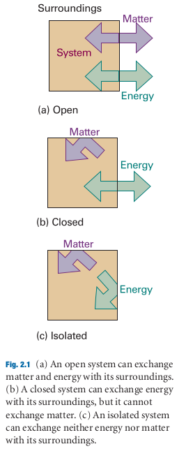
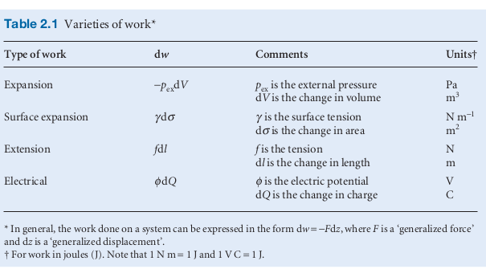

# Physical Chemistry

_Peter Atkins_

# The Properties of Gases

* Initially stated that gases are the simplest state of matter, why is this the case?
* The physical conditions, or the 'case' of a gas is it's state. 
* 3 out of 4 physical variables are used to describe the equation of state. Once the first three are known, it is shown
  experimentally that the fourth is fixed (or pre determined). The **equation of state** interrelates the four variables
  
### Pressure 

* > Pressure is defined as the force divided by the area to which the force is applied...The origin of the force exerted
  by a gas is the incessant battering of the molecules on the walls of its container
    * Collisions are numerous so it's essential a steady force.
* A movable wall is placed between two areas (in a container of differing pressure). The higher pressure side causes the
  movable wall to push into the low pressure side until both pressures are equal. This is a mechanical equillibrium.
    * > The pressure of a gas is therefore an indication of whether a container that contains the gas will be in
      mechanical equilibrium with another gas with which it shares a movable wall.
    * The physical nature of the properties being talked about
    * Also, leads into the measurement of pressure. Torricelli's invention is determining when a fluid is in mechanical
      equillibrium with the atmosphere.
      
### Temperature 

* > The concept of temperature springs from the observation that a change in physical state
* > The temperature, T, is the property that indicates the **direction of the flow of energy** through a thermally
  conducting, rigid wall. If energy flows from A to B when they are in contact, then we say that A has a higher
  temperature than B 
* > Thermal equilibrium is established if no change of state occurs when two objects A to B are in contact through a
  diathermic boundary [A boundary is diathermic (thermally conducting) if a change of state is observed when two objects
  at different temperatures are brought into contact]. 
* **Zeroth law** 
    * > If A is in thermal equilibrium with B, and B is in thermal equilibrium with C, then C is also in thermal
      equilibrium with A.
    * Thermal equillibrium being that no change of state occurs when the bodies interact. If B is a mercury vile and it
      has a certain reaction (change of state) when put into contact with A, we can then say that if it has this same
      reaction with C, that A and C will not have an reaction if they were to interact. This consistency means we can
      use the chnage of state of the mercury as a proxy for thermal equillibrium in bodies
    * Pressure temperature scale, that is, using pressure as the measure of thermal equillibrium is useful as there
      seems to be such a thing as a general gas, ideal gas. As opposed to using different liquids that expand and
      contract differentely.
End of this section covers a bit about partial pressure

### Virial equation

* That the perfect gas law is a first term in a new polynomial equation of state
* One of the big confusions I've been having is how we can reason about temperature from a pV graph. It seems to be a
  hidden variable.

# The First Law  

## Work, Energy, Heat

* > Work is motion against an opposing force
* > Energy is the capacity of a system to do work
* > Experiments have shown that the energy of a system may be changed by means other than work itself
* > When the energy of a system changes as a result of a temperature difference between the system and its surroundings
  we say that energy has been transferred as heat
  
  
* Heat as the transfer of energy through _disorderly molecular motion_. Molecules of a hot object 'stimulate' the
  molecules around it as they reach some sort of equilibrium.
* Work is the transfer of energy through organised motion. Interestingly this has an element of information involved, or
  a sense of purpose to the action.
* The distinction between work and heat is determined by the surroundings. For a given change in energy of the system,
  how did it come about? was it due to an 'orderly' transfer e.g. compression of piston, or through thermal motion from
  the surrounding molecules. The end result is an increase in thermal motion of the system but it's still relevant to
  talk about the 'source' of this change.
* Each human heartbeat consumes about 1 joule, pretty small 
* > An energy of 1 cal is enough to raise the temperature of 1 g of water by 1°C.
* If a system is isolated from it's surroundings, no change in energy takes place. 

## Expansion

* Expansion is seemingly a general term for transfer of energy through work. The indicator here is a change in volume,
  or a along any of the three axis. Working off the explanation above about a transfer of energy through 'organised
  motion' being work, is this our heuristic for that?
   
* $dw = -Fdx$ where $F$ is an opposing force
* _free expansion_ is expansion against zero opposing force, so no work is being done.
* $p_{ex}$ is the pressure external to the system so $p_{ex} = 0$ for free expansion
* In the case of a gas expansion against the atmosphere e.g. in a chemical reaction, the $p_{ex}$ could be modelled as
  constant. The opposing force from the general definition of work above becomes $F = p_{ex}A$ when the system expands
  through a distance (in the z direction) $dz$ then $dw = -p_{ex}Adz$ but $Adz$ is equal to $dV$. To obtain the total
  work done over a volume change 
*  $$-\int_{V_i}^{V_f}p_{ex}dV$$
* _reversible expansion_   
    * _equilibrium_ is when a system responds with an opposite change in state to a change in it's surroundings. 
    * reversibility seems to rely on mechanical equilibrium so that a change in the surroundings should be met by an
      equal change from the system. How does this mean it's reversible in the 'thermodynamic sense'?
    * I think a reversible process is one where we can define the path between two states (on a pV diagram). For rapid
      expansion the intermediate path will be undefined due to unknowns (not in equilibrium, in flux) as a given time in
      the expansion (different parts of the gas might be different temp.). A reversible process is one in which we can
      manipulate the path.
    * equilibrium is reached almost instantly at each incremental change. So the importance here is being able to define
      the state of the system at all points (in theory) along it's path?
    * Because each state in the middle is 'well-defined' we can go 'forward' or 'backward' along the path.

## Thermodynamics of mixtures

* In general, the **partial molar volume** of a substance A in a mixture is the change in volume per mole of A added to
  a large volume of the mixture.
* Partial here is more in the sense of partial derivative, it's the slope of the plot of the total volume as an amount
  of species J is added (everything else held constant).
* It can be used for other extensive state functions (once again the properties of state functions playing a role?).
* Raoults law and Henry's law look at different ends of the mole fraction scale. When two species combine this mole
  fraction determines which one is acting as the solvent and which the solute. It's this kind of tug of war we're trying
  to map. At lower molar fractions we expect to see Henry's law (so the species is acting as the solute). At higher
  molar fractions we expect to see it's vapor pressure following Raoult's law (so it's acting as the solvent).

## Thermochemistry

* The study of the energy transferred as heat during a chemical reaction

# Notes/Ramble

* Might depart from the structure here. It's interesting how important graphs are in analysing gases. Telling stories
  about them. A graph is just a causal relationship formally (wrong I think, see below). Most likely from experiment.
  It's interesting how the gas behaiours or prediction is what we'r'e looking for. The explanation revolves around it? 
* If some physical property is related to another physical property, we say that when a chnage in the property on A
  changes we notice also a change in another property on B. The two properties are related. When they are related
  linearly the same change of B occurs for every change in A. So there is a constant proportion there. Say if A is
  measured in x units and B in y units. And when A chnages by x + 1 units y changes by 4 units of y. So a change of 1 in
  A results in a change in 4 in y. If this is the same across all changes then the relationship is linear. **This says
  nothing about a causal relationship as I said earlier**. How does this relate then to deriving a statement about the
  ideal gas law. We have a set of relationships than we can define in two dimensions but how do we combine them.
* This may not be totally relevant but how do we keep temperature constant when changing pressure or Volume which
  changes the collisions happening (or the k.e. of the system)?
* I think it's worth trying to remember a small collection of comparisons for amounts of energy.
* "You can bring all the power of the Calculus to bear on the problems of thermodynamics once you focus on infinitesimal
  changes"
 
 
