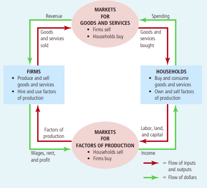

# Principles of Economics

* Starts of with the notion of scarcity which means an economy can't produce all the goods and services it wants to
  have.
* > Economics is the study of how society manages its scarce resources. In most societies, resources are allocated not
  by an all-powerful dictator but through the combined choices of millions of households and firms

### Ten Principles

_not all to be understood straight away, might take some convincing so important to come back to_

_How individuals make decisions_

1. People face trade-offs
    * Also touches on the idea of efficiency vs equity. Efficiency is when a society is getting the most out of it's scarce
      resources whereas equality is how those benefits are being redistributed. This fits into the trade-off notion in terms
      of understanding that one affects the other. An example given is increasing income tax for the higher brackets, making
      it more equatable but less likely that people will want to strive to be in those brackets
2. The Cost of something is what you give up to get it (opportunity) 
3. Rational people think on the margin 
    * Marginal is a small incremental adjustment and rational people are those that who do the best they can to achieve
      their objective (or at least systematically). Mankiw says that people inherently understand costs and benefits of
      actions. Not quite sold on this
4. People respond to incentives

_How people interact_

1. Trade can make everyone better off 
    * Households are used as an example, rather than us all growing our own food, making our own clothes etc. we focus
      on what each wants to do and does best. Interacting and trading with each other. 
2. Markets are usually a good way to organise economic activity 
    * The central planner, who knows what to do with an economies scarce resources is replaced by the decisions of
      millions of firms and households. Firms decide who to hire and what to make and households decide who to work for
      and what to buy
    * In a market the price determines how much a supplier will supply and how much consumers demand. There is a
      communication between demand and supply. Taxes distort this pricing and so too did central planning in terms of
      matching what consumers wanted and how much needed to be supplied
    * Prices can represent how much it costs society to produce a good and how much it's worth to that society
    * This has me thinking about the housing market and why, if that was centrally planned it might go to shit
3. Governments can sometimes improve market outcomes 
    * Government are important in enforcing property rights
    * Government policies can be divided into two broad aims, improving efficiency or equality. So increasing the
      economic pie or change how the pie is divided.
    * Externalities can affect how markets work for instance pollution may not be factored into pricing or the energy
      market. 
    * Monopolies can also affect the efficiency of markets.

_How the economy works as a whole_

1. A country's standard of living depends on its ability to produce goods and services 
    * Historically growth in productivity is linked with income growth
2. Prices rise when the government prints too much money
3. Society faces a short run trade-off between inflation and unemployment 
    * I think this relies on prices being 'sticky' in that it takes some time for prices to catch up with new demand in
      the economy. In that time, firms hire people and produce more.

### 09/09/22 09:38:36 Goals

* Brisk Read through Chpt 2 
* > All models [in this case, economic] simplify reality to improve our understanding of it
* 
    * From the above, if I (as a household) use money (dollars) to buy a good or service off a company, this becomes
      revenue for that company
    * The company, in turn, uses that to buy factors of production. In the Starbucks case, they might buy coffee beans,
      pay wages, pay rent etc. 
    * When revenue is used in this way it may enter another firm (in the case of buying coffee beans) in that case you
      go back to the above step
    * Either that or it becomes income for someone else
* Production possibilities curve
* Review of normative and positive statements. Normative (attempts to describe the world as it should be). Positive
  (attempts to describe the world as it is)
* Broken window fallacy

### 11/09/22 12:28:33

* Comparative advantage is a measure of the opportunity costs faced by two producers
* In the situation where one producer is better at one thing and another producer at another it makes sense that they
  should trade so that they operate efficiently. 
* Two main points here it seems: Gains from trade, comparative advantage
    * Gains from trade: 
    * Comparative advantage: A measure of the opportunity cost for a producer for producing a good. From a PPC even if
      one producer has an absolute advantage over the other they cannot have comparative advantage in both goods. This
      is because if a producer is not missing out on production of another good when its producing a good A, then inputs
      to produce A over inputs to produce the other good have a low ratio. When we go to the other good B and try to
      say, 'this should have a high comparative advantage too' we again measure the inputs into B over A. Because this
      is the flip of the first ratio it will be high.
    * Opportunity cost here is measured in the other good

#### Benefits of trade

* Description of production possibilities curve when one producers curve is much larger than the others and how they can
  both still benefit.

### Monetary System

* Fed was created to help banks against bank runs so I suppose it makes sense that it's considered a 'lender of last
  resort'.
* One of the main purposes of the FED is to control the money supply in the economy.
* How do we define the amount of money in the economy as many assets that can be used to buy goods and services in the
  economy such as currency or demand deposits (balances that people can access on demand). The line get's blurry here
  because there can be a time delay between asset and liquidity it's just about drawing a line in how long it takes I
  suppose.
*  
* If banks hold all deposits in reserve, they do not influence the money supply. Reserves are an asset to the bank, the
  deposit being the liability.
* If they only keep a percentage in reserve, using the rest for loans. Assets still equal liabilities there's just two
  types of assets.
* The money supply includes demand deposits so the money supply increases by the amount loaned out. 
* The bank is not creating _wealth_ it's adding more of the medium of exchange (?). The borrowers don't become richer.
  They have access to buy goods and services in the short term but they still must pay the loan back. There overall
  wealth in the long term doesn't increase. Where wealth is the amount of good and services you can 'have access to'.
* The money multiplier is the reciprocal of the reserve ratio. It also seems to be an infinite series which is odd.
* Can think of Assets on a bank balance sheet as how it's 'used' it's liabilities. 
* Bank capital: the resources the banks owners have put into the institution.

