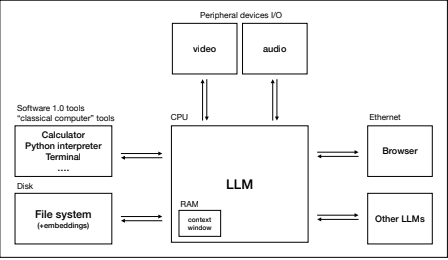

_Start putting in frames to evaluate the future development of AI._

## Frames/First principles

* To determine the impact of AI. How much of the current GDP can be produced by AI?
    * Understanding digital people (Karnovsky/Age of Em).
* That AI will have a 'transformative impact'. It's hard to deny that AI doesn't keep scaling but who says that it hits
  a point where it can duplicate us and/or go beyond us through its own feedback loops.
* Another tactic is to take the viewpoint of a smart person and deviate from that.
* Scaling laws, what are they and how does a tradeoff come into play with money where suddenly hard benchmarks become
  easier.
* There is a compute step change around 2012 when GPU's first started to be used. The doubling time for FLOPS (was it
    parameters?) in a model decreased.
* Even, just step back and think about how much has changed since last year, or since I left college. You'd have to
  seriously think about what you're learning in computer science these days.

## What is Compute?
[[Computational Power and AI]]

Compute is a measure of arithmetic or comparison (non arithmetic) operations.
The perfomance of a computer is broken into the logic unit, its interconnection
with memory and memory. All of these are factors in our measure of computation.
The measure has units of FLOPs/s.

In AI systems you have two stages: training and inference. The training run
time is a broad measure of the time and computation required to establish some
set of stable parameters in the model. Inference is a process of running the
model, considerably lower computation.

> Common metrics are operations (OPs), floating point operations (FLOPs) or
> Petaflop/s-days

FLOPS/s is a rate where's PetaFlops/s-days is the amount of operations
performed by a computer that would run 1 Peta flop per second in a day.

A petaflop is 10^15 operations per second. There ar
* Evolution produced us, therefore its possible that some process can produce intelligence.

## Dwarkesh w/ Carl Shulman
[[Carl Shulman]] [[Dwarkesh]]

Frame
* Evolution produced us, therefore its possible that some process can produce intelligence.

With AI we're developing the algorithmic process in one direction, it doesn't have to worry about fat stores, muscle
mass etc.

> really intensive massive brute force search and things like evolutionary algorithms can produce intelligence.

We spend more time in childhood, increasing compute, larger brain. Compared to a model and training.

A feedback loop of allocating resources to cognitive ability. The bigger your brain, the more compute, the smarter you
are, the smarter everyone else is so they can teach each other. So the marginal benfit for optimising this dimension is
much higher than any other dimension. (Without foresight here from evolution obviously).

He also highlights that the larger the group in pre-industrial society, the more technology propogated.

> Humans and animals learn and adapt efficiently with relatively limited experiences compared to what AI models are
> exposed to. This 'undertraining' means that despite their efficient cognitive architectures, animals can't reach the
> kind of exhaustive training AI models undergo.

This comparison to evolutionary brain development is really interesting.

This niche of dimension expansion that we got is
> In general, there are trade-offs where the extra fitness you get from a brain is not worth it and so creatures wind up
> mostly with small brains because they can save that biological energy and that time to reproduce, for digestion and so
> on. Humans seem to have wound up in a self-reinforcing niche where we greatly increase the returns to having
> large brains. Language and technology are the obvious candidates. You have humans around you who know a lot of things
> and they can teach you. And compared to almost any other species we have vastly more instruction from parents and the
> society of the [unclear]. You're getting way more from your brain than you get per minute because you can learn a lot
> more useful skills and then you can provide the energy you need to feed that brain by hunting and gathering, by having
> fire that makes digestion easier.

Each question asks you will frame your answer from what you've read.

_got nothing good here_

## Intro to LLM's

https://www.youtube.com/watch?v=zjkBMFhNj_g&t=1069s

Think of LLMs as the kernel process of an LLM OS.

* Pre-training is when a web crawler takes a large amount of text data and the parameters are calculate for the model
  through large amounts of computation with GPU's.
    * Compress 10TB of web text data
    * Get a cluster of~6000 GPUs.
    * Pay 2 million, wait 12 days, obtain base model.
* Once this done, fine-tuning involves more labelled instructions that specify how the model should behave. Collect
  high quality QA responses and train the model on that (assistance model).

Karpathy states that text prediction is a form of compression of the internet. If we think of a random sequence as the
most un-compressed form of a string. A model can predict what comes next, therefore it reduces the information required
to store that text.

* You can't use the base model directly. Not too sure why.
* You can do your own fine-tuning with the meta llama model, they'll give you the base model.
* Closed weight models are the highest rated currently (ELO wise).

### Scaling Laws

Performance of these LLMs in terms of the _accuracy of the next word prediction task_ is a well behaved function of two
variables: The number of parameters and the amount of text we train on.

The accuracy is correlated with a lot of things we do care about.

### Multi-modality.

* Tool use is a major aspect in how the models are becoming more capable (being able to use the browser, plot things
  Dall-E etc.).
* This is related to how we solve problems, we use calculators, search for information etc.

### Future development

* LLM's currently function in a system 1 fashion. They can't dilate their pupils and put a tree of possibilities on
  front of their minds eye. What would it mean for them to have a system 2? We want them to think things through.
* Theres no simple reward function for self-learning of LLMs.

## The most Important Century
https://www.youtube.com/watch?v=3K25VPdbAjU

- If you think about trying to tell communities in the 18th century about the industrial revolution, you would have
  sounded as crazy as people projecting hyperbolic growth sound now.
- By default, peoples model is that business will continue as usual. If you project this forward, say 2% a year of
    growth there
- You see exponential growth in population historically. " In 1800, there were one billion people. Today there are more
  than 8 billion of us."
- " the world population today is around 2,000 times the size of what it was 12,000 ago when the world population was
  around 4 million – less than half of the current population of London." This growth has happened very recently and
  Brad Delong has done an estimate of GDP historically which matches this general plot.
- Population growth is not exponentially, it's growth rate is not constant and has been declining since the 60's.
- While things have happened historically, massive standard of living increases didn't really happen. From generation to
  generation the type of life you lived didn't change too much. Vaclav Smil estimates that during the Roman empires peak
  the annual per capita energy usage was 18GJ which didn't change really for the next 1000 years.
- In England, the percentage of people emplyed in agriculture in the early 19th century was about 30%, falling to 1.2% in the early
  21st century. Life expectancy of a 10 year old went from 57 -> 80 yrs and % attending primary school went up to 98%
  from 13%.
- The business as usual viewpoint would say that someone looking at today from the 70's is the same effect as us looking
  50 years in the future.
- Perhaps, we're failing to see a radical change.
    - If you look at economic growth in the last 100 years it has a fairly predictable growth rate. Economic growth rate
      is increasing though throughout time.
    - can thought of as every time quantity doubles the time til it's next doubling decreases by some amount. This is
      different from exponential where the growth rate is constant over time.
- Ok, so infinite growth doesn't make sense (physically) but one technology (duplication) might be able to break free
  from the business as usual thesis.
- Duplicators could be used to create (potentially unlimited) duplications of the worlds most productive people. If
  cost of duplication were low this method could possibly sustain the economic growth projected.
- The inputs to the economy can be broadly classified as labour (population), capital (equipment and supplies) and
  technology (efficiency of labour). You can explain economic exponential growth with a pure population model. Each
  generation produces more output, therefore they can produce more people, who produce more output.
  - The economy gets bigger when you have more people, more capital and more technology.
  - For some starting generation with some population of labour and capital. This generation comes up with new ideas
    (innovation) in ways to use their capital. This creates more economic output to support a large population. Each
    person has a certain likelihood of innovation to produce more output.
- It's my understanding that because of language and ideas being spread. When someone has a production increasing idea.
  The whole population can essentially get that idea.
- Ok, so if we assume AI will have the same affect as a duplicator. That is, increasing the productivity rate it becomes
  a matter of when this will happen.

**This is why predicting AI progress is important, it gives a timeline**
- It seems the end of this century is a serious proposition based on surveys.

## Super Intelligence

### Perfect Bayesian agent

> In the case of uncertain reasoning, the question isn’t “What is a proof?”, but rather questions such as “What is it
rational to believe, in light of certain observations and probabilities?”

A logic based agent is this idea form of transforming states to the end state. This, however, meets the combinatorially
explosion so we inherently live with uncertainty. This brings in what 'beliefs' or propositions one can hold.

If you had a proof that was 5 lines long with one rule of inference, like implication or something and you start with 5
axioms. Then you would be able to brute force a proof if you tried 5^5 'proofs' and select those that generate something
new or that are valid. This could be any formal logic.

Artificial Intelligence: A Modern Approach defines an "agent" as

"Anything that can be viewed as perceiving its environment through sensors and acting upon that environment through actuators"

It defines a "rational agent" as:

"An agent that acts so as to maximize the expected value of a performance measure based on past experience and knowledge."

It also defines the field of "artificial intelligence research" as:

"The study and design of rational agents"

If we look at machine learning from a 'functional' level, that is, the goal of such systems is to _learn the function_.
Model and function are interchangeable in this context. Machine learning is a process of building _models from data_.

- Neural nets try to _classify_ an input into some set of finite output (supervised).
- Linear modelling tries to determine parameters for a model or function.
-

# AI impact

### How Do I Envision AI changing software?

The Software Development lifecycle is an interaction between interfaces. AI enables the interaction
between these interfaces to be automated. In my own work:

- A feature request.
- Some implementation (algorithm) to meet some criteria of the feature request.
- Feedback on the feature request.

The above process is generalised but my belief is that the second point, the core of my work can be
automated. Secondly, this will happen sooner for me, than for a senior.

#### Why my job can be automated.

My job, is constrained to step two above. Some formal way to get from the initial state to the goal
state. What are the barriers preventing this from happening? Suppose an AI implements an extremely
convaluted algorithm thats really slow? In the feedback stage this would be weeded out. Suppose that
AI me just keeps getting it wrong? The likelihood is small, given that AI me will have untold hours
of training in the specific syntax and semantics of the algorithm language. It could still happen of
course but AI will keep getting better which means focusing on what it AIable is not a good idea.

**Michael Webbs work as a back up here? I'm not much convinced by the above**

#### AI will augment software developers

On the second point above. If I have some productive capacity. So for some inputs I generate some
dollar amount of business value. A senior developer might generate, say, 10x this, so they would be
10 times as productive as me. In the minimum case, AI will augment these engineers such that they
get some percentage increase in productivity. As Vogels says

> 2023 Stack Overflow Developer Survey, 70% of respondents said they were already
> using or planning to use AI-supported tools in their development processes.

Crucially, they can provide support in the software lifecycle so that the real value of the
applications being developed can take priority.

> Unburdened by the undifferentiated heavy lifting of tasks like upgrading Java versions, developers
> can focus on the creative work that drives innovation.

Say 10%, this means that the business value they
create, is now 110% what it was:

40hr/week :
- me: 1000$
- senior: 10000$.

40hr/week with AI:
- me: 1000*1.1 = 1100$
- senior: 10000*1.1 = 11000$

So the senior has added 1000$ of business value, presumably for lower cost than I such that the net
cost is most likely greater than me. Michael Webb says that AI will bring in "demand elasticity in
the presence of complementarity". The idea is that companies approach this cheap productivity gains
by scaling up AI use, or scaling down workforce. Neither would save me.

### AI will start solving wicked problems

AI as helping to solve [[Wicked Problems]] The right answer is ambiguous.

https://www.youtube.com/watch?v=wvvMmLzzhqg

* Once something has an interface an LLM can interact with it and it can be iteratively developed
  through natural language.
  * Amazon Q is doing version migrations already https://www.youtube.com/watch?v=JVEusf8l2b
* User feedback or interaction with a software developer can be used to iteralively develop software
  in a kind of 'backpropagation' [^1].

## Value of Software Engineers from a business perspective

- [[Budgets for Software Engineers]]
- [[why engineers are worth so much]]
- [[dont call yourself a programmer]]

These articles state the case for the cost centers that are software engineers. Software does not
exist for its framework, intersteing problems or complexity (as it might in other non business
domains). #### Case Study

#### Understanding backpropagation in this context

## What do I like/dislike about Software

* I like software as a tool for solving problems. As a means to an end, not a means in itself.
* Sometimes I feel surrounded by people who like software the entity in itself.
* Here, I'm generalising programming with Software. The idea of optimising algorithms for no reason
  etc. In my view if its not attempting to get us closer to a solution to a problem beyond software
  I'm not interested.
* This is probably not a fair view though. What are some cases where just love of programming
  benefits everyone? I guess they can co-exist.

>  There is a computer disease that anybody who works with computers knows about. It's a very
>  serious disease and it interferes completely with the work. The trouble with computers is that
>  you 'play' with them! - Feynman

* I think there's always space for me to explore programming languages and CS but my career won't
  involve this. The advent of generative AI abstracts a lot.

w Do I Envision AI changing software?

The Software Development lifecycle is an interaction between interfaces. AI enables the interaction
between these interfaces to be automated. In my own work:

* If you try to write a program, algorithm, to recognise handwritten digits there are numerous
  caveats and fuzzy thinking that must be accounted for.
> What seems easy when we do it ourselves suddenly becomes extremely difficult. Simple intuitions
> about how we recognize shapes - "a 9 has a loop at the top, and a vertical stroke in the bottom
> right" - turn out to be not so simple to express algorithmically. When you try to make such rules
> precise, you quickly get lost in a morass of exceptions and caveats and special cases. It seems
> hopeless.
* The goal of a neural network is to use examples to learn the rules and caveats this algorithm
  would have.
- A feature request.
- Some implementation (algorithm) to meet some criteria of the feature request.
- Feedback on the feature request.

The above process is generalised but my belief is that the second point, the core of my work can be
automated. Secondly, this will happen sooner for me, than for a senior.

#### Why my job can be automated.

My job, is constrained to step two above. Some formal way to get from the initial state to the goal
state. What are the barriers preventing this from happening? Suppose an AI implements an extremely
convaluted algorithm thats really slow? In the feedback stage this would be weeded out. Suppose that
AI me just keeps getting it wrong? The likelihood is small, given that AI me will have untold hours
of training in the specific syntax and semantics of the algorithm language. It could still happen of
course but AI will keep getting better which means focusing on what it AIable is not a good idea.

This is uncertainty, known unknowns vs unknown unknowns.

**Michael Webbs work as a back up here? I'm not much convinced by the above**

#### AI will augment software developers

On the second point above. If I have some productive capacity. So for some inputs I generate some
dollar amount of business value. A senior developer might generate, say, 10x this, so they would be
10 times as productive as me. In the minimum case, AI will augment these engineers such that they
get some percentage increase in productivity. As Vogels says

> 2023 Stack Overflow Developer Survey, 70% of respondents said they were already
> using or planning to use AI-supported tools in their development processes.

Crucially, they can provide support in the software lifecycle so that the real value of the
applications being developed can take priority.

> Unburdened by the undifferentiated heavy lifting of tasks like upgrading Java versions, developers
> can focus on the creative work that drives innovation.

Say 10%, this means that the business value they
create, is now 110% what it was:

40hr/week :
- me: 1000$
- senior: 10000$.

40hr/week with AI:
- me: 1000*1.1 = 1100$
- senior: 10000*1.1 = 11000$

So the senior has added 1000$ of business value, presumably for lower cost than I such that the net
cost is most likely greater than me. Michael Webb says that AI will bring in "demand elasticity in
the presence of complementarity". The idea is that companies approach this cheap productivity gains
by scaling up AI use, or scaling down workforce. Neither would save me.
