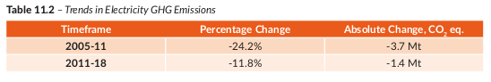

# Climate Action Plan 2021 

_Notes on the 2021 Irish Climate action plan_
[This plan will apparently be updated annually](https://www.gov.ie/en/consultation/0de7f-climate-conversation-climate-action-plan-2022/)

## Part 1

* EU driving force is the 'European Green Deal' which among other things wants the EU to be carbon neutral by 2050. It
  also pushes for a reduction of 55% in GHG by 2030 (from 199 levels)
* > In line with EU ambition, the Programme for Government, Our Shared Future commits to achieving a **51% reduction in
  Ireland’s overall GHG emissions from 2021 to 2030**, and to achieving net-zero emissions no later than 2050. These
  legally-binding objectives are set out in the Climate Action and Low Carbon Development (Amendment) Act 2021, the
  enactment of which was a key priority in the
* There's an iterative model they're trying to work with too in evaluating technologies 
* A National Adaption Framework from 2018, due to be updated in 2022 is a plan to deal with the effects of climate
  change on Ireland's climate
# Notes

* The goal is to reduce this pie
* > In 2021, Ireland’s provisional GHG emissions are estimated to be **61.53 million tonnes carbon dioxide equivalent (Mt
  CO2eq)**, which is 4.7% higher (or 2.76 Mt CO2 eq) than emissions in 2020 (58.77 Mt CO2 eq). 
* Could be interesting to have a pie for Ireland's balance sheet as a measure of burden on the Irish people maybe
  
# Assignment

_Going to look specifically at electricity and building retrofitting get_

* Main goals
* Outline of governance and just transition that is highlighted early on
* Focus on electricity
* Focus on retrofitting buildings 
* Worth highlighting where the emissions are coming from in the generation

* Challenges this plan attempts to address?
    * Mitigation of the effects of GHG on the climate
    * Also, tries to focus on climate adaption from the changes that may come to our environment from global warming
    * > The Climate Act will support Ireland’s transition to net-zero and the achievement of a climate neutral economy
      no later than 2050. It also establishes a legally binding framework with clear targets and commitments, to ensure
      the necessary structures and processes are in place to deliver our national, EU and international climate goals
      and obligations in the near and long term.
* Define the economic, environmental and technological situation it's being defined in?
    * The main policy context seems to be the National Development Plan
* The legal acts supporting the plan?
    * There doesn't seem to be much of a consequence of sectoral targets are not hit.
    * I suppose the Carbon tax acts as the main punishment?
    * Also, just sticking to constant updates, actual implementation details surely requires such an approach. A
      statement like 50% emissions reductions is much more static of a statement that actually implementing it.
* Analysis of how these acts will be carried out
* Critical analysis, what could be improved, what might work and how.
* The whole doc is definitely too large to cover in a 10 minute presentation. My hope would be to identify some patterns
  that are being used to push toward their goals. Maybe areas of relevance or just interest to me would be a good filter
    * Residential buildings and the national retrofit plan
    * electricity generation
    * Brief look at last 4 chapters too
* Format is: state of play, targets set up, then how those targets will be hit.

#### 13/10/22 14:21:41: 

What's the story of the policy document? Ireland is trying to have no GHG emissions by 2050. It currently has about 60
Million tonnes of CO2 emitted per year. This is a directive from the EU, it was promise made during the 2015 Paris
agreement (?). There is an emphasis on making it a just transition, making it equitable for all those who may be
effected by this change in the economy. The economy is broken up in to main sectors of emissions. Building (both
residential and commercial), electricity, transport and industry. Areas of particular interest for me are building
changes and the change in electricity generation. Firstly, where do the CO2 emissions come from in each of these two
sectors? For Electricity, it's generated in the combustion of fuels used to power electricity generators. For buildings,
most of it is in the use of generating heat. What's taken my eye so far is how much progress we've made in the
electricity sector in terms of converting to renewable energy supply, the ceiling on this transition might be harder to
break than others though (in terms of managing variable demand with renewable's). There is a massive retrofitting plan
on the building side of things. About 500,000 homes are being targeted for upgrades to get a BER rating of B2. 

The whole policy is also in the shadow of the National Development Plan, this far reaching plan to set up Ireland for
the future (2040 to be exact). Consideration for the climate has become a part of a plan like this for the first time in
Ireland's history. 

There was a previous Climate Action bill in 2019 but we now have a 'legally binding' (not too sure to what extent)
target of 50% reduction by 2030. There's also a real iterative aspect to the plan, like a 2022 updated version, probably
every year it will update.

Documents I know of:

* This one
* Ireland's national energy and climate plan with seems to be analysis of all energy related things in Ireland
* Ireland energy white paper which is a less dense version of the above of Ireland's general energy stance until 2030

Open questions?

* What are the renewable support schemes?
* Is there a set emissions target by sector, has that been issued? Does Ireland operate by cap and trade or by carbon
  tax? I know it's the latter but whats the difference?
    * [Sectoral ceilings](https://www.gov.ie/en/press-release/dab6d-government-announces-sectoral-emissions-ceilings-setting-ireland-on-a-pathway-to-turn-the-tide-on-climate-change/)
* What are the incentives in place for retrofitting? Is it just a push? How will it work with already high construction
  costs for housing? Could it be socially unstable?

## 18/10/22 12:41:53

* It seems if we actually look at the laws, you've the [principal act](https://www.irishstatutebook.ie/eli/2015/act/46/enacted/en/html) 
 which is from 2015, then we've amendment's to this act
 https://www.irishstatutebook.ie/eli/2021/act/32/enacted/en/print#sec4 which seems to just make it a bit more intense.
 If a company doesn't follow this then they're breaking Irish law?
* https://sci-hub.hkvisa.net/10.1017/cel.2016.7
* Quick detour about how the government in Ireland actually works, jeez I'm ignorant of it all.
* Will national retrofit affect housing supply greatly?

## 19/10/22 13:42:11

* The goal is to present what the document is first and foremost and answer some of the main questions about it.
* The general structure is state of play, target, then actions to acheive target
* Thoughts on it can be given later.

### Electricity 

* Electricity accounts for 16.2% of the GHG emissions for Ireland in 2018
*  
* What's already been done
    * First Renewable Electricity support scheme?
* Hopes to reduce electricity emissions by 62-81% relative to 2018 levels (which was about 10.5 MtCO2)
* There's a nice infographic of the amount of investment in electricity change that will be incremental, in that it
  requires a building on top of initial structures, or a transformation of existing infrastructure
* In electricity generation GHG emission's come from the combustion of the fuel used to generate the electricity **more
  detail here**
* Data centers are projected to increase to 25% of current demand ?. This puts into question how influential the
  'legally binding' targets will be for location of data centers in Ireland, unless we can manage the load of course.
* > Building energy efficiency improvements from an extensive retrofit programme will moderate the growth in electricity
  demand from new heat pumps in buildings
    * How does a heat pump moderate demand?
* Variable demand seems a large challenge. Managing network loading with renewable sources is key. Also, the
  introduction of smart meters might help this.
* Need to get some reference point for MW
* If the action is creating a policy roadmap or a committee. Is that something useful? When is it appropriate and when is
  it not?
* May have been a good idea to use whatever policy doc we used to reduce emission by 16% (failing at it)
    * This was done under an EU directive. 
    * Could further look into how binding this is

### Buildings

* Main source of GHG is generating heat.
* Main push here is to make homes more fuel efficient and take them off fossil fuel heat
* > the achievement of this target alongside other initiatives such as the roll-out of district heating systems. This
  National Residential Retrofit Plan (NRP)aims to achieve the equivalent of 500,000 homes retrofitted to a Building
  Energy Rating (BER) of B2/ cost optimal or carbon equivalent and the installation of 400,000 heat pumps in existing
  homes to replace older, less efficient heating systems by end-2030.
* There is a focus on conveying what retrofitting is to construction and to residential aspects of the house. So making
  people more aware of what a more efficient house can do for them and then giving clear goeals to construction as to
  what a retrofitted, efficient house is
* The actions here are defined by 4 pillars
    * Driving demand and activity in the retrofitting of homes
    * Financing
    * Supply chain and skills, setting up the current supply chain to handle all the retrofits
    * Structures and Governance
        * the SEAI will be the main driver of change of retrofitting. It says they want to implement SEAI re
          structuring?
