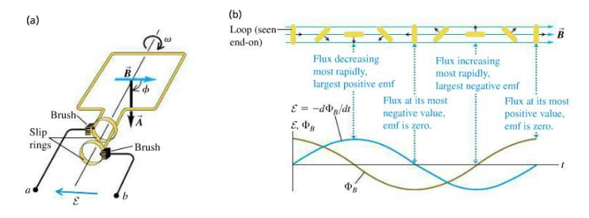

Power system is a network of components deployed to supply, transfer and
use _power_. In particular, electric power.

The transformer allows the use of realy high voltages in generation and
transmission of Power.

The transformer can be thought of as a lever. It trades voltage for current at equivalent powers.

### Why do we need large voltages for efficient power transmission?

* The goal is to transfer as much of the power that was produced to the destination load.
* The biggest dissipater of power (energy/time) over the line is resistive losses, or I2 losses.
* Because this loss is proportional to the square of the current you want a really low current. To get a really low
  current with the same power you need a high voltage.
* It seems that now HVDC is possible, it would be preferable but when all the infrastructure was set up higher voltages
  could only be obtained by AC sources.
* The use of transformers allows high voltages of AC to be obtained. 

# Components of Electric Power System

## Electric Generator

Most electricity is generated using a turbo generator. Mechanical
energy, derived from fossil fuels spins a turbine rotor that induces
power into the surrounding stator.

A **generator** consists of a rotating part and a stationary part which
together form a magnetic circuit.

-   An n pole strator where each pole is a solenoid, that operates like
    a bar magnet.

-   The strator can be connected to a power source in such a way that a
    rotating magnetic field is produced.

-   The voltage from this power source are at different phases.

-   Detail how this rotating magnetic field is generated.

-   Product of superposition of magnetomotive force.

-   For now, if we just think of the rotor as having a magnetic moment
    that is trying to follow the rotating magentic field.

Equivalent circuit enables us to analyse performance of motor. Going
down the rabbit hole of slip frequency and all that.

There is mechanical energy in the rotor that appears in the electrical energy aspect as angular velocity $\omega$. 

## Load

Power systems deliver energy to *loads* which form a function.

### Non Linear Loads

When the current drawn does not vary linearly, or is intermittent from the source voltage.

Trying to get used to this notion of 'drawing' current.

Worth thinking about 'variable loads' in general.

_Harmonic order_ is the ratio of the harmonic frequency to the fundamental frequency.

### How is it that a source 'seems' responsive to a load that needs more energy

* Sounds very teleological, I know but the notion that a load might draw more current.
* In a simplified example. There's so phase voltage powering a load. The goal of the source is to maintain constant
  power.
* What if the load requires less power than that from the source?

## Switching as Voltage Regulation

* The notion seems to be that any output voltage between 0 and the source voltage can be achieved by switching so fast
  that the output has no noticeable variation and it's average voltage is some desired value.

## Transmission

Conductors carry power from source to load.

---

Generators generate sinusoidal output (natural rotation). We can turn
the rotation of coil of wire into a sinusoidal wave.

If we look at a loop in a uniform magnetic field.

Comes directly from translating mechanical energy (through rotation) to
electrical energy.

RMS value $$P_{DC} = P_{AC}$$ $$I^2R = \frac{1}{2}I_{max}^2R$$
* $$I_{DC} = \sqrt{\frac{1}{2}I_{max}^2}$$
* $$I_{DC} = \frac{I_{max}}{\sqrt{2} }$$

From Faraday's law we know that the emf generated in a coil is
proportional to the magnetic flux. If you've a rotating coil, the flux
is change by some proportion to the angular velocity.

Things like impedance, reactance are just products of the alternating
current.

# Power in AC circuits

* Voltage and current are no longer constant so the power law for DC currents won't work.
* There is reactance in the circuit, this adds a time delay to power in the circuit (as it's stored by the reactive
  components and returned to the circuit).
* Power at any given time is the voltage at that time by the current at that time.

* $p = Vsin( \omega t) \times Isin(\omega t - \phi)$
* $p = VI(sin(\omega t)sin(\omega t - \phi)$
* With a trig identity.
    * $sin(\omega t)sin(\omega t - \phi) = \frac{1}{2} cos(\omega t - (\omega t - \phi)) - cos(\omega t + \omega t - \phi)$
* If phase between current and voltage is zero then $cos(\phi) = 1$
* $p = VI(\frac{1}{2}(cos(\phi) - cos(2\omega t - \phi)))$
* $V_{rms} \times I_{rms} = \frac{VI}{2}$
* $p = V_{rms}I_{rms}(cos(\phi) - cos(2\omega t - \phi))$

  
# Transformers

* A transformer consists of two or more windings coupled by a magnetic field.
* Transformer windings are actually interleaved but represented as separate.
* Different shapes of silicon steel laminations sheets make up the core. Shape depends on frequency of operation.
* Transformer are passive, the power does not change (ideally) just the voltage.

# Magnetic Circuits

* Magnetic fields exert a force on moving charged particles. 
* Similar to the way emf drives current through an electric circuit, magnetomotive force (mmf) drives magnetic flux
  through a magnetic circuit. MMF is not a force (just like EMF is not a force).
* MMF plays a role similar to ohms law because its a constant arising from the relationship between flux in the circuit
  and the reluctance of the circuit.
* This opposition to flux is defined by properties of the object. It doesn't dissipate heat though? It stores the
  energy.
* Gauss's law for magnetic fields means that the net magnetic flux is always zero. For any source field line there is a
  sink at the source.

## H vs B 

* Differ in how they account for magnetization.

# Phasors

One of the main reasons for using AC (according to Halliday) is that the
magnetic field is changing, meaning we can use transformers to step up
or step down current.

