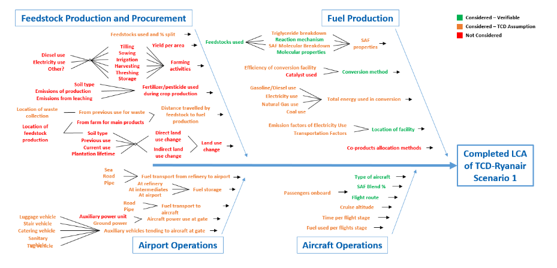

_Master doc for summer research projects notes_

# What is the problem?
_time to get very, very familiar with the problem_

Represent the uncertainty of output of an Unit Process under the LCA standard.
Propagate that uncertainty for a collection of dependent unit processes.

Here uncertainty is a parameter that quantifies a _range_ of values that could credibly be given to the output.

There are two problems, a design problem and a uncertainty analysis problem.

# Representation of the LCA

Arguably the most flexible representation is that of a computer program. This allows the LCA designer to choose a
different underlying representation based on what they would like to say about the output.

Excel enhances the 'accounting' feature of the LCA but comes with the cost of rigidity for computation methods to be
used on the LCA.

All the issues and benefits are downstream of the chosen representation.

An LCA almost operates on a critical algorithm scale like in aircraft's or medicine. Once again, the representation
allows us to take advantage of progress in those fields

[LCA as computation](https://sci-hub.se/https://doi.org/10.1007/978-94-015-9900-9)

## Representation Design goals

Building a tool to simulate the TCD model.

1. Produce a way to simulate the TCD model so that input parameters can be varied and the output taken.
2. Should be flexible enough to simulate the model n number of times.
3. Should leverage the advantages of the model i.e. should be able to interact with level of granularity of model.

### Who am I designing this for?

The user is just me. My design thinking cap has been on though but seems to be taking place in two
dimensions. There is the representation in a UML or more software related paradigm and the representation in a more
realistic or tangible way ([Mass flow as a shared language](#Mass flow as a shared language).

Making use of specific Python design patterns like duck typing, conscious of creating the appropriate data types.
Thinking about what I'm trying to represent (each-of, recursive, one-of) and choosing an appropriate data type.

I've prioritised representation in Jupyter notebooks taking a 'walkthrough' style approach to its use. Not really by too
focused a design but more emergent from the idea of communicating what I'm doing. This is similar to notion of literate
programming I believe **??**.

### What do I expect the lifetime of this representation to be?

## Mass flow as a shared language 

Ideally, this model would be developed in a communicative environment (Evans). There are limitations here, partly due to
my own laziness and to divide in representation of code base to those unfamiliar with code. To progress this 'shared
language' and effort has to be made on my side to present the model I'm operating with which is Python code, in the form
of classes (objects) and functions on these objects. 

This links also with representation in Jupyter notebooks or more literate programming.

## Tacit Knowledge
_Technology is knowledge of cause-and-effect relationships embedded in machines and methods._

There are three months in which I hope to contribute useful work to a body of knowledge that extends for years.
Efficiency of learning is important. Disparate parties with different mental models are trying to exchange knowledge.

If we think of Liams as having some mental model of the fuel production process. I come along with no knowledge of such
a process and my goal is to embed some abstraction of what Liam knows into Python code, or, more generally, an algorithm.

In N and T they use the example of making a home baking appliance. There is tacit knowledge, like that in liams head of
the baker. The goal is to create a machine (technology using the above definition) which does what the baker can do,
implying that it has the same knowledge (tacit) in the bakers head embedded in its operation. 

Now, my goal is not to replace Liam with a computer! its just to say that we have tacit knowledge we're trying to
externalize. **This framework might help us gain insight into how to do this process more efficiently.**

Once knowledge is externalized, its explicit and can easily be processed by a computer. Thats where we can leverage the
full power of computation.

### Limitations of Knowledge representation

* In DDD Evans points to the complexity at the heart of software, that software is about the ability to solve domain
  related problems for the user. He posits that this requires steeping yourself in the domain. That most developers
  try to use technology to skip this step but that its crucial to tackling complexity in the solution.
* Evans uses a Monty Python analogy of a technicality getting in the way of putting a funny scene in the final cut.
  Knowledge of the domain requires knowing what to ignore technically provided that the goal of the domain problem is
  being solved.
* A _pidgin_ language develops similar to what [Vernon talks about](../articles/softwareisprocess.md).

# Uncertainty Quantification

The tacit part of Liam's knowledge, that of which is by definition not in Excel (not explicit) is related to assumptions
and credences (aka uncertainty). So the embodiement of tacit knowledge is integrating these assumptions and credences
into the model itself. So far, I've been converted explicit to explicit. 

(Lo 2005) highlights the use of bayesian methods to encroporate 'belief' into calculations.

## Approach

1. Classify uncertainties: Look at model and determine where the relevant uncertainties are. The model could be the
   whole fuel production or just a unit process.
2. Aggregate uncertainties: Using sampling methods to aggregate the uncertainties specified on each domain of the
   previous step.
3. Sensitivity analysis.
4. Think of how best to present results.

## Does an uncertainty analysis lead to better decision making?

This overlaps too with scenario and relevance uncertainty from the LCA theory and practice book.

_LCA as decision support tool_ 

> Practitioners generally assign single values to model parameters, build deterministic models to approximate
> environmental outcomes, and report results as point estimates. This approach fails to capture the variability and
> uncertainty inherent in LCA, reducing the effectiveness of LCA for _supporting_ private and public sector decision making

If we take as an assumption that the goal of an LCA is to support decision making (@lloyd2007). An uncertainty analysis
provides a level of credence to the model being used. It says, how much should we actually care about what this model
says.

The hope of making the right decision is an efficient use of resources (time and money).

Refining the scope a bit, something like a sensitivity analysis makes our LCA better. We allocate resources (time,
energy and money) to data collection that is more relevant to the outcome of interest. This is all with the aim of
crafting an LCA model that does what it says, that evaluates scenarios and gives outcomes based on functional units.

**The LCA functions as a prior for the next decision, in this scenario, spending on R and D (what do I mean by this?)**
Can this be formalised?

## How might a highly precise input parameter not imply increased accuracy in the model output?

More data collection and information relating to a parameter will increase its precision, lowering the uncertainty
surrounding its final value. If the variation in this parameter has little to no impact on the model result this
precision increase plays little to no role in increasing certainty of our model output.

## How might an uncertainty analysis offer us more information than just a sensitivity analysis?

If our aim is to figure out what paramters we should spend our time on, we need to know both how important it is to the
output (sensitivity) and the uncertainty range associated with it.

Thinking of the extremes, high sensitivity, high uncertainty is something we should spend time on and vice versa.

In terms of maximising gains in the certainty of the output measurement, we divert our attention to those parameters of
high 'importance' where importance is defined as position in the sensitivity uncertainty matrix.

## Representation
_to following is taken from 11.5 of @hauschild2018_

### Classification of target audience

Try to define the target group in terms of what they might know about LCA's and uncertainty analysis. Some of the
categories might include:

For addressing multiple groups, developing layers of explanation: executive, technical etc. can be a good compromise.

### What to communicate?

What assumptions are relevant to convey to the target audience. 

### How to communicate uncertainty?

It's important to be aware of _interpretation_. It is up to the communicator to be conscious of possible
misinterpretations and understanding. 

Representation of uncertainty is open to a wide array of interpretation. You're balancing the probability heuristics
that people have with what you're trying to actually communicate.

### Some questions to ask of the presenation?

* How could this data be otherwise interpreted?
* What terms am I relying on the target audience understanding?
* How do I feel that the target audience interprets/understands these terms compared to my own understanding?
* What models or map/territory relations am I relying on the audience knowing?
* Are we seeking to persuade or inform?

# Notes

* **Principle of least astonishment**: "a component of a system should behave in a way that most users will expect it to
  behave". In UI design its leveraging a users prior knowledge to reduce friction of interaction. An example si given as
  integrating keyboard shortcuts that people have gotten used to over time. Say if lots of people use Chrome and Ctrl l
  always yanks the url, then if I'm presenting a new browser to a user and I want this to be a feature, I should
  probably make it the same shortcut.
* > New knowledge is born in ambiguity and redundancy.

'Cultivating a language based on the model'. Do we want the model to become _knowledge rich_? that is, have some
coherence due to the knowledge its built on.
> It is the creativity of brainstorming and massive experimentation, leveraged through a model-based language and
> disciplined by the feedback loop through implementation, that makes it possible to find a knowledge-rich model and
> distill it. 

* How might knowledge socialization sessions look?
* Knowledge representation: Is there a connection between the well known machine learning space and the tacit knowledge
  that aims to be embedded in the LCA model?

# Papers

_to act as notes for literature review section_.

## [@lloyd2007]

> Most often, practitioners define a model structure, assign a single value to each parameter, and build deterministic
models to approximate environmental outcomes. This approach fails to capture the variability and uncertainty inherent in
LCA.

They outline where LCA results are being used in a policy decision making context, it might be good to get some data on
where LCA are being used, particularly in the airline industry.

They took 24 LCA studies that claimed to do an uncertainty analysis. They aim to discuss the current approaches effect
on enabling better decisions.

* They types of results reported: I'm confused as to how the LCI is considered a reporting of a result. Seemingly where
  inventory information on elementary flows is 'translated' into some impact metric.
* They've classified uncertainty into parameter, model and scenario. 
* I don't totally understand the piece on 'evaluating the role' that different types of uncertainty play.
* Is **scenario uncertainty** something we should consider? allocation procedures are classified as such.
* Parameter uncertainty was the most commonly evaluated form of uncertainty but the authors could not determine if this
  was due to avaliablity of data for this characterization or that it is the most important form of uncertainty. All 24
  studies reported parameter uncertainty.
* There was quite a lot of difference in opininon on uncertainty propogation methodology. Probabilistic modelling
  requires lots of computation. The inherent uncertainty in the data sets was also considered a motivating factor for
  certain methods.
* The iterations needed for MC simulation was determined based on when the authors felt that convergence would be reached.
 > In many cases, the reasons for using the various sampling techniques were not discussed.
* A low number of studies berfore statistical tests to evaluate selected distributions? what are these tests?

### Discussion

Analytical uncertainty may not be best for LCA with large uncertainties. They say its due to not being able to provide
reliable estimates for tails of the output distribution?

It seems fuzzy data sets are useful for qualitative reasoning and imprecise language. 

## [@bamber_comparing_2020]

Contrary to @lloyd2007 they say that LCA's are not accepted as decision support tools due to lack of robustness.

* It seems that uncertainty reporting is actually decreasing despite more and more LCA studies being published.
* Importance of uncertainty types can be context specific. https://journals.plos.org/plosone/article?id=10.1371/journal.pone.0121221
* Includes link to https://www.sciencedirect.com/science/article/pii/S1364815214002813?via%3Dihub in validating point
  that some, but not all forms of uncertainty can lead to misleading results.
* Like @lloyd2007 they state that there may be more uncertainty in impact assessment when value judgements and
  unpredictable environmental elements are added.

## [@igos_how_2019]

## Uusitalo et al., ‘An Overview of Methods to Evaluate Uncertainty of Deterministic Models in Decision Support’.

An analysis of 'Decision support Models' a particularly relevant term for LCA's.

Talks about _emulators_ which aim to reduce the model in the form of approximating its functions so that computation
times are reduced.

## Razavi et al., ‘The Future of Sensitivity Analysis’.

Open science would be the classifiation for the represenation of assumptions

Models seem to have a large number of hardcoded paramters, taken as certain.

Is there something here, with regard to a 'maya' layer on top of the model that allows assumptions to be explored?

## Groen et al., ‘Methods for Uncertainty Propagation in Life Cycle Assessment’.

What does _convergence_ mean for monte carlo method?
