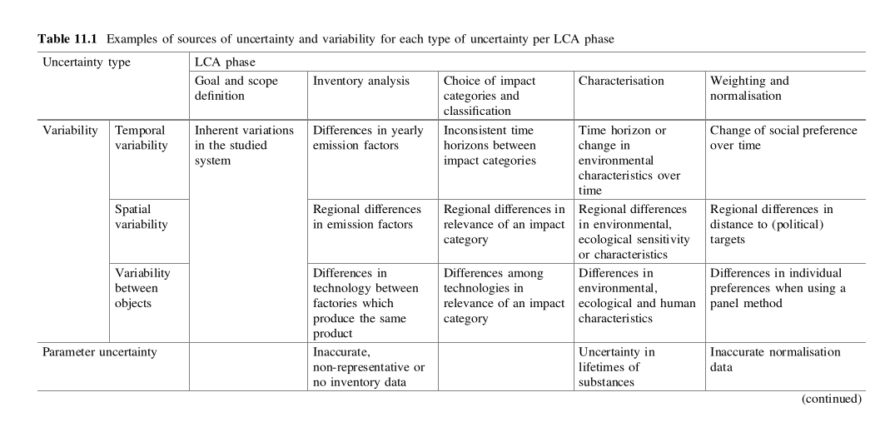
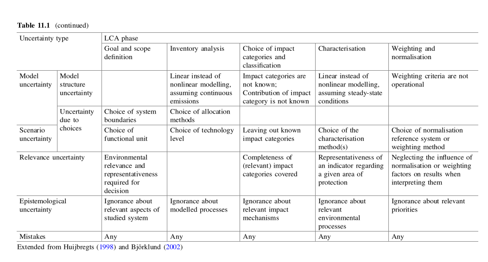

# Uncertainty Analysis of TCD life cycle assessment methodology in support of sustainable aviation fuel modelling
The following should answer:

* The types of uncertainty present in an LCA.
* The goals of the project.
* The plan to achieve these goals.
* Outcomes/definition of done for the project goals (sub goals).

## Key Points

* Due to background as a Software Developer, the iterative production orientated lens (feedback on this).
* Uncertainty is hard to define, so starting small and growing complexity seems logical. Fail fast.
* Suits the iterative nature of developing an LCA. 

## Structure

* "Brief introduction to project background."
    * Conveying importance of uncertainty analysis and problems it can help solve.
        * Why is research/conveying uncertainty of LCA models important or relevant?
            * What is uncertainty in an LCA study?
            * Promotes communication of complexity of results, or quantifies credibility of results.
            * Important as a norm in LCA model results publication. Currently not very well defined.
            * Concerns relayed in Arons report regarding transparency.
        * What challenges relating to LCA models do they help solve?
            * Uncertainty can guide decisions. Acting as a heuristic for better data collection and use of resources.
* "Brief introduction to experimental methods being used."
    * Uncertainty analysis in practice.
        * Some known techniques specific to LCA uncertainty.
    * What do I hope to do? How do I hope to apply uncertainty analysis? 
* Avenues for exploration
    * Build a tool that tackles issues surrounding transparency of assumptions.
    * Opportunity to explore replication of Liam and Aron's work.

* "Research work plan (Gantt chart)."

* Watch out for overuse of prepositions
* Avg sentence should be 15 to 20 words.
* camoflouged verbs.

--- 

A Lifecycle Assessment (LCA) is a process to determine the environmental impacts and resource use of a product throughout
its lifetime. An LCA is defined by a specification (cite) that guides its development. Of particular importance is the
impact assessment. Determining how the results of the study will be used. 

### Accuracy vs Precision

In an LCA context _accuracy_ is a function of the LCA goal and scope. In the goal of an LCA practitioners, define the
intended application of the study and in what decision context this will be used. The accuracy of a study is how closely
the functional unit defined for the study achieves those requirements. 

The soul purpose of the model constructed then is to hit that marker, to gather data, determine unit processes, input
output flows etc. that gets the model output as close as possible to the functional unit for the product under
examination.

To make this concrete, in the TCD model the is the gCO2eqRPK, a unit that is deemed to more accurately represent the
impact of fuel type on the GHG of aviation activity. A model result is using all defined paramters, assumptions and
calculations (algorithms of processes) to calculate an ouptut value for this unit to produce SAF from 100kg of cooking
oil. Precision refers to how closely this approximation comes to the real world value of gCO2eqRPK (as much as it exists
as a physical quantity). Accuracy then takes on a higher level, referring to whether gCO2eqRPK captures the goal of the
study in the first place.

### Uncertainty defined
In the textbook "Lifecycle Assessment Theory and Practice" [@hauschild2018] uncertainty is defined as:

> comprising everything we do not know, expressed as the probability or confidence for a certain event to occur. 

They later put it more bluntly in describing it as "the degree to which we may be off from the truth". To make accurate
assessment based on LCA output we have to accept uncertainty. Uncertainty analysis has subtle complexity but it is a
worthwhile tool in decision making that is derived from LCA output.

To illustrate a simple example (derived from @hauschild2018), in the TCD lifecycle the functional unit for the fuel
production stages is  gCO2eq/MJ for the conversion of 100kg of used cooking oil to Sustainable Aviation Fuel (SAF). This
functional unit might represent an 'impact score' we can compare processes of production of SAF from cooking oil based
on this environmental score. Figure shows two processes compared by their impact scores. The distribution is a
representation of uncertainty attached to this impact score that has been calculated for the model. In this example,
this is uncertainty about the _accuracy_ of the model. On the left, its definite which process should be used by the
measured impact score. As we move to the right its clear that the addition of uncertainty makes it less clear as to
which process should be chosen. This might lead us to reevaluate data collection to get this uncertainty down, to
reevaluate process structure etc. in general, to use the uncertainty measure as a cost and to the best of our ability
reduce it in the model.

This is an incredibly simplified example just to illustrate how it might impact decision making. One of the many things
it simplifies is the difference between uncertainty and sensitivity. Sensitivity is the effect that a variation in the
input parameter has on the output. In this example, the variation of some input parameter and how that might affect the
impact score. We might have a high uncertainty about some input parameter but if it has a low sensitivity (no measurable
effect on the impact score) its not overly important to whats relevant to the model, this might cause a redirection of
data collection or general rethinking of what inputs parameters are being used. Likewise, an input with high sensitivity
and high certainty that is constantly being refined might not be the best use of our resources.

> a competition towards better data quality is enforced by explicitly stating uncertainty.

### Local Sensitivity Analysis

Variability for an input parameter is the natural spread that exists for that parameter regardless of uncertainty. If
you make several height measurements you will get differing values, this does not mean your measurements are wrong or
that you're uncertain about the measuring stick used, there is simply an underlying variability in population heights.
The more height samples taken, the closer you get to that overall population variation.

In an LCA model, variability is present in weather, geography and inter-individual technologies, diets, culture etc. 

When looking at variation of input parameters its important to be conscious of whether variability is a function of
natural causes or some form of error and uncertainty. Varying the input parameter and measuring the output
parameter deviation is a form of sensitivity analysis, the sensitivity quantitatively being a ratio of input variation to
output variation.

### Methods for Local Sensitivity Analysis

* Pedigree Matrix Approach: a combination of qualitative uncertainty (data quality) combined with the quantitative
  uncertainty of parameters. Something that can be seen in the 'grading' of assumptions in the Excel sheet. Some more
  reading would need to be done on study in this area (some sample readings referenced in text).
* MC simulation.
* Analytical Propagation: 

Perturbation analysis is the examination of the change in output based on a change in input. Sensitivity could also be
some ratio of these two changes to one another.

A model may be very sensitive to a parameter change in which case its important that that input is given attention in
terms of its assumptions and calculations. Likewise these efforts would be wasted for an input with very low sensitivity
to output even if this input parameter is very uncertain. This focuses data collection (like a cost mechanism, links to
better data quality from first section?).

## Plan for this project

This project will take an iterative approach to uncertainty analysis of the TCD model. Some subset of the TCD model will
be analysed, a subset of processes of a sufficient size to tangibly map and get a sense of both quantitative (cite
types) and qualitative uncertainties. A programmatic version of this subset will be created and used to explore
parametric uncertainty with techniques like that of pedigree matrix, MC, etc (cite). The goal at each cycle is to
generate robust conclusions for that portion of the LCA studied. By robust, the explicit determination of uncertainty to
as high a degree as we can manage. Analysis at this stage will inform analysis of the next stage as the processes
modelled become more and more complex we can see how the uncertainty evolves.

Tiered system of uncertainty management. Suits the iterative nature of LCI.

Need to consistently have impact assessment in the back of mind for each stage.

At each stage can explore uncertainty in its:

* Communicated/representation.
* Interpretation.
* Accuracy (accounting for all variability both natural or otherwise).

* Attempt to replicate to produce programmed model of subset of unit processes. Trying to pick a small unit where we can
  map out types of uncertainty easily. Or at least tangibly. Then explore how this propagate as we expand.
* Perform Sensitivity analysis, exploring methods like MC, Pedigree Matrix etc. on this model. Look at uncertainty in a
  qualitative and quantitative sense, referring to literature.
* Look at limitations, robustness.
    * Looking for _robust conclusions_. At every stage.
* Repeat 1 - 3 with these learnings.

## Exploration of Software Engineering Practices in LCA model design
_can I give an example of how things will develop faster here_

In a broad sense a model life this can be considered a "Knowledge management system" involving some embedding of
knowledge in a system. At the moment, that is dispersed between Excel and Microsoft Word. The hope is to communicate
transparency but gaining more knowledge contributes more and more opacity. At some point this is inevitable but the idea
that a model may exists on paper but 'truly' exist in the head of the person who designed it can be resistant to growth
in usefulness of that model.

A knowledge management system is some collection of actors in a knowledge system that is directed toward some goal. In
this case, the goal would be the production of as accurate a representation of reality of a lifecycle assessment model
for SAF. Uncertainty plays a primary role in how each new element of information effects the underlying reality.

Due to the dynamism of tackling uncertainty, the model needs to be translated into a more flexible tool. The hope is to
provide a frictionless way of converting knowledge into the LCA specification. To do this several software design
practices and methods will be used. 

Uncertainty analysis in this research project (where tacit knowledge will have to be gained quickly or not at all)
of a model also represents a good example of  where the division of information or tacit knowledge can be placed. If Bob
is a model designer who has a large amount of knowledge in Lifecycle assessment under a specific scope, Alice, who wants
to evaluate the model, or use it in a seamless way shouldn't have to know as much as Bob to take advantage of what he
knows. The model should have all the knowledge (at least, thats relevant) embedded within it. This is what Excel
currently offers but often times the amount of knowledge you have to learn to use the model affectively is still quite
large. The hope for this tool would be to:

1. Provide an easy and more intuitive way to interact with a LCA model under the LCA specification.
2. Have access to pockets of knowledge, for Alice to use a particular sub process she needs to know just what is
   relevant to that sub process (not clicking through reference after reference of calculation in Excel to get to the
   truth). This will also promote uncertainty propagation methods to get more general uncertainties.

# References
