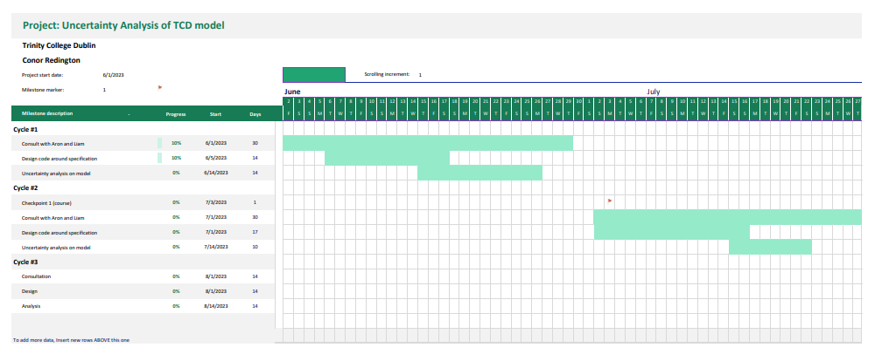

# Uncertainty Analysis of TCD life cycle assessment methodology 
<!--

* Watch out for overuse of prepositions
* Avg sentence should be 15 to 20 words.
* Camouflaged verbs.

## Key Points
* Uncertainty is hard to define, so starting small and growing complexity seems logical. Fail fast.
* Follow a tiered approach on each iteration.

## Structure

- "Brief introduction to project background."
    * Uncertainty can guide decisions. Acting as a heuristic for better data collection and use of resources.
- "Brief introduction to experimental methods being used."
    * Uncertainty analysis in practice.
- "Research work plan (Gantt chart)."
-->

A Lifecycle Assessment (LCA) is a process to determine the environmental impacts and resource use of a product throughout
its lifetime. The LCA development is guided by the ISO 14040 specification[^1]. LCA's are used to make decisions on the
environmental impact of products. An Uncertainty analysis can further inform these decisions.

To illustrate a simple example (derived from @hauschild2018), the output of the TCD model can be considered an 'impact
score' a measure of the environmental impact of two fuel production processes.

Figure \ref{fig:uncertaintyshow} shows two processes compared by their impact scores. The distribution is a
representation of uncertainty attached to each impact score. For the plot to the left, its definite which process should
be used by the measured impact score. As we move to the right its clear that the addition of uncertainty makes it less
clear as to which process should be chosen. This would lead to a reevaluation of data collection to remove this uncertainty.
Uncertainty acts as a heuristic for better data collection.


An LCA has 3 categories of uncertainty [@hauschild2018]:

* **Parametric**: variability and uncertainty in the models input parameters.
* **Model**: uncertainty about the algorithms used to determine process outputs.
* **Scenario**: uncertainty in the application of the model and its results.

This project will focus on parametric uncertainty.

# Planned Uncertainty Analysis of TCD model

This project will take an iterative approach to uncertainty analysis of the TCD model. 

A subset of the TCD model of a sufficient size to have a manageable amount of quantifiable and qualitative parametric
uncertainty will be analysed. A programmatic version of this subset will be created in Python and used to explore
parametric uncertainty of this subset of the model. 

<!-- 
An iterative approach tackles:

* _Uncertainty management_
* _Uncertainty complexity_ 
* _Uncertainty accuracy_
-->



The timeline, figure \ref{fig:ganttchart}, is split into three cycles. One cycle consists of: 

* _Consultation_: meetings with Aron and Liam [^2] to pick a set of unit processes where an analysis of uncertainty
  will be useful and of a manageable size for the cycle time frame.
* _Design_: Using Python to codify this area of the model. This involves consistent communication with Liam and Aron to
   accurately capture this area of the model.
* _Uncertainty Analysis_: exploration on this simulation of parametric uncertainty methods like that of pedigree matrix, Monte Carlo
  simulations and Analytical uncertainty propagation as shown in ([@groen2014], [@lloyd2007], [@ciroth2016]). 

The goal at each cycle is to determine uncertainty for that subset of the model to as high a degree as possible. A cycle
would be considered complete if we can move from point estimates all the way to a full full probabilistic representation
of uncertainty for that section of the model.

Analysis from one cycle will inform analysis of the next cycle as the processes modelled becomes more and more complex.
By slowly building up the complexity of the model programmed we can carefully manage the uncertainty as it develops.

[^1]: https://www.iso.org/standard/37456.html
[^2]: Aron Bell and Liam Mannion are PhD students that have developed the LCA model being analysed.

# References

::: {#refs}
:::


\newpage

# A simple perturbation analysis of the "Filtration" process

Using Liam Mannion's report, the total energy required for the 'Filtration' process, the first step in SAF fuel production as:

$$E_{\text{filtration}} = E_{\text{Triolein}} + E_{\text{Trillinolein}} + E_{\text{Tripalmitin}} + E_{\text{Unknowns}}$$

Each energy is the specific heat capacity times the temperature change of 25C to 100C. 

To simulate this process we set up a configuration file:

```yaml
Processes:
- name: "FILTRATION"
  description: "The energy required to heat the percentage mass of trilolein from 25-100C"
  inputs:
    - name: INITIAL_TEMP
      value: 25
    - name: FINAL_TEMP
      value: 100
    - name: MASS_OF_FEEDSTOCK
      value: 100
    - name: VEGETABLE_OIL_TRIGLYCERIDE_CONTENT
    - name: VEGETABLE_OIL_DIGLYCERIDE_CONTENT
    - name: VEGETABLE_OIL_MONOGLYCERIDE_CONTENT
    - name: VEGETABLE_OIL_FFA_CONTENT
    - name: VEGETABLE_OIL_PALMITIC_CONTENT
    - name: VEGETABLE_OIL_STEARIC_CONTENT
    - name: VEGETABLE_OIL_OLEIC_CONTENT
    - name: VEGETABLE_OIL_LINOLEIC_CONTENT
    - name: HEAT_CAPACITY_TRIOLEIN
    - name: HEAT_CAPACITY_TRILINOLEIN
    - name: HEAT_CAPACITY_TRIPALMITIN
    - name: HEAT_CAPACITY_OLEIC_ACID
    - name: HEAT_CAPACITY_PALMITIC_ACID
    - name: HEAT_CAPACITY_STEARIC_ACID
    - name: HEAT_CAPACITY_UNKNOWNS
    - name: SAF_ENERGY_DENSITY
    - name: SYSTEM_EFFICIENCY
    - name: FINNISH_GHG_INTENSITY
    - name: MASS_JET_FUEL_COOKING_OIL
```

This defines the unit processes under study. In this example one process unit, "FILTRATION".

A python script will run the energy calculations from above based on the configured inputs. Where the value for an
input is unspecified, the value will be looked up in an inventory file that contains pre set values.

This results in an output value of 0.49 gCO2e/MJ(SAFe) when run with the inputs set to their default values.

If we wanted to perform a perturbation of one input, say, `HEAT_CAPACITY_TRIOLEIN` sampling that input N times with a normal distribution whose mean
parameter is the default value for that input, 2.13. The code would look like:
```python
    N = 10000 # number of simulations
    outcomes = []
    for n in range(N):
        outcomes.append(
            system_boundary.find_process("FILTRATION").run_with_inputs(
                inputs={ 
                    "HEAT_CAPACITY_TRIOLEIN": np.random.normal(loc=2.13, scale=1) 
                }
            )
        )
```
The result of this is used to plot a distribution of the ouput figure \ref{fig:filtration}.

{height=70%, width=70%}


