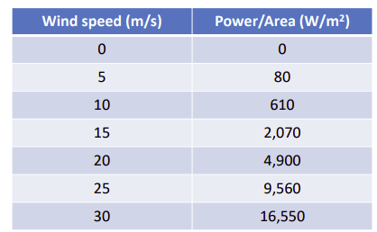
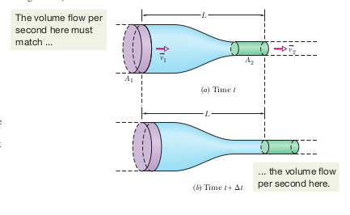

# Wind Energy (CEJ01)

https://windeurope.org/intelligence-platform/product/wind-energy-in-europe-2022-statistics-and-the-outlook-for-2023-2027

## Overview

* Europe has 255GW of installed wind energy capacity as of end of 2022. 225GW onshore and 30GW offshore.
* Offshore makes up to 90% of new installations.
* The average rating of new offshore turbines is 8MW and for new onshore 4.1MW.
* Denmark and Ireland had the highest share of wind in their electricity mix with 55% and 34% respectively
* Bigger is better for wind turbines. Because the power available is related to the swept area.

## Characteristics of the Wind

* The random variable of interest is wind speed (u) as this is the main determinant in power output.

## Turbulence 

* **Turbulence can be thought of as random wind speed fluctuations imposed on mean wind speed.**
* Fluctuations occur in the direction of the wind (longitudinal), perpendicular to the wind and vertical.
* The mean wind speed may be constant over relatively longer time periods.

The winds variability is characterized by a few statistical properties.

* Turbulence Intensity
* Power spectral density function
* Wind speed probability density functions
* Autocorrelation

## Weibull Distribution

* Turbulence is well characterized by a normal distribution. It's not totally symmetrical around the mean so Weibull is
  used.
* Wind speed variations is well characterized by the Weibull distribution.
* Density vs distribution function?
    * Density function provides a relative likelihood for the random variable to take on the supplied value.
    * I think here, the distribution function is saying, the relative probability that the random variable will be less
      than or equal the supplied parameter.

## Rayleigh Distribution 

* A special case of the Weibull distribution.
* Has a higher k value (a shape parameter for Weibull distribution).
* A lower k value indicates greater deviation around the mean wind speed.

## Correlation and Covariance

* The deviation of random variables from their expected values.
* Covariance is the measure of joint variability of two random variables.

## Autocorrelation
_probably need to go over this again_

* Provide information on what wind speed is likely to be.
* Similarity of a random variable between observations.
* Used to find repeating patterns.

## Power Spectral Density Function

* The wind speed is treated as a 'signal' through time. With time on the x axis and wind speed on the y.
* To determine how speed is changing through time it's assumed that this 'signal' wave is a composite of lots of waves
  that cause variation to the mean wave.
* A spectrum, using Fourier analysis, is used to determine power across frequencies.
* The integral across all frequencies is equal to the total variance.
* The power spectral density function gives the energy distribution of the wind over different frequencies.
* When this function is unknown, known general functions can be used.

## Height variation on wind speed

* This variation is know as the _vertical profile of the wind_ or _wind shear_.
* Important to determine for lifetime of rotor and productivity of turbine.
* Falls under two models, Power law and the log law (from fluid mechanics).
* Subject to uncertainty.

## Power Available

* $P = \frac{1}{2} \rho A v^3$.
* Wind speed doubling will generate 8 times the power.
* This equation tells us that wind turbines will keep getting bigger.
*  
* $C_p$ is the ratio between the actual power obtained and the maximum available power.
* The _Betz limit_ is the theoretical maximum at 59.3%.

## Power Curve

* The speed at which the blades will start to rotate is called the _cut in_ speed.
* The power output rises with wind speed until it hits a rated power output which is the limit of the electrical
  generator.
* Cut out power involves breaking the system to reduce power.

## Betz Limit

* The simplest model of turbine is actuator disk model.
* The turbine modelled as a circular disc through which air flows with velocity $\vec{v_t}$ with a pressure drop from
  $P_1$ to $P_2$.
* I'm not going to go through derivation yet. Just going to try get some exposure to it first.
* One interesting thing, power is $1/2\cdot{m}v^2$ because $\cdot{m}$ here is the mass flow rate.
* Using mass flow equations to derive what power is for the simple actuator model.
* Efficiency can vary with the ratio of upstream (before the turbine) and downstream (after the turbine) velocity.
* Can think of it as extracting energy from a specified volume of air moving like an object towards the turbine.

## Control 

## Design

* The main heuristic for design is minimizing CoE (Cost of Energy). 

---

* Turbines do not achieve the Betz limit for several reasons: rotation of wake behind rotor, finite number of blades
  (tip losses), non-zero aerodynamic drag.
* The ratio between the speed of the blade tip $v_{tip}$ and the wind speed $v_0$ is called the tip speed ratio.
* To capture max power tip speed ratio to Cp curve should be kept at a maximum.

# How Wind Turbines work

The air flowing past the object that is the wind turbine, has kinetic energy. The goal of this object we call the wind
turbine is to convert that energy into rotational energy. It does this by 'extracting', or using the conservation of
momentum, perform rotational work on the turbine.

https://www.youtube.com/watch?v=7-awFXqisYA&t=227s

## How does lift work

* My mental model is thinking of the air fluid as a load of particles.
* There is a lower pressure on the top surface of the rotor blade than the bottom. This creates a net upward force.
* If you have one air particle that meats an airfoil, it will be deflected upward into a whole region of air
  particles.
* These particles repel it back against the airfoil surface causing it to 'hug' the surface as it travels in a
  straight line.
* More deflection of these particles against atmospheric pressure cause a reduction in that pressure locally around
  the airfoil.
* There is less deflection of these particles on the bottom surface so the pressure is closer to atmospheric.
* The deflection of air downwards, by the conservation of momentum of the air particles lifts the airfoil up.

# Aerodynamics of Wind Turbines

* The mass flow rate of the air is constant. When the rotor disk causes this flow velocity to slow it's area after the
  rotor must increase.
* There's a decrease in Kinetic Energy, a reduction in speed of the mass flow of the air. This causes an increase in
  pressure as the lost of KE is transferred to energy in the volume of air.
* A rapid change in velocity of the streamtube is not desired. The air is gradually slowed down.
* This is the inflow factor _a_. I'm not too sure how this works physically.
    * _Boundary Layer effect_
    * Air particles that interact with the turbine, through friction, slow down. This creates a thin layer of slow
      moving air at the turbine surface.
* Interesting question: Why not have drag based turbines? So, the rotors would be parallel to the wind?

## Actuator Disk Model

* What happens to the kinetic energy that the turbine extracts. It may be put to useful work but some of it will be
  returned to the airflow and dissipated as heat.
* The force on the wind turbine is due to the **change in momentum** of the mass flow.
    * The reactionary force of the disk on the wind. If this wasn't there no energy would be extracted.
* Higher the blades, the higher the blockage of flow.
 
---

* Skipping derivation of force exerted on the air.
* $F = 2 \rho A_dU_{infty}^2a(1 - a)$
* Ultimately, the force on the actuator disk is due to the **pressure drop** across it. 
* Power is then the rate of work done ($FU_d$)

## Rotor Disc Theory

* Due to the rotation of the blades, incoming air gains angular momentum, a rotational component.
---

* An _airfoil_ is a streamlined shape that is capable of generating significantly more lift than drag.
* Lift increases linearly with angle of attack $\alpha$.
* Drag is more dependent on Reynolds number.

### Bernoulli's Principle and Continuity

_Chapter 14 of Halliday_

#### Continuity

 
* A _streamline_ is a path followed by an individual fluid particle.
* A _tube of flow_ is a bundle of streamlines.
* The more spacing between streamlines, the lower the pressure, the less acceleration imparted by particles on one
  another.
* Thinking of a garden hose, the velocity of exiting fluid can be increased by reducing the area. 
* If we consider the fluid incompressible then taking a volume that enters on the left side of the tube and equating it
  with one leaving the right side of the tube.
* Volume flows must match at all points in a tube, or all cross sections.
* The Volume flow rate: $\Delta V/\Delta t = Av$ which is a constant. 
* If fluid is uniform mass flow rate: $\Delta V/\Delta t \rho = \rho Av$

#### Bernoulli's Principle

* When the fluid does not change elevation.
* The kinetic energy per unit volume (kinetic energy density). 
* If a fluid element increases speed along a horizontal streamline, the pressure of the overall fluid must somehow
  decrease.
* Is this due to the transfer of kinetic energy to this streamline?

### Bernoulli Equation

* Only defined along a streamline.
* Conservation of energy along said streamline.
* In a fluid flow, all particles are moving. To defined a path of a single particle, we define a curve that at all
  points is tangential to the velocity vector of the particle (a _streamline_).
* _For a horizontal flow, an increase in velocity must be accompanied by a decrease in pressure._
* In energy terms, to increase the kinetic energy of the particles, it comes at the expense of the static pressure
  potential energy.

# Assignment 2 Notes

* what is the problem?
* What's the data?
* What's the conditions under which these exist?

* In spherical cow spirit, I'm trying to figure out the basics of pressure distribution for a simple case.
* How does pressure distribution around an object immersed in an ideal fluid change as the object moves through the
  fluid?
    * It seems fairly indeterminate. As in, theres no obvious physical principle, fluid dynamics is hard.
    * Lift force acts on an airfoil mainly because of the pressure distribution around it. The exact cause of this
      pressure distribution is complex (Bernoulli v Newton). 
    * Shear stress can also play a role. It's related to the tangential friction on the airfoil surface.
    * https://www.youtube.com/watch?v=E3i_XHlVCeU
    * If we have a dissipation of ke of the stream line by deflection at the moving object front this causes an increase
      in pressure (ideal fluid, bernoulli equation). 
    * If minimal ke is absorbed by the object then a pressure differrential forms immediately behind the body, this
      increases streamline speed.
    * This can create a wake of recirculating flow as it returns to the part of the fluid with the initial static
      pressure (i think).
* https://www.youtube.com/watch?v=9A-uUG0WR0w&list=PLEYqyyrm-hQ09B9JWzypjjTMAITgUItVh&index=1
    * Flow regime (turbulent vs laminar) where one has constant velocity and the other some mean velocity with variations is
      determined by the parameter, the Reynolds number.
    * Can generally be thought of as a ratio of inertial forces to viscous forces. If viscous forces dominate, we're more
      likely to see laminar flow.
    * A low reynolds number implies laminar flow of the fluid.
    * Blood flow is laminar. Because the characteristic length and velocity in the vessels are small. If it was
      turbulent, the heart would have to work much harder to pump blood around the body.
    * Why do we need no slip condition? It implies large shear stresses right?
