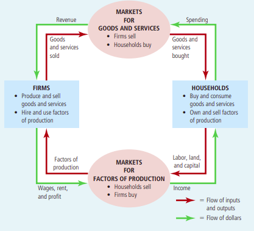

# Economic Growth
:economics:

* The history of economics can be roughly split in two.
* There is the malthusian way of life where any productivity improvements results in more output of, say food, resulted
  in an increase in population which cancelled the gains out.
* It was an interplay between rising population and productivity of labour or the output of agriculture
* Then the industrial revolution caused dramatic productivity changes which resulted in more output without the
  increase in population to cancel it out.
* The models would necessarily predict that a population increase should cancel any improvements we make out (as Malthus
  said) but for some reason it did not, this time.

## Income

_What is income in charts of economic growth_

* Income is a measure of income in nominal terms vs a consumer price index in nominal terms
* Its measured as a ration
* Example, in 1695 the nominal price of an hour of labour might be £x. Today it might be £150x. The nominal ratio here
  is 150. If the CPI though in 1695 is £y and now it is £20y. 150/20 is the real change in wages.
* Here, we have to assume we have the data from the time and that we are in the same currency (or have a valid
  translation)

## CPI

* Also, new products and services become available that substantially increase well being
* A good example. Nathan Rothschild was the worlds richest man 1836. He could by literally anything. He died of an
  infection who's treatment today is cured by widely available antibiotics
* there are quality changes that often cant be measured

*Capital* : A thing that confers value or benefit to its owner (which could be an entity like a company?)

* Investopedia lists 4 ways to induce economic growth
    * Increase the amount of capital goods (fisherman with net vs fisherman with spear). This inherently requires some
      sacrifice from someone to save (in order to afford the net)
    * Tech improvement, increasing productivity of a resource. Dependent on the rate of savings and spending (to fund
      research and development)
    * Increase the labour for force to produce more output. Must be net productive (in terms of providing enough growth
      for themselves plus some)
    * Human capital, becoming more skilled at craft. Can also relate to social changes or tendencies

# First principles

* This is not an exact science so things like GDP are correlations that seem to imply causation
* The aim of all societies is to increase their standard of living. Through more food, better shelter etc.
    * More abstractly but intuitive to me is from Azar Gat's book the aim is to expand the resource frontier. Expansion
      of the resource frontier can be done in many ways. This correlates with increases in productivity in my mind.
      Either making what you have more efficient or just more absolute acquisition of resources
* The off shoot of this was advancements in technology which increased productivity, the industrial revolution.
* Institutions are needed(?) to enable cooperation for the greater good of a society (tragedy of the commons?)

## [What is economic growth?](https://ourworldindata.org/what-is-economic-growth)

* Book production increase fits into the first principles productivity increase analogy. The resources here are manpower
  and raw materials (factors of production). Through a new technology the amount produced is increased expanding the
  capacity of the resources we had.
    * What are examples of when this expansion is bad, bigger cars? more plastics?
* Emphasis on production of goods and services as being done for _eachother_
* Think of goods and services you interact with in your daily life (Max has a list) and how would we measure these
  things being more abundant for others and or getting better for everyone?
* > Economic growth describes an increase in the quantity and quality of the economic goods and services that a society
  produces.
    * So if we think of all the goods and services listed, this says that more of these goods and services being
      available is growth. How do we measure an increase in quaility?
    * Value can be replaced for quantity and quality
* We don't want to end up with a definition of production that is meaningless like just doing something regular like
  brushing our teeth being a service, even just breathing being a service
    * Economic goods and services are those that can be produced and are scarce relative to demand
    * A good or service that provides a solution to a problem
    * Delegability that some service in particular is delegable is a useful measure (excludes your breathing does it?)
* Max says here that scarcity implies some amount of opportunity cost for producing a good or service. Could scarcity
  encapsulate not having sufficient knowledge or resources or time. Say, I dont have the time to learn how to make this
  computer monitor nor the x, y and z to get the raw materials and produce it for myself.

### Ways to measure growth

* Access to resources. Interesting graphs. Ireland comes off really well here.
* Max says here that measuring income is a good way to look at what people find useful, or their wants and needs as
  opposed to trying to measure every good and service in the economy
    * > measuring people’s income is a way of measuring the options that they have, rather than the choices that they make.
      It respects people’s judgment to decide for themselves what they find most important for their lives.
    * Making things more affordable increases peoples options
* __real income__ nominal price / price of goods and services
* Increases of real income is an increase in the ratio of what people can buy. It's a measure of choices

# Scratch-Pad

It keeps bugging me that economic growth is always the aim for development and I just can't visualise why that is.

Economic growth is the increase in market value of the goods and services produced by a group in a period of time.

Where does the money come from if its inflation adjusted?

So, if we are looking at real income. Against a CPI. If I can buy more today that in the 1900's where did that money
come from? Because it showing how much today's money can buy against the CPI. So, how much of what you need you can get.
It's not actual a physical increase in income. If I could buy bread with 1 unit in the 1900's and I can buy 10 loaves
today with 1 unit (bread becomes cheaper with increased productivity) I am 10 times richer?

17/12/21 08:27:29 I think the money could 'appear' in many ways. It could be an increase in productivity so now you can
buy more baskets of goods than you could before and since income here is a ratio as opposed to hard cash you have more
of it.

I dont know if its possible to build up a great intuition from one man and an island examples. What are the first
principles here?

# Autarky

16/12/21 08:37:27

The fundamental goal of an economy or just a group of human beings is to get food, to expand the resource frontier
(Azar Gat). This can also be expanded to increasing standard of living for all the population. The Malthusian model
said this was impossible but we started to outpace population growth with technological growth (Scott Alexander) (or was
it a decision to have less children?)

When an economy is autarkic is there explicit restrictions on what they can acheive? Do they only have access to the
resources of their environment and does this put a restriction on things like diet?

What are the fundamental institutions to 'instantiate' an economy? This is a broad question so specifically the money
related trust structures and institutions

How is it sustained?
How does it increase the standard of living of people?

# Books

## Principles of Economics

* Starts of with the notion of scarcity which means an economy can't produce all the goods and services it wants to
  have.
* > Economics is the study of how society manages its scarce resources. In most societies, resources are allocated not
  by an all-powerful dictator but through the combined choices of millions of households and firms

### Ten Principles

_not all to be understood straight away, might take some convincing so important to come back to_

_How individuals make decisions_

1. People face trade-offs
    * Also touches on the idea of efficiency vs equity. Efficiency is when a society is getting the most out of it's scarce
      resources whereas equality is how those benefits are being redistributed. This fits into the trade-off notion in terms
      of understanding that one affects the other. An example given is increasing income tax for the higher brackets, making
      it more equatable but less likely that people will want to strive to be in those brackets
2. The Cost of something is what you give up to get it (opportunity)
3. Rational people think on the margin
    * Marginal is a small incremental adjustment and rational people are those that who do the best they can to achieve
      their objective (or at least systematically). Mankiw says that people inherently understand costs and benefits of
      actions. Not quite sold on this
4. People respond to incentives

_How people interact_

1. Trade can make everyone better off
    * Households are used as an example, rather than us all growing our own food, making our own clothes etc. we focus
      on what each wants to do and does best. Interacting and trading with each other.
2. Markets are usually a good way to organise economic activity
    * The central planner, who knows what to do with an economies scarce resources is replaced by the decisions of
      millions of firms and households. Firms decide who to hire and what to make and households decide who to work for
      and what to buy
    * In a market the price determines how much a supplier will supply and how much consumers demand. There is a
      communication between demand and supply. Taxes distort this pricing and so too did central planning in terms of
      matching what consumers wanted and how much needed to be supplied
    * Prices can represent how much it costs society to produce a good and how much it's worth to that society
    * This has me thinking about the housing market and why, if that was centrally planned it might go to shit
3. Governments can sometimes improve market outcomes
    * Government are important in enforcing property rights
    * Government policies can be divided into two broad aims, improving efficiency or equality. So increasing the
      economic pie or change how the pie is divided.
    * Externalities can affect how markets work for instance pollution may not be factored into pricing or the energy
      market.
    * Monopolies can also affect the efficiency of markets.

_How the economy works as a whole_

1. A country's standard of living depends on its ability to produce goods and services
    * Historically growth in productivity is linked with income growth
2. Prices rise when the government prints too much money
3. Society faces a short run trade-off between inflation and unemployment
    * I think this relies on prices being 'sticky' in that it takes some time for prices to catch up with new demand in
      the economy. In that time, firms hire people and produce more.

### 09/09/22 09:38:36 Goals

* Brisk Read through Chpt 2
* > All models [in this case, economic] simplify reality to improve our understanding of it
* 
    * From the above, if I (as a household) use money (dollars) to buy a good or service off a company, this becomes
      revenue for that company
    * The company, in turn, uses that to buy factors of production. In the Starbucks case, they might buy coffee beans,
      pay wages, pay rent etc.
    * When revenue is used in this way it may enter another firm (in the case of buying coffee beans) in that case you
      go back to the above step
    * Either that or it becomes income for someone else
* Production possibilities curve
* Review of normative and positive statements. Normative (attempts to describe the world as it should be). Positive
  (attempts to describe the world as it is)
* Broken window fallacy

### 11/09/22 12:28:33

* Comparative advantage is a measure of the opportunity costs faced by two producers
* In the situation where one producer is better at one thing and another producer at another it makes sense that they
  should trade so that they operate efficiently.
* Two main points here it seems: Gains from trade, comparative advantage
    * Gains from trade:
    * Comparative advantage: A measure of the opportunity cost for a producer for producing a good. From a PPC even if
      one producer has an absolute advantage over the other they cannot have comparative advantage in both goods. This
      is because if a producer is not missing out on production of another good when its producing a good A, then inputs
      to produce A over inputs to produce the other good have a low ratio. When we go to the other good B and try to
      say, 'this should have a high comparative advantage too' we again measure the inputs into B over A. Because this
      is the flip of the first ratio it will be high.
    * Opportunity cost here is measured in the other good

#### Benefits of trade

* Description of production possibilities curve when one producers curve is much larger than the others and how they can
  both still benefit.

### Monetary System

* Fed was created to help banks against bank runs so I suppose it makes sense that it's considered a 'lender of last
  resort'.
* One of the main purposes of the FED is to control the money supply in the economy.

## Macroeconomics

* Constructing models, using functional notation to signify a relationship between variables without maybe the exact
  graph that maps it out. The skill is determining what variables are important to keep tabs of and what not
    * > The art in economics is in judging when a simplifying assumption (such as assuming a single price of pizza)
      clarifies our thinking and when it misleads us
    * It's important to keep in mind the underlying assumptions for any model you're using
    *
