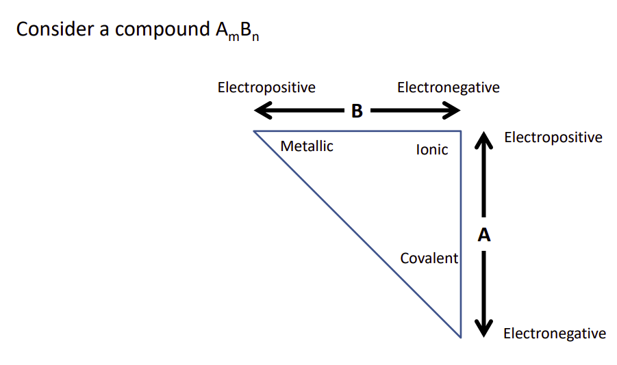
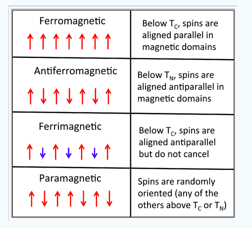
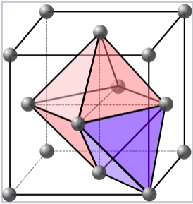

# Energy Materials

_notes from energy materials course_

* 22/09/22 14:59:49
    * AMU is the mass of 1/12 of Carbon 12 isotope. Mole conversion factor between grams and amu.
    * 1 amu/atom = 1g/mol
    * The why of chemical reactions depend on quantum theory.
    * Have a look at trying to describe a wave function
* 29/09/22 15:06:02 
    * Electronegativity, the power of an atom to attract electrons to itself
    * Clouds of negative charges, being pushed together trying to overlap
    * Attractive force depends on type of bonding between atoms.
    * Equilibrium distance is the ideal bond length for a pair of atoms
    * The energy well dictates the strength of bonds, the ductility of the material
    * orbitals have shape and direction, which determine covalent bonds
* Atomic mass unit is then the atomic weight of a carbon atom?
* 04/10/22 11:01:09 
    * Geometry that results from bonding
    * Amorphous, no shape. Something like glass where when it's shattered there's no clean break.
        * Could have tetrahedral component that makes it up but it may be linked in a lot of different ways
    * Main focus is on crystalline solids. Much easier tie structure back to properties and applications. Extrapolating
      properties to large scales
    * Hexagonal close packing and cubic close packing
    * unit cell: smallest representation of your structure, if you were to stack that structure in space
    * Tetrahedral sites (gaps). A lot of structures rely on this idea of packing spheres together
* 11/10/22 10:59:56 
    * Ionic compounds trying to maximise ion connections. Rather than straight close packing like metals
    * resonance structure, where electrons are 'flitting' between two nuclei, swapping
    * molecular orbital theory, gold standard at the moment. The notion of molecular orbitals
    * orbitals can combine (hybridisation) relevant to organic chemistry because pops up a lot in carbon based
      materials, it can help to explain properties of these substances quite well
    * orbitals can interact with eachother in constructive and destructive ways, because of their wave nature. These
      pairs define things like whether we'll see $He_2$ in the real world.
    * MO theory gets v complicated for polyatomic systems

[problem set 1](problem_set_1)
[materials problem set 2](materials_problem_set_2)
---

## Lecture 1 and 2 

* Materials are defined by their properties and composition. Things like conductivity to heat and electricity,
  ductility, hardness, how brittle they are, strain, stress etc.
* Properties arise due to the structure of the material. Knowing this structure and how it arises can help us determine
  what the material will eventually be like.
* Each layer of structure builds on the one below it. You can look at atomic, then molecular, then lattice etc. all play
  a role
* A Nuclide is a particular atom with a specific no. of protons and neutrons 
* An isotope is a Nuclide but with possible variability in the number of neutrons it has. So the overall charge of the
  atom wouldn't really change
* Although we can measure the mass of an atom (apparently) it's too small for convenient use. It's about $10^{-27}$kg.
  Instead atomic mass units are used which is 1/12th the mass of a carbon 12 isotope.
* A mole is a unit to convert between amu's and grams 1 amu of an atom is 1 gram per mole. If you took 3 amu's of
  Hydrogen (a number of hydrogen atoms that equal the mass of 1/12th carbon 12 (arbitrary measure)), taking $6x10^{23}$
  groups of this would equal one gram.
* The sum of the squares of the wave functions yields a probability space called an orbital. I think by functions here
  there is a wave function determining probability for translational energy, but also for angular momentum.
    * **Principal quantum number**: describes energy of the orbital $n \rightarrow \infty$
    * **Orbital quantum number**: describes the shape of an orbital (usually a letter), between 0 and n-1
    * **Magnetic quantum number**: $m_l$ describes the orientation of the orbital between -l and l
    * **Spin quantum number**: $m_s$ can have a value of -1/2 or 1/2 depending on rotation of the electron
* An s orbital is just a cloud it can hold 2 electrons, p can hold 6 and d can hold 10
* Degenerate orbitals are orbitals of the same energy
* The Schrodinger equation can't be solved for more than one electron (?) so useful ways to determine these orbitals
  with 
    * Pauli exclusion principle: No two electrons in the same atom can have the same set of 4 quantum numbers. (only 2
      electrons per orbital)
    * Aufbau principle: electrons fill the lowest energy orbital before occupying higher ones
    * Hund's rule: 
* Effective nuclear charge?    
* Electronegativity as a measure of how much the valence shell 'wants' an electron?

## Lecture 3

For polyelectronic atoms we use three rules to extrapolate from the basic Hydrogen atom.
* Pauli exclusion principle: No two electrons in the same atom can have the same set of 4 quantum numbers.
* Aufbau principle: electrons fill the lowest energy orbital before occupying higher ones.
* Hund's rule: for a set of degenerate orbitals, electrons will be placed with aligned spins. This reduces coulombic
  repulsion.
* Effective charge is the attractive force felt by electrons in the atom. The higher the penetration, the higher the
  effective charge.
* Penetration: the proximity the electron can approach the nucleus.
* Shielding: refers to the core electrons not having a one to one relationship to protons. Shells are formed, there is
  less of a 'grip' on the valence electrons.
    * Electrons are said to be shielded by electrons closer to the core. In that, they don't feel the force they should
      feel if they were in a hydrogen atom.
* Penetration and shielding  play a role in periodic trends.
* Electronegativity the power of an atom to attract electrons to itself, Pauling defines a scale for it
    * How much each atom likes to 'hog' electrons in a covalent bond
    * This is kind of like the electric dipoles from physics. Positive charge  kind of collects on the Hydrogen atoms
      and negative charges on the oxygen side (partial charges)
    * It makes sense then that those on the right side of the table want to gain an electron more to get a stable
      configuration so the electronegativity increases as you go across a group. As you move down a period it will
      decrease
* As you go across the periodic table electronegativity increases, as you go down a group, it decreases
* The attraction  that a bonding pair of electrons feels for a particular nucleus depends on
    * $Z_{eff}$ number of effective protons
    * the distance from the nucleus (or quantum number n)
    * the amount of shielding by the inner electrons
*  
* If two atoms approach eachother and both are electropositive, that is, they want to attract positive charges, move
  freely within the solid. Metallic bonding
* If they are both electronegative, neither will give up their electron so they share them, forming covalent bonds
* If one is electropositive, the other electronegative then the electronegative will bully the electropositive into
  giving up it's charge forming a cation, the bully atom will then gain an electron becoming an anion. The bond is ionic

## Lecture 5

* A *crystal lattice* is a mathematical construct describing periodicity of a crystal structure. Crystal structure =
  unit cell x crystal lattice
* There are seven fundamentally different kinds of unit cells
* If a cubic unit cell consists of 8 atoms (at the vertices) then its simple cubic. If there's also an atom in the
  middle its body-centered cubic and if there are atoms in the middle of the faces it's considered face-centered cubic
* A solid consists of a large array of unit cells. An intensive property like density must be defined for the unit cell
  as well as the large array.
* With hexagonal packing, six spheres are joined around one in the same plane
* The idea behind close packing of spheres is to occupy the most space with sphere volume in some repeatable pattern.
  Gauss proved that the highest average density attainable was 0.74.

## Ionic bonding

* **Electron affinity**: the energy released when an electron is added to a gas-phase atom. A negative affinity means
  that energy is required to add an electron to an  atom
* Electron affinities are highest toward the right of the periodic table especially those in the top right that are
  close to forming noble gases
* Energetic calculus for this bonding?
* The strong electrostatic interaction in ionic bonds accounts for the typical properties of their compounds. Solid
  forms melt to form liquids, they can be brittle, have high melting points.

## Magnetism

* The magnetic properties of a material depend on the magnetic moments associated with the electrons in the material.
*  

## Sites

* _interstitial sites_ are the empty space that exists between packing atoms.
* Sites are distinguished by the number of neighbouring atoms.
* _Octahedral_ is an arrangement with 6 atoms around it.
*  
* if you imagine collapsing the unit cell maybe the neighbouring atoms becomes more obvious.

## Crystal Field Theory

* When a transition metal loses electrons, it tends to lose it's s orbital electrons before any of its d orbital
  electrons. 
* Ligands (which are a set on ions) as they approach an octahedral ion (for example) of the transition metals (d
  orbitals) causes fluctuations in how much work must be done for an electron to exist in that orbital.
* If all the d orbitals are degenerate and you start to move in a ligand (which moves in along the x, y and z axis) then
  the orbitals which lie along those axis are repulsed causes a split in how easy it is to now get into all the other
  orbitals. 
* Because of this, when it comes to pairing. If it's 'harder' to put an electron in the orbitals that are repulsed than
  into those that aren't repulsed as much, the electron will just go and pair with the easier to 'access' orbital.
* This splitting or disparity in the energy required to enter the once degenerate orbitals is known as _crystal field
  splitting_
  
# Notes

* Metals in the s and p blocks are likely to lose electrons to form ions that converge on their noble gas core
* Non metals rarely lose their electrons in chemical reactions because their ionization energy is too high. They
  sometimes form anions by gaining an electron
* The 'goal' generally is to achieve and octet on their valence shell
  
