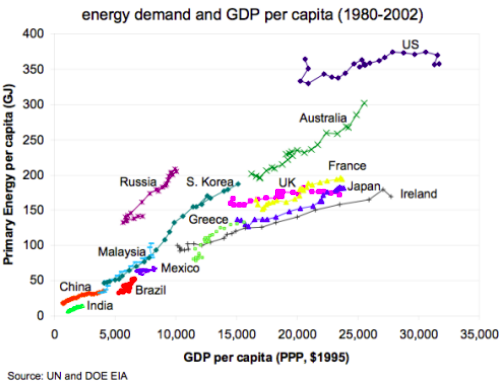

# Total Primary Energy Supply vs GDP per capita (1990 - 2021)
_Conor Redington_

### What are the relevant factors to be taken into account for this comparison?

* In the graph from the lecture slides (shown on last page), GDP per capita is measured with the international
  dollar from 1995. This is the value of a 1995 US dollar adjusted for price
  levels. [A US dollar in 1995 is worth about 1.94 current US
  dollars](https://www.usinflationcalculator.com/). If we take the
  example of Mexico. In the lecture slide graph it's GDP finishes (in 2002) at
  around 8000 1995 dollars which using a 1.94 conversion rate is
  about 15,000 2022 dollars. We can see this in the main graph as Mexico starts
  around this value. How GDP changes for country will be taken from the updated
  graph using current international dollars because it takes into account
  changes in the products you can buy e.g. you couldn't really buy an iPhone
  with 1995 dollars.
* Energy Usage seems to be distorted for Australia from the graph in the slides.
  In the main graph the value hovers between 220 and 240 GJ for the early
  2000's whereas for the slide graph it's approximately 300GJ in 2002. This is a
  large difference, maybe the population data used is different or energy
  statistics have been revised. For instance, taking the population in Australia in
  2002 as 19,651,400 from the World Bank and the Primary energy
  supply from the OECD in 2002[^1] as approximately $4.56 \times 10^9$GJ (109
  Mtoe) from the OECD, the GJ per capita is around 232GJ, the IEA has a value of
  $4.583 \times 10^9$GJ for primary energy supply so that the GJ per capita is
  also approximately 230GJ. 
 

\newpage

### Australia

* As mentioned above the comparison for Australia to the lecture slides may not
  be accurate for energy demand comparisons. Australia's energy demand has
  been growing at a rate of 0.2\% annually in the last ten years [^2]
* It's GDP has doubled in the last 20 years which is not surprising as Australia is
  known as never really having a recession.
  
### Mexico

* Mexico's GDP has grown by about 25% while it's energy usage has remained relatively constant.
* Despite Mexico's population growing at a fast rate it's energy consumption has been reducing
  by -1.2% annually in the last ten years.

### Uganda

* Uganda is one of the worlds poorest countries and it's interesting to note how it's energy usage is completely dwarfed
  by those of developed and developing economies. It barely appears on the bottom left of the above graph. Uganda, like
  many African countries has a high population growth rate.

### Greece

{ height=200}

* Greece had major setbacks as an economy from the Global Financial Crisis of 2008 and it's interesting to note this in
  it's energy usage as a measure of the austerity it faced and how it's never really recovered.

### Korea

* Korea has expected reductions in growth during the 1990's due to the
  Asian Financial crisis but it has continued on the same trend of growth as
  that of the graph in the lecture slides similar to a lot of Asian countries in
  the past 20 years.
* It's growth rate in the last decade has been 0.9\% annually which is still nothing in
  comparison to China's 3.4%.
* Australia and Korea don't seem to have been affected by the global pandemic in
  2020 as much as other countries in terms of GDP per capita.

[^1]: Primary energy supply is defined as energy production plus energy imports,
minus energy exports, minus international bunkers, then plus or minus stock
changes. This is the definition used by the OECD where the primary energy supply
data was taken from IEA which uses the same definition. Primary energy is
considered demand by a country. There are discrepancies this value as its
based on a determined thermal efficiency of the underlying energy sources.
Conversion used is 1 Toe = 41.86GJ

[^2]: All growth rates in energy supply taken from the following report: https://www.bp.com/content/dam/bp/business-sites/en/global/corporate/pdfs/energy-economics/statistical-review/bp-stats-review-2022-full-report.pdf

 
