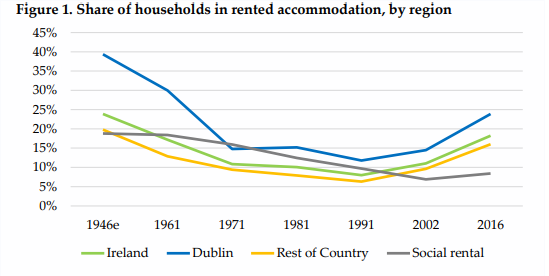
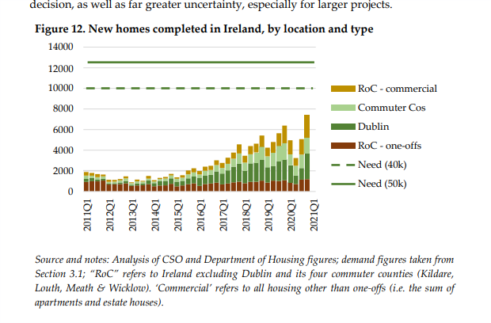

__Disclaimer: __

# Introduction

The start of providing everyone with basic needs. While housing and homelessness may not be solvable or up for debate it
is definitely the case that housing plays a fundamental role in a sense of security for the person, a form of permanence
to the location and a broadening of their horizons now that they do nnot have to think about shelter. This along with
other supports is a way of creating a populace that has time to think about who we want to be.

# Demand Demographics

What kind of housing are people asking for?

* > Figures from the most recent Census, undertaken in 2016, show that 18% of households rent their home from a private
  landlord, while a further 8% rent from a Local Authority or an Approved Housing Body
* 
* In a generation the share in rental accomadation has almost doubled.

# First principles

* How much does a typical house cost?
    * Types of houses
    * Cost (average or breakeven) of each type of house, in Dublin and the rest of Ireland
* Social housing
* Why can't the  government fund the whole thing?
    * How much money does the government have?
    * How long does it take to build a house through public means?

# Notes

* Prime time episodes on housing
* Latest Daft report
    * Lyons argues that new rental accomadation is largely from the 'professional rental sector' that it is no longer
      really 'mom and pop' stuff. This means that the 'landlord' wants you there as long as they can have you they wont
      just boot you out "so their niece can go to college". Lyons says that the current rent controls, which I'm
      assuming is some cap on rent increases is meant to apply for those particular mom and pop cases but it should not
      be a blanket case as this means that landlords are less likely to reduce prices when demand decreases (to not get
      stuck with a long term tenant on a low price)
* [Lyons 2021](https://irp.cdn-website.com/4065c16c/files/uploaded/Identify%20Consulting%20June%202021%20PRS%20Report%20for%20IIP%20-%20final.pdf)
    * At the end of 2.1 there is a discussion of the 'path dependence' of irish housing based on financing model.
      Analyses in Blackwell and Kohl (2008)
    * Ireland is converging demographically to the EU average in terms of population growth and the no. of apartments
    * Two thirds of landlords in a survey commissioned by the RTB own just one property.
    * > For almost all of the 19th century, there were no purpose-built apartments constructed in Ireland. This and the
      later absence of apartment construction reflects a unique element of Ireland’s demographic development: unlike all
      our European peers, Ireland’s population fell, rather than increased rapidly, between the mid-19th and mid20th
      century. This meant there was, effectively, no pressure on either the policy or finance systems to plan how to
      accommodate density: instead, sparser and more sprawled greenfield development was sufficient
    * There was virtually no private rental accomadation built at the start of the 20th century in Ireland due to
      viability (which I think means that the market price wasn't even enough to cover costs). Most building was
      subsidised and suburban due to transport infrastruce slowly being set up.
    * An example is given of the disparity between the market price and costs of development even in the 60's. It is
      similar to today, where incomes just can't match the break even price.
    * Ireland followed the European trend post war to build pre caste large scale developments (liek Ballymun) later
      following what other countries do mixing tenures (in terms of market renters and social renters together)
    * In the 80's the government tried to deal with the lack of viability for
      capital  with a 40% subsidy for cost of developments 
    * Under section 23 you could get the cost of building minus the site cost off the income you made from rent. So
      anything you built would contribute towards you not having to pay tax on the rent you earned from it. This was
      also aggregate rental income. You could be building houses that there were no demand for but getting a huge tax
      break on the income you were making from somewhere else.
    * This seems to have worked as rents decreased after it's implementation
    * This tax break only applied to private taxpayers which meant that institutional investors were essentially priced
      out?
    * 2.3
    * 2.4
        * Institutional investors play an important role in build to rent projects as they have access to longer  term
          capital from European markets. Like pension funds. This means they can spread the costs of construction over a
          longer period of time. 
        * This is frowned upon in Ireland as it's seen as 'squeezing out' the regular developer(?). How else would this
          accomadation be built?
* Lyons 2021 continued
    * Sales prices of housing are about 40% below 2007 peak. Being around 20% below in Dublin
    * Rental prices are 40% above their peak though
    * Show's scatterplots that link increases in supply with reduction in rent and vice versa. The equilibrium seems to
      be above 4,000 units available
    * Interesting how this is the largest rental boom in modern history, I'm not too sure what the cause of the others
      were.
    * I skipped 3.1, assumptions for growth and expected housing need.
    * 3.2
        * Almost 80% of developments use foreign captial. Either in equity or debt form.
        * My mental model here for equity is some firm that is 'investing' in a development rather than just expecting
          their money back.
        * Interesting that during the tiger the 'pillar banks' played a large role in capital circulation. That now they
          are more restrained so it was inevitable that some other form of capital must come in. Also, they were
          intermdeiaries for foreign capital. So the money you were getting from the bank was just coming from overseas
          anyways
          
        * It's made how short need we are
    * What is the government expenditure profile like in the past few years. Why do we need international capital
* [local file](file:///home/conor/Downloads/205477_d744837d-8f03-4ff0-82dd-4763df823c95.pdf)
    * This report seems to talk more about economic cylces and how they affect social housing, which I think is an
      interesting point.
    * > Rising rents can also increase the cost faced by the exchequer in providing housing. With regard to housing
      measures funded through current expenditure, a large share of the rental sector in Ireland is in receipt of some
      form of support. Data from the 2016 census indicates that 326,8324 households rent from a landlord (including
      voluntary and co-operative bodies). As of 2021Q2, there were approximately 62,000 active HAP tenancies, 17,500 RAS
      tenancies, and 5,000 privately leased SHCEP operational units (DHLGH). This indicates that approximately 26% of
      households residing in the rental sector are in receipt of some form of housing support that is funded through
      current expenditure.
    * Be interesting to check this for the most recent census.
    * Interesting point on how more strict mortgage lending rules affect price signals and push people to the rental
      sector, so rent increase more than avg. house prices.
    * > Census data indicates that the age at which home ownership became the majority tenure category was 35 years in
      2016. Below the age of 35, the number of households renting exceeded those owning a home. Previous censuses
      indicate the ages which have marked the changeover between renting and homeownership; 32 (2011), 28 (2006), 27
      (2002), 26 (1991)

# Summaries
