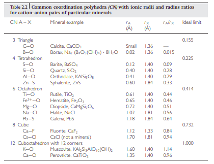

# Mineralogy 

_notes from Juan's class_

> Minerals are naturally occurring, macroscopically homogeneous chemical compounds with
a regular crystal structure.

* Minerals are characterised by their **crystal structure** and **chemical composition** both of which determine their
  specific properties
* A **unit cell** is the minimum unit that defines a crystal structure
* There are 7 types of unit cells found in nature. The atomic arrangement in the unit cell is called the crystal
  structure
* There is a large amount of symmetry in unit cells, how does this change our expected behaviour of them?
* The reason that diversity is lacking in the types of unit cells is that periodicity is only compatible with a few
  types of rotations ? There's derivations for this in the supplementary stuff, not fully grokking it yet.
    * If I have time should dig into this more
    * Different folds of symmetry is how many 'turns' to get back to the original shaper. e.g. 2-fold meaning rotating
      180 degrees twice returns to original shape
    * In terms of fitting things together, is more axis of symmetry helpful?
* What determines the crystal structure? 
    * Stoichiometry 
    * Relative size of ions or atoms
    * Nature of bonds between atoms
* Different types of bonding can exists between atoms in a crystal structure
* Ionic radius affecting coordination number. The larger the ion the higher it's coordination number. Can be represented
  with lattices.

## Logic behind unit cells

* Few defining features of a unit cell to give an idea of a lattice
    * Must contain all the formula units of the crystal, so for rock salt must contain sodium and chloride in the cell
    * Each corner must be identical with an identical environment so that it can be repeated indefinitely.
    * The unit cell must express the symmetry of the atomic relationships.
* Unit cells are classified based on their symmetry.
* Lattice parameters: a, b and c defining the size of the unit cell on those axis, then $\alpha, \beta, \gamma$ defining
  the angle between those axis.
* Breaking down a mineral into unit cells is almost like trying to make jigsaw out of it. You want full description of
  the mineral (so no gaps). It's interesting that it has this macro regularity. Also, it's not that there can't be gaps
  between the atoms, just that there shouldn't be gaps in our description of the crystal structure.
* Symmetry reduces the cell parameters also, the 2d face of a cell is confined to shapes that can cover a surface area
  with no gaps. 
* Symmetry looks at the lattice points and you assume the rotation axis perpendicular to these points. After rotation all
  points on the original plane should coincide with points on the rotated plane.
* 3D lattices are just stacking lattice points on top of eachother, so symmetry can still be evaluated. 
* A unit cell with points only in the corners is called a _primitive cell_.

_How ionic radius and coordination number relate?_

* Anions are known to be larger than cations, normally the volume of anions in a mineral is greater.
* We would expect that a larger cation would have more anions around it (a greater coordination number).
* If you have a scenario where the cation is reduced relative to a surrounding of anions, it reaches a point where the
  anions are in contact. Up to that time the electrostatic interaction between the anions and cations is getting
  stronger as they technically get closer to the nucleus of the cation.
* The cation bounces around in this region with a constant energy.
* The coordination number of the cation depends then on the cation anion ratio.
* Whether cation/ion structures share corners or edges or faces depends on the distance between the cations. A stable
  configuration is one where there is a maximum distance between cations.
*  

## Polymorphism

* _The ability of a specific chemical substance to crystallise with more than one type of structure._
* Reconstructive transformation: an isochemical change in a crystal structure in which chemical bonds are broken and
  reformed.
* Displacive transformation: a change in crystal due to changes in bond length and angles. Long-range order change.

## Solid Solution

* Most minerals display extensive variation in chemical composition.
* This is as a result of ionic substitution or solid solution occurs in isostructural minerals.
* Simplest substitution is ionic substitution where there is no valence change. 
  
## Mineral Solution interface 

* This happens in the earth as rainwater percolates down through soil. Mainly occurs at sites of cracking and fractures.
* The mineral is characterised by it's three dimensional structure and the solution consisting of free moving dipoles of
  water together with solvated ion complexes.
* Reactions at these interfaces cause the atomic rearrangement of both phases.
* When a mineral is placed in an aqueous solution solute ion complexes sometimes accumulate on the surface of the solid
  material. This process is called _sorption_
* absorption or co precipitation is when these complexes are integrated into the structure of the solid.
* Precipitation may deposit some compounds on the surface of the solid
* All other factors like pressure and temperature held constant pH is the most important factor in determining
  adsorption. This is due to the normally charged nature of the mineral surface (?).
* If the surface is thought of as a large defect in the crystal where ions are 'exposed' to the surrounding solution.
* Max adsorption can occur over a narrow pH range for a given concentration of adsorbate.

## Defects

* Two types of defects affect the density of the substance
    * A _vacancy defect is just a gap in the structure
    * A _interstitial defect_ is when and interstitial site is filled, this increases the density of the structure. This
      can't occur in ionic compounds because they must be electrically neutral. Ionic solids show Frenkel and Schottky
      defects.
    * Frenkel defect is also called a dislocation defect, a charge (usually the smaller cation) is displaced in the
      solid occupying an interstitial site.

## Crystal Nucleation and Growth

_How crystals form_

* How come there are many different morphologies for the same mineral?
* The final crystal structure, depends on mechanism of crystal formation and growth (nucleation) 
* > The classical nucleation theory (CNT), developed in the 1930s by Becker, Döring, and Volmer, is rooted in Gibbs’s
  thermodynamics. It considers the mother liquid and the fi nal crystallite as the only states during the phase
  transition. 
* For water, for it to start cooling, it needs some 'seed' to start solidifying on. Some surface to begin it's process
  of turning into ice. This happens will cool water. Then banging the water bottle, starting the process of nucleation.
* Supersaturated solutions are always temporary solutions (metastable).
      
      
[minerals problem sheet](minerals_problem_sheet)
# Notes

* 12/10/22 11:01:51 
    * Having enough ions to support initially creation of crystal and maintain it.
    * Even best crystals have defects.
* 05/01/23 07:31:27
* Q1. Polymorphism:
    * Define and explain the concept of polymorphism in mineral systems (4 points).
        * Polymorphism: _The ability of a specific chemical substance to crystallise with more than one type of
          structure._ It is a form of isomerism (same molecular structure with different configuration in space).
        * The relative internal energy of structures can change depending on factors like temperature and pressure. The
          stable state of a molecule may vary depending on this internal energy.
    * Describe the two most important types of polymorphic transformations, giving examples (6 points).
        * Reconstructive transformations: Require a large amount of energy to perform change. An large change in
          structure can occur.
        * Displacive transformations: When the internal adjustment of the structure requires a small amount of energy.
          Normally only a slight adjustment of bonds and atoms. 
* Q2. Solid solutions:
    * Explain the concept solid-solution and outline the main physicochemical factors that affect the formation of solid solutions (5 points).
        * It's rare that a mineral is a pure substance. Compositional variation is a result of substitution.
        * A homogeneous mixture of two different kinds of atoms in solid state having a single crystal structure.
            * Some factors affecting the formation of solid solutions are things like the components being
              iso-structural, they have the same arrangement in space but different molecular composition.
            * Ionic or atom sizes. Generally, a wide range of substitution is possible if size differences are within
              about 15% of eachother.
            * The charges of the ions involved. Substitution where valency doesn't change is more likely to happen.
            * Temperature: generally a greater tolerance for substitution the greater the vibration in the lattice
              structure.
    * Describe the three main types of solid-solutions that we can find in mineral systems (5 points).
        * Substitutional: An ion substitution where initial a solid had a cation or anion that is replaced by an
          isomorph or similar structured ion. There is no valence change in simple substitution.
        * Interstitial: voids or gaps can exist in mineral crystal structure. Ions and molecules can sometimes occupy
          these gaps.
        * Omission: Replacement of more highly charged cation by two or more cations for charge balance. This results in
          vacancy (omissions) because normally a single ion is replacing multiple.
* Q3. Nucleation of solids from solution:
    * Define the concept of critical nucleus and discuss the main physiochemical factors that need to be considered for
      the homogeneous nucleation of solids from aqueous solutions in the classical nucleation theory (6 points).
    * Compare the main mechanistic differences between the classical versus non-classical nucleation theories (4
      points).
