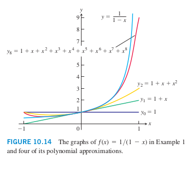

## Infinite series

* An infinite series is a sum of an infinite sequence of numbers
* Sums are determined with sequences by taking the limit of partial sums as the number of partial sums tends to infinity
* Partial sums could be thought of as generating a new sequence where $${a_n} = s_1 + ... s_n$$. You can analyse then
  what that sum approaches

## Geometric series

* Are of the form $a + ar + ar^2 + ... + ar^{n-1} + ... = \sum_{n=1}^{\infty}ar^{n-1}$
* $a$ and $r$ are fixed real numbers and $a \neq 0$
* It doesn't seem that r can be greater than 1?
* If $r = 1$ the series diverges $\lim_{n\rightarrow\infty}s_n = \pm\infty$ depending on the sign of $a$
* If $r = -1$ the partial sums alternate between $a$ and 0. This is a divergence.
* If $|r| \neq 1$ we determine convergence or divergence using 
* $$s_n = \frac{a(1-r^n)}{1-r},(r\neq1)$$
* Applies only if the n index starts at 0 or 1 with n-1 as the power
* I've worked through this on paper. When $|r| < 1$ $r^n$ will tend towards 0 so the series converges. If $|r| > 1$ the
  partial sum will tend towards positive or negative infinity so it diverges
---
* If $\sum_{n=1}^{\infty}a_n$ converges, then $a_n \rightarrow 0$
* If the integral converges or diverges, so does the series. For a sequence of positive terms ${ a_n }$, if $a_n = f(n)$
  where $f$ is continuous and positive and decreasing, that is for each $x_1 \l x_2$ in the domain $f(x_1) \geq f(x_2)$
---
* **ratio test** if we've a series $\sum a_n$ and $lim_{n\rightarrow\infty}|\frac{a_{n+1}}{a_n}| = \rho$, the series converges
  absolutely if $\rho < 1$, diverges if $\rho > 1$ and is inconclusive if $\rho = 1$
* Going to have to take for granted that we've a bunch of tests for convergence of a series

## Power series

* $$\sum_{n = 0}^{\infty}c_n(x - a)^n = c_o + c_1(x - a) + ... + c_n(x - a)^n + ...$$
* If we take all the constants to be 1, you get the geometric series that converges to $\frac{1}{1 - x}$ (from above)
* If we shift focus to think of a partial sum of highest polynomial n as $P_n(x)$
* If $a_n$ (being the partial sum) is on the y axis and n (or the index of the series) along the x axis. Graphically,
  each increase along the x is trying to get closer to some incredibly large y value. 
  
* The above has a boundary of plus and minus 1. As x gets closer and closer to 1, $P_n(x)$ approaches the sum $\frac{1}{1 - x}$ 
* power series behaves in 3 possible ways
    * It might converge at a single value
    * converge everywhere
    * converge on some interval, this is like the bounds of -1 and 1 above right?
    
# Taylor Series

* If we take the sum of a power series as a function $f(x) = \sum_{n = 0}^{\infty}a_n(x - a)^n$
* There are an infinite number of derivates in the interval of convergence
* If we had a set of these intervals, could we reconstruct the series, or at least parts of it, in turn, approximating a
  function based on the power series.

## Notes

* Is the significance of polynomials in the derivative nature, that it intuitively makes sense that they're
  approximating a function as each higher order of polynomial means another (more specific) derivative on the initial
  convergence interval?
* Also, watched a video that details how, similar to converting fractions to decimal places, making addition easier.
  Converting functions to approximations makes addition easier.
