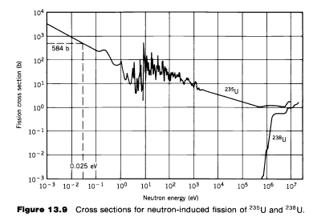

# Nuclear Physics

_Mainly notes from 'Introductory Nuclear Physics' Krane_

* Isotopes, like Uranium 238 (that can be converted to Plutonium 239) are considered fertile. They can produce fissile
  material in a conversion reactor.

## Controlled reactions

* If we just had a fine powder of Uranium and mixed it with the moderator, like Carbon. As you reduced the energies of
  the neutrons it becomes more likely to be captured by the 238 Uranium. To prevent this, we need the neutrons to enter
  at least 19cm of graphite to become thermalized.
* Graphite has a very small thermal cross section but we still need to get neutrons back into the Uranium fuel.

## Four factor formula

* $k_{\infty} = \eta \epsilon pfN$
* $\epsilon$ is the number of fission neutrons caused by thermal neutrons.
* If we have an original generation of N thermal neutrons. If v is the number of neutrons produced in a fission reaction
  of element.
    * $$\eta = v \frac{\sigma_f}{\sigma_f + \sigma_a}$$
    * Where $\phi_f$ and $\phi_a$ are the fission cross section and other absorptive cross section respectively.
    * After this first process you're left with $\eta N$ neutrons which must be thermalized.
* The $\eta N$ fast neutrons have an non negligible cross section for fission with 328 Uranium this causes a further
  increase in neutrons produced from our initial N generation. The fast fission factor is $\epsilon$
* As mentioned above resonance capture can occur with 238 during moderation, this is accounted for with $p$ the
  resonance escape probability.
* The thermal utilization factor $f$ is a measure of thermal neutrons that are actually available to the $U^{235}$ and
  $U^{238}$.
* The number of neutrons remaining is the $\eta \epsilon pf N$.
* There's further optimisation here, for surface leakage which I didn't quite get.

## Time constants

* Based on power, what is time towards failure of mechanical elements.
* Something to do with system analysis. A Step in time for some function.
* Specific to exponential systems. Time to change to e -1.
* This is why having a really small time constant for power growth is bad. We can't control it from being a bomb.
* Need to rely on delayed neutrons.

### Why 235 rather than 238

* The thermal cross section is orders of magnitude larger than any cross section for 238.

# Reactors

Essential elements

* Core
    * Fuel or fissile material.
    * Moderator.
* Reflector surrounding the core.
* Shielding.
* Coolant, to remove heat from the core.
* Control System
* Emergency System.

## Power reactors

* Most of the costs of these reactors is in containment and shielding. So building one 1000MW reactor is better than 10
  100MW reactors.
* Most graphite moderated reactors are gas cooled.

## Converter reactors

* Breeder reactors? Plutonium?

---

Sketch the block diagram of an early RBMK (Chernobyl type) reactor. Label all the main
blocks associated with control and managements, cooling, power generation, etc. Draw a
more detailed diagram of the structure of an individual fuel assembly and an individual
control rod.

What features of the structure of the control rods is attributed a substantial
impact on the infamous accident? Explain the principles behind reactor poisoning and its
corresponding contribution to the same accident.

* The RBMK reactor control rods are tipped with graphite (because).
    * It's thought that because of the positive void coefficient in the core was uneven along the fuel rods. The
      graphite tipped rods being lowered further enhanced this inbalance.
    * The control rods came in from the top, displacing neutron absorbign water with moderating graphite for a period of
      time. This increased the reaction rate where the tip of the control rod was.
    * A few seconds into the emergency dropping of these control rods a power spike to 530MW occurred.
    * As the SCRAM proceeded, the power spiked to 30000MW about 10 times the power rating.
* Power in the reactor dropped to 30MW and efforts to increase it again were frustrated by Xe poison that had built up
  in the reactor. Xe 135 has a thermal capture cross section of about 2 million barn.
* Control rods were removed to try and increase power. At the same time the pumps were being powered by the energy from
  a powered down turbine. This decreased the flow rate of coolant and likely caused a positive void coefficient or steam
  to build up in part of the core. 
* It's thought that because of less control from the steam (less absorption) and Xe burn off, the power in the core shot
  up.
