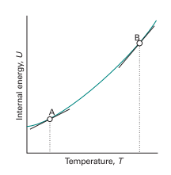
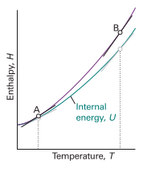

# Thermodynamics

> "The subject of thermodynamics is complicated because there are so many different ways of describing the same thing."
 -- Richard Feynman

* When we connect Boyles law with Charles' law and Avogadro's principle we get an interesting relation called the ideal
  gas law
* $$ pV = nRT $$

## Kinetic theory of gases

* A good example of using a simple model to build up interesting equations. In this case, the ideal gas law
* If we imagine that the particles in our ideal gas
    * Only collide with the walls
    * Obey classical mechanical laws
    * Potential energy interactions and others are prohibited, we're only looking at K.E changing through collisions
* Derive an equation for pressure from this model. The container is considered a L sided cube
    * Gas molecules is imagine to be a billiard ball type object that is only moving in the x plane. When it collides
      with a wall of it's container it collides elastically meaning it has the same momentum but in the other direction
    * The force required to perform this change in momentum is $\vec{F} = \frac{\Delta{\vec{p}}}{\Delta{t}}$
    * The change in momentum is $\Delta{p} = p_2 - p1$ where $\Delta{p} = -m\vec{v_x} - m\vec{v_x} = -2m\vec{v_x}$
    * Confused about loss of momentum by particle and gain of momentum by wall, in slides
    * $\Delta{t}$ is time time to go a full length $L$, hit the wall and come back again so $\Delta{t} = \frac{2L}{\vec{v_x}}$
    * $F = \frac{2m\vec{v_x}}{\frac{2L}{\vec{v_x}}}=>\frac{m\vec{v_x}^2}{L}$
    * If we take it that F on each side of the wall should be roughly the same and that we're now operating is 3
      dimensions so $v^2 = v_x^2 + v_y^2 + v_z^2$

## Reversibility 

* Arises out of work done on expansion of a gas
* In the first case, it is a way to define a stable path between states on a pV diagram.
* Each point along the diagram is stable and defined. This is done by allowing time for the system to catch up with
  volume expansion after a change in pressure.
    * In a irreversible system expansion of a gas 
    * The metric we care about here is work done: $-p_{ex}*dV$ the higher this value the more work done to the
      surroundings (negative done to the system).
    * For an expansion the pressure of the system must be greater than $p_{ex}$, if $p >> p_{ex}$ then you've really
      fast expansion until volume expands enough that $p = p_{ex}$. This could mean that the piston (in this case) goes
      past its final volume position doing more work on the surroundings, this work is then counteracted by the
      surrounding pressure ($p_{ex}$) to end up at $V_f$ that extra bit of work done is wasted, as no work is required
      put into it to get it to that $V_f$ (?) 
    * The expansion will never over shoot the mark if we slowly increment up to that final volume.
    * Work is wasted if the pressure is much greater than it needs to be for a given final volume destination
    * The fact that you can't define stable states means energy is lost? In the sense of resetting the system
    * What if we think of work as a cycle, does that make it clearer?

## Zeroth law

* We're trying to measure things at a macro level. To have a measure of all the molecular activity is infeasible in that
  there is too much going on. Of a quick search on the internet, there are $3^{18}$ molecules in a grain of salt. How
  could we reason about the internal energy of such a system? We would have to keep track of a huge amount of energies
  as well as interactions between molecules
* _temperature_ is a measure of average kinetic energy of the molecules in a system. This is a useful, intuitive way to
  look at it. How we actual measure it: we have two objects of a given state. When they interact, by touching for
  instance, There is some changing in its state but eventually an equillibrium is reached between the two, our knew
  system (both objects touching each other) is at a new state (by _state_ here I'm referring to a set of physical
  properties we can observe and/or measure). 
* Ok, now we add a third object. We call the first two A and B. C is our third object with a given state. We can say
  that if object C reaches an equillibrium state with A and then proceeds to reach the same equillibrium state with B
  when A and B interact they will not have any change in there states.
* In this way, C acts as a measure of the _activity_ of A and B, we call this _activity_, wait for it, _temperature_

## First law

* An isolated system is one which has **no interaction** with it's surroundings, not through heat or work.
 
### Internal Energy
 
* The internal energy $U$ is the sum of all the kinectic and potential energies of a system. Specifically those energies
  internal within the system. So, a glass of water on the table, the force of gravity pulling those particles down would
  not be considered a component of the internal energy of the system
* To change the internal energy, it must be done through one of these two. We can write this as $\Delta U = Q - W$
    * $Q = \Delta{U} + W$  the heat added to a system gets split between changing the internal energy, so some of it
      'remains' in the system and some amount of it's random motion being put to work
* As stated above, measuring things on this microscopic a level is not useful as there is too much complexity, nor does
  it describe how we might derive it from physical quantities we can measure
* But wait! There are two ways of adding energy (that we know of) to a system. 1) through heat and 2) through work. Work
  is the organised motion of atoms, whereas heat is more of a transfer through random motion of atoms. We can measure
  both of these. 
* We can also use a reference state for $U$ similar to potential energy where we pick a convenient height to start or
  change in energies from
* How do we know that $\Delta U = Q - W$? If $\Delta U$ is path dependent we could not use it as a comparison, like
  temperature between systems. We only know that it is a state function by experimentation. It also makes intuitive
  sense that energy is fungible. Whether it comes from heat or work, the end state of energy in the system is the same.
* To go smaller then $dU = dq + dw$ so a tiny nudge in energy can be caused by tiny nudges in heat or work
* $U$ is a state function, this means that how the object got to this state is not relevent (example here). It could
  also be thought of as a fixed path function. There is a continuos range of values for $q$ and $w$ in the above
  equations in the boundary of $\Delta{U}$. If $q$ takes on a value $x$ in the range $[0, \Delta{U}]$ from the above $w$ is
  fixed to some value $[0, \Delta{U} - X]$ 
* The alternative is a path function, which both heat and work are. There are several paths that can be taken to arrive
  between an initial and final internal energy state.
* Internal energy is dependent on $p, V$ and $T$
---

* Exploring the different paths that heat and work can take between energy states
* Normally by having a determined path for heat or work and seeing what results the other path produces
 
### Expansion

* Expansion is seemingly a general term for transfer of energy through work. The indicator here is a change in volume,
  or a along any of the three axis.
   
* $dw = -Fdx$ where $F$ is an opposing force
* _free expansion_ is expansion against zero opposing force, so no work is being done.
* $p_{ex}$ is the pressure external to the system so $p_{ex} = 0$ for free expansion
* In the case of a gas expansion against the atmosphere e.g. in a chemical reaction, the $p_{ex}$ could be modelled as
  constant. The opposing force from the general definition of work above becomes $F = p_{ex}A$ when the system expands
  through a distance (in the z direction) $dz$ then $dw = -p_{ex}Adz$ but $Adz$ is equal to $dV$. To obtain the total
  work done over a volume change 
* General expression for work done in expansion $-\int_{V_i}^{V_f}p_{ex}dV$
* for a constant $p_{ex}$ the work done is $p_{ex}(V_f - V_i)$ or $p\Delta{V}$
* _reversible expansion_   ?????
    * Remember this is isothermal (isothermal vs adiabatic?) 
        * Adiabatic process transfers energy to the surroundings only as work.
    * $p_{ex}$ set to the final pressure $p_f$ would mean increasing temp. which is not possible in adiabatic
      environment.
    * The next question is, why is the reversible process more efficient. 

### Heat

* If no work is done by or on the system we right that $dU = dq$
* Between to states $f$ and $i$ along a path at constant volume $\Delta U = q_v$ 
    * Remembering that $q_v$ is not a change in the heat supplied, it's an integral over heat supplied e.g. if I am
      supplying 200J of heat now and 300J later the change in internal energy is not the difference of the two, it's an
      integral over how long the heat by the rate of heat transfer
* The internal energy is dependent on temp. here when volume is held constant. The slope of the tangent the curve
  for an temp is called the *heat capacity (at constant volume)* at that temperature 
  
* $$C_v = (\frac{\partial U}{\partial T})_v$$
 
* This property is *extensive* meaning that 100 grams of a water would have 100 times the heat capacity of one gram. It
  can be made *intensive* with something like *molar heat capacity* or *specific heat capacity* (heat capacity per gram)
* We can now define $dU = C_vdT$ if $C_v$ is independent of temperature over the range of temp. of interest then $\Delta
  U = C_v(t_2 - T_1)$ a change in temperature can be used to determine a change in internal energy of a system.
* How might we measure the heat capacity of a sample: If we supply a quantity of energy that we know the value of and
  measure the temp. rise assuming constant volume of a container (this is done in the book with a certain power heater
  on for a certain amount of time)
  
### Enthalpy

_easing our way into variability in both paths, heat and work_

* When the volume is not held constant, all the heat supplied to the system is not equal to the change in internal
  energy
* Enthalpy is defined as $H = U + pV$
* When the pressure is constant and the only work that can occur is expansion work the $\Delta H = q_p$  the change is
  enthalpy is equal to the heat supplied. The work is pre determined, it acts like a state function in that $w =
  p_{ex}\Delta V$. 
* The heat added must have been lost to this kind of work if it did not all go into changing the internal energy.
  
* $$C_p = (\frac{\partial H}{\partial T})_p$$

## Heat Engines

* Attaining mechanical energy from thermal energy (or ordered motion from disorder motion).
* A piston kind of represents this ordered mass of molecules. The disorder of steam is channelled to move this ordered
  mass creating mechanical work. The same in the case of a steam boiler that spins, the blades offer that order.
* The temperature difference is required so that the process spontaneous. Work will always be needed to start or run the
  process but the more spontaneous the more net work output you get.
* The efficiency is the output over input of an engine. The ratio of work to heat input at the higher temp. $e = \frac{W}{Q_H}$
* If we sub in $Q_H = W + Q_L$ because of the conservation of energy
* $$e = 1- \frac{Q_L}{Q_H}$$

# Entropy

_try and build up entropy as a concept_

* Our initial "signpost" for what are the permissible changes under the first law is that it's impossible for the
  spontaneous localization of ordered motion of atoms from disordered random motion of atoms. We've never seen it
  happen.
* Recognition of two classes of processes in the universe: spontaneous and non-spontaneous.
* Entropy is a measure of the energy and matter dispersed in a process.
* Entropy is a measure of disorder (both thermal and positional).
* Matter and energy has a tendency towards disorder.
* The extent to which energy is dispersed depends on how much energy is transferred as heat (because it is the disorderly
  motion of atoms).
* Entropy change is defined as 
* $$dS = \frac{dq_{rev}}{T}$$
* We can get rid of the reversible process if we look at the entropy change in the surroundings because it's a fixed
  volume so there's no work done. 
* $$\Delta S_{sur} = \frac{q_{sur}}{T_{surr}}$$
* The statistical definition is $S = klnW$ where W is the number of micro states.
* **Entropy is a measure of dispersal of energy**
    * This is the definition from lecture slides without the word "spontaneous" because that can only be determined by
      considering entropy change of the surroundings as well.

## Standard Molar Entropy

* Entropy at a certain temperature is calculated with Boltzman's formula.
* $S(T) = \Delta S(\text{heating from 0 to T})$
* The change in temperature upon heating relies on the heat capacity, which can vary.
* All phase transitions must be taken into account too.

## Clausius inequality

* For a reversible and irreversible path between two states the change in internal energy is the same 
* $$dU = dq+dw = dq_{rev} + dw_{rev}$$
* It follows that $dq_{rev} - dq = dw - dw_{rev}$ we know that the difference on either side here is greater than zero. 
* $$\frac{dq_{rev}}{T} \geq \frac{dq}{T}$$
* $$dS \geq \frac{dq}{T}$$
* Any process of heat transfer results in an entropy increase because even in an isolated system where q = 0, entropy
  must still be greater than zero.
* Any process you do will result in some amount of heat transfer because it's not reversible. You could then view this
  as saying, an amount of work done increases the entropy of the system, or use it as a measure of heat loss.
* The Clausius inequality is really the second law but it needs the notion of entropy.
* Could we not have a process that's purely work? That would mean all other energy change (i.e. q) would be 0. Setting q
  = 0 for the Clausius inequality still says that any process causes an increase in entropy!
* Could we say that if we've a system (like ice or cells in our body) that have decreasing entropy but appear
  spontaneous, we must look for the 'isolated system' that does increase in entropy (in this case the surroundings)?

## Gibbs Energy

* To use entropy to predict spontaneity we need to look at changes in entropy of the system and the surroundings.
    * No, entropy is a quantitative measure of spontaneity, what we do below relates to figuring out why some spontaneous
      process appear to reduce entropy. Like water at 0 degrees has tendency to become ice, but a decrease in entropy.
* If we take our "isolated system" to be the system and it's surroundings 
* $$\Delta S_{tot} = \Delta S + \Delta S_{surr}$$
* A process in which the change in entropy of the system is zero can be spontaneous provided that the change in entropy
  in the surroundings increases a lot more.
* $S_{tot}$ here is then the more refined definition of entropy than above **Entropy is a measure of the spontaneous dispersal of energy**
* $\Delta S_{tot}$ The larger this value the more energy dispersed. For a value greater than zero the process was
  spontaneous and less than zero the reverse process was spontaneous.
* We can calculate the entropy change of the surroundings taken into account that:
    * The temperature of the surrounding is constant $\Delta S_{surr} = \frac{q_{surr, rev}}{T}$ Note here theres no change in T.
    * The heat that leaves the system, enters the surroundings.
    * For a system at constant pressure the heat that leaves it is equated to the change in enthalpy of the system.
    * The transfer of heat the surroundings can be considered reversible (because it's so tiny in comparison to the vast
      surroundings).
    * $$\Delta S_{surr} = -\frac{\Delta H}{T}$$
* Using this as the entropy of the surrounds
* $$\Delta S_{tot} = \Delta S -\frac{\Delta H}{T}$$
* This allows us to determine the total entropy from the system alone at constant pressure and temperature.
* Gibbs doesn't seem to get rid of this limitation however.
* **Gibbs free energy** is defined as 
* $$G = H - TS, \Delta G = \Delta H - T\Delta S, \text{ at constant temperature}$$
* If we constrain pressure, keeping it constant then:
* $$G = -T\Delta S_{tot}, \text{ at constant temperature and pressure}$$
* My thinking here is that Gibbs energy is useful because it's a quantity that when we keep pressure and temperature
  constant it's change is inverse to spontaneity.

# Notes

* More generally, how would I explain entropy to someone who doesn't know what it is? 
    * In any system you would have to highlight those components that are dissipating heat. Or those components that are
      using energy??
