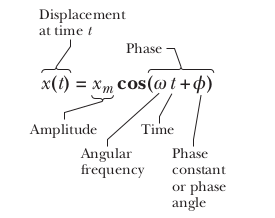

# Electromagnetism

_trying to aggregate_

# Broad strokes

* We've two types of fields, electric and magnetic.
* There's two types of energies to these fields, electric potential and magnetic potential (?).
* Induction. Faraday's law combines these two fields experimentally in that a moving loop in a magnetic field generates an emf in
  that loop (hence, an electric field).
* Why does this happen?
* Maxwell then said, if a changing magnetic field can induce an electric field, could a changing electric field induce a
  magnetic field.
  
# Electrostatics

_following along from Chpt 21 in University Physics_

## Electric Charge

* Charge is a property of particles, like mass. It's what determines their interaction with the _electromagnetic force_
* The unit of charge is the coulomb. Because conglomerations of particles are more common in nature a coulomb is the
  negative charge of $6\times10^{18}$ electrons
* When we're trying to determine the affect a charged particle has on the space around it, we define a field. That is,
  when you place another charged particle (the set of things affected by the field) in the space around it, what force
  will it experience? We define the field as the force per unit of charge placed in it. So you then have some
  determinism as to what force will be experienced by a charge you place into the field (provided you're using the same
  units as the test charge)
* The force on an electric charge depends on its location, speed, and direction; two vector fields are used to describe this force.
* The first is the electric field, which describes the force acting on a stationary charge and gives the component of the force that is independent of motion.
* The magnetic field, in contrast, describes the component of the force that is proportional to both the speed and direction of charged particles.
* The field is defined by the Lorentz force law and is, at each instant, perpendicular to both the motion of the charge and the force it experiences.

# Electric Current and Electromotive Force

_following along from chapter 25 of University Physics_

* Current is any _net_ motion of charge from one region to another.
* Free electrons are naturally occurring in a conducting material.
* If an electric field is applied the electrons move with a force dictated by that field. They 'bump' into positive ions
  and in general there is a mass of electrons slowly crawling their way along the conductor. They do this at a velocity
  called the _drift velocity_.
* The kinetic energy of the electrons is transferred to the ions when they collide, this causes a rise in temperature of
  the material. **Most of the work done by the field goes into heating up the material.**
* Do electrons collide with one another? Presumably yes, but they're much smaller than the atoms so maybe it's less
  frequent.
* In conductors the movement after the application of a field is done by electrons. In _conventional current_ the free
  charges are assumed to be positive. Current is a scalar so direction doesn't matter. It's the net charge flowing
  through a cross sectional area per unit time
* When a electric field is applied all free moving electrons go one direction and all free moving positive charges go
  the other.
* Drift velocity is in the same direction as the field if we assume that the free moving charges are positive.
* For metals at a given temperature, the current density ($\vec{J}$) is generally proportional to the resistivity of the material.
  Current density is current for a given cross sectional area.
* $$\rho = \frac{E}{J}$$
* Current is the rate of change of charge, it can also be useful to look at current per unit area, the rate of change of
  charge through a particular area.
* $$i = \frac{dQ}{dt}$$
* $$dQ = qnAv_ddt; Av_ddt \text{ basically a small volume of charge}$$
* $$\vec{J} = \frac{i}{A} = nq\vec{v_d}$$
* > For simple materials such as metallic conductors, the current density is proportional to the electric field.
* The proportionality constant is known as conductivity.

### Ohms Law

_Chapter 26 Halliday_
* The essence of Ohm's law is that a plot of i versus V is linear for a conductor. When the resistivity is independent
  of magnitude and direction of the field.
* All homogenous materials obey Ohm's law within some range of values of electric field.

## Power

* When a potential difference exists in a circuit, the potential drop that an electron experiences must be transferred
  into some other form of energy (by the conservation law).
* The rate of this transfer $dU/dt$ is 
* $$P = iV$$
* This applies to the transfer of energy of all kinds. 
* $P = i^2R$ and $P = \frac{v^2}{R}$ applies to resistive dissipation (energy loss due to collisions with atoms in the
  resistor).

# Electric field lines

* Indicate the direction of the electric field. 
* Magnitude of the electric field is proportional to the number of lines crossing a unit area. The closer the lines, the
  stronger the field. 
* Start on positive charges and end on negative charges. The number of starting lines is proportional to the charge.

## Electric flux

* *Gauss' law* relates electric field at points on a closed Gaussian surface (just an imaginary concentric sphere
  surrounding a charge) to the net charge of the enclosed surface
* If we know the charge, we can determine the field at a point, if we know a field we can determine the source charge.
  We need a measure of the field at a point on this Gauss surface.
* For a tiny patch of a flat surface $\Delta{A}$ the amount of electric field going through this patch is
  $Ecos(\theta)\Delta{A}$ because if the field is perpendicular to the surface the x component is the only portion of it
  acting on the surface. The 'amount' of electric field 'piercing' this area is $\Delta{\phi}$ 
* $\Delta{\phi} = E\cdot\Delta{A}$ dot product will get the x component of the electric field
* The total flux can then be $\phi = \int{\vec{E} \cdot d\vec{a}}$ vector integrals?
* The flux allows us to know directionality too. Because A is a vector also, meaning that if E switches direction the
  angle $\theta$ becomes 180 and the dot product flips.
* An inward piercing field is negative flux and an outward piercing field is positive flux
* The SI unit of flux is $N/m^2/C$ it's a magnitude, an amount.
* $\oint{\vec{E} \cdot d\vec{A}}$
* The area vector A is always perpendicular to the surface and always points away from the interior of the Gaussian
  surface
* Gauss' law: $\epsilon_0 \oint{\vec{E} \cdot d\vec{A}} = q_{enc}$
* If there is a Gaussian surface with no charge enclosed, any field lines entering it also leave it.

# Energy of electric field

* **Electric potential** (or potential) is the electric potential energy per unit charge.
* Potential at some point is dependent on what is chosen to have zero potential as potential is only useful as a
  quantity of change.
* Often, the ground is chosen. If something is 50 volts the difference in potential between it and the ground is
  50V.
* In some case (I'm think specifically in bonding models here) the potential is chosen to be zero at an infinite
  distance ($r \rightarrow \infty$). 
* Potential difference is a measure of how much energy a charge can acquire, or, how much work it can do.
* Important to relate the notion of charge **and** voltage defining the energy transferred in some movement.
* The work done by a charge in moving from a to b is the negative of the change in potential energy.
* $$W = -q(V_b - V_a) = -qV_{ba}$$
* W is force by distance. $W = qEd$ where d is the distance from a to b
* $$-qV_{ab} = qEd \rightarrow E = -\frac{V_{ab}}{d}$$
* What is the electric potential for a point charge?
* The main ease of use it seems is that potentials add as scalars whereas fields add as vectors.

# Magnetism

* Elementary particles have an intrinsic magnetic field around them. 
* Magnetic poles always appear in pairs, their has not been found to exists an isolated south or north pole of a magnet
* The nature of the magnetic force is different to the electric force. Through experimentation with velocities of
  particles it's found that if we want to know a magnetic field $B$ we measure the force experienced by charges
  fired through it at different velocities. There is a line where the particle experiences no force and all forces
  experienced after that seem proportional to $vsin(\theta)$ where $\theta$ is the angle between velocity vector and
  zero force line. The force of the field always seems to act perpendicular to the velocity vector.
* $$\vec{F_b} = q\vec{v} \times \vec{B}$$
* The force of the  magnetic field relies on the movement of charge
* $\vec{F_b}$ can never change the particle speed because it's always acting perpendicular, so it doesn't contribute to
  it's kinetic energy. It can change it's direction though which is changing its acceleration?
* The magnetic force on a conductor when you've a moving charge through it is $\vec{F_b} = I\vec{l} \times \vec{B}$ If
  you let l become infinitely small then you can find the force at all points along any shaped conductor

# Electromotive Force

* the influence that makes current flow from lower to higher potential is electromotive force. It's an energy per unit
  charge though, not a force.
* If you make a circuit with an electric field pointing one direction. At some point along the field work has do be done
  for the free particles to reset at the top of the circle. In the sense that they need to overcome the negative work
  being done on them by the field when they get over halfway around the circle. The work done by the emf then is just
  the opposite of the work done by the field.
* You would want another electric field at the bottom of the circle to give the free particles a 'push' against the
  oncoming field
* There is internal resistance in the emf source too so the actual current flow in the circuit must take this into
  account too.
* SI unit: Joule/coulomb as it's a measure of the work that needs to be done per unit charge to lift it up the energy
  well.
  
# Induction

* Transfer of mechanical energy to electrical energy.
* If you move a magnet towards a wire it can induce a current proportional to the speed of it's motion and the pole
  directed towards the loop current. The current is 'induced' and the work done per unit charge to induce that current
  is the induced emf.
* A current and emf is induced when the number of magnetic field lines passing through a loop is changing.
* The emf here, is the energy provided to induce the motion of the current that we see. A force that causes free
  particles to move away from lowest potential.
* If we define magnetic flux (field perpendicular to a surface) as $\phi_B = \oint{\vec{B}d\vec{A}}$ where area is the
  surface area of the loop. Faraday's law can then be: the magnitude of the emf induced is the time rate of change of
  the magnetic flux $emf = -\frac{d\phi_B}{dt}$ (Faraday's law)
* If the same flux passes through N loops $emf = -N\frac{d\phi_B}{dt}$ 

# Lenz's law

* An induced current will produce a magnetic field that will oppose the magnetic flux that induced the current.
*  

# Capacitance

* The capability of a material to store electric charge.

## Explain how a battery works

[Cool vid and visualisation](https://www.youtube.com/watch?v=4-1psMHSpKs)

# Circuits

_Chapters 26 + 27_

Just like mechanical energy we need a way of periodically delivering energy (engine). This is done for electrical energy
through circuits.

In a circuit, voltage acts as a pump. Resistors or the load act as something that will extract the energy and hopefully
do useful work with it (or just dissipate it as heat).

**Loop rule**: The algebraic sum of the changes in potential encountered in a
complete traversal of any loop of a circuit must be zero.

**Junction rule**: The sum of the currents entering any junction must be equal
to the sum of the currents leaving that junction.

The circuit diagram is kind of like a map of potential, just like a point in
space under gravity.

## Capacitors

_from chapter 25 of Halliday_

* A device in which electrical energy can be stored.
* The _capacitance_ is a measure of how much charge is required to achieve a potential difference V between two plates.
* $$q = CV$$
* Capacitors in parallel.
* $$C_{eq} = \sum^n{j = 1}C_j$$
* Capacitors in series.
* $$C_{eq} = \sum^n{j = 1}\frac{1}{C_j}$$

### Charging a Capacitor (RC circuit)
_chapter 27_

* In a simple series RC circuit, if we want to know the charge on a capacitor at
  time t.
* $V = iR - \frac{q}{C} = 0$
* $\frac{q}{C}$ is the pd across the capacitor.
* $R\frac{dq}{dt} + \frac{q}{C} = V$
* We need to solve this for all q through time.
* The solution is $q(t) = CV(1 - e^{-t/RC})$
* The derivative of $q(t)$ is $i = \frac{V}{R}e^{-t/RC}$
* The voltage across the capacitor varies as $V_C = V(1 - (1 - e^{-t/RC})$

### LC Oscillations

* At any time t, the energy store in a capacitor is $U_E = \frac{q^2}{2C}$.
* At any time t, the energy stored in the magnetic field of an inductor is $U_B = \frac{Li^2}{2}$.
* If we assume a circuit with and inductor and a capacitor where the capacitor is _fully charged_ to begin with.
* There is an oscillating transfer of charge between the two components at a frequency $f$ and angular frequency $\omega = 2\pif$.
* This would continue indefinitely if not for resistance (energy loss in the wires).

#### Differential Equation for LC

* An analogy is made to a block and spring system.
* $$U = U_b + U_E = U_E = U_B = \frac{Li^2}{2} + \frac{q^2}{2C}$$.
* $$\frac{dU}{dt} = L\frac{d^2q}{dt^2} + \frac{1}{C}q = 0$$.
* The solution to this equation is $q = Qcos(\omegat + \phi)$ and $i = Isin(\omegat + \phi)$ where $I = \omegaQ$.
* This is a solution provided $\omega = \frac{1}{\sqrt{LC}}$.
* This is considered a _free oscillation_.

# Alternating Current

* In an RLC circuit, the rate a which natural oscillations occur might be at some frequency $\omega$. 
* Introducing an emf that is oscillating introduces a driving force, a forced oscillation.
* We assume that there may be a lag, due to reactance in the circuit between the emf and it's current, this is
  represented with $\omega_dt - \phi$. 

## Driven Oscillation

* An oscillating emf drives current and a potential difference through the circuit by $v(t) = Vsin(\omega_dt)$.
* The resistance of the circuit at a time t is $v_r(t) = V_rsin(\omega_dt)$.
* When resistance amplitude varies with voltage current, then, has no phase shift.
* $i_R = I_Rsin(\omega_dt)$.

#### Phasors

* The angle is makes with the horizontal is $\omegat$.
* The angle between vectors in this space is the phase difference between them.
* The value at a time t is the projection on to the real axis (horizontal in most cases).
* When sine is used below, it's not the phasor representation. The phasors representation allows us to put the
  oscillation of interest on the x axis (real axis) for manipulation. Cos is just sin 'shifted' by 90 degrees.

## Capacitive Reactance

* If the capacitor voltage is the same as the driving voltage we have $v_c = V_Csin\omega_dt$.
* To derive the current, we look at the charge on the capacitor at this time t, $q_c = Cv_c = CV_Csin\omega_dt$.
* Current is then $dq_C/dt = \omega_dCV_Ccos\omega_dt$.
* Capacitive reactance is $X_C = \frac{1}{\omega_dC}$. It's unit is the ohm (look at time constant).
* $$i_C = (\frac{V_C}{X_C})sin(\omega_dt + 90)$$.
* From [above](#Alternating Current) $i_c = I_Csin(\omega_dt - \phi)$ so the phase is shifted back by 90 degrees for a
  capacitive load.
* The voltage and current amplitude are linked by $V_C = I_CX_C$.

## Inductive Reactance

* The same steps work for an inductive load.
* Inductive reactance is $X_L = \omega_dL$. It's unit is the ohm (look at time constant).
* The voltage and current amplitude are linked by $V_L = I_LX_L$.
* Here, the phase is plus 90 degrees, which means the current through the inductor lags the voltage through the
  inductor. Because the convention says that current will by some negative phase of voltage, when you sub in a positive
  value and put it on a phasor diagram, the current phasors rotates clockwise a phase $\phi$ from the voltage.

## Power

In the RLC circuit, the source of energy is the alternating current. Some of this energy is stored in the magnetic field
of the inductor, the electric field of the capacitor or dissipated as heat from the resistor.

* If we take the average power $P = I_msin^2(\omegat)R$ the average value of $sin^2$ is 1/2.
* $P_{avg} = \frac{I^2R}{2}$ factoring to $P_{avg} = (\frac{I}{\sqrt{2}})^2R$.
* $I_{RMS} = \frac{I}{\sqrt{2}}$.

# Waves

* The goal of wave equation is to describe the wave as a whole not any specific point on the wave moving through time 
* Actually, the crest of waves move. 
* Movement of sine function through time could be thought of as angular speed.
*  
* Waves are ultimately generated by oscillators.

# Oscillators

* It's similar to how we define a point in space in general except we're confined to an axis.
* As a point moves through space we have acceleration and velocity that pop out of position at a given time
* Oscillation is a repeated movement so we must return to an initial value, this is why the sine and cos functions are
  useful as they are defined on a circle.
* The amplitude can be thought of as the radius of the circle

# Notes

* 22/09/22 13:46:02 Introduction to Electromagnetism
    * Apparently Ireland gets 10% of the sun radiance in the winter months as it does in the summer months
    * Force on a curved path. For each chunk of the path $dl$ the net force may help you, or not. This is where we can
      use the dot product to figure out it's affect on $dl$. It's a path integral, we don't have to consider it an arc
      because it's such a tiny chunk?
    * Energy operates as a state function here too. Even though Work is derived from a path integral?
    * Bigger the distance you do work over, the smaller the avg. work e.g. catching a ball
    * Time and symmetrical laws 'causing' conservation. Emmy Noether.
    * Try and review worked examples, to make sure they make sense.
* [Thought this was a cool video](https://www.youtube.com/watch?v=KGJqykotjog)
    * Give's a good visualisation of de-localized electrons.
* Fields do the work. In the case of a circuit, the load is considered some resistance that energy is put into. It's the
  fields that the current generate that cause the electrons near the load to accelerate towards the ions of the load and
  do work. The electrons drift as well, but it's the field effect that travels at the speed of light?
