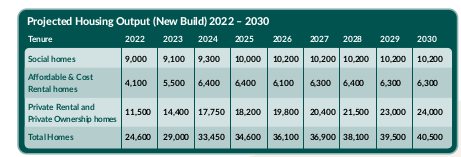
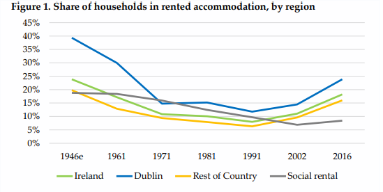
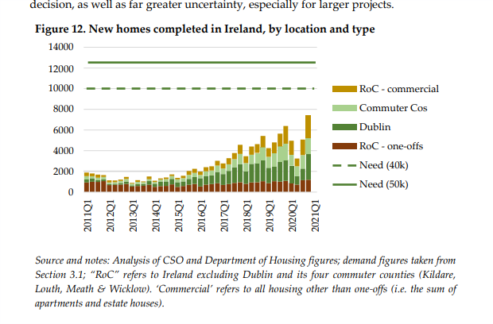

# Housing
@economics @housing @ireland

_The goal here is to constantly update this document by making claims and doing reading to edit those claims_

# Why Housing in Ireland is so expensive

* The government are lobbied by institutional investment firms so they can buy up all the houses and hold them
  increasing their price artificially.

What does it take for this to be true.

* Evidence of government interest in institutional investment in housing and/or general interest in rising house prices.
* Evidence of constraining supply artificially to increase a firms profits.

# 08/04/23 14:05:49

_Following Karnofsky method_

Step 1: pick a topic. First, I decide what I want to form an opinion about. My basic approach here is: “Find claims that
are important if true, and might be true.”

Step 2: read and/or discuss (a bit). I usually start by trying to read the most prominent 1-3 pieces that (a) defend the
claim or (b) attack the claim or (c) set out to comprehensively review the evidence on both sides

Step 3: explain and defend my current, incredibly premature hypothesis, in writing (or conversation).

Step 4: find and list weaknesses in case.

I think what might be useful is to construct some 'stakeholder' profiles/takes on the current situation that I think are
out there. Then try and get evidence to back each one.

_Try and focus on statements that have an effect on outcome_

## Step 1 Current view/claims

* Housing supply in Ireland is low due to construction costs and land regulation. Land tax should be instituted along
  with more data on construction value chain to reduce its costs.
* Institutional investors are a small portion of the housing market (buying and selling of housing) and of the rental
  market (letting).
* The way out is to incentivise more private funding to meet demand in all it's diversity. That is, the government would
  be too slow an organization to meet the changing demand and would make things worse.
* The government can not afford to meet housing need. Supply is currently way below demand.

## Step 2 read/discuss major pieces

* 'Housing for All' is the government’s housing plan to 2030.
    * Jesus, literally all my claims are on p.16. Did I nail it?
    * "Ireland needs on average 30,000 new homes per annum to meet targets set out for additional households as outlined
      in the National Planning Framework".
    * Four pathways for overarching objectives with 20bn for them all over 5 years.
        * 1) Supporting Home Ownership and Increasing Affordability
            * Increase new housing supply to 33,000 per year up to 2030.
            * 6,000 affordable homes to be made available to rent or buy per year from AHB's, Local Authorities or LDA.
            * Introduction of cost rental homes and indefinite leases.
            * LDA will start building more on state land and will advance Project Tosaigh.
        * 3) Increasing Housing Supply
            * "To build housing, we need land. This land needs to be serviced with transport, utilities and other
              infrastructure"
            * "The overall investment required to build an average of 33,000 homes per year is estimated at €12bn."
    * In terms of modelling, the Scottish housing need model is the leader.
    *  

If we just focus on the housing supply claim for now. Pathways 1 and 3 are directly related to that.

## Profiles

* "Housing is being 'held back' to increase it's price"
* "Institutional invested buy up all the housing stock and do the above"
* "There is not enough affordable housing"
* "The government could just build all the houses we need."
* "The government do not care, nothing is being done"

What am I really arguing over here? What are the claims. It seems my goal is to have a full picture of the nuance
involved but I'd also like to be able to assign some blame, I suppose, as to why were in this situation in the first
place.

# 10/04/23 16:56:55

What does this mean for the future of Dublin, for my future, what is expected of income and prices?

# 16/04/23 14:48:20

* Maybe it's useful to split this into supply and demand.
* Demand implies demographics.
* Supply implies construction costs and prices (what is feasible).
* This notion of scarcity and shortage is very much on my mind.
* Price as a signal for resource allocation rather than having any teleological component of 'greed'. I think this is
  very important in the discussion, that we don't always resort to some anthropomorphic motive.

# Gather all notes

## Affordable housing

* The guiding principle in affordable housing finance is that public and private financing sources must equal uses or
  the total cost of building the building, also know as development cost
* In Ireland approved housing bodies seem to be supported by Housing Finance Agency. The question then becomes how much
  supply can these not for profits really provide.

## Why can't we just mandate non profit developers

* for profit is fundamental to capitalism. Debating for profit debates the incentives of capitalist economy. 
* Socialist housing may not agree with the general populace (high taxes), also, it may not be efficient (in terms of the
  types of housing provided)
 

# Demand Demographics

What kind of housing are people asking for?

* > Figures from the most recent Census, undertaken in 2016, show that 18% of households rent their home from a private
  landlord, while a further 8% rent from a Local Authority or an Approved Housing Body
* 
* In a generation the share in rental accomadation has almost doubled.

# First principles

* How much does a typical house cost?
    * Types of houses
    * Cost (average or breakeven) of each type of house, in Dublin and the rest of Ireland
* Social housing
* Why can't the  government fund the whole thing?
    * How much money does the government have?
    * How long does it take to build a house through public means?

## Reading

* https://www.ucd.ie/geary/static/publications/workingpapers/gearywp201901.pdf
* https://www.irishtimes.com/news/social-affairs/a-century-of-housing-how-the-state-built-ireland-s-homes-1.3785939
* https://catuireland.org/i-like-public-housing-and-so-should-you/
* [argument for the existence of landlords](https://mises.org/wire/why-we-need-landlords)
* [How affordable housing gets built](https://www.urban.org/urban-wire/how-affordable-housing-gets-built)
    *   https://apps.urban.org/features/cost-of-affordable-housing/
* https://www.oecd.org/housing/topics/affordable-housing/
* [housing course](./../../vimwiki/Housing Market Course.md)
* [Lyons 2021](https://irp.cdn-website.com/4065c16c/files/uploaded/Identify%20Consulting%20June%202021%20PRS%20Report%20for%20IIP%20-%20final.pdf)
* [Understanding Irelands Housing challenge](https://publicpolicy.ie/perspectives/understanding-irelands-housing-challenge-in-the-light-of-housing-for-all/)
    * Interesting to note how Irelands policy just flipped to home ownership as the goal from the rental sector in the
      previous major policy 
    * The large amount of institutional investment in irelands residential investment goes into build to rent. We seem to
      need more investment from abroad as we can not fund it ourselves but this brings with it this supply of btr.
    * There's also a supply deficit. It seems that around 50,000 dwellings should be built a year for projected Irish
      population growth. The target for Housing for All is 30,000.
    * It is not clear if the decline in home ownership is due to supply shortage. Credit conditions could also play a role
* [KPMG report](https://www.cluid.ie/wp-content/uploads/2021/04/WEB-Cluid-Housing-Towards-a-Sustainable-Rental-Sector-in-Ireland-Understanding-the-Key-Challenges-and-Opportunities.pdf)
    * To cope with a rise in demand for housing from economic growth in the early 90's the Urban renewal act allowed
      landlords to write off 100% of costs on their income tax, this was only 50% in the case of owner occupied landlords.
      This lead to 60% of subsidies units being owned by private landlords.
    * Despite these incentives ending in the mid 2000's cheap credit propped the development market up.
    * Home ownership for 25-34 year olds has declined from 68% in 1991 to 30% in 2016
    * There this changing landscape for demand, is policy then playing catch up?
* [Golden age of Irish social housing](https://www.ucd.ie/geary/static/publications/workingpapers/gearywp201901.pdf)
    * > Until recently almost all social housing in Ireland was delivered, owned and managed by local government, but
      apart from the United Kingdom, this model was rarely used elsewhere. In the rest of Western Europe social housing
      was provided by the independent, non-profit sector organisations (eg. cooperatives in Denmark, housing
      associations in the Netherlands and Austria), quasigovernmental municipal housing companies (in France and Sweden)
      or less commonly the private sector (Germany)
    * Coincided with the expansion of the welfare state
    * Services of housing loans became an issue
    * Funding of debt through rents.
    * Debt held by non profit agencies in other Western countries
    * Ireland financing was destabilised by politics

* https://www.irishtimes.com/news/social-affairs/a-century-of-housing-how-the-state-built-ireland-s-homes-1.3785939
* [Irish institutional investment](https://assets.gov.ie/6348/140219142846-5a166a1ec85f4237935fb5c21dd666cb.pdf)
 
# Notes

* [Lyons 2021](https://irp.cdn-website.com/4065c16c/files/uploaded/Identify%20Consulting%20June%202021%20PRS%20Report%20for%20IIP%20-%20final.pdf)
    * At the end of 2.1 there is a discussion of the 'path dependence' of irish housing based on financing model.
      Analyses in Blackwell and Kohl (2008)
    * Ireland is converging demographically to the EU average in terms of population growth and the no. of apartments
    * Two thirds of landlords in a survey commissioned by the RTB own just one property.
    * > For almost all of the 19th century, there were no purpose-built apartments constructed in Ireland. This and the
      later absence of apartment construction reflects a unique element of Ireland’s demographic development: unlike all
      our European peers, Ireland’s population fell, rather than increased rapidly, between the mid-19th and mid20th
      century. This meant there was, effectively, no pressure on either the policy or finance systems to plan how to
      accommodate density: instead, sparser and more sprawled greenfield development was sufficient
    * There was virtually no private rental accomadation built at the start of the 20th century in Ireland due to
      viability (which I think means that the market price wasn't even enough to cover costs). Most building was
      subsidised and suburban due to transport infrastruce slowly being set up.
    * An example is given of the disparity between the market price and costs of development even in the 60's. It is
      similar to today, where incomes just can't match the break even price.
    * Ireland followed the European trend post war to build pre caste large scale developments (liek Ballymun) later
      following what other countries do mixing tenures (in terms of market renters and social renters together)
    * In the 80's the government tried to deal with the lack of viability for
      capital  with a 40% subsidy for cost of developments 
    * Under section 23 you could get the cost of building minus the site cost off the income you made from rent. So
      anything you built would contribute towards you not having to pay tax on the rent you earned from it. This was
      also aggregate rental income. You could be building houses that there were no demand for but getting a huge tax
      break on the income you were making from somewhere else.
    * This seems to have worked as rents decreased after it's implementation
    * This tax break only applied to private taxpayers which meant that institutional investors were essentially priced
      out?
    * 2.3
    * 2.4
        * Institutional investors play an important role in build to rent projects as they have access to longer  term
          capital from European markets. Like pension funds. This means they can spread the costs of construction over a
          longer period of time. 
        * This is frowned upon in Ireland as it's seen as 'squeezing out' the regular developer(?). How else would this
          accomadation be built?
* Lyons 2021 continued
    * Sales prices of housing are about 40% below 2007 peak. Being around 20% below in Dublin
    * Rental prices are 40% above their peak though
    * Show's scatterplots that link increases in supply with reduction in rent and vice versa. The equilibrium seems to
      be above 4,000 units available
    * Interesting how this is the largest rental boom in modern history, I'm not too sure what the cause of the others
      were.
    * I skipped 3.1, assumptions for growth and expected housing need.
    * 3.2
        * Almost 80% of developments use foreign captial. Either in equity or debt form.
        * My mental model here for equity is some firm that is 'investing' in a development rather than just expecting
          their money back.
        * Interesting that during the tiger the 'pillar banks' played a large role in capital circulation. That now they
          are more restrained so it was inevitable that some other form of capital must come in. Also, they were
          intermdeiaries for foreign capital. So the money you were getting from the bank was just coming from overseas
          anyways
          
        * It's made how short need we are
    * What is the government expenditure profile like in the past few years. Why do we need international capital
* [local file](file:///home/conor/Downloads/205477_d744837d-8f03-4ff0-82dd-4763df823c95.pdf)
    * This report seems to talk more about economic cylces and how they affect social housing, which I think is an
      interesting point.
    * > Rising rents can also increase the cost faced by the exchequer in providing housing. With regard to housing
      measures funded through current expenditure, a large share of the rental sector in Ireland is in receipt of some
      form of support. Data from the 2016 census indicates that 326,8324 households rent from a landlord (including
      voluntary and co-operative bodies). As of 2021Q2, there were approximately 62,000 active HAP tenancies, 17,500 RAS
      tenancies, and 5,000 privately leased SHCEP operational units (DHLGH). This indicates that approximately 26% of
      households residing in the rental sector are in receipt of some form of housing support that is funded through
      current expenditure.
    * Be interesting to check this for the most recent census.
    * Interesting point on how more strict mortgage lending rules affect price signals and push people to the rental
      sector, so rent increase more than avg. house prices.
    * > Census data indicates that the age at which home ownership became the majority tenure category was 35 years in
      2016. Below the age of 35, the number of households renting exceeded those owning a home. Previous censuses
      indicate the ages which have marked the changeover between renting and homeownership; 32 (2011), 28 (2006), 27
      (2002), 26 (1991)
