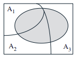
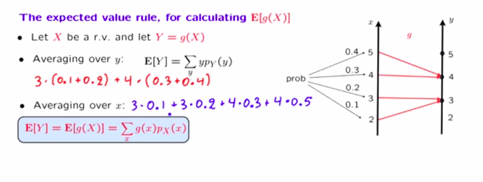

# Probability

_The goal is to have a resource that lays out my fundamental understanding of probability_

A _probabilistic model_ is a mathematical description of an uncertain situation. The elements of the model include:

* **Sample space** is the set of outcomes of experiment, which can be discrete, finite, infinite etc.
* **Events** are subsets of the sample space.

Should think of the sample space, when it is finite, as a _set_ of outcomes (elements).

All models involve an _underlying process_ called the _experiment_. Tsitsiklis notes that this is always modelled as a
single experiment. If you are modelling three coin tosses, you say that one 'run' of the experiment is three tosses
(outcomes then, could be something like triples of the coin faces).

> Generally, the sample space chosen for a probabilistic model must be collectively exhaustive, in the sense that no
matter what happens in the experiment, we always obtain an outcome that has been included in the sample space.

This space should also have enough _detail_ to distinguish outcomes of interest to the modeler.

Representation of the sample space can take a sequential character, tree based character, involve counting principle its
just about attempting to model the experiment of interest, there is not always one correct way. As long as all relevant
outcomes are accounted for and the correct probability law is applied.

### Examples

* Where the number of possible outcomes are _finite_ and equally likely, the probability of an event is a matter of
  _counting_ the number of elements of the event and dividing by the number of elements in the sample space. 
* If the experiment has a _sequential_ character, conditional probabilities (a special kind of probability law) are
  defined (possibly using the methods from previous example). The probabilities of events are then calculated by
  multiplication of conditional probabilities.
* Need to fill in divide and conquer method here.

The sample space can be drawn out as, for instance, a tree diagram.

[Is area a legitimate probability law for a unit square. Countable additivity, how our disjoint axiom only applies to countable infinities](https://www.youtube.com/watch?v=mUxg3j_h5GM&list=PLUl4u3cNGP60hI9ATjSFgLZpbNJ7myAg6&index=9)

## Discrete Probability law

For a space with a finite number of possible outcomes. A probability law assigns probability to events with one element.
The probability of any event is the sum of its elements $$P({s_1, s_2, ..., s_n}) = P(s_1) + P(s_2) + ... + P(s_n)$$.

The discrete uniform law follows from this, with a smaple space of n outcomes that are equally likely (_all single
element sets have the same probability_), then the probability of any event A is $$P(A) = \frac{#A}{n}$$

## Framework of probability theory

2 stages, construct a model and deduce properties

1) construct a probabilistic model by specifying a probability law on a suitable defined sample space. there are no hard
rules to guide this step, other that the requirement that the probability law conform to the three axioms. Tsitsiklis
states that sometimes incorrect models are chosen for ease of use, or tractable calculations.

2) The second stage has no ambiguity like that of the first. You're working in a fully specified model
> While the first stage entails the often open-ended task of connecting the real world with mathematics, the second one
is tightly regulated by the rules of ordinary logic and the axioms of probability.
> All conceivable questions have precise answers and it is only a matter of developing the skill to arrive at them.

Often probability paradoxes reflect a poorly specified or ambiguous model (first stage.

## The Counting Principle

If you have an experiment with 2 stages, that has n possible results for the first stage and m possible results for the
second stage. The result of the experiment is all the possible tuples of first and second stage results. There are nxm
of these pairs.

Can imagine a sequence as a set of sequential steps with a choice at each step.

Suppose you want to construct some **'object'** through a sequence of $r$ stages.

For the ith stage you have n_i options. 

How many objects can you construct?

$$n_1n_2 ... n_r$$

Normally this 'object' is an outcome of interest.

### The number of subsets of an n-element set

For a n element set, say (3, 4, 5, 6), how many subsets does it have?

If you view the 'object' to be created as a subset, the creation of a subset involves choosing between putting an
element in the subset or not (although, this implies same ordering?)

## Conditional Probability

Construction of a new probability law based on knowledge of the occurrence of an event. Intuitively could be seen as
updating our probability law based on some information.

From an intuitive approach we generalize to the follwoing $$P(A|B) = \frac{P(A \cap B)}{P(B)}$$ This equation follows
the three basic axioms. P(B|B) = 1 so it can be considered that the whole sample space is B in this frame of reference.

* Useful in reasoning with **partial information** of the occurrence of some event.
* Once B has occurred, it now 'becomes' the sample space so it's probability of occurring is 1. Almost as if you zoom in on it.
* Need to scale A's original probability when B becomes the sample space.
* This is a definition, not a theorem. Motivated by reasoning.

## Mulplication Rule

Presented with a problem that takes on a tree like sequential character, mathematically we are dealing with events that
occur one after the other.$$P(\cap^n_{i=1}A_i) = P(A_1)P(A_2|A_1)...P(A_n| \cap^{n - 1}_{i = 1}$$

This intersection event $P(\cap^n_{i=1}A_i) $ could be associated with a particular _path_ of the tree.

## Total Probability Theorem

* The probability that B occurs is then a weighted probability under each scenario.
* $P(B) = P(A_1 \cap B) + ... + P(A_n \cap B)$
* $P(B) = P(A_1)P(B|A_1) + ... + P(A_n)P(B|A_1)$.

If B is the event {X = x} for a random variable X, then the total expectation theorem is $$E[X] = P(A_1)E[X|A_1]+ ... + P(A_n)E[X|A_n]$$.

## Bayes Rule

* If we look at a cause effect relationship. Bayes Theorem can be seen as giving a belief in the cause ($A_i$) of an observed
  effect B.
* $P(B|A_i) = \frac{B \cap A_i}{P(A_i)}$
* We can use the multiplication rule (looking at the tree): 
* $P(A_i|B) = \frac{P(A_i)P(B|A_i))}{P(B)}$.
* Could look at the tree diagram as a causal model. And the left as inferring what cause lead to the outcome on the
  right.

## Independence

* Two events are independent if the occurrence of one event does not change our beliefs about the other.
* Subtly, disjoint and independence are not the same thing! Independence is about information.

## What is the relationship between conditioning and independence?

## Random Variables

* **A function from the sample space $\Omega$ to the real number line**.
* Not random, nor a variable.
* We have the random variable $X$, which represents the function. Tsitsiklis also says you can think of it as a sub
  routine or process. We then have $x$ the number that X spurts out for an outcome.
* It's just some tool we use to convert fuzzy outcomes into a more manageable representation (numerical).
* It has nothing to do with the probability distribution that is assigned across its events.

## PMF

* If you think of the sample space, the PMF is a function that tells us the 'mass' of probability (a weighting) of an
  outcome.
* Graphically, we're stacking weights on to a given value of x.

### How to compute a PMF

* Collect all possible outcomes for which X is equal to x.
* Add their probabilities.
* Repeat for all x. 

## Binomial PMF

* Binomial random variable is function that takes a parameter of interests, a certain amount of heads say and returns
  the numerical value of the  subset of outcomes of n trials that have the 'supplied' heads.
* We know that each of these outcomes would have the same probability (some mixture of heads and not heads) for the n
  tosses. 
* So the pmf for the binomial is (n choose k)$p^{k}(1-p)^{n-k}$ summed over each k value.
* If X is _the number of heads in n tosses_ then the pmf for X must cover all the k values from 0 to n.

## Expected Value of a Random Variable

* Can be interpreted a center of gravity of an object of the kind given by the pmf. Mainly useful for symmetric pmf's.
* A moment of a function. 
* $$E[X] = \sum_xxp_X(x)$$
* In some scenarios it represents the mean.

## Joint PMF's

For two random variable's X and Y, if A is some set of the sample space with the properties x and y.

$$P((X, Y) \in A) = \sum_{(x, y) \in A} p_{X, Y}(x, y)$$

Just taking those instances as disjoint sets and summing them to get combined probability.

X and Y are tightly linked over their values $p_X(x) = \sum_y p_{X, Y}(x, y)$. If they weren't linked like this for all
values of X I suppose you would just have two X's, one with a joint distribution with Y and one without it.

There is not necessarily a causal relationship between X and Y here. How do definitions change when they affect
eachother?

## Conditional PMF's

* The PMF must change if information comes to light that affects it.
* The PMF is now constructed with the conditional values {X = x | A}.
* Conditional model is the same you just have different probability values, still follows all the same 'laws'.

## Expected Value Rule

* E[Y] where Y = g(X) is $E[g(X)] = \sum_xg(X)p_X(x)$.

* He goes through the proof at the end of this video if you need it.
* https://www.youtube.com/watch?v=gB5TCCfF6e4&list=PLUl4u3cNGP60hI9ATjSFgLZpbNJ7myAg6&index=59
* The _linearity of expectation_ makes sense knowing this.
* If Y is some function of x $Y = g(x)$ and it's linear $g(x) = ax + b$.
* Then, $E[g(X)] = \sum_xg(X)p_X(x)$
* $E[g(X)] = \sum_xaxp_X(x) + \sum_xbp_X(x)$
* $E[g(X)] = \sum_xaxp_X(x) + \sum_xbp_X(x)$
* $E[g(X)] = aE[X] + b$

## Variance

* Expected value of the distance from the mean for random variable. Or just the average distance from the mean.
* $E[X - \mu]$, because this is zero, we consider the absolute value.
* $E[(X - \mu)^2] = E[X^2 -2\mu + \mu^2] = E[X^2] - E[X]$.
* $var(aX + b) = a^2var(X)$.

## Continuous Random Variables

* A random variable is continuous if it can be described by a PDF.
* In the discrete case, we 'stacked' masses of probability for a given {X = x}, for pdf's {X=x} is infinitely small. It
  is 'massless'. We look at the density of the probability and determine the mass from that. 
* Density is mass per unit area (in 2d) so our probability is still a mass we just need to specifiy the random variable
  as a density.
* Different outcomes in the sample space result in different numerical values for the random variable of interest.
* When we say that probability that X takes some value in an interval of the pdf, we're saying that the probability of
  those outcomes defined by X=x lies in some interval.
* The notion that a single point of the pdf is zero is similar to how a line is a collection of zero length points.
* Density = probability per unit area in the neighbourhood of a point. This can be greater than one. The integral in
  some neighbourhood won't exceed one but its derivate can. 
* If we think of probability, in the discrete case as getting a chunk of mass and being able to palce discrete chunks on
  to outcomes of the sample space. The continuous case is a 'spreading' of mass over the sample space.
* "How doe we describe masses of continuous spread, the way we describe them is by specifying _densities_" 4:30. 
    * How thick is the mass sitting here etc.

## Joint PDF

Think of the joint function as some kind of 'surface' that sits on top of the two dimensional plane.
This plane is just another space, just like the outcome space. The probability mass is spread out over it.

For two random variables X and Y, say, X is defined over a range 15 - 17 and Y over 55 - 68. The outcomes space is some
tuple of these values (just because we're interested in them not necessarily that there is an a priori relationship
between them). If we have an event B in this space, say $X > 16$ and $Y < 60$ the  $$P((X, Y) \in B) = f(x, y)$$ if this
function is non negative and integrates to 1 then it is considered a joint pdf.

A joint pdf is _any_ function which is non negative for two variables and integrates to one. Is this regardless of an
'intuitive' notion of the probability it assigns? 

In the above example, the surface integral, where you integrate for some integral bounds of x results in a 'line' in the
2-D space which is then multiplied by an integral for y in this space (another line). This product results in an area
representing a joint probability. 

For smaller and small 'lines' you approach

$$P(a \leq X \leq a + \delta, c \leq Y \leq c + \delta) = f_{X, Y}(a, c)\delta^2$$

This 'approaches' zero but can be a point estimate for the (a, c) pair of the set (outcome in space).

It's really just not obvious to me how the joint function for two rvs is 1/area if its uniform. It seems to pluck on a
core misunderstanding about calculus or something, when the sample space is continuous.

The way I understand it at the moment is that when we say P(X,Y) we're really saying the joint distribution for a little
area around x,y. The _misunderstanding_ is that I feel it should be the case that a function is undefined for a point on
the space. Thats the essence of calculus though, taking things in the limit we can say things about them.

## Conditional PDF
_a normalised slice of the joint pdf, can reason about the conditional from the joint_

## Probability Measure

A function from a set to the real number line. Measures in mathematics aim to generalize real world measure like length,
width etc. as well as more foggy notions like charge and probability. Is this related to the standard lindley speaks of?

Thinking of 'Probablity' as a word without association in your head, if you can. What happens is that there is some
function that maps from the discrete set to the real number line in the 'stacking' manner. In the continuous case, there
is some function that maps from the set of outcomes to the real number line in a continuous manner.
We call these two functions/mappings the probability functions.

We then try and get closer to our subjective notions by defining: $$P(a \leq X \leq b) = \int_a^b f_X(x)dx$$.

The function must satisfy the probability axioms, just like the discrete case $$\int_{-\infty}^{\infty} f_X(x)dx = 1$$.
This is important for our 'subjective' notions of probability because if you ask, what is the probability that X falls
in the range $-\infty$ to $\infty$ we are sure that it will, the probability of that event should be 1.

### Finding the marginal from the joint

## General Function of a Continuous Random Variable

https://www.youtube.com/watch?v=X-AzW70e2M0&list=PLUl4u3cNGP60hI9ATjSFgLZpbNJ7myAg6

* Two step procedure, find the CDF, take its derivative.
* If $Y = g(X)$, if we get $F_Y(y)$ we're dealing with the case of $P(g(X) \lte Y)$
* How to we know the cdf is the same for functions of random variables?
* He uses the geometry of the graphs here, its interesting the way he does this, just to get an intuition for the
  'mathematical  machinery' visually.

## Convolution

The surface integral of x and y values for some constrained limits of either x or y, defined by a z value. Gives you the
pdf of the z which is X + Y. I'm confused about its relationship to the joint distribution.

# Sources

https://ocw.mit.edu/courses/6-041sc-probabilistic-systems-analysis-and-applied-probability-fall-2013/
https://ocw.mit.edu/courses/res-6-012-introduction-to-probability-spring-2018/

# Tips

* if you don't know the probability assign it to a variable $p$.
* Use De Morgans law for turning unions into intersections. 
* Think about justifying your answer intuitively.
* Make assumptions really clear.
* Try to calculate the outcome space and see if you can apply probability purely from division of this space. This uses
  a lot of counting which I'm still getting used to.
    * Event's is just a set of outcomes so can also be counted.
    * Saw this in q1 problem set 3.
* I've come across a few examples where trying to find the conditional I don't know the joint probability of A and B for
  A|B. This is problem sheet 4, the outcomes are countable, so you change the sample space to the number of outcomes
  that are in B, then you can assume an equal probability for each outcome and just put # outcomes of A over it.
* The _counting principle_ is really powerful, or at least a simple concept that can be generalised. The idea of
  constructing an _object_ is what I'm clinging to here.
* Its helpful to visualise the graph of the conditional pmf. Fixing a y and plotting all possible x's given that y on a
  new plane. Its useful for getting more intuitive notion of what its area might look like and its expected value.
* Make sure to remember where in space probabilities are valid. From the great Jimmy Li.

## 09/06/23 15:19:57

What is the :creative: contexts that makes me like probability?

There's an internal consistency to probability. Outside of any interpretation of probability.
https://www.youtube.com/watch?v=H_k1w3cfny8&list=PLUl4u3cNGP61MdtwGTqZA0MreSaDybji8

How is uncertainty compounded. If you have a random variable X, and Y where Y is a noisy measurement of X, how do you add
the uncertainty of both.

Suppose X = {0, 1}, sending a bit of information. Now, suppose Y is a measurement of X but with some noise W. Y = X + W.
You observe a noisy version of X. 

For the continuous X but discrete Y he uses the example of a measurment device that measures current (continuous) using
some photon counter (discrete Y).

This all feels pretty relevant to my research work. Stacking uncertainties. There is some objective state of the world,
the LCA is our 'noisy' measurement.

## 19/06/23 18:42:54

The 'Total' theorem's are 'divide and conquer approaches', they weight the probability or expectation of interest by
each probability in the partition of a set.

With the _absent minded professor_ problem, you're asked to calculated a 'compound' expecation but the expectation is
conditional. The expectation of the random variable (in my case T) is conditional on what event (or scenario) takes
place. This means that its expectation is also conditional.

## 20/06/23 12:29:06

Watching: https://www.youtube.com/watch?v=mHfn_7ym6to&list=PLUl4u3cNGP61MdtwGTqZA0MreSaDybji8

The notion of 'stacking' some quantity 'probability' on outcomes is interesting. Then in the continous case we have to
spread it, not stack finite chunks of it.

This is like Polya's notions of analogies. Hopefully the analogy is helpful. 

The key here is the change in the _set_. In the discrete case we have discrete elements, not in the continuous case.

"densities are note probabilities, they're probabilities per unit length" pmf's are probabilities though right? They're
both probability measures.

Value of of density at endpoints can be left as 'ambiguous'.

The CDF for a normal can't be defined, so the values for the standard normal is calculated. Unless you want to do the
same for you're normal, you should standardise and lookup the table.

Watching: https://www.youtube.com/watch?v=CadZXGNauY0&list=PLUl4u3cNGP61MdtwGTqZA0MreSaDybji8&index=9

For a uniform distribution, you can get the constant (probability assigned to every real number) by seeing that it must
integrate to 1.

Trying to look at conditionals graphically, or just distributions in general graphically.

## 26/06/23 18:25:20

I had some success working through the Laplacian distribution at the start of recitation 11. Just getting a feel for
what happens when numbers get plugged into the graph. Its really crazy how some of these equations are so responsive and
align to properties we want them to have despite their on the surface rigid formalism.

It helps to look at extremes, this is something Alan Hajek talks about as a useful thinking trick, to take the extremes. 

The Laplacian gets pinched more and more as $\lambda$ goes to infinity. So the Y value in the Z variable sits pretty
confidentely around zero. This means that if Z is greater than zero, you're very confident the conditional, X given Z is
a given x.

This shape of the function gives us an indication of how to intepret things.

Really found drawing things out, or attempting to make sense of answers visually helped this session.

## 27/06/23 18:32:21

Why is it p(1-p) not just p? p is the probability something happens. Why would we want to know the probability p happens
and doesn't happen? I think over more than one experiments this matters, but not for one?

## 30/06/23 18:55:11

_derived distribution_: The pmf, or pdf of a function of random variables. Not needed for things like expected value of
function of random variables.

Working on problem 21 in chapter 3. Information is always gained if your distribution changes based on some other random
variable. So in this case, the first stick break changes x's probability, in fact is pretty much all x cares about, so
we learn a lot (the distribution changes a lot) when we get a value for y.

## 07/07/23 14:08:49

Conditional expectation as a random variable
Watching YT 13.1 - 13.11

With $E[X | Y = y] = \sum_xxp_{X|Y}(x|y)$ it can be viewed as a function of y. So $g(y) = E[X | Y = y] =
\sum_xxp_{X|Y}(x|y)$ for a given y, g(y) is the value that the expected value of X takes when Y = y and is itself a
random variable. The _abstract conditional expectation of the random variable X given Y_.

Now, we look at the expected value of this new random variable
$$E[E[X | Y]] = E[g(Y)] = \sum_y g(Y)p_Y(y)  = \sum_y E[X|Y]p_Y(y) $$

This is the total expectation theorem. Which is  $E[X]$, the expectation of the conditional expectation is the
unconditional expectation. Law of iterated expectation.

This is an equality between numbers, where given some little y we have the expected value $$E[X|Y=y]$$ whereas the
following is an equality between random variables $$E[X|Y]$$. 

He really puts an emphasis on the idea that until the variable y is known, the quantities are unknown (random
variables).

Law of total variance (not the same as unconditional): $$var(X) = E[var(X|Y)] + var(E[X|Y])$$

https://www.youtube.com/watch?v=-0pzpXHq_io&list=PLUl4u3cNGP60hI9ATjSFgLZpbNJ7myAg6&index=139
A pdf with separate chunks, should should 'divide and conquer'.

It's all pretty abstract.

Think I'll follow book format, so looking at convergence theorems before random processes.

Going to focus on getting a better understanding of variance.

* I think I need to make these notes more formal, They're fairly scattered.
* I've got to stop moping if I don't understand something. I'm never going to understand it all fully and thats part of
  the fun. I'm putting pressure on myself to understand everything first try, or to say, why didn't you do this before
  etc. but its just not useful. The source of the pressure is irrational too, its unlikely that what I learn now will
  have an impact visa vi whether I pass my research project or not, whether I get a job or not. Need to be focused a bit
  longer term. That said, still going to try and get 20 hours over the next week.

## 08/07/23 12:42:13

https://www.youtube.com/watch?v=3eiio3Tw7UQ&list=PLUl4u3cNGP61MdtwGTqZA0MreSaDybji8&index=19

Expected value is over whole population, sample mean is some sample of that population.

Getting useful answers from limit theorems, when we've to analysis the conduction of many random variables.

## 10/07/23 14:28:35

Markov inequality

If $X \geq 0$ and $a > 0$ then $P(X \gte a) \leq \frac{E[X]}{a}$.

Chebyshev inequality

"If the variance is small, then X is unlikely to be too far from the mean"
$P(|x - \mu| \gte c) \lte \frac{\sigma^2}{c^2}$

For $$P(|x - \mu| \gte k\sigma) \ltq \frac{1}{k^2}$$  no matter what the distribution of X is.

The Chebyshev inequality is more informative in most cases as it uses knowledge of the variance _and_ the mean.

iid: Independent and indentically distributed. Normally used when carrying out an experiment over a period of time,
drawing from the same sample space.

The sample mean is the mean of a collection of 'draws' of these random variables $$M_n = \frac{X_1 + ... + X_n}{n}$$.
This mean is a function of random variables (so it too is a random variable).

$E[M_n] = \mu$, $var(M_n) = \frac{\sigma^2}{n}$. 

As we take n to infinity, the probability that the values of $M_n$ stay within some bound $\epsilon$ of the mean gets
closer to one.
$$P(|M_n - \mu| \gte \epsilon) \lte \frac{\sigma^2}{n\epsilon^2}$$

If each X is considered as $X_i = \mu + W$ where $W$ is some noise with an expected value of 0. The emprical freqency
will be close to the actual mean of the random variable. It strengthens the frequentist notion of probability.

_Convergence of RV's does not imply convergence of expectation_.

## 31/07/23 16:41:55

A lot of the time what I'm looking for is a robust concept of random variables, one that can fit in when new topics are
learnt. I guess, sometimes it takes an inverse order.

#### Moments

Reading https://gregorygundersen.com/blog/2020/04/11/moments/ about the origin of moments.
Probability, as a measure, can be thought of as a mass. A distribution of measure (mass, probability etc.) can be
specified by three parameters: location (where the center of mass is on the x-axis, which is normally non-zero
outcomes), scale (how spread out the distribution is), shape (its overall geometry)

Not all distributions use all the parameters.

The zeroeth moment I don't quite understand, the first moment is communicated as a distance from a hinge, like a moment
arm, the distance from the origin that the center of mass is.

Moments in physic refer to a distribution of mass. The moment of inertia changes with distance from the center of mass.
The zeroth moment is a general measure of total mass. The first moment tries to weight the components of this mass
distribution by factors (the x values in this case) of interest. 

Moments kind of grab the center of mass for more and more scaled up versions of the initial function.

#### Random Variables

This stack overflow answer https://stats.stackexchange.com/questions/50/what-is-meant-by-a-random-variable/54894#54894
talks about modelling an uncertain event as a load of tickets in a box with outcomes written on them. You pick tickets
out of the box and ultimately try and infer the proportion of tickets with certain outcomes written on them. This builds
up the model of a random phenomenon.

A random variable is a function on whats written on the ticket. Its consistent in that no matter what \omega it will
produce the same number (like a sub process or computer function).

There is nothing random or variable about a random variable

> What is random is the process of drawing a ticket from the box; what is variable is the value on the ticket that might
be drawn.

So do we separate the notion of a distribution and a random variable?

