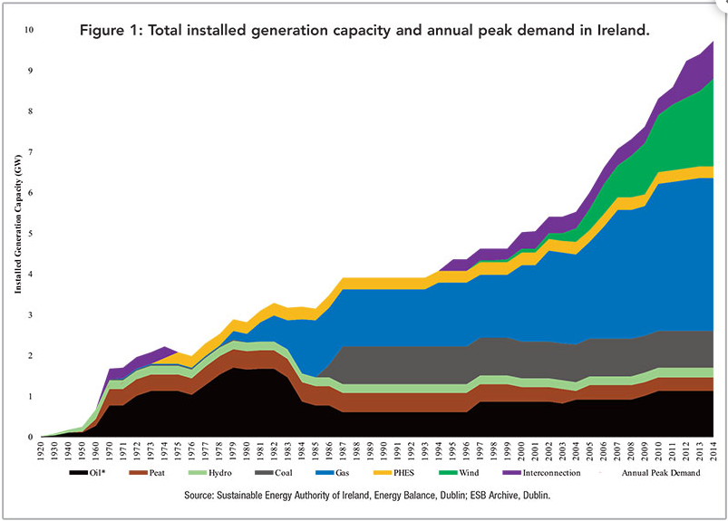

general hope is to improve ability to connect a model based analysis of something with technical know how.

The question:

How are we improving and how would you improve the electric grid?
What effect would large scale micro generation have on the grid?

# Describe the machine, get familiar with its operation

> The reason a bulb illuminates when you flip on a light switch is that you have just lowered the resistance on the
circuit, from total (when the switch is off) to near zero (when the switch and lamp are on). There is no need to
“communicate” with electricity in any other way—our grid, indeed the whole of our world, might be thought of as a
symphony of varying resistances, each beckoning or shunning electric current in its own way.

# Themes

* detailing specific scenarios?
* Quantifying the value of the grid can be done, in the US specifically, by looking at GDP drops during blackouts
* A motivation also is that if you can figure out a way to manage sub systems of the grid, it might make it more
  scalable for industrial development of other nations. 
* In Ireland, it's fairly recent that broad electrification has happened, or at least, it's a bit easy to see the
  qualitative difference. It also has this cultural aspect of literal enlightenment in empowering rural Ireland.
  Although this may be overstated.
* What's the filter through which we can put the planned actions? Something like a map that shows online/offline
  generation through time? This would involve looking at Ireland's current infrastructure and seeing how much aggregate
  power is coming from renewables.
* When looking at any system, as Meadows says, you want to get a sense of it's
  structure. This is kind of why I looked at history first, you're trying to get
  a sense of what it is. This can kind of overshadow behaviour however in interesting ways. What it is today, as a
  system might have absolutely nothing to do with what it was, it's unlikely but that's why you also look at historical
  data, to get a sense of it's behaviour.

# Whats wrong with the grid?

* Systems dynamics come into play when you look at the self-organization level of the grid. We have to determine what
  the overall goal of the electric grid system is and determine if the sub systems that may arise (say, in the form of
  micro grids) can push us towards that goal more efficiently. If it can't, are we operating at maximal efficiency
  towards the goal or function of the grid at the moment? I suspect not.
* Hierarchies may be formed here where the needs of small pockets of society are fully satisfied, more efficiently based
  on their demand.
* Why is hierarchy so efficient? It reduces the amount of information that each node needs to keep track of. This local
  information is similar to what prices can capture.

# Infrastructure Map of Ireland's current grid

Electricity generators can be:

* Connected to the _transmission_ systems: high to medium voltage ([EirGrid](https://www.eirgridgroup.com/customer-and-industry/general-customer-information/connected-and-contracted-generators/))
* Connected to the _distribution_ system: medium to low voltage ([ESB](https://www.esbnetworks.ie/new-connections/generator-connections-group/generator-statistics))
    * This is a nice map of the distribution system, medium to low voltage stations that specify the feeders also.
    * https://www.esbnetworks.ie/network-capacity-map
    * I'm not too what I'm looking at just yet.
    * Also [this](https://esb.ie/what-we-do/generation-and-trading/generation-asset-map) gives an overview of bigger generators.

* > ESB Networks builds and maintains the transmission system. Eirgrid manages the power flows, including electricity
  generated by each major facility. Eirgrid also ensures that the transmission system can meet the growing demand for
  electricity in the future and allow more electricity to come from renewable sources, such as wind farms[^4]. 
* Eirgrid is set up to enable 80% of the grid to be powered by renewables.
* But still, EirGrid is considered the transmission system operator?
* In Denmark the DSO's are customer [owned ](https://cdn.eurelectric.org/media/5089/dso-facts-and-figures-11122020-compressed-2020-030-0721-01-e-h-57999D1D.pdf)
* EirGrid are the TSO but ESB are the Transmission Asset Owner (TAO). The function of EirGrid is:
    > “To operate and ensure the maintenance of and, if necessary, develop a safe, secure, reliable, economical and
    > efficient electricity transmission system, and to explore and develop opportunities for interconnection of its
    > system with other systems, in all cases with a view to ensuring that all reasonable demands for electricity are
    > met and having due regard for the environment”.

# Interconnect

* East West Interconnector: Link between Britain and Ireland, 500MW HVDC line, submarine cable about 260km in length, AC
  voltage of 400kV with DC of +- 200kV.
    * Manufactured by ABB.
* Proposed 'Celtic Interconnector' between Ireland and France for 2026.
    * Partly to integrate with EU electricity market.
    * Improve exports of electricity.

# Ireland's Electric grid basic timeline

_getting a sense of the physical infrastructure that makes up our current grid_

> The sheer scale of the rural electrification project can be gauged from early estimates of the materials needed for
its completion, namely: 1 million poles; 100,000 transformers; and 75,000 miles of line [^3].

* 1880: The first public electric light bulb is installed in Dublin.
* 1882: Dublin Electric Company operates 3 generation plants throughout Dublin.
* Pre 1927: for 40 years Ireland's grid had been in operation. This was done, starting with small generation plants
  around Dublin, eventually spreading across the country [^1].
* 1923 Thomas McLaughlin returns from working with Siemens in Berlin deciding that Ireland's natural resources should be
  used for electricity generation.
* McLaughlin pushed for the establishment of the ESB to unite the fragmented network as it stood at the time.
* 1929: Shannon scheme is completed and comes online connecting up the first towns.
* 1935: Shannon generator producing 80 percent of Ireland's electricity.
    * Electricity from the Shannon Scheme was supplied to roughly 240,000 premises in towns and cities only, leaving over
      400,000 rural dwellings without power[^2].
* Over the 1930's decade transmission capabilities were increased using 110/38kV transmission, then distribution lines.
* 1946: Around the second world war, coal was rationed so generation capacity went down. This delayed rural electrification
  until the Rural Electrification Scheme (1946).
* 1965: The Rural Electric Scheme was a massive project, the work would require over 1 million poles erected with
  78,754km of wire used. It would eventually cost £36m equivalent to €1.5bn today. The first phase of the scheme ended
  in 1965 and by then, over 300,000 homes were connected.
* By 1970, 46% of electricity generation was indigenous (hydro and peat) and the rest oil based. 
* 1975: 99% of irish homes are connected to the same grid.
* Problems with supply from hydroelectric and peat power as well as the oil crises' increased Ireland's focus on
  diversifying fuel type. This along with finding a gas source of the south coast in 1973.
*  
* 1990's: A national renewal plan for the grid

When the grid was being rolled out in rural Ireland it was down to community votes for application to get your
town/parish to be connected. People were termed 'backsliders' if they said yes but then reneged later on.

# Log

* 16/05/23 13:20:51 What's the story to be uncovered here? What's useful to explicate? How do we get a sense of what the
  Irish grid is?
    * There's this notion of contextualising the Irish grid in a global sense, but also in a daily life sense, gaining
      engagement through changing ones thinking about what it is.
    * In, Zen and the Art of Motorcycle Maintenance the author talks about Phaedra's' knife that cuts reality into it's
      minute functional details, in search of some deep form. The opposite then is a romantic view with no granularity,
      just a whole.
    * I'm tackling that same issue here, there's plenty of technical detail to follow up on but the general whole is
      electricity and how it permeates our lives so much we don't notice it.
    * In this sense, it's useful to classify it as one big machine. Define our (Irish) machine and see how it compares
      to the rest of the world's machines. Look at how we're now interacting with that machine, EirGrid places a lot of
      emphasis on stakeholder engagement and community engagement, this a form of beginning the process of determining
      what people want from this machine, not for it to be determined for them. This thinking right now is heavily
      influence by KSR and actor network theory.
    * If someone (like me) is learning about the grid, it's hard to put it into some sort of reference plain, a bit like
      how are current government systems work, where did they come form, when did we choose this form? Why is it good,
      is everyone else doing this? Maybe that's something I often feel gets lost in the weeds. What's the grand
      rationale.
    * Maybe that's the skill, keeping that awe factor while navigating the technical details. I like how in Bakke's book
      she talks about 'symphony' of electricity, it's kind of one big balancing act. In order to appreciate that though,
      I feel like you need a tangible sense of what electricity feels like, which is hard to do. It doesn't really feel
      that this grid is crucial to my laptops power, it's hard to visualise (at least to me).
    * Particularly one area is the notion of electrical to mechanical energy. It's easy to see how a horse makes your
      life easier if previously you'd to haul the cart up the mountain yourself. Or a car, it clearly cuts down time to
      destination.
    * Today was mainly just reading. I feel I'm tending towards the notion of describing this in a cultural sense, like
      Bakke. I guess that's fine, what is this pining to do something different though. Is it worth just committing to
      the pre existing body of work?
* 17/05/23 14:22:10 I'm questioning the notion of what I'm doing here. What's the problem, well, there is no problem
  really. I've attempted to artificially create one but fundamentally it doesn't create any new information really. This
  thinking is heavily influenced by reading @gwern about fake journal club where you ultimately want some element of
  predictive power.
    * I've just been reading lots of documents about plans for the future, this project, that project. I should probably
      look at micro generation specifically. This is kind of an area of interest.
    * There doesn't seem to be too much said about microgeneration in the shaping the future report.
    * Now, I'm looking at microgeneration, how viable is it as a solution, if we all just had solar panels would that
        not be great etc.
    * This involves getting a sense of the power you'd expect from solar PV's on your roof in Ireland.

---

[^1]: https://www.eolasmagazine.ie/electricity-ireland-brief-history-1916-2015/
[^2]: https://www.theirishstory.com/2021/06/07/and-then-there-was-light-electrification-in-rural-ireland/
[^3]: https://esbarchives.ie/2016/03/24/implementation-of-the-scheme/
[^4]: https://www.esbnetworks.ie/who-we-are/our-networks

[How the ESB electrified Ireland](https://esbarchives.ie/2020/06/09/electrifying-ireland-how-esb-connected-one-million-irish-homes-to-the-national-grid-1929-1978/)
    * > ESB connected Oranmore and 14 customers to the National Grid in 1941 via the Shannon Scheme. We have no record of
      any commercial electricity supplier here before ESB. The Population of Oranmore was 184.
* https://esbarchives.ie/2016/03/23/life-before-and-after-rural-electrification/
    
