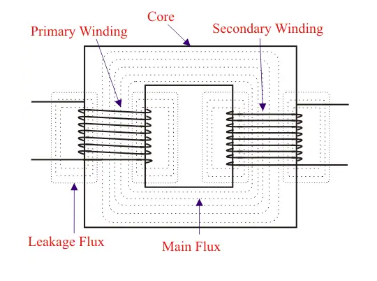

## 17/02/23 11:21:34
@study @py7002 @power-systems 

* Trying to understand equivalent circuit for motor.
* The magnetic circuit analogy is important to keep in mind.
    * While no power is transferred, flux is analogous to current, with mmf being the turns times the current

---

The ultimate goal is delivering a certain amount of power. Just trying to see if I can visualise all the parameters in
the motor that effect this.

* There is resistance naturally in the wires of the transformer.
* As shown below there is leakage flux which will cause a self inductance in the wiring.

* When we talk about an ideal transformer it's considered as having infinite permeability, not too sure why that is.
    * I think it's so that all the flux that's generated dwarfs any leakage and is transferred completely through the
      core.
Normally the magnetic field that we're always studying is created by another circuit.

* the stator rotor equivalent circuit apparently is the same as that of the transformer.

## Thinking of a motor as a transformer with a rotating secondary?

* If we look at each induction coil as a transformer.
* The flux in the coil exists in air, rather than some core. Placing a rotor in that air gap then takes away some of that flux.
* If we thinking of the rotating magnetic field in the air gap, as a rotating bar magnet. 
* The magnetic moment of the rotor is then 'chasing' this invisible bar magnet.
* The magnetic moment could also be said to be 'chasing' the resultant mmf right?
* Where mmf of the rotating field is: $\frac{3}{2}NI_mcos(\omegat - \theta)$.

The rotor has to be behind the source rotating field by a slip. If you were on the rotor (frame of reference), you would
notice that a gap is opening between you and the rotating mmf.

From this frame, the rotating magnetic field has a different angular velocity of another frequency, called the _slip
frequency_??

Ultimately, trying to determine the speed at which the rotor rotates.

---

The shunt path is normally a small resistance path to measure current, diverting a small current away from main path.

> Shunt resistors are commonly used in applications such as ammeters, where they are connected in parallel with a circuit
element to measure the current flowing through that element. They can also be used in power supply circuits to regulate
the output voltage by diverting excess current around the load. Shunt resistors are often designed with low resistance
values to minimize the voltage drop across them and prevent significant power loss.

