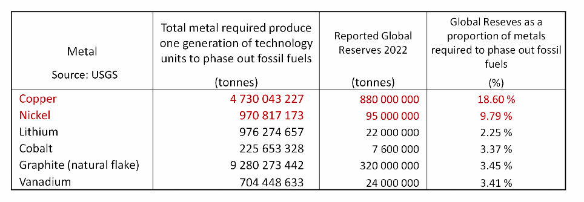

# 13/04/23 11:54:15
@energy 

Talk from Simon Michaux
@simon-michaux

* In the history of copper, 700 million tonnes mined. We will need the same in the next 22 years.
* We want 6.7 times the above quantity in a couple decades.
* This mining issue is under appreciated, what do we do?
    * Increasing the efficiency of society.
    * Shrink the value chain length.
    * I don't believe it's realistic that demand changes that dramatically.
* It seems we need to focus more on nuclear.
* Sourcing from unconventional sources. If we had to make the material ourselves, what would that look like. So if you
  had to source locally, would you use the same principles.
* Mapping out Dublin, energy profile, whats the economy, food sources etc.

