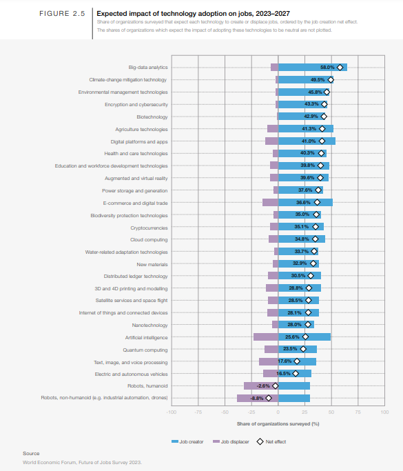

@career 

Reading https://www3.weforum.org/docs/WEF_Future_of_Jobs_2023.pdf

>  Among the macrotrends listed, businesses predict the strongest net job-creation effect to be driven by investments
that facilitate the green transition of businesses, the broader application of ESG standards and supply chains becoming
more localized, albeit with job growth offset by partial job displacement in each case

They interviewed ~800 companies that employ some 11 million or some people across roughly 45 economies. Across 27
industry clusters.

* Technological adaption of frontier technologies is what they specify as where job growth will be. Is this not obvious,
like that's what every company wants to do.

Big data, AI and cloud computing supposedly to be adopted by 3/4 companies surveyed.

> Big data analytics, climate change Key findings May 2023 Future of Jobs Report 2023 Future of Jobs Report 2023 5 and
environmental management technologies, and encryption and cybersecurity are expected to be the biggest drivers of job
growth. Agriculture technologies, digital platforms and apps, e-commerce and digital trade, and AI are all expected to
result in significant labourmarket disruption, with substantial proportions of companies forecasting job displacement
in their organizations, offset by job growth elsewhere to result in a net positive. All but two technologies are
expected to be net job creators in the next five years: humanoid robots and non-humanoid robots. 

Associate electrical engineers are considered short on supply, what does that job entail?
Also, systems analysts?
Sustainability analyst is also determined to be growing as a 'job on the rise'. Whatever the hell it is.

By 2030 the transition to a naturepositive economy in China alone is expected to add
$1.9 trillion to the country’s economic worth and
generate 88 million new jobs

The main global initiatives for the green transition being
* The Inflation reduction act.
* European Green deal.
* China's carbon neutrality pledge.

* One of the things I'd like to have consistently is kind of being forced to learn physics, solid state physics, quantum
mechanics etc. I don't think it's something I'll be able to do as a pass time.
